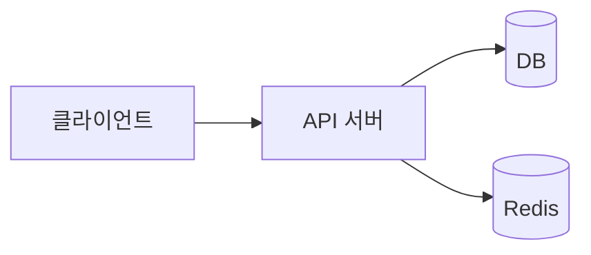

---
# ⚠️ 이 파일은 템플릿입니다. 복사해서 _posts/ 로 옮기고 내용을 채우세요.
#    파일명 예시: _posts/2026-07-08-myapp-architecture.md
title: "[개발기] OO 앱은 이렇게 만들었습니다"
date: 2026-07-08 10:00:00 +0900
categories: [Project, Dev Notes]
tags: [project, devlog, 앱이름]
mermaid: true
image:
  path: /assets/img/posts/project-devlog-template.svg
  alt: OO 앱 개발기
---

## 왜 만들었나

(해결하려던 문제, 동기)

## 기술 스택

| 영역 | 선택 | 이유 |
|------|------|------|
| 백엔드 | Spring Boot | ... |
| DB | PostgreSQL | ... |
| 인프라 | AWS EC2 + GitHub Actions | ... |

## 아키텍처

## 막혔던 지점과 해결

1. **문제**: (무엇이 안 됐는지)
   - **원인**: ...
   - **해결**: ...

## 배포 & 운영에서 배운 것

- ...

## 회고

- 잘한 점 / 아쉬운 점 / 다음에 시도할 것

소개 글은 여기 → (Showcase 글 링크)
