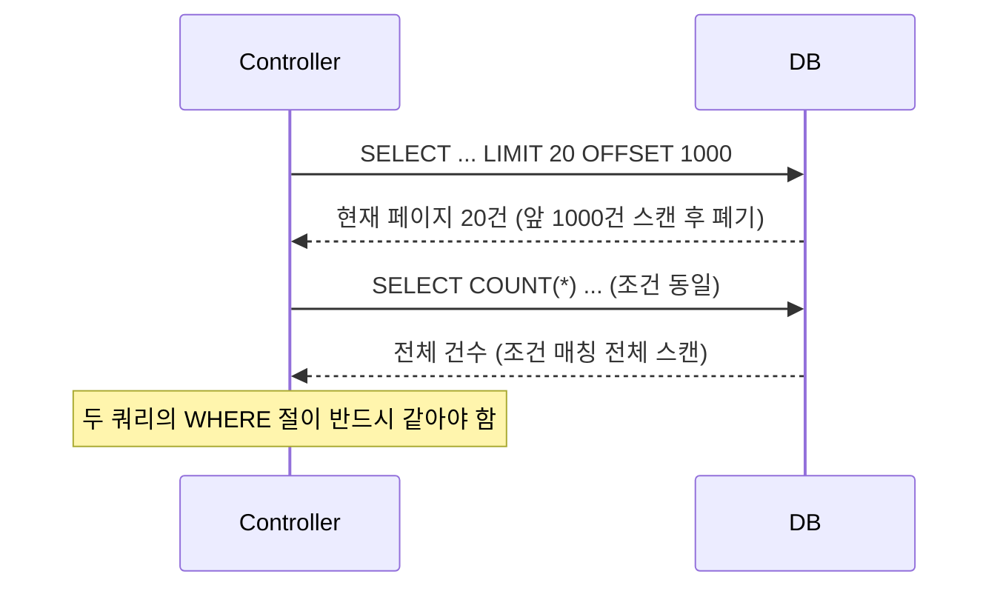

목록 화면 하나를 만들면 거의 항상 따라오는 요구가 있다. "검색 조건으로 거르고, 페이지 단위로 끊어서 보여달라." 단순해 보이지만 여기서 백엔드가 던지는 쿼리는 보통 **두 개**다. 한 번은 현재 페이지의 데이터를, 한 번은 전체 건수를. 이 두 번째 쿼리가 조용히 성능을 갉아먹는 지점이다.

## 핵심 개념: offset 페이징이 실제로 하는 일

`LIMIT 20 OFFSET 1000`은 직관적으로 "1000번째부터 20개"로 읽힌다. 하지만 DB는 1000번째 행으로 점프하지 못한다. **앞의 1000개 행을 모두 읽어서 버리고**, 그 다음 20개를 반환한다. 즉 offset이 커질수록 읽고 버리는 행이 선형으로 늘어난다. 1페이지는 빠르고 5000페이지는 느린 이유가 이것이다.

count 쿼리는 다른 문제를 가진다. `SELECT COUNT(*)`는 조건에 맞는 **모든 행을 세야** 결과가 나온다. 데이터 페이지는 20개만 보면 끝이지만, count는 조건에 맞는 전체를 훑는다. 커버링 인덱스가 잘 걸리면 인덱스만 읽고 끝나지만, 검색 조건이 인덱스를 타지 못하면 풀스캔이 된다. 실무에서 "목록은 빠른데 페이지네이션 바가 느리다"는 현상은 대개 count 쿼리가 범인이다.



## 동적 검색조건과 count의 일관성

핵심은 **데이터 쿼리와 count 쿼리의 WHERE 절이 정확히 같아야 한다**는 것이다. 동적 검색에서 흔히 깨진다. 데이터 쿼리에만 조건을 추가하고 count 쿼리를 빼먹으면, 화면엔 3건이 나오는데 "총 50건"이라고 표시되는 버그가 난다. MyBatis라면 WHERE 절 SQL 조각을 `<sql>`로 분리해 두 쿼리가 공유하게 만드는 것이 안전하다.

```sql
-- 데이터: 현재 페이지
SELECT id, name, status, created_at
FROM orders
WHERE status = #{status}
  AND created_at >= #{from}
ORDER BY created_at DESC
LIMIT #{size} OFFSET #{offset};

-- count: WHERE 절이 동일해야 한다
SELECT COUNT(*)
FROM orders
WHERE status = #{status}
  AND created_at >= #{from};
```

```xml
<sql id="searchWhere">
  <where>
    <if test="status != null">AND status = #{status}</if>
    <if test="from != null">AND created_at &gt;= #{from}</if>
  </where>
</sql>
<!-- 데이터/카운트 쿼리 모두 <include refid="searchWhere"/> 로 동일 절 공유 -->
```

## 운영 함정

**count를 매번 던질 필요는 없다.** 검색 조건이 같으면 총건수도 같다. 첫 페이지 진입 시 한 번만 count를 구하고, 같은 조건으로 페이지를 넘길 때는 그 값을 재사용하면 된다. 검색 조건 + 정렬을 키로 한 짧은 TTL 캐시(수십 초)면 충분하다. 또 하나, 사용자가 1000페이지로 점프할 일이 거의 없다면 "총 9999+건" 식으로 상한을 두거나, 무한스크롤에서는 count 자체를 버리고 keyset 페이징으로 가는 편이 낫다.

## 핵심 요약

- offset은 점프가 아니라 **앞 행을 읽고 버리는 것**이다. 깊은 페이지일수록 비싸다.
- count는 조건 매칭 전체를 세므로 인덱스를 못 타면 풀스캔이다.
- 데이터/count 쿼리의 WHERE는 반드시 일치시키고, 총건수는 조건 단위로 캐싱하라.
