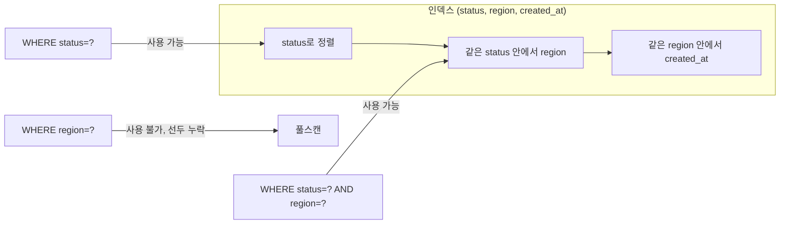

여러 컬럼을 조건으로 거르는 목록 검색을 만들면, 컬럼마다 인덱스를 하나씩 만들고 싶어진다. 하지만 옵티마이저는 보통 **하나의 인덱스만** 골라 쓴다. 그래서 핵심은 "어떤 컬럼들을, 어떤 순서로 묶어 복합 인덱스를 만들 것인가"다. 이 순서가 같은 쿼리를 1ms로도, 1s로도 만든다.

## 핵심 개념: 좌측 접두(leftmost prefix) 규칙

복합 인덱스 `(a, b, c)`는 **`a`로 먼저 정렬되고, 같은 `a` 안에서 `b`로, 같은 `b` 안에서 `c`로** 정렬된 하나의 정렬 구조다. 전화번호부가 (성, 이름) 순으로 정렬된 것과 같다. 성을 모르면 이름만으로는 책을 펼칠 수 없다.

그래서 이 인덱스는 `a`, `(a,b)`, `(a,b,c)`로 시작하는 조건엔 쓸 수 있지만, **`b`만, `c`만, `(b,c)` 조건엔 못 쓴다.** 선두 컬럼이 빠지면 인덱스 정렬의 출발점을 잡을 수 없기 때문이다. 이것이 leftmost prefix 규칙이다.



## 선택도와 컬럼 순서

등치(`=`) 조건끼리라면, **선택도(selectivity)가 높은 컬럼**, 즉 값의 종류가 많아 한 값으로 거르면 적은 행만 남는 컬럼을 앞에 둔다. `email`(거의 유일)은 선택도가 높고 `is_active`(두 값뿐)는 낮다. 선택도 높은 컬럼이 앞에 있으면 인덱스 탐색 범위가 즉시 좁아진다.

선택도를 가늠하는 쿼리:

```sql
-- 전체 대비 distinct 비율이 1에 가까울수록 선택도가 높다
SELECT COUNT(DISTINCT region) / COUNT(*) AS region_sel,
       COUNT(DISTINCT status) / COUNT(*) AS status_sel
FROM orders;
```

## 운영 함정: range 컬럼 뒤는 인덱스가 끊긴다

가장 자주 놓치는 지점이다. 복합 인덱스에서 **범위 조건(`>`, `<`, `BETWEEN`, `LIKE 'abc%'`)을 만나는 순간, 그 뒤 컬럼들은 인덱스로 거르지 못한다.** 정렬이 그 컬럼까지만 유효하기 때문이다.

```sql
-- 인덱스 (status, created_at, region) 가정
SELECT * FROM orders
WHERE status = 'PAID'           -- = : 인덱스 사용
  AND created_at >= '2022-09-01' -- range : 여기까지만 효율적
  AND region = 'A';              -- created_at가 range라 region은 인덱스로 못 거름
```

해법은 **등치 조건 컬럼을 앞에, 범위 조건 컬럼을 맨 뒤에** 두는 것이다. 위 쿼리라면 `(status, region, created_at)` 순서가 맞다. `status`와 `region`을 등치로 좁힌 뒤 `created_at` 범위를 인덱스 위에서 스캔한다. 정렬(`ORDER BY created_at`)까지 인덱스로 해결되는 보너스도 있다.

`LIKE '%abc%'`처럼 앞에 와일드카드가 붙으면 선두 접두를 못 잡아 인덱스를 아예 못 탄다는 점도 같은 맥락이다. 부분 일치 검색이 본질이라면 풀텍스트 인덱스를 따로 고려한다.

## 핵심 요약

- 복합 인덱스는 선두 컬럼부터 차례로만 쓸 수 있다(leftmost prefix).
- 등치 조건은 앞, **범위 조건은 맨 뒤**. range를 만나면 그 뒤 컬럼은 인덱스로 못 거른다.
- 등치끼리는 선택도 높은 컬럼을 앞에. `EXPLAIN`으로 실제 사용 인덱스를 확인하라.
