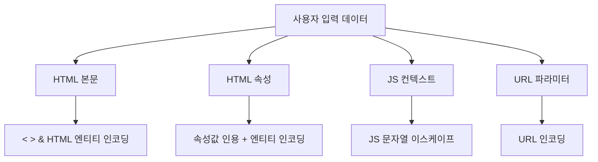

사용자가 입력한 값을 화면에 다시 보여주는 기능은 흔하다. 검색어를 "'OOO' 검색 결과"로 되비추거나, 게시글 제목을 목록에 출력하거나. 이때 입력값이 단순 텍스트가 아니라 `<script>`라면, 그 값이 다른 사용자의 브라우저에서 **코드로 실행**된다. 이것이 XSS다.

## 핵심 개념: 왜 출력 시점에 막아야 하는가

브라우저는 HTML을 파싱하다 `<script>`를 만나면 그것을 마크업으로 해석해 실행한다. 사용자 입력 `<script>steal()</script>`가 escaping 없이 HTML에 박히면 브라우저는 이를 "데이터"가 아니라 "코드"로 본다. 데이터와 코드의 경계가 무너지는 것, 이것이 인젝션 계열 취약점의 본질이다.

XSS는 두 종류다. **반사형(reflected)**은 요청 파라미터가 그 응답에 즉시 되비치는 경우(검색어 echo). **저장형(stored)**은 입력이 DB에 저장됐다가 나중에 다른 사용자에게 출력되는 경우(게시글, 댓글)로, 한 번 심으면 보는 사람마다 터지니 더 위험하다.

방어의 핵심은 **입력 필터링이 아니라 출력 인코딩**이다. 입력 시점엔 그 값이 어디에 쓰일지 모른다. 같은 값이 HTML 본문, 속성, JS, URL에 들어갈 때 escaping 규칙이 다 다르다. 그래서 "데이터를 코드 컨텍스트에 넣는 바로 그 순간" 그 컨텍스트에 맞게 인코딩하는 것이 정석이다.

## 컨텍스트별 출력 인코딩

```html
<!-- JSP: c:out은 기본으로 HTML escape 한다 -->
<p><c:out value="${keyword}"/></p>
<!-- ${keyword}를 그대로 쓰면 escape 안 됨 → 취약 -->

<!-- HTML 본문: < > & " ' 를 엔티티로 -->
&lt;script&gt; → 텍스트로 표시될 뿐 실행되지 않는다
```

같은 값이라도 들어가는 위치에 따라 인코딩이 달라진다.



서버 사이드 Java에서 직접 인코딩할 때는 검증된 라이브러리(예: OWASP Java Encoder)의 컨텍스트별 메서드를 쓴다. 직접 정규식으로 `<`를 지우는 식은 우회당하기 쉽다.

```java
// 컨텍스트에 맞는 인코딩 메서드를 선택한다
String safeHtml = Encode.forHtml(userInput);          // HTML 본문
String safeAttr = Encode.forHtmlAttribute(userInput); // 속성값
String safeJs   = Encode.forJavaScript(userInput);    // JS 문자열
```

## 운영 함정

**HTML을 허용해야 하는 리치 에디터**가 함정이다. 게시글 본문에 굵게/링크 같은 태그를 허용하면 출력 escaping을 못 건다. 이때는 전체 escape 대신 **허용 태그 화이트리스트로 sanitize**(예: 검증된 HTML sanitizer)해서 `<script>`, `onerror=` 같은 실행 벡터만 제거한다. blacklist로 `<script>`만 막으면 ``, 대소문자 변형 등으로 우회된다. "막을 것"이 아니라 "허용할 것"을 정의하는 게 안전하다.

또 하나, `Content-Security-Policy` 헤더로 인라인 스크립트 실행을 차단하면 XSS가 터져도 피해를 줄이는 2차 방어선이 된다.

## 면접 한 줄 Q&A

- **Q. XSS는 입력에서 막나 출력에서 막나?** A. 출력 시점의 컨텍스트별 인코딩이 정석이다. 같은 값도 HTML/속성/JS/URL마다 escaping이 다르기 때문이다.
- **Q. 저장형이 반사형보다 위험한 이유는?** A. 반사형은 공격 링크를 클릭한 사람만, 저장형은 그 데이터를 보는 모든 사용자에게 터진다.
