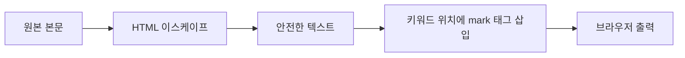

검색 결과 화면에서 매칭된 키워드를 굵게 칠하는 작업을 했다. 별것 아닌 UI 같지만, 본질은 **"사용자 입력을 사용자 입력 위에 다시 그려넣는 일"**이다. 여기서 출력 인코딩을 한 번 놓치면 검색창이 그대로 XSS 입구가 된다.

## 하이라이트는 결국 "치환"이다

키워드 강조의 알고리즘은 단순하다. 본문에서 검색어가 나타난 위치를 찾아 `<mark>` 같은 태그로 감싼다. 문제는 이 치환을 **언제, 무엇에 대해** 하느냐다.

순서가 핵심이다. 올바른 순서는 이렇다.



먼저 본문 전체를 HTML 이스케이프해서 `<`, `>`, `&`, `"`를 엔티티로 바꾼다. **그다음에** 우리가 의도한 `<mark>`만 삽입한다. 순서를 뒤집으면 — 즉 `<mark>`를 먼저 넣고 통째로 이스케이프하면 우리 태그까지 죽어 텍스트로 보인다. 반대로 이스케이프를 아예 안 하면 본문에 섞인 `<script>`가 살아난다.

## 발췌(snippet)

긴 본문을 전부 보여줄 수 없으니, 매칭 위치 주변 몇십 글자만 잘라 보여준다. 잘라낼 때도 함정이 있다. 이스케이프된 문자열을 글자 수로 자르면 `&lt;` 같은 엔티티 중간이 잘려 깨진다. 그래서 **자르기는 원본 텍스트에서, 이스케이프는 자른 뒤에** 한다.

```java
public String snippet(String raw, String keyword, int radius) {
    int idx = raw.toLowerCase().indexOf(keyword.toLowerCase());
    if (idx < 0) return escape(truncate(raw, radius * 2));

    int from = Math.max(0, idx - radius);
    int to = Math.min(raw.length(), idx + keyword.length() + radius);
    String piece = raw.substring(from, to);

    String escaped = escape(piece);                 // 1) 먼저 통째로 이스케이프
    String safeKeyword = escape(keyword);           // 2) 키워드도 같은 규칙으로
    return (from > 0 ? "…" : "")
         + escaped.replaceAll("(?i)" + Pattern.quote(safeKeyword),
                              "<mark>$0</mark>")     // 3) 안전한 위에 mark만
         + (to < raw.length() ? "…" : "");
}
```

`Pattern.quote`를 빼먹으면 키워드에 들어간 `.`, `*` 같은 문자가 정규식 메타로 해석돼 엉뚱한 곳이 강조된다. 사용자 입력은 항상 리터럴로 취급해야 한다.

## 운영 함정

**함정 1 — 템플릿 엔진의 자동 이스케이프와 충돌.** Thymeleaf의 `th:text`나 JSP의 `c:out`은 출력을 자동 이스케이프한다. 여기에 우리가 만든 `<mark>` HTML을 넣으면 태그가 텍스트로 나온다. 그렇다고 `th:utext`(unescaped)로 통째로 출력하면, **우리 서버가 이스케이프를 100% 책임진다는 전제**가 생긴다. 발췌 생성 코드에서 단 한 군데라도 raw를 흘리면 그게 XSS다. 자동 이스케이프를 끄는 순간 안전망이 사라진다는 걸 잊으면 안 된다.

**함정 2 — 정규식 백트래킹.** 사용자 키워드를 그대로 정규식에 넣으면 악의적 패턴으로 ReDoS(정규식 폭주)를 유발할 수 있다. `Pattern.quote`로 리터럴화하면 이 위험도 같이 사라진다.

## 핵심 요약

- 하이라이트의 안전한 순서는 **이스케이프 → 그다음 의도한 태그 삽입**이다.
- 발췌는 **원본에서 자르고, 자른 뒤 이스케이프**한다.
- 사용자 키워드는 정규식에서 반드시 `Pattern.quote`로 리터럴 처리한다.
- `utext`로 출력하기로 했다면 인코딩 책임은 전적으로 서버에 있다.
