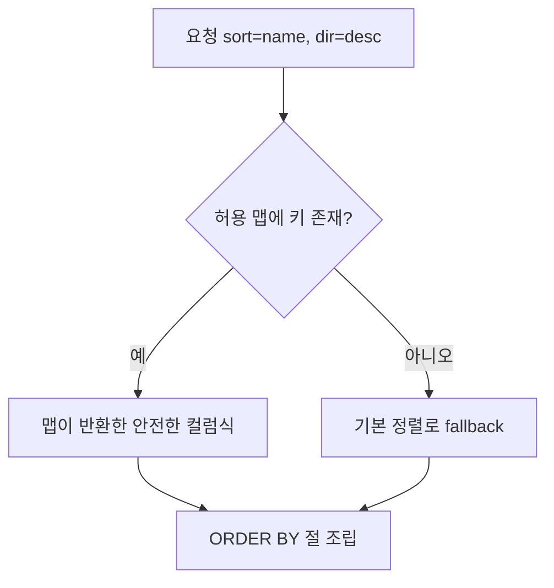

목록 화면에서 사용자가 정렬 컬럼과 방향을 고를 수 있게 만들었다. `?sort=name&dir=desc` 같은 흔한 요구다. 그런데 이 작업은 조용히 위험하다. **정렬 컬럼명은 값(value)이 아니라 식별자(identifier)이고, 바인딩 변수로 막을 수 없다.**

## 왜 바인딩으로 못 막나

PreparedStatement의 `?` 플레이스홀더는 **값** 자리에만 들어간다. `WHERE id = ?`의 `?`는 리터럴 값으로 안전하게 바인딩된다. 하지만 `ORDER BY ?`는 동작하지 않거나, 동작해도 컬럼명이 아닌 문자열 상수로 취급된다. 컬럼명·테이블명·`ASC/DESC` 같은 **SQL 문법 구조**는 본질적으로 파라미터화할 수 없다. 그래서 개발자들은 문자열을 그냥 이어 붙인다.

MyBatis로 치면 이 차이가 `#{}` 와 `${}` 다.

- `#{sort}` → PreparedStatement 바인딩. 컬럼명 자리엔 못 쓴다.
- `${sort}` → **문자열 그대로 치환**. 컬럼명엔 쓸 수 있지만, 사용자 입력을 그대로 넣으면 인젝션이다.

`ORDER BY ${sort}`에 `sort = "name; DROP TABLE users--"`가 들어오면 어떻게 될까. 또는 더 흔하게는 `(SELECT CASE WHEN ... THEN 1 ELSE (SELECT 1 UNION SELECT 2) END)` 같은 블라인드 인젝션으로 데이터를 한 글자씩 추출당한다.

## 해법은 단 하나, 화이트리스트

사용자 입력을 **검증·이스케이프하려는 시도 자체가 틀렸다.** 식별자는 검증할 게 아니라 **매핑**할 대상이다. 허용된 정렬 키의 유한 집합을 서버가 정의하고, 들어온 입력을 그 집합의 키로만 받는다. 매칭되지 않으면 기본값으로 떨어뜨린다.



```java
private static final Map<String, String> SORTABLE = Map.of(
    "name",      "u.name",
    "createdAt", "u.created_at",
    "email",     "u.email"
);

public String resolveOrderBy(String sortKey, String dir) {
    String column = SORTABLE.getOrDefault(sortKey, "u.created_at"); // 거부 기본값
    String direction = "asc".equalsIgnoreCase(dir) ? "ASC" : "DESC"; // 이진 선택
    return column + " " + direction;
}
```

핵심은 **사용자 문자열이 SQL에 단 한 글자도 직접 도달하지 않는다는 것**이다. 사용자는 맵의 *키*를 고를 뿐이고, 실제 컬럼식은 서버 코드에 하드코딩된 *값*이다. `dir`도 마찬가지로 `ASC`/`DESC` 둘 중 하나로만 환원한다.

이렇게 만든 결과를 MyBatis에 넘길 때는 어쩔 수 없이 `${}`를 쓰지만, 그 값은 이미 우리가 통제한 상수라 안전하다.

```xml
<select id="findUsers" resultType="User">
  SELECT * FROM users u
  <where> ... </where>
  ORDER BY ${orderBy}   <!-- orderBy는 resolveOrderBy의 산출물 -->
</select>
```

## 운영 함정

**함정 1 — 다중 정렬과 화이트리스트.** `sort=name,email`처럼 복수 정렬을 허용하면, 콤마로 split한 각 토큰을 **개별적으로** 맵에 통과시켜야 한다. 전체 문자열을 한 번에 매핑하려 들면 다시 인젝션 표면이 생긴다.

**함정 2 — fallback을 예외로 던지지 말 것.** 미허용 정렬 키에 400을 던지면, 북마크된 옛 URL이나 클라이언트 버그가 페이지를 통째로 깨뜨린다. **조용히 기본 정렬로 떨어뜨리는 쪽**이 견고하다(단, 보안 결정엔 로그를 남긴다).

## 면접 한 줄 Q&A

> **Q. `ORDER BY`는 왜 PreparedStatement 바인딩으로 못 막나?**
> 바인딩 변수는 SQL의 *값* 자리만 채운다. 컬럼명·정렬방향은 SQL 문법 *구조*라 파라미터화 대상이 아니다. 그래서 식별자는 검증이 아니라 서버가 정의한 화이트리스트로 **매핑**해야 한다.
