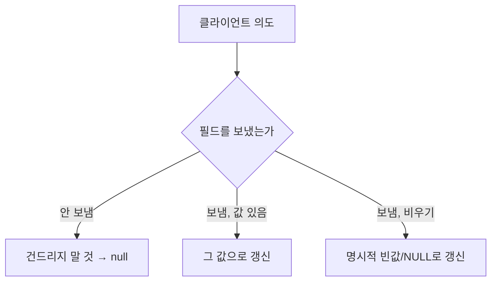

엔티티 수정 기능을 다뤘다. 화면에서 일부 필드만 고쳐 보냈는데, 서버가 받은 객체를 그대로 전체 컬럼 UPDATE 하면 어떻게 될까. **보내지 않은 필드가 null로 덮여 데이터가 날아간다.** 부분 수정의 핵심은 "무엇을 바꾸는가"가 아니라 "무엇을 **건드리지 않는가**"를 표현하는 일이다.

## 전체 UPDATE의 함정

가장 흔한 코드는 이렇다.

```sql
UPDATE users
   SET name = #{name}, email = #{email}, phone = #{phone}, bio = #{bio}
 WHERE id = #{id}
```

폼에서 `name`만 수정하고 나머지 필드를 전송하지 않으면, DTO의 `email`, `phone`, `bio`는 `null`로 채워진다. 그리고 위 SQL은 그 `null`을 충실히 DB에 기록한다. 사용자는 이름만 바꿨다고 생각했는데 이메일과 연락처가 통째로 지워진다. 동시에 두 명이 같은 행의 서로 다른 필드를 수정하면, 나중 저장이 앞 저장을 통째로 덮는 lost update도 발생한다.

## 동적 `<set>`으로 변경분만

MyBatis의 `<set>`은 내부 `<if>` 중 참인 것만 모아 `SET` 절을 만들고, 후행 콤마를 알아서 제거한다.

```xml
<update id="updateUser">
  UPDATE users
  <set>
    <if test="name != null">   name  = #{name},</if>
    <if test="email != null">  email = #{email},</if>
    <if test="phone != null">  phone = #{phone},</if>
    <if test="bio != null">    bio   = #{bio},</if>
  </set>
  WHERE id = #{id}
</update>
```

`name`만 들어오면 실제 실행되는 SQL은 `UPDATE users SET name = ? WHERE id = ?`가 된다. 나머지 컬럼은 SQL에 등장조차 하지 않으니 기존 값이 보존된다. `<set>`이 콤마와 `SET` 키워드를 관리하므로 직접 문자열을 다듬을 필요가 없다.

## null과 "비우기"는 다르다

여기서 진짜 설계 문제가 드러난다. 위 방식은 **"필드 미전송"과 "필드를 빈 값으로 만들고 싶음"을 구분하지 못한다.** `bio`를 의도적으로 비우려고 빈 값을 보내도, 그게 `null`이면 `<if>`가 걸러내 변경이 무시된다.



"전송 안 함"과 "비우기"를 모두 표현하려면 **세 가지 상태**가 필요하다: 미전송 / 값 있음 / 명시적 비움. JSON에서 키 자체의 존재 여부로 구분하거나(키 없음 = 미전송, `null` = 비움), 별도의 PATCH 의미를 정의해야 한다. Java에서는 `JsonNullable`이나 필드별 "변경됨" 플래그로 이를 모델링한다. 동적 `<set>` 하나로는 이 의미 구분이 안 된다는 걸 인지하는 게 중요하다.

## 운영 함정

**함정 1 — 빈 `<set>`.** 모든 `<if>`가 거짓이면 `SET` 절이 비어 `UPDATE users WHERE id = ?` 같은 문법 오류가 난다. 변경 필드가 하나라도 있는지 서비스 계층에서 먼저 검증하거나, `updated_at = NOW()`처럼 항상 갱신되는 컬럼을 두어 `<set>`이 비지 않게 한다.

**함정 2 — 부분 수정에도 동시성 제어는 필요하다.** 컬럼 단위 충돌은 줄지만 **같은 컬럼**을 두 트랜잭션이 동시에 고치면 여전히 lost update다. `version` 컬럼 + `WHERE version = #{version}` (낙관적 락)으로 갱신 건수가 0이면 충돌로 처리한다.

## 핵심 요약

- 전체 컬럼 UPDATE는 미전송 필드를 null로 덮는다. 동적 `<set>/<if>`로 변경분만 갱신한다.
- `<set>`은 콤마·`SET` 키워드를 자동 관리하지만, 모든 `<if>`가 거짓이면 빈 SET으로 깨진다.
- "미전송"과 "비우기"는 다른 의도다. 둘 다 표현하려면 세 가지 상태 모델이 필요하다.
