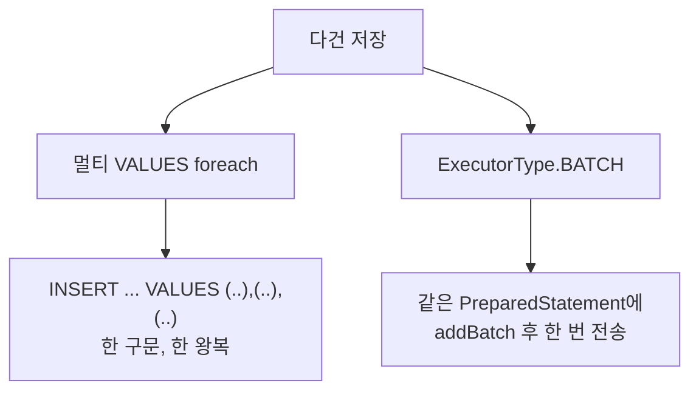

여러 건을 한 번에 저장하는 작업을 했다. 처음엔 리스트를 루프 돌며 insert를 호출했는데, 건수가 늘자 눈에 띄게 느려졌다. 다건 저장의 비용은 디스크 쓰기보다 **네트워크 왕복(round-trip)과 구문 처리 오버헤드**에 있다.

## 단건 반복이 느린 이유

`for` 루프 안에서 insert를 1000번 호출하면, **애플리케이션 ↔ DB 사이를 1000번 왕복**한다. 매 호출마다 쿼리 전송, 파싱·플랜 조회, 결과 수신이 반복된다. 실제 row를 디스크에 쓰는 시간은 작고, 이 왕복 지연(latency)이 누적돼 전체 시간을 지배한다. RTT가 1ms만 돼도 1000건이면 1초가 통신에만 사라진다.

해결의 두 갈래가 있다.



## 갈래 1 — foreach 멀티 VALUES

MyBatis `<foreach>`로 VALUES 절을 펼쳐 **하나의 INSERT 구문**으로 만든다. 왕복이 1번이다.

```xml
<insert id="insertUsers">
  INSERT INTO users (name, email, created_at)
  VALUES
  <foreach collection="list" item="u" separator=",">
    (#{u.name}, #{u.email}, #{u.createdAt})
  </foreach>
</insert>
```

만들어지는 SQL은 `INSERT INTO users (...) VALUES (?,?,?),(?,?,?),...` 하나다. 파싱도 한 번, 전송도 한 번. 단건 반복 대비 수십 배 빨라진다.

## 갈래 2 — ExecutorType.BATCH

JDBC 배치를 쓰는 방식이다. 같은 PreparedStatement에 파라미터만 바꿔 `addBatch()`로 쌓고, `executeBatch()`로 한 번에 전송한다. MyBatis에선 BATCH 모드 SqlSession을 쓴다.

```java
try (SqlSession session = factory.openSession(ExecutorType.BATCH)) {
    UserMapper mapper = session.getMapper(UserMapper.class);
    for (User u : users) {
        mapper.insertOne(u);   // 즉시 전송 아님 — 배치에 쌓임
    }
    session.flushStatements(); // 여기서 한 번에 전송
    session.commit();
}
```

**둘의 차이:** 멀티 VALUES는 한 *구문*에 여러 행을 넣어 SQL 텍스트가 길어진다. BATCH는 *같은 구문*을 재사용하며 파라미터 집합만 여러 번 보내, 구문 캐시 재사용에 유리하고 generated key 처리가 더 깔끔하다. 단건 매퍼 재사용성도 BATCH가 좋다.

## 운영 함정

**함정 1 — 패킷 크기 한계.** 멀티 VALUES로 한 방에 보내면 SQL 문자열이 거대해진다. MySQL의 `max_allowed_packet`(기본 흔히 4~16MB)을 넘으면 `PacketTooBigException`으로 통째로 실패한다. 그래서 리스트를 **청크로 분할**해 500~1000건씩 나눠 보낸다.

```java
int chunk = 1000;
for (int i = 0; i < users.size(); i += chunk) {
    List<User> slice = users.subList(i, Math.min(i + chunk, users.size()));
    mapper.insertUsers(slice);
}
```

너무 큰 단일 구문은 파서 부담과 트랜잭션 길이도 늘린다. 무한정 크게가 아니라 적정 청크가 정답이다.

**함정 2 — generated key.** 멀티 VALUES INSERT는 자동 증가 PK를 각 row에 매핑해 돌려받기가 까다롭다(드라이버·버전 의존). PK가 꼭 필요하면 BATCH + `useGeneratedKeys`를 쓰거나, 애플리케이션이 키를 미리 생성하는 전략을 택한다.

## 핵심 요약

- 다건 저장의 진짜 비용은 디스크가 아니라 **왕복 횟수**다.
- foreach 멀티 VALUES = 한 구문 한 왕복. ExecutorType.BATCH = 같은 구문 재사용 후 일괄 전송.
- 멀티 VALUES는 `max_allowed_packet`에 걸리므로 **청크 분할**이 필수다.
