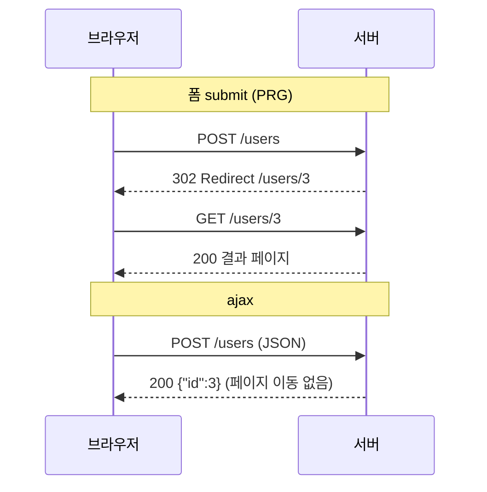

전송 방식을 일반 폼 submit에서 ajax로 바꾸는 작업을 했다. 화면 동작만 바뀐 것 같지만, **서버가 요청을 받아들이는 방식 자체가 달라진다.** Content-Type, 파라미터 바인딩, 응답 처리, CSRF가 전부 영향을 받는다.

## Content-Type이 모든 걸 가른다

브라우저가 `<form method=post>`를 제출하면 기본 Content-Type은 `application/x-www-form-urlencoded`다. 본문은 `name=kuo&email=a%40b.com` 형태의 키=값 쌍이다. 반면 ajax로 JSON을 보내면 `application/json`이고 본문은 `{"name":"kuo","email":"a@b.com"}`이다.

서버 바인딩 코드가 달라진다.

```java
// 폼 전송 — form-urlencoded → 개별 파라미터 바인딩
@PostMapping("/users")
public String createByForm(@ModelAttribute UserForm form) { ... }

// ajax — application/json → 본문 전체를 객체로 역직렬화
@PostMapping("/users")
public ResponseEntity<?> createByJson(@RequestBody UserForm form) { ... }
```

`@ModelAttribute`는 form-urlencoded/쿼리 파라미터를 필드에 채운다. `@RequestBody`는 본문을 통째로 JSON 역직렬화한다. **둘은 호환되지 않는다.** ajax로 JSON을 보내는데 컨트롤러가 `@ModelAttribute`면 필드가 안 채워지고, 폼을 보내는데 `@RequestBody`면 `415 Unsupported Media Type`이 난다.

## 리다이렉트(PRG)의 차이

폼 submit은 **브라우저가 직접 항해(navigation)**한다. 그래서 서버가 POST 처리 후 `redirect:/users/3`을 반환하는 **PRG(Post-Redirect-Get)** 패턴이 자연스럽다. 새로고침 시 폼 재전송 경고를 막는 정석이다.



ajax에선 브라우저가 자동 항해하지 않는다. 서버가 302를 줘도 **`XMLHttpRequest`/`fetch`는 리다이렉트를 투명하게 따라가** 최종 응답 본문을 받아버린다(HTML 페이지가 JSON 파서로 들어와 깨진다). 그래서 ajax 엔드포인트는 **리다이렉트가 아니라 JSON으로 결과/다음 URL을 내려주고**, 화면 이동은 클라이언트가 결정한다.

## 에러 처리도 갈린다

폼 전송에서 검증 실패는 보통 에러 메시지를 담은 HTML을 다시 렌더링한다. ajax는 **HTTP 상태 코드 + JSON 에러 바디**로 응답해야 한다. 200에 에러를 숨기지 말고 `400`/`422`로 명확히 신호하고, 본문에 필드별 오류를 담는다.

```java
@ExceptionHandler(MethodArgumentNotValidException.class)
public ResponseEntity<Map<String,String>> handle(MethodArgumentNotValidException e) {
    Map<String,String> errors = new HashMap<>();
    e.getBindingResult().getFieldErrors()
     .forEach(f -> errors.put(f.getField(), f.getDefaultMessage()));
    return ResponseEntity.unprocessableEntity().body(errors); // 422
}
```

## 운영 함정

**함정 1 — CSRF 토큰 전달 경로.** 폼 전송은 hidden input으로 CSRF 토큰을 실어 보낸다. ajax는 본문이 JSON이라 hidden input이 없으니, **헤더(예: `X-CSRF-TOKEN`)**로 토큰을 보내야 한다. 방식을 바꾸면 CSRF 토큰 전달 경로도 같이 바꿔야 하고, 안 그러면 `403`이 난다.

**함정 2 — 파일 업로드는 또 다르다.** 파일이 섞이면 form-urlencoded도 JSON도 아닌 `multipart/form-data`다. ajax로 파일을 보낼 땐 `FormData`를 쓰고 Content-Type을 브라우저가 boundary와 함께 자동 설정하게 둔다. 직접 `application/json`으로 박으면 깨진다.

## 핵심 요약

- 전송 방식의 본질 차이는 **Content-Type**이다: form-urlencoded(`@ModelAttribute`) vs application/json(`@RequestBody`).
- 폼은 PRG 리다이렉트, ajax는 JSON 응답 + 클라이언트가 화면 이동 결정.
- ajax는 상태코드+JSON으로 에러를 신호하고, CSRF 토큰은 헤더로 보낸다.
