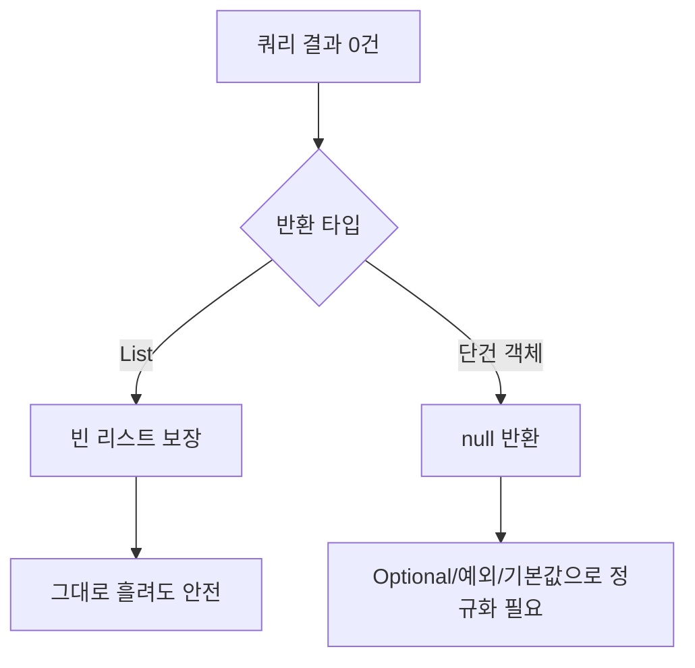

검색 결과가 없을 때의 처리를 다뤘다. "결과 없음"은 사소해 보이지만, 백엔드의 각 계층이 이를 어떻게 표현하느냐에 따라 NPE가 터지기도 하고, 프런트가 분기를 헷갈리기도 한다. **0건은 에러가 아니라 정상적인 빈 상태**이고, 이걸 일관되게 만드는 건 백엔드의 책임이다.

## 매퍼는 무엇을 반환하나

MyBatis가 `List`를 반환하는 셀렉트에서 결과가 0건이면, **null이 아니라 빈 리스트(`Collections.emptyList()` 류)**를 돌려준다. 이건 MyBatis의 보장된 동작이다. 그래서 리스트 결과는 비교적 안전하다.

문제는 **단건** 조회다. `selectOne`이 0건이면 **`null`**을 반환한다. 여기서 `user.getName()`을 부르면 그대로 NPE다.



## 계층마다 표현을 정규화한다

핵심 원칙: **null을 위로 흘려보내지 않는다.** 각 계층 경계에서 의미를 정규화한다.

```java
// 매퍼 — 단건은 null 가능
User findByEmail(String email);

// 서비스 — null을 Optional로 봉인, 호출자가 분기를 강제로 인지
public Optional<User> findUser(String email) {
    return Optional.ofNullable(userMapper.findByEmail(email));
}

// 리스트 — 혹시 모를 null도 방어적으로 빈 리스트로
public List<User> search(SearchCond cond) {
    List<User> result = userMapper.search(cond);
    return result != null ? result : Collections.emptyList();
}
```

`Optional`은 "값이 없을 수 있다"를 **타입으로 강제**한다. 호출자가 `.orElse(...)`나 `.map(...)`을 거치게 만들어, null 체크를 깜빡할 여지를 컴파일 단계에서 줄인다. 단, Optional을 필드나 컬렉션 원소에 쓰는 건 안티패턴이다 — **반환값에만** 쓴다.

## 프런트로 내려가는 응답 형태

응답 DTO는 **"0건"과 "에러"를 분명히 구분**해야 한다. 검색 0건은 200 + 빈 배열이지, 404가 아니다(특정 ID 단건 조회 실패는 404가 맞다).

```json
// 검색 결과 0건 — 정상
{ "items": [], "totalCount": 0 }

// 좋지 않은 형태 — null이면 프런트가 .length에서 터진다
{ "items": null, "totalCount": 0 }
```

`items`를 절대 null로 내리지 않는다. 프런트가 `items.map(...)` 한 줄로 끝낼 수 있게, **항상 배열**을 보장한다. 페이지 응답이라면 `totalCount`, `page`, `size`를 함께 줘 "더 없음"도 표현한다.

## 운영 함정

**함정 1 — resultType이 원시 래퍼일 때.** `SELECT COUNT(*)`는 항상 행이 있어 안전하지만, `SELECT SUM(amount)`는 대상 행이 0건이면 **`NULL`을 반환**한다. 이걸 `long`(원시형)으로 받으면 MyBatis가 언박싱하다 NPE를 낸다. SQL에서 `COALESCE(SUM(amount), 0)`로 막거나 래퍼 타입 `Long`으로 받아 서비스에서 정규화한다.

**함정 2 — 빈 결과인데 totalCount만 0이 아닐 때.** 페이징에서 마지막 페이지를 넘어선 요청은 `items`가 빈 배열이지만 `totalCount`는 양수다. 프런트가 `totalCount > 0`만 보고 "결과 있음"으로 판단하면 빈 화면을 그린다. **현재 페이지의 빈 여부와 전체 건수는 별개 신호**임을 응답에 명확히 담는다.

## 핵심 요약

- 리스트 셀렉트는 빈 리스트를 보장하지만 단건 셀렉트는 null을 준다 — 서비스에서 Optional로 봉인한다.
- 검색 0건은 200 + 빈 배열이다. 응답의 컬렉션은 절대 null로 내리지 않는다.
- 집계 함수(`SUM` 등)는 0건일 때 NULL을 주므로 `COALESCE`나 래퍼 타입으로 방어한다.
