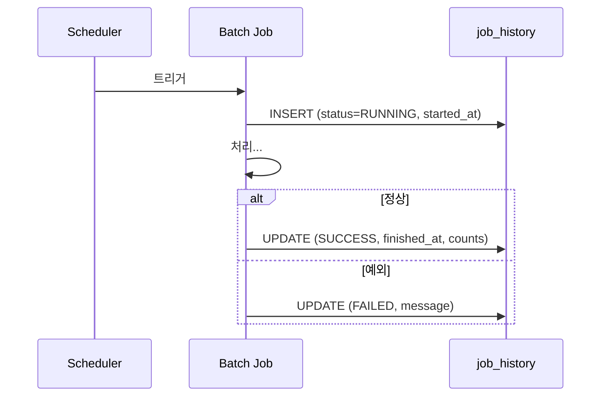

스케줄러가 새벽에 배치를 돌렸다. 그런데 "성공했나?"라는 질문에 답하려면 무엇을 봐야 하나. 로그 파일을 grep하는 건 운영이 아니다. **배치의 실행 결과는 데이터로 남아야 하고, 운영자는 화면에서 그 데이터를 본다.** 이게 관측 가능성(observability)의 가장 기본적인 형태다.

## 무엇을 기록해야 하나

배치 잡 하나가 끝났을 때 "이게 잘 됐는지" 판단하려면 최소한 다음이 필요하다.

- **무엇을** — 잡 이름/구분
- **언제** — 시작 시각, 종료 시각 (→ 소요 시간)
- **얼마나** — 처리 건수, 실패 건수
- **결과** — 성공/실패 상태, 실패 시 메시지

```sql
CREATE TABLE batch_job_history (
  id           BIGINT AUTO_INCREMENT PRIMARY KEY,
  job_name     VARCHAR(100)  NOT NULL,
  started_at   DATETIME      NOT NULL,
  finished_at  DATETIME      NULL,
  total_count  INT           NOT NULL DEFAULT 0,
  fail_count   INT           NOT NULL DEFAULT 0,
  status       VARCHAR(20)   NOT NULL,  -- RUNNING / SUCCESS / FAILED
  message      VARCHAR(1000) NULL,
  KEY idx_job_started (job_name, started_at)
);
```

핵심은 **시작과 종료를 두 번 쓰는 것**이다. 잡 시작 시 `RUNNING`으로 INSERT하고, 끝날 때 종료 시각·건수·상태를 UPDATE한다. 이렇게 해야 "시작했는데 종료 행이 안 채워진" 잡 = 도중에 죽은 잡을 식별할 수 있다. 끝에만 한 번 쓰면 죽은 잡은 흔적조차 안 남는다.



## 이력 기록은 별도 트랜잭션으로

함정이 하나 있다. 이력 UPDATE를 본 배치 트랜잭션 안에서 하면, 배치가 롤백될 때 **실패 기록까지 같이 롤백**되어 사라진다. 정작 알아야 할 실패가 안 남는 역설이다. 실패 이력은 본 작업과 분리된 트랜잭션(예: 새 트랜잭션 전파)으로 커밋해야 살아남는다.

## 모니터링 화면의 페이징

이력 테이블은 매일 쌓여 금세 커진다. 화면은 `job_name`·기간·`status`로 필터하고 페이징한다.

```sql
SELECT id, job_name, started_at, finished_at,
       total_count, fail_count, status
FROM batch_job_history
WHERE started_at >= ? AND started_at < ?
ORDER BY started_at DESC
LIMIT ? OFFSET ?;
```

`(job_name, started_at)` 인덱스가 필터와 정렬을 동시에 받친다. 운영자는 이 화면에서 **실패 잡 재실행 판단**을 한다 — 실패 건수가 일부면 부분 재처리, 시작만 있고 종료가 없으면 좀비 잡으로 보고 강제 종료/재기동.

## 핵심 요약

- 배치 성공 여부는 로그가 아니라 이력 데이터로 판단한다.
- 시작 시 `RUNNING` INSERT, 종료 시 UPDATE — 두 번 써야 죽은 잡을 잡는다.
- 실패 이력은 본 트랜잭션과 분리해 커밋한다(같이 롤백되면 안 된다).

> **면접 한 줄**: "배치가 실패했는데 실패 기록도 안 남는 이유는?" → 이력 기록이 본 배치 트랜잭션 안에 있어 롤백과 함께 사라진 것. 별도 트랜잭션으로 커밋해야 한다.
