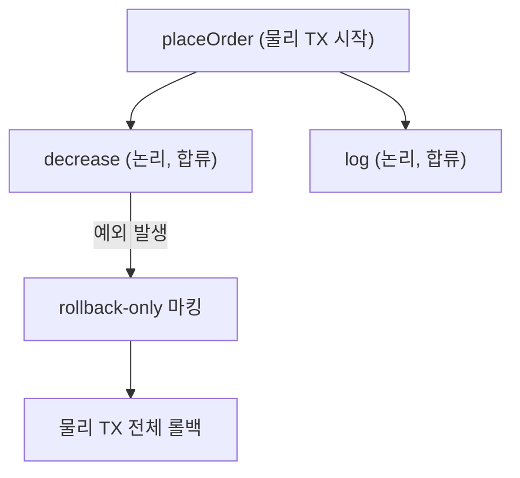

여러 단계의 저장이 "전부 성공하거나 전부 실패해야" 하는 흐름은 백엔드에서 흔하다. 주문을 만들면서 재고를 차감하고 이력을 남기는 일이 한 덩어리여야 한다면, 그 원자성을 보장하는 것이 트랜잭션이고, 그 묶음을 결정하는 것이 **전파(propagation)** 다.

## REQUIRED — 합류 또는 시작

`@Transactional`의 기본 전파 속성은 `REQUIRED`다. 의미는 단순하다. "진행 중인 트랜잭션이 있으면 거기에 **합류**하고, 없으면 **새로 시작**한다."

```java
@Service
public class OrderService {
    @Transactional                  // REQUIRED — 새 트랜잭션 시작
    public void placeOrder(OrderReq req) {
        orderRepo.save(...);
        stockService.decrease(req);  // 이 안의 @Transactional은 합류
        historyService.log(req);     // 역시 합류
    }
}

@Service
public class StockService {
    @Transactional                  // REQUIRED — 기존 트랜잭션에 합류
    public void decrease(OrderReq req) {
        stockRepo.update(...);
    }
}
```

`placeOrder`가 트랜잭션을 열고, 그 안에서 호출된 `decrease`와 `log`는 새 트랜잭션을 만들지 않고 **같은 물리 트랜잭션을 공유**한다. 따라서 셋은 하나의 커밋, 하나의 롤백 단위로 묶인다.

## 물리 트랜잭션과 논리 트랜잭션

Spring은 이를 두 층으로 본다.

- **물리 트랜잭션(physical)**: 실제 DB 커넥션과 그 위의 commit/rollback. 최초 진입점에서 하나만 만들어진다.
- **논리 트랜잭션(logical)**: `@Transactional` 경계마다 하나씩. REQUIRED로 합류한 안쪽 메서드도 자기만의 논리 단위를 갖는다.

규칙은 이렇다. **모든 논리 트랜잭션이 정상이어야 물리 트랜잭션이 커밋된다. 하나라도 롤백 표시가 붙으면 전체가 롤백된다.**



## 안쪽 예외가 전체를 말아올리는 메커니즘

핵심 함정이 여기 있다. 합류한 안쪽 메서드에서 런타임 예외가 나면, Spring은 그 논리 트랜잭션을 롤백하면서 **공유 트랜잭션에 `rollbackOnly` 플래그를 세운다.** 바깥에서 그 예외를 try-catch로 삼켜도 플래그는 남는다. 그 결과 바깥 메서드가 정상 종료해 커밋을 시도하는 순간:

```
UnexpectedRollbackException: Transaction silently rolled back
because it has been marked as rollback-only
```

즉 "안쪽 호출 실패는 무시하고 나머지는 커밋하겠다"는 시도는 실패한다. 한 번 더럽혀진 트랜잭션은 통째로 되돌릴 수밖에 없기 때문이다. 안쪽 실패를 정말로 격리하고 싶다면 그 메서드를 `REQUIRES_NEW`로 분리해 별도 물리 트랜잭션으로 돌려야 한다.

## 운영 함정

**자기호출(self-invocation)은 트랜잭션을 타지 않는다.** `@Transactional`은 프록시 기반이라, 같은 클래스 안에서 `this.otherMethod()`로 호출하면 프록시를 거치지 않아 전파가 적용되지 않는다. 별도 빈으로 분리하거나 `AopContext`를 거쳐야 한다. 또한 기본 롤백 규칙은 **unchecked 예외(RuntimeException)에만** 작동한다. checked 예외는 기본적으로 커밋되므로, 필요하면 `rollbackFor`를 명시한다.

## 면접 한 줄 Q&A

- **Q. REQUIRED에서 안쪽 메서드 예외를 catch하면 커밋되나?**
  A. 안 된다. 합류한 트랜잭션에 `rollbackOnly`가 마킹되어, 바깥 커밋 시 `UnexpectedRollbackException`이 난다. 격리하려면 `REQUIRES_NEW`로 분리한다.
- **Q. 같은 클래스 메서드 호출에 @Transactional이 안 먹는 이유는?**
  A. 프록시를 거치지 않는 자기호출이라 AOP 어드바이스가 적용되지 않는다.
