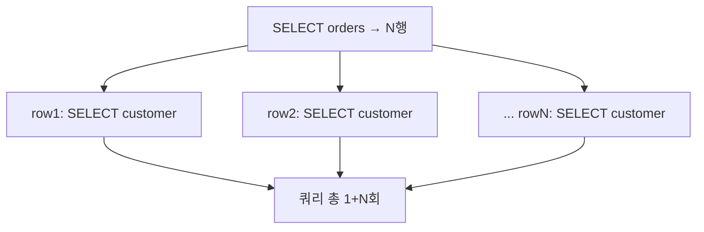

연관 데이터를 함께 조회하는 일은 흔하다. 주문과 그 주문의 고객, 게시글과 그 댓글들. MyBatis는 `association`(1:1)과 `collection`(1:N)으로 이를 표현하는데, 매핑 방식을 어떻게 쓰느냐에 따라 쿼리가 한 번 나가기도, 행 수만큼 나가기도 한다. 후자가 그 악명 높은 **N+1 문제**다.

## 두 가지 방식: nested select vs nested result

`association`/`collection`을 채우는 길은 두 가지다.

**1) Nested select** — `select` 속성으로 별도 쿼리를 지정한다.

```xml
<resultMap id="orderMap" type="Order">
  <id     column="order_id" property="id"/>
  <result column="order_no" property="orderNo"/>
  <association property="customer" column="cust_id"
              select="findCustomerById"/>   <!-- 행마다 이 쿼리 실행 -->
</resultMap>

<select id="findOrders" resultMap="orderMap">
  SELECT order_id, order_no, cust_id FROM orders
</select>
<select id="findCustomerById" resultType="Customer">
  SELECT cust_id, cust_name FROM customers WHERE cust_id = #{id}
</select>
```

주문 목록을 1번 조회한 뒤, **반환된 주문 행 N개 각각에 대해 `findCustomerById`를 N번 더 실행한다.** 총 1+N번. 이게 N+1이다.



**2) Nested result** — JOIN으로 한 번에 가져와 결과를 매핑으로 접는다.

```xml
<resultMap id="orderMap" type="Order">
  <id     column="order_id"  property="id"/>
  <result column="order_no"  property="orderNo"/>
  <association property="customer" javaType="Customer">
    <id     column="cust_id"   property="id"/>
    <result column="cust_name" property="name"/>
  </association>
</resultMap>

<select id="findOrders" resultMap="orderMap">
  SELECT o.order_id, o.order_no, c.cust_id, c.cust_name
  FROM orders o JOIN customers c ON o.cust_id = c.cust_id
</select>
```

쿼리는 **단 한 번**이다. MyBatis가 결과셋을 받아 `<id>` 컬럼을 기준으로 행을 그룹핑해 객체 트리로 조립한다.

## 왜 nested select가 위험한가

목록 화면에서 주문 100건을 보여주면 nested select는 쿼리 101번을 던진다. 각 쿼리가 네트워크 왕복과 파싱 비용을 동반하니, 단건으로는 빠른 쿼리여도 100배가 되면 응답 시간이 폭발한다. 게다가 이 문제는 **개발 환경의 적은 데이터에서는 드러나지 않는다.** 운영에서 목록이 커진 뒤에야 느려진다.

## collection의 N+1과 카티전 곱 트레이드오프

`collection`(1:N)도 nested select면 부모 N개당 자식 쿼리 N번이 나간다. 다만 JOIN으로 바꾸면 다른 문제가 생긴다. 부모 1건에 자식 M건이면 결과셋이 M행으로 부풀고, 부모 컬럼이 M번 중복된다(카티전 곱). MyBatis가 `<id>`로 접어주긴 하지만, 전송되는 행 수와 데이터량이 늘어난다. 자식이 매우 많으면 JOIN 한 방보다 "부모 목록 1쿼리 + 자식 IN 절 1쿼리"로 2번에 나누는 편이 나을 때도 있다.

## 운영 함정

**lazy loading이 N+1을 숨긴다.** nested select에 `fetchType="lazy"`를 걸면 실제 접근 시점에 쿼리가 나간다. 디버깅 중엔 안 나가다가, 뷰 렌더링이나 직렬화가 모든 프로퍼티를 건드리는 순간 N개의 쿼리가 한꺼번에 터진다. 로그에서 같은 형태의 쿼리가 반복되면 N+1을 의심한다. SQL 로그를 켜고 목록 조회 시 쿼리 횟수를 직접 세어보는 것이 가장 확실하다.

## 핵심 요약

- nested `select`는 행마다 추가 쿼리를 던져 1+N번 → N+1 문제.
- JOIN 기반 nested result map은 한 쿼리로 가져와 `<id>` 기준으로 객체를 조립한다.
- 1:N JOIN은 카티전 곱으로 행이 부푼다. 자식이 많으면 IN 절 2쿼리 분할도 고려한다.
- SQL 로그로 목록 조회 시 실제 쿼리 횟수를 확인해 N+1을 잡는다.
