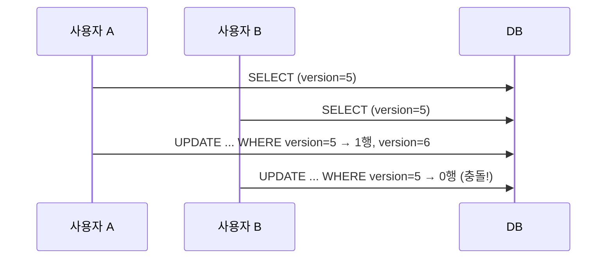

같은 레코드를 두 사용자가 동시에 수정하면 무슨 일이 벌어지는가. 아무 방어가 없으면 나중에 저장한 쪽이 먼저 저장한 변경을 조용히 덮어쓴다. 이 "마지막 쓰기 승리(lost update)"를 막는 가장 가벼운 방법이 **낙관적 락(optimistic locking)** 이고, 그 핵심은 컬럼 하나, `version`이다.

## 낙관적 vs 비관적

- **비관적 락(pessimistic)**: 읽을 때부터 `SELECT ... FOR UPDATE`로 행을 잠가, 다른 트랜잭션이 못 건드리게 한다. 충돌이 잦은 환경에 적합하지만, 락 점유 시간만큼 동시성이 떨어지고 데드락 위험이 있다.
- **낙관적 락(optimistic)**: "충돌은 드물 것"이라 가정하고 락을 걸지 않는다. 대신 **수정 시점에 그동안 아무도 안 바꿨는지 검증**한다. 충돌이 드문 환경에서 훨씬 효율적이다.

## 원리 — version으로 검증하는 UPDATE

레코드에 `version` 정수 컬럼을 둔다. 읽을 때 버전도 함께 읽고, 수정할 때 **그 버전을 조건에 넣어** UPDATE한다.

```sql
-- 읽기: 현재 상태와 version=5 를 함께 가져온다
SELECT id, name, price, version FROM products WHERE id = 100;

-- 수정: 내가 읽은 version 그대로일 때만 갱신, 동시에 version 증가
UPDATE products
SET price = 9900, version = version + 1
WHERE id = 100 AND version = 5;
```

핵심은 **갱신된 행 수**다. 내가 읽은 사이에 누군가 먼저 수정해 version이 6이 되었다면, `WHERE ... AND version = 5`는 어떤 행에도 매칭되지 않아 **0행이 갱신된다.** 이 0행이 곧 충돌 신호다.



```java
int updated = productRepo.updateWithVersion(id, newPrice, readVersion);
if (updated == 0) {
    throw new OptimisticLockException("이미 다른 사용자가 수정했습니다");
}
```

`UPDATE`는 그 자체로 영향받은 행에 락을 걸기 때문에, "version 검증 + 갱신"이 한 문장 안에서 원자적으로 일어난다. 별도 `SELECT` 후 조건 검사처럼 검사-수정 사이에 틈(race)이 생기지 않는다.

## 충돌 처리: 재시도 또는 사용자 통지

0행을 감지했을 때 선택지는 둘이다.

- **재시도(retry)**: 최신 데이터를 다시 읽어 변경을 재계산하고 UPDATE를 다시 시도한다. 카운터 증가처럼 합쳐도 되는 연산에 적합하다.
- **사용자 통지**: 폼 편집처럼 사람이 개입해야 하는 경우, "데이터가 변경되었으니 다시 확인하라"고 알린다. 자동 재시도하면 사용자가 보지 못한 변경을 덮을 수 있다.

```java
@Retryable(value = OptimisticLockException.class, maxAttempts = 3)
public void increaseStock(Long id, int delta) {
    Product p = repo.find(id);
    int updated = repo.updateStock(id, p.getStock() + delta, p.getVersion());
    if (updated == 0) throw new OptimisticLockException();
}
```

## 운영 함정

**version을 안 올리는 경로가 락을 무력화한다.** 어떤 UPDATE 문은 version 조건과 증가를 넣고, 다른 배치/관리 쿼리는 version을 무시하고 직접 컬럼을 바꾼다면, 그 경로로 들어온 수정은 낙관적 락의 보호를 받지 못한다. 한 레코드를 수정하는 **모든 경로가 동일하게 version 규약을 지켜야** 보호가 성립한다. 또한 재시도에 상한(maxAttempts)을 두지 않으면, 경합이 심할 때 무한 재시도로 자원을 소진한다.

## 면접 한 줄 Q&A

- **Q. 낙관적 락은 어떻게 충돌을 감지하나?**
  A. `UPDATE ... WHERE id=? AND version=?`의 영향 행 수가 0이면, 읽은 뒤 누군가 먼저 수정해 version이 바뀐 것이므로 충돌로 본다.
- **Q. 낙관적 락이 부적합한 경우는?**
  A. 충돌이 매우 잦은 경우. 재시도 비용이 커지므로 비관적 락(`FOR UPDATE`)이 낫다.
