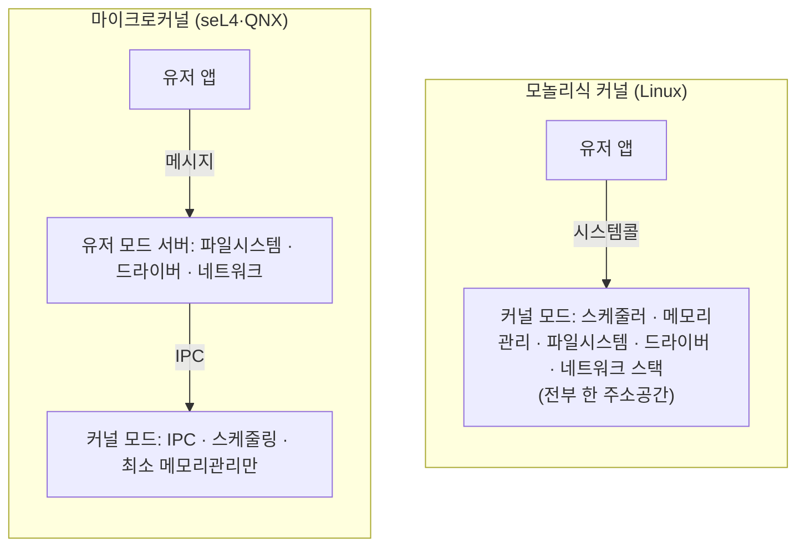

## "내 코드는 누구를 통해 CPU에 닿는가"

`./a.out`을 실행하면 내 코드가 CPU에서 돕니다. 그런데 그 코드가 디스크에서 파일을 읽고, 화면에 글자를 찍고, 네트워크로 패킷을 보냅니다 — **단 한 줄도 디스크 컨트롤러나 네트워크 카드를 직접 건드리지 않고서**. 중간에 누가 대신 해줍니다. 그게 운영체제(OS)입니다.

여기서 당연해 보이는 질문 하나를 끝까지 파봅시다: **왜 내 프로그램은 하드웨어를 직접 만지면 안 되나?** 옛날 도스 시절엔 프로그램이 디스크를 직접 긁었습니다. 지금은 못 합니다. 못 하게 막은 이 한 가지 결정에서 — 커널, 유저/커널 모드, 시스템콜, 가상 메모리, 프로세스 격리까지 — 현대 OS의 거의 모든 것이 따라 나옵니다. 이 글은 "OS의 정의"를 외우는 게 아니라, **그 경계가 왜 존재하고, 내 함수 호출 한 번이 그 경계를 어떻게 넘나드는지**를 따라갑니다.

## OS가 없다면 — 세 가지 재앙

프로그램이 하드웨어를 직접, 단독으로 다룬다고 상상해 봅시다. 세 가지가 동시에 무너집니다.

- **공유 불가 (다중화의 실패)**: CPU는 1개(혹은 몇 개)인데 돌아야 할 프로그램은 수백 개입니다. 누가 CPU를, 메모리를, 디스크를 나눠줄 것인가? 아무도 안 한다면 먼저 잡은 프로그램이 기계를 독점합니다.
- **보호 불가 (격리의 실패)**: A 프로그램의 버그가 B 프로그램의 메모리를 덮어쓰고, 악성 코드가 남의 비밀번호를 읽습니다. 경계가 없으면 한 프로그램의 실수가 전체를 죽입니다.
- **이식 불가 (추상화의 실패)**: 디스크 모델마다, NIC 칩마다 제어 방식이 다릅니다. 모든 앱이 모든 하드웨어를 직접 알아야 한다면 세상의 어떤 프로그램도 두 대의 다른 컴퓨터에서 돌지 못합니다.

그래서 OS는 정확히 이 세 가지를 책임지는 **중재자**입니다.

> **OS의 한 줄 정의 — "하드웨어 위에 올라앉아, 자원을 *추상화*하고 *중재*하고 *보호*하는 소프트웨어 계층."** 추상화(파일·프로세스·소켓이라는 깔끔한 인터페이스), 중재(누구에게 CPU·메모리를 줄지), 보호(서로의 영역 침범 차단). 이 세 단어가 이 시리즈 전체를 관통합니다.

## 권한의 벽: 유저 모드와 커널 모드

세 책임 중 "보호"를 하드웨어 수준에서 강제하는 장치가 **이중 모드(dual-mode) 동작**입니다. CPU에는 지금 어떤 권한으로 실행 중인지를 가리키는 **모드 비트**가 있습니다.

- **커널 모드(ring 0)**: 모든 특권 명령을 실행할 수 있습니다 — 입출력 직접 제어, 페이지 테이블 변경, 인터럽트 설정, 다른 프로세스의 메모리 접근. OS 커널만 여기서 돕니다.
- **유저 모드(ring 3)**: 평범한 산술·메모리 접근만 가능합니다. 특권 명령을 시도하면 CPU가 **즉시 fault를 일으켜** 커널로 제어를 넘깁니다(= 보통 그 프로세스는 죽습니다).

내 애플리케이션은 **언제나 유저 모드**에서 돕니다. 디스크를 직접 긁는 명령? CPU 하드웨어가 거부합니다. 그래서 도스 시절의 "직접 접근"이 지금은 원천 봉쇄됩니다 — 소프트웨어 규칙이 아니라 **CPU의 물리적 능력**으로요.

그럼 유저 프로그램은 어떻게 파일을 읽을까요? 직접은 못 하니, **커널에게 정중히 부탁**합니다. 그 부탁의 공식 창구가 바로 시스템콜입니다.

## 시스템콜: 경계를 넘는 단 하나의 문

`read()`, `write()`, `open()`, `fork()`, `mmap()` … 우리가 호출하는 이 함수들은 사실 **커널로 들어가는 문**입니다. 호출하면 CPU가 특별한 명령(x86-64의 `syscall`)을 실행해 **유저 모드 → 커널 모드로 전환(trap)**하고, 커널 안의 정해진 핸들러로 점프합니다. 일을 마치면 다시 유저 모드로 **복귀**합니다.

아래 애니메이션에서 실행 토큰(⬤)이 유저 레인에서 코드를 돌다가, `read()`에서 **아래(커널)로 떨어지고(trap)**, 커널이 디스크에서 데이터를 읽은 뒤, 다시 **위(유저)로 복귀**합니다. 위쪽 "현재 모드" 표시가 <span style="color:#1971c2;font-weight:600">USER</span>↔<span style="color:#e03131;font-weight:600">KERNEL</span>로 바뀌는 것을 보세요 — 이게 모드 비트가 뒤집히는 순간입니다.

<div class="os-syscall" markdown="0">
<style>
.os-syscall{margin:1.4rem 0;overflow-x:auto}
.os-syscall svg{width:100%;max-width:720px;height:auto;display:block;margin:0 auto;font-family:inherit}
.os-syscall .lane{fill:none;stroke:currentColor;stroke-width:1.4;opacity:.35}
.os-syscall .lbl{fill:currentColor;font-size:12px;font-weight:600}
.os-syscall .sub{fill:currentColor;font-size:10px;opacity:.6}
.os-syscall .path{stroke:currentColor;opacity:.18;stroke-width:1.6;fill:none;stroke-dasharray:4 4}
.os-syscall .tok{fill:#1971c2;animation:ossysmove 7s linear infinite}
.os-syscall .tok{offset-path:path('M 70,86 L 300,86 L 300,196 L 470,196 L 470,86 L 660,86');}
@keyframes ossysmove{0%{offset-distance:0%;opacity:0}3%{opacity:1}97%{opacity:1}100%{offset-distance:100%;opacity:0}}
.os-syscall .modeU{fill:#1971c2;animation:osmodeU 7s linear infinite}
.os-syscall .modeK{fill:#e03131;animation:osmodeK 7s linear infinite;opacity:0}
@keyframes osmodeU{0%,26%{opacity:1}28%,79%{opacity:0}81%,100%{opacity:1}}
@keyframes osmodeK{0%,26%{opacity:0}28%,79%{opacity:1}81%,100%{opacity:0}}
.os-syscall .flash{fill:#f08c00;opacity:0}
.os-syscall .f1{animation:osflash 7s linear infinite}
.os-syscall .f2{animation:osflash 7s linear infinite}
@keyframes osflash{0%,24%{opacity:0}27%{opacity:.9}33%{opacity:0}100%{opacity:0}}
</style>
<svg viewBox="0 0 720 270" role="img" aria-label="실행 토큰이 유저 모드에서 코드를 돌다 read 시스템콜에서 커널 모드로 trap 진입하고, 디스크 읽기 후 유저 모드로 복귀하는 과정과 모드 비트 전환 애니메이션">
  <text class="lbl" x="20" y="24">현재 모드:</text>
  <rect class="modeU" x="100" y="12" width="74" height="18" rx="4"/>
  <rect class="modeK" x="100" y="12" width="86" height="18" rx="4"/>
  <text class="sub" x="137" y="25" text-anchor="middle" fill="#fff" style="opacity:1">USER</text>
  <rect class="lane" x="40" y="64" width="650" height="44" rx="6"/>
  <text class="lbl" x="52" y="58">유저 모드 (ring 3) · 내 프로그램</text>
  <rect class="lane" x="40" y="174" width="650" height="44" rx="6"/>
  <text class="lbl" x="52" y="240">커널 모드 (ring 0) · OS 커널</text>
  <path class="path" d="M 70,86 L 300,86 L 300,196 L 470,196 L 470,86 L 660,86"/>
  <circle class="tok" r="7"/>
  <text class="sub" x="120" y="86" text-anchor="middle" style="opacity:.7">① 코드 실행</text>
  <text class="sub" x="300" y="150" text-anchor="middle" style="opacity:.7">② read()</text>
  <text class="sub" x="300" y="164" text-anchor="middle" style="opacity:.7">trap ↓</text>
  <text class="sub" x="385" y="190" text-anchor="middle" style="opacity:.7">③ 커널이 디스크 읽기</text>
  <text class="sub" x="470" y="150" text-anchor="middle" style="opacity:.7">④ 복귀 ↑</text>
  <text class="sub" x="600" y="86" text-anchor="middle" style="opacity:.7">⑤ 결과로 계속</text>
  <rect class="flash f1" x="293" y="80" width="14" height="14" rx="3"/>
  <rect class="flash f2" x="463" y="80" width="14" height="14" rx="3"/>
</svg>
</div>

이 그림에서 꼭 봐둘 것 두 가지. **(1)** 시스템콜은 평범한 함수 호출이 아니라 **CPU 모드 전환을 동반하는 특수한 점프**입니다. 그래서 일반 함수 호출보다 수십~수백 배 비쌉니다(레지스터 저장, 모드 전환, 커널 진입/복귀). **(2)** 커널 진입점은 내 마음대로 정하는 게 아니라 **커널이 등록해 둔 정해진 핸들러**입니다 — 아무 커널 주소로나 뛰어들 수 없어야 보호가 성립합니다.

```c
/* 우리가 쓰는 read()는 libc의 얇은 래퍼다. 그 안에서: */
ssize_t n = read(fd, buf, 4096);
/*  ↓ 대략 이렇게 펼쳐진다 (x86-64) */
/*  mov  rax, 0        ; 시스템콜 번호 0 = sys_read */
/*  mov  rdi, fd       ; 1번째 인자 */
/*  mov  rsi, buf      ; 2번째 인자 */
/*  mov  rdx, 4096     ; 3번째 인자 */
/*  syscall            ; ← 여기서 유저→커널 모드 전환(trap) */
/*  ; 커널의 sys_read 핸들러 실행 후, rax에 결과 담아 유저로 복귀 */
```

> **현실 체크 — "느린 건 보통 시스템콜 횟수다."** 1바이트씩 백만 번 `write()` 하면 시스템콜만 백만 번, 그때마다 모드 전환 비용을 치릅니다. 그래서 표준 라이브러리는 **버퍼링**으로 시스템콜을 한 번에 모아 칩니다(`fwrite`는 내부 버퍼가 차야 `write` 한 번). `strace -c`로 어떤 시스템콜이 몇 번 불리는지 세어 보는 게 성능 디버깅의 첫걸음인 이유입니다.

## 한 대의 CPU, 여러 프로그램 — 시분할 다중화

이제 "중재"를 봅시다. CPU는 한 번에 한 명령만 실행합니다. 그런데 내 노트북에선 브라우저·에디터·음악이 **동시에** 도는 것처럼 보입니다. 비밀은 OS가 CPU를 아주 짧은 시간 조각(타임 슬라이스, 보통 수 ms)으로 잘라 프로세스들에게 **번갈아** 나눠주는 데 있습니다 — **시분할(time-sharing)**.

아래에서 프로세스 A(<span style="color:#1971c2;font-weight:600">파랑</span>)·B(<span style="color:#f08c00;font-weight:600">주황</span>)·C(<span style="color:#2f9e44;font-weight:600">초록</span>)가 단 하나의 CPU를 빠르게 번갈아 차지합니다. 전환이 사람 눈보다 빨라서 **셋이 동시에 도는 것처럼** 보입니다.

<div class="os-timeshare" markdown="0">
<style>
.os-timeshare{margin:1.4rem 0;overflow-x:auto}
.os-timeshare svg{width:100%;max-width:700px;height:auto;display:block;margin:0 auto;font-family:inherit}
.os-timeshare .bx{fill:none;stroke:currentColor;stroke-width:1.5;opacity:.5}
.os-timeshare .lbl{fill:currentColor;font-size:11px;font-weight:600}
.os-timeshare .sub{fill:currentColor;font-size:10px;opacity:.6}
.os-timeshare .pa{fill:#1971c2}.os-timeshare .pb{fill:#f08c00}.os-timeshare .pc{fill:#2f9e44}
.os-timeshare .cpu{fill:currentColor;opacity:.08;stroke:currentColor;stroke-width:1.5}
.os-timeshare .cpufill{opacity:0}
.os-timeshare .ca{animation:oscpu 4.5s steps(1) infinite}
.os-timeshare .cb{animation:oscpu 4.5s steps(1) infinite 1.5s}
.os-timeshare .cc{animation:oscpu 4.5s steps(1) infinite 3s}
@keyframes oscpu{0%{opacity:.85}33.3%{opacity:0}100%{opacity:0}}
.os-timeshare .slot{opacity:0}
.os-timeshare .pulseA{animation:ospulse 4.5s infinite}
.os-timeshare .pulseB{animation:ospulse 4.5s infinite 1.5s}
.os-timeshare .pulseC{animation:ospulse 4.5s infinite 3s}
@keyframes ospulse{0%{opacity:1;transform:scale(1.08)}20%{opacity:1}33%{opacity:.35;transform:scale(1)}100%{opacity:.35}}
.os-timeshare .sl{opacity:0;animation:osslot 4.5s linear infinite}
@keyframes osslot{0%{opacity:0}4%{opacity:.9}100%{opacity:.9}}
</style>
<svg viewBox="0 0 700 240" role="img" aria-label="단일 CPU를 세 프로세스가 타임 슬라이스로 번갈아 차지하는 시분할 애니메이션과 누적되는 실행 타임라인">
  <text class="lbl" x="20" y="24">준비 큐 (실행 대기 프로세스)</text>
  <g class="pulseA"><rect class="bx pa" x="20" y="36" width="64" height="34" rx="6" style="fill:#1971c2;opacity:.85"/><text class="sub" x="52" y="58" text-anchor="middle" fill="#fff" style="opacity:1">A 브라우저</text></g>
  <g class="pulseB"><rect class="bx pb" x="20" y="78" width="64" height="34" rx="6" style="fill:#f08c00;opacity:.85"/><text class="sub" x="52" y="100" text-anchor="middle" fill="#fff" style="opacity:1">B 에디터</text></g>
  <g class="pulseC"><rect class="bx pc" x="20" y="120" width="64" height="34" rx="6" style="fill:#2f9e44;opacity:.85"/><text class="sub" x="52" y="142" text-anchor="middle" fill="#fff" style="opacity:1">C 음악</text></g>

  <rect class="cpu" x="300" y="64" width="110" height="62" rx="10"/>
  <text class="lbl" x="355" y="56" text-anchor="middle">CPU (1개)</text>
  <rect class="cpufill ca" x="300" y="64" width="110" height="62" rx="10" style="fill:#1971c2"/>
  <rect class="cpufill cb" x="300" y="64" width="110" height="62" rx="10" style="fill:#f08c00"/>
  <rect class="cpufill cc" x="300" y="64" width="110" height="62" rx="10" style="fill:#2f9e44"/>
  <text class="sub" x="355" y="100" text-anchor="middle" fill="#fff" style="opacity:.95">실행 중</text>
  <path d="M 90,95 L 296,95" stroke="currentColor" stroke-width="1.4" opacity=".3" fill="none" marker-end=""/>
  <polygon points="296,95 286,90 286,100" fill="currentColor" opacity=".3"/>

  <text class="lbl" x="20" y="186">실제 CPU 사용 타임라인 →</text>
  <g>
    <rect class="sl pa" x="20"  y="196" width="68" height="26" rx="3" style="fill:#1971c2;opacity:.85;animation-delay:0s"/>
    <rect class="sl pb" x="90"  y="196" width="68" height="26" rx="3" style="fill:#f08c00;opacity:.85;animation-delay:.75s"/>
    <rect class="sl pc" x="160" y="196" width="68" height="26" rx="3" style="fill:#2f9e44;opacity:.85;animation-delay:1.5s"/>
    <rect class="sl pa" x="230" y="196" width="68" height="26" rx="3" style="fill:#1971c2;opacity:.85;animation-delay:2.25s"/>
    <rect class="sl pb" x="300" y="196" width="68" height="26" rx="3" style="fill:#f08c00;opacity:.85;animation-delay:3s"/>
    <rect class="sl pc" x="370" y="196" width="68" height="26" rx="3" style="fill:#2f9e44;opacity:.85;animation-delay:3.75s"/>
    <rect class="sl pa" x="440" y="196" width="68" height="26" rx="3" style="fill:#1971c2;opacity:.85;animation-delay:4.5s"/>
  </g>
  <text class="sub" x="620" y="214" text-anchor="middle">시간 →</text>
</svg>
</div>

이 한 장면 안에 운영체제의 가장 본질적인 마법이 들어 있습니다. 하드웨어는 CPU 1개뿐인데, OS가 **시간을 잘게 나눠** 각 프로세스에게 "너만의 CPU"라는 **환상**을 줍니다. 메모리도 마찬가지로 [가상 메모리]로 "너만의 주소 공간"이라는 환상을 줍니다(10편). 운영체제 공부의 절반은 결국 **"이 환상을 어떻게 싸고 빠르고 안전하게 만드나"** 입니다.

> **그런데 누가, 언제 전환하나?** 타임 슬라이스가 끝나면 **타이머 인터럽트**가 발생해 강제로 커널에 진입하고, 커널의 스케줄러(5편)가 다음 프로세스를 고릅니다. 즉 시분할은 **인터럽트 + 컨텍스트 스위치 + 스케줄링**의 합작품입니다. 이 셋을 각각 4·5·6편에서 끝까지 팝니다.

## 커널은 어떻게 생겼나 — 모놀리식 vs 마이크로커널

"커널"이 하나의 거대한 프로그램이라는 건 알았는데, 그 내부 구조는 한 가지가 아닙니다. 핵심 설계 갈림길은 **"어디까지를 커널 모드에 넣을 것인가"** 입니다.



| | 모놀리식 (Linux, 전통 Unix) | 마이크로커널 (seL4, QNX, Minix) |
|---|---|---|
| 커널 모드에 넣는 것 | 거의 전부(드라이버·FS·네트워크) | 최소한(IPC·스케줄링·기본 메모리) |
| 성능 | 빠름(전부 한 주소공간, 함수 호출) | 상대적으로 느림(서버 간 IPC 메시지) |
| 안정성·격리 | 드라이버 하나 죽으면 커널 패닉 위험 | 드라이버가 유저 서버 → 죽어도 재시작 |
| 대표 | **Linux, BSD, (실질적) Windows** | QNX(자동차), seL4(항공·보안) |

현실의 승자는 **실용적 절충**입니다. Linux는 모놀리식이지만 **로더블 모듈(LKM)**로 드라이버를 동적으로 끼웠다 빼고, 일부 드라이버는 [유저 공간(FUSE 등)]에서 돌립니다. Windows·macOS도 순수한 어느 한쪽이 아닌 하이브리드입니다. **"무엇이 옳은가"가 아니라 "성능 vs 격리를 어디서 끊을 것인가"의 트레이드오프**라는 점이 핵심입니다.

## 직접 들여다보기: strace로 시스템콜 엿보기

추상이 손에 잡히게, 실제로 한 명령이 커널과 나누는 대화를 엿봅시다. `strace`는 한 프로세스가 호출하는 모든 시스템콜을 가로채 보여줍니다 — **유저/커널 경계를 넘는 모든 순간의 로그**입니다.

```bash
# echo 한 줄이 커널과 나누는 대화 전부를 본다
strace -f echo hi
#   execve("/usr/bin/echo", ...)   ← 프로그램 적재 (3편)
#   brk(NULL)                       ← 힙 확보 (14편)
#   openat(..., "/lib/libc.so.6")   ← 동적 라이브러리 적재
#   mmap(...)                       ← 메모리 매핑 (10편)
#   write(1, "hi\n", 3)             ← 표준출력에 쓰기 ★ 이게 진짜 일
#   exit_group(0)

# 어떤 시스템콜이 몇 번·총 몇 초 불렸나 (성능 병목의 시작점)
strace -c -f your_program

# 지금 이 순간 시스템 전체에서 일어나는 일을 모드별로 본다
top        # %us(유저) vs %sy(커널/시스템) 비율 — sy가 높으면 시스템콜·인터럽트 과다
vmstat 1   # us/sy/id(유휴)/wa(I/O 대기) 분해
```

`echo hi` 같은 사소한 명령조차 수십 번 커널 문을 두드립니다. 우리가 짜는 모든 프로그램은 결국 **이 시스템콜들의 연속**이고, OS를 안다는 건 이 대화를 읽을 줄 안다는 뜻입니다.

## 면접/리뷰 단골 질문

- **Q. 유저 모드와 커널 모드는 왜 나누나?** → 보호를 위해. 특권 명령(I/O·페이지테이블·인터럽트 제어)을 커널만 쓰게 CPU 하드웨어가 강제 → 한 프로그램의 버그·악성코드가 전체를 무너뜨리지 못한다.
- **Q. 시스템콜과 일반 함수 호출의 차이는?** → 시스템콜은 **모드 전환(trap)**을 동반한다. 정해진 커널 진입점으로 점프하고, 레지스터 저장·모드 전환 비용이 들어 함수 호출보다 훨씬 비싸다 → 버퍼링으로 횟수를 줄인다.
- **Q. 인터럽트와 시스템콜의 관계는?** → 둘 다 커널로 진입하는 trap. 시스템콜은 **소프트웨어가 자발적으로**(syscall 명령), 인터럽트는 **하드웨어가 비자발적으로**(타이머·디스크 완료 등) 발생시킨다. 시분할의 강제 전환은 타이머 인터럽트가 만든다.
- **Q. 모놀리식과 마이크로커널의 트레이드오프는?** → 모놀리식은 빠르지만(한 주소공간) 드라이버 결함이 커널 전체를 위협. 마이크로커널은 격리·안정성이 좋지만 IPC 오버헤드로 느림. Linux는 모듈로 절충한 모놀리식.
- **Q. OS의 핵심 역할 셋은?** → 추상화(파일·프로세스·소켓), 중재(CPU·메모리·I/O 다중화), 보호(프로세스 격리).

## 정리

- OS는 하드웨어 위에서 자원을 **추상화·중재·보호**하는 계층이다. 이 세 단어가 시리즈 전체의 뼈대다.
- 프로그램이 하드웨어를 직접 못 만지는 이유는 **이중 모드**: 유저 모드(ring 3)는 특권 명령 불가, 커널 모드(ring 0)만 가능 — CPU 하드웨어가 강제한다.
- 경계를 넘는 유일한 합법 통로가 **시스템콜**: 모드 전환을 동반하는 특수 trap이라 비싸다 → 버퍼링으로 횟수를 줄인다.
- 하나의 CPU를 여러 프로세스가 쓰는 마법은 **시분할** — 타이머 인터럽트가 강제 전환을 트리거하고 스케줄러가 다음 주자를 고른다.
- 커널 구조는 **모놀리식 vs 마이크로커널**의 성능↔격리 트레이드오프이며, 현실은 하이브리드다.

> 다음 글: 전원 버튼을 누른 순간부터 이 커널이 메모리에 올라와 첫 프로세스를 띄우기까지 — **부팅: 전원에서 커널까지**를 따라갑니다. 그 위쪽으로는 프로세스, 스케줄링, 가상 메모리가 이어지며, 결국 이 OS가 제공하는 추상(프로세스·메모리·파일·소켓) 위에서 모든 응용이 돌아갑니다.
