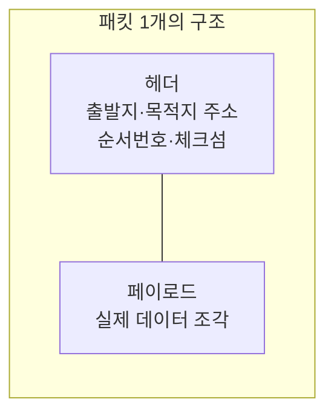

## "선을 미리 깔아둘까, 그때그때 쪼개 보낼까"

전화와 인터넷은 같은 구리선·광케이블 위를 달리지만, 자원을 나누는 철학이 정반대입니다. 전화는 통화하는 동안 **너와 나 사이의 길을 통째로 예약**합니다(회선 교환). 인터넷은 길을 예약하지 않고, 데이터를 작은 조각으로 쪼개 **남는 틈에 끼워 보냅니다**(패킷 교환).

이 한 가지 선택이 라우팅, TCP의 재전송, 혼잡 제어, 버퍼블로트, CDN, 심지어 AWS의 과금 모델까지 — 이 시리즈에서 다룰 거의 모든 것을 결정합니다. 그래서 첫 글은 "패킷이 뭔지" 외우는 게 아니라 **왜 인터넷이 회선이 아니라 패킷을 골랐는지**, 그 트레이드오프를 끝까지 따라갑니다.

## 두 방식을 움직임으로 먼저 보기

위는 **회선 교환** — 통신 시작 전에 끝에서 끝까지 한 줄을 예약(파랑)하고, 그 길은 내가 안 쓰는 순간에도 남에게 못 넘어갑니다. 아래는 **패킷 교환** — A(파랑)와 B(주황)의 조각들이 같은 링크의 빈 틈을 번갈아 채웁니다(통계적 다중화).

<svg viewBox="0 0 700 250" role="img" aria-label="회선 교환은 길을 통째로 예약하고, 패킷 교환은 여러 출처의 조각이 빈 틈을 번갈아 채우는 통계적 다중화 애니메이션">
  <text class="lbl" x="8" y="22">회선 교환 · 통화 내내 길을 통째 예약</text>
  <line class="wire" x1="70" y1="60" x2="630" y2="60"/>
  <line class="resv" x1="70" y1="60" x2="630" y2="60"/>
  <circle class="node" cx="70"  cy="60" r="14"/>
  <circle class="node" cx="257" cy="60" r="14"/>
  <circle class="node" cx="443" cy="60" r="14"/>
  <circle class="node" cx="630" cy="60" r="14"/>
  <text class="sub" x="70"  y="92" text-anchor="middle">A</text>
  <text class="sub" x="630" y="92" text-anchor="middle">목적지</text>
  <circle class="ctok" cx="70" cy="60" r="6"/>

  <text class="lbl" x="8" y="150">패킷 교환 · 빈 틈을 번갈아 — 통계적 다중화</text>
  <line class="wire" x1="70" y1="190" x2="630" y2="190"/>
  <circle class="node" cx="70"  cy="190" r="14"/>
  <circle class="node" cx="350" cy="190" r="14"/>
  <circle class="node" cx="630" cy="190" r="14"/>
  <text class="sub" x="70"  y="222" text-anchor="middle">A·B</text>
  <text class="sub" x="350" y="222" text-anchor="middle">라우터</text>
  <text class="sub" x="630" y="222" text-anchor="middle">목적지</text>
  <rect class="pa p1" x="64" y="183" width="16" height="14" rx="2"/>
  <rect class="pb p2" x="64" y="183" width="16" height="14" rx="2"/>
  <rect class="pa p3" x="64" y="183" width="16" height="14" rx="2"/>
  <rect class="pb p4" x="64" y="183" width="16" height="14" rx="2"/>
  <rect class="pa p5" x="64" y="183" width="16" height="14" rx="2"/>
</svg>

회선 교환에서 파란 선은 토큰이 한가운데 멈춰 있어도 계속 켜져 있습니다 — **놀고 있어도 남이 못 씁니다.** 패킷 교환에서 파랑·주황 조각은 서로의 사이사이를 채웁니다 — **아무도 길을 소유하지 않습니다.**

## 회선 교환: 예약의 장단점

전통 전화망(PSTN)은 통화를 걸면 교환기들이 **종단 간 전용 경로**를 만들고, 통화가 끝날 때까지 그 경로의 대역폭(예: 64 kbps)을 고정 할당합니다.

- **장점**: 연결만 성사되면 대역폭·지연이 **보장**됩니다. 경로가 고정이라 패킷 순서가 뒤집힐 일도, 중간에 버려질 일도 없습니다.
- **단점 1 — 낭비**: 사람의 대화는 절반이 침묵입니다. 그 침묵 동안에도 회선은 예약된 채 놀고, 누구도 그 대역폭을 못 씁니다.
- **단점 2 — 설정 지연과 확장성**: 통신 전 경로를 까는 시간이 필요하고, 동시 통화 수가 곧 물리 회선 수입니다. 수억 개 장치가 잠깐씩 통신하는 인터넷에는 맞지 않습니다.

핵심 통찰: **회선 교환은 트래픽이 꾸준하고 예측 가능할 때(음성) 효율적**입니다. 그러나 데이터 트래픽은 **버스티(bursty)** 합니다 — 웹페이지를 받을 땐 폭발적이고, 읽는 동안은 0입니다. 이 버스티함이 패킷 교환의 존재 이유입니다.

## 패킷 교환: 길을 쪼개 시간으로 나눠 쓰기

패킷 교환은 데이터를 **패킷**(헤더 + 페이로드)으로 쪼개 각각 독립적으로 보냅니다. 길을 미리 예약하지 않고, 각 라우터가 패킷의 목적지 주소를 보고 **그때그때** 다음 홉을 정합니다.

여러 출처의 패킷이 같은 링크를 **시간으로 나눠** 씁니다. A가 잠깐 쉬면 그 틈을 B가 채웁니다. 이것이 **통계적 다중화(statistical multiplexing)** 입니다. 회선 교환의 고정 분할(TDM/FDM)과 달리, 수요에 따라 유동적으로 나눕니다.

> **왜 이게 이기나 — 숫자로.** 링크 용량이 1 Mbps이고, 각 사용자는 활성일 때 100 kbps를 쓰지만 **시간의 10%만** 활성이라 합시다.
> - **회선 교환**: 사용자당 100 kbps를 예약 → **최대 10명**. 11번째는 거절.
> - **패킷 교환**: 35명이 있어도, 11명 이상이 *동시에* 활성일 확률은 통계적으로 0.0004 미만(이항분포). 즉 거의 항상 다 수용하면서 **3배 넘는 사용자**를 받습니다.
>
> 이게 인터넷이 회선이 아니라 패킷인 진짜 이유입니다. **남는 침묵을 공유**하면, 같은 케이블로 훨씬 많은 사람을 태울 수 있습니다.

## 공짜 점심은 없다: 패킷이 치르는 비용

길을 예약하지 않은 대가로, 패킷 교환은 **보장을 포기**합니다. 이게 TCP·QoS·혼잡 제어가 존재하는 이유입니다.

| | 회선 교환 | 패킷 교환 |
|---|---|---|
| 자원 할당 | 사전 예약(고정) | 온디맨드(공유) |
| 대역폭/지연 보장 | 있음 | **없음(best-effort)** |
| 유휴 자원 | 낭비 | 재사용 |
| 혼잡 시 | 연결 거절(통화중) | **큐 대기 → 지연 → 손실** |
| 순서/무결성 | 자동 보장 | **상위 계층(TCP)이 책임** |
| 대표 사례 | 전통 전화망 | 인터넷, 이 글을 받은 경로 |

"best-effort(최선형)"는 인터넷의 핵심 계약입니다. 네트워크는 "최선을 다해 전달하되, 못 해도 책임 안 진다"고 말합니다. 그래서 신뢰성이 필요하면 **양 끝단(end-to-end)** 에서 TCP가 직접 챙깁니다 — 이게 [TCP 글]()의 출발점입니다.

## 저장-후-전달과 라우터의 큐: 지연이 태어나는 곳

패킷 교환 라우터는 **store-and-forward**로 동작합니다 — 패킷을 *전부* 받은 뒤에야 다음 홉으로 내보냅니다(체크섬 검증·목적지 조회를 위해). 출력 링크가 바쁘면 패킷은 **출력 큐**에서 대기합니다.

아래는 패킷이 입력으로 들어와 라우터에 **완전히 도착**한 뒤(저장), 큐에 잠깐 머물다(혼잡), 출력으로 떠나는(전달) 모습입니다. 도착 속도가 처리 속도보다 빠르면 큐가 쌓이고, 큐가 꽉 차면 패킷은 **버려집니다(drop)**.

<svg viewBox="0 0 660 180" role="img" aria-label="라우터가 패킷을 완전히 받은 뒤 출력 큐에 대기시켰다가 전달하는 저장-후-전달 과정과 큐 적체 애니메이션">
  <rect class="rt" x="230" y="40" width="200" height="100" rx="10"/>
  <text class="lbl" x="330" y="30" text-anchor="middle">라우터</text>
  <text class="sub" x="330" y="64" text-anchor="middle">① 완전 수신(저장)</text>
  <text class="sub" x="330" y="100" text-anchor="middle">② 출력 큐 대기</text>
  <text class="sub" x="330" y="120" text-anchor="middle">③ 전달</text>
  <text class="sub" x="40"  y="95" text-anchor="middle">입력</text>
  <text class="sub" x="610" y="95" text-anchor="middle">출력</text>
  <line class="arr" x1="60" y1="90" x2="228" y2="90"/>
  <line class="arr" x1="432" y1="90" x2="600" y2="90"/>
  <rect class="pk in1" x="56" y="83" width="18" height="14" rx="2"/>
  <rect class="pk in2" x="56" y="83" width="18" height="14" rx="2"/>
  <rect class="q1" x="300" y="83" width="18" height="14" rx="2"/>
  <rect class="q2" x="322" y="83" width="18" height="14" rx="2"/>
  <rect class="out1" x="436" y="83" width="18" height="14" rx="2"/>
  <rect class="out2" x="436" y="83" width="18" height="14" rx="2"/>
</svg>

이 큐가 인터넷 지연의 가장 변덕스러운 원천입니다. 그리고 큐가 꽉 차 패킷이 버려지는 게 TCP가 "혼잡"을 감지하는 신호입니다([혼잡 제어 글]()).

## 패킷 하나가 겪는 4가지 지연

end-to-end 지연을 분해하면 라우터 한 홉마다 네 가지가 더해집니다. 이걸 구분 못 하면 "느린 원인"을 영영 못 찾습니다.

| 지연 | 정의 | 무엇에 비례하나 | 줄이는 법 |
|------|------|----------------|-----------|
| **전송(transmission)** | 패킷 비트를 링크로 *밀어내는* 시간 = 패킷크기 ÷ 링크대역폭 | 대역폭(bps) | 더 넓은 파이프, 작은 패킷 |
| **전파(propagation)** | 비트가 물리 매체를 *건너가는* 시간 = 거리 ÷ 전파속도(≈ 2×10⁸ m/s) | **거리** | 더 가까운 서버(CDN·엣지) |
| **처리(processing)** | 헤더 검사·라우팅 조회 | 라우터 성능 | 빠른 하드웨어 |
| **큐(queuing)** | 출력 큐 대기 | **혼잡도(가변)** | 혼잡 제어·QoS·용량 증설 |

> **핵심 직관 — 대역폭 ≠ 지연.** 서울↔상파울루는 광속 한계상 편도 전파만 ~90 ms입니다. 회선을 100배 넓혀도 이 90 ms는 **1 ms도 안 줄어듭니다.** 대역폭은 "파이프 굵기", 지연은 "파이프 길이"입니다. 이 둘을 분리하는 게 [네트워크 성능 글]()의 핵심이고, AWS가 전 세계에 리전·엣지를 까는 이유이기도 합니다.

## 패킷 교환이 만든 인터넷의 성격

이 한 번의 선택에서 인터넷의 모든 성격이 따라 나옵니다.

- **계층화**: 네트워크는 best-effort 전달만, 신뢰성은 끝단이 — 이 역할 분담이 [OSI/TCP-IP 계층]()의 철학입니다.
- **각 패킷이 독립**: 같은 출발·목적지라도 패킷마다 다른 경로로 갈 수 있어, 한 링크가 죽어도 우회합니다(인터넷의 생존성). 이게 [라우팅]()입니다.
- **공유라서 혼잡**: 아무도 길을 예약 안 하니, 다 같이 몰리면 큐가 터집니다 → 혼잡 제어가 필수가 됩니다.
- **종량제 친화**: 길이 아니라 흘려보낸 바이트·시간이 비용 → 클라우드 네트워크 과금(데이터 전송량)의 토대입니다.

## 면접/리뷰 단골 질문

- **Q. 인터넷은 왜 회선 교환을 안 쓰나?** → 데이터 트래픽이 버스티해서. 침묵을 공유하는 통계적 다중화가 같은 자원으로 훨씬 많은 사용자를 수용한다. 보장이 필요하면 끝단(TCP)이 책임진다.
- **Q. 대역폭을 늘리면 지연이 주나?** → 전송 지연만 준다. 전파 지연(거리÷광속)과 혼잡 시 큐 지연은 안 준다. "느림"의 원인부터 분해하라.
- **Q. store-and-forward가 지연을 추가하는데 왜 쓰나?** → 체크섬 검증·라우팅 조회·링크 속도 정합을 위해 패킷 전체가 필요하다. (지연에 극도로 민감한 환경에선 cut-through 스위칭으로 일부 생략한다.)
- **Q. best-effort 망에서 어떻게 신뢰 전송을 하나?** → 손실·순서뒤바뀜·중복을 끝단에서 순서번호·ACK·재전송으로 복구한다 = TCP.

## 정리

- 회선 교환 = **길을 예약**(보장 O, 유휴 낭비). 패킷 교환 = **틈을 공유**(보장 X, 효율 O).
- 인터넷이 패킷을 고른 이유는 **통계적 다중화** — 버스티한 트래픽의 침묵을 공유하면 같은 케이블로 몇 배 더 수용한다.
- 그 대가가 **best-effort**: 지연·손실·순서뒤바뀜은 끝단(TCP)이 책임진다.
- 라우터는 **store-and-forward + 큐**로 동작하고, 패킷 하나의 지연은 **전송·전파·처리·큐** 4가지 합이다 — **대역폭과 지연은 다른 축**이다.

> 다음 글: 이 best-effort 전달과 끝단 책임의 분담을 **계층**으로 정리한 [OSI 7계층 / TCP-IP]()로 이어집니다.
