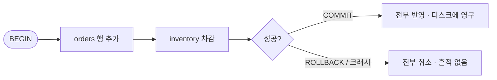
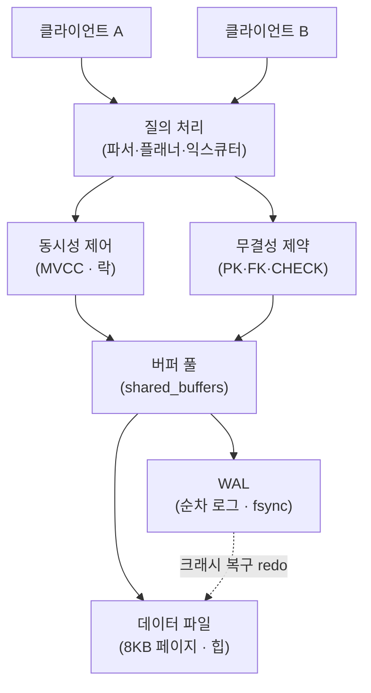

## "그냥 JSON 파일에 저장하면 안 되나요?"

주문 데이터를 `orders.json`에 저장하는 코드를 짰다고 해봅시다. 처음엔 잘 돕니다. 그런데 트래픽이 늘자 이상한 일이 터집니다. 두 요청이 동시에 같은 파일을 읽고-수정-쓰기를 하니 한쪽 주문이 통째로 사라집니다. 파일을 쓰는 도중에 서버가 죽으니 절반만 쓰인 깨진 JSON이 남습니다. 특정 주문 하나를 찾으려고 매번 파일 전체를 읽어 들이느라 점점 느려집니다. 재고가 음수가 되어도 막을 방법이 없습니다.

이 증상들은 우연이 아닙니다. **파일은 "바이트를 디스크에 적는다"는 한 가지 일만** 하기 때문입니다. 동시성, 원자성, 검색, 무결성, 복구 — 이 모든 것을 직접 짜야 하고, 제대로 짜면 결국 데이터베이스를 다시 발명하게 됩니다. 이 글은 "DBMS 쓰는 법"이 아니라, **왜 인류가 굳이 DBMS라는 별도 시스템을 만들었는가**를 PostgreSQL 관점에서 끝까지 따라갑니다.

## 파일로 직접 다룰 때 깨지는 다섯 가지

파일 기반 저장이 무너지는 지점을 하나씩 봅시다. 각각이 DBMS가 책임지는 기능에 정확히 대응합니다.

| 파일의 한계 | 무슨 일이 터지나 | DBMS가 책임지는 것 |
|---|---|---|
| **동시 쓰기 경합** | read-modify-write가 겹쳐 갱신 분실(lost update) | 동시성 제어 (락 · MVCC) |
| **부분 쓰기** | 쓰는 도중 크래시 → 절반만 반영된 깨진 상태 | 원자성 (트랜잭션 · WAL) |
| **선형 검색** | 한 건 찾기에 파일 전체 스캔 O(n) | 인덱스 (B-Tree 등) |
| **무결성 부재** | 음수 재고, 중복 PK, 고아 외래키 | 제약 조건 (constraint) |
| **크래시 후 복구** | "어디까지 저장됐는지" 알 수 없음 | 영속성 + 복구 (WAL · checkpoint) |

핵심 한 줄: **데이터베이스는 디스크 위의 복잡한 자료구조를, 여러 사용자가 동시에, 깨지지 않게, 빠르게 공유하도록 만드는 시스템**입니다. 파일 시스템이 "바이트의 컨테이너"라면, DBMS는 그 위에 트랜잭션·동시성·질의·무결성이라는 네 겹의 보증을 얹은 것입니다.

## 동시성: 같은 데이터를 동시에 만질 때

파일로 직접 다룰 때 가장 먼저, 그리고 가장 조용히 깨지는 게 동시성입니다. 두 클라이언트가 잔고 100원을 동시에 읽고, 각자 50원을 더해 쓰면, 마지막에 쓴 쪽이 이깁니다. 결과는 200원이어야 하는데 150원이 됩니다 — 한 건이 증발한 겁니다(lost update).

아래 애니메이션은 **파일을 직접 쓸 때(왼쪽)** 두 쓰기가 겹쳐 한쪽이 사라지는 모습과, **DBMS가 직렬화(serialize)할 때(오른쪽)** 두 쓰기가 차례로 안전하게 반영되는 모습을 비교합니다.

<div class="dbms-conc" markdown="0">
<style>
.dbms-conc{margin:1.4rem 0;overflow-x:auto}
.dbms-conc svg{width:100%;max-width:720px;height:auto;display:block;margin:0 auto;font-family:inherit}
.dbms-conc .ttl{fill:currentColor;font-size:12px;font-weight:700}
.dbms-conc .lbl{fill:currentColor;font-size:10px;font-weight:600}
.dbms-conc .sub{fill:currentColor;font-size:9px;opacity:.6}
.dbms-conc .store{fill:none;stroke:currentColor;stroke-width:1.4;opacity:.6}
.dbms-conc .wA{fill:#1971c2}
.dbms-conc .wB{fill:#f08c00}
.dbms-conc .lost{fill:#e03131;font-size:10px;font-weight:700;opacity:0;animation:dbmsLost 6s ease-in-out infinite}
.dbms-conc .ok{fill:#2f9e44;font-size:10px;font-weight:700;opacity:0;animation:dbmsOk 6s ease-in-out infinite}
.dbms-conc .pA{offset-path:path('M 60,60 L 130,140');animation:dbmsPA 6s ease-in-out infinite}
.dbms-conc .pB{offset-path:path('M 60,100 L 130,140');animation:dbmsPB 6s ease-in-out infinite}
.dbms-conc .qA{offset-path:path('M 430,60 L 540,140');animation:dbmsQA 6s ease-in-out infinite}
.dbms-conc .qB{offset-path:path('M 430,100 L 540,140');animation:dbmsQB 6s ease-in-out infinite}
.dbms-conc .lock{fill:#2f9e44;opacity:0;animation:dbmsLock 6s ease-in-out infinite}
@keyframes dbmsPA{0%{offset-distance:0%;opacity:0}10%{opacity:1}40%,100%{offset-distance:100%;opacity:1}}
@keyframes dbmsPB{0%{offset-distance:0%;opacity:0}10%{opacity:1}40%,100%{offset-distance:100%;opacity:1}}
@keyframes dbmsLost{0%,45%{opacity:0}55%,100%{opacity:1}}
@keyframes dbmsQA{0%,5%{offset-distance:0%;opacity:0}10%{opacity:1}40%{offset-distance:100%;opacity:1}45%,100%{offset-distance:100%;opacity:.25}}
@keyframes dbmsQB{0%,50%{offset-distance:0%;opacity:0}55%{opacity:1}90%,100%{offset-distance:100%;opacity:1}}
@keyframes dbmsLock{0%,48%{opacity:0}52%,88%{opacity:.9}92%,100%{opacity:0}}
@keyframes dbmsOk{0%,90%{opacity:0}95%,100%{opacity:1}}
</style>
<svg viewBox="0 0 700 200" role="img" aria-label="왼쪽은 파일을 직접 쓸 때 두 동시 쓰기가 겹쳐 한쪽이 사라지는 갱신 분실을, 오른쪽은 DBMS가 쓰기를 직렬화해 둘 다 안전하게 반영하는 모습을 비교하는 애니메이션">
  <text class="ttl" x="100" y="20" text-anchor="middle">파일 직접 쓰기</text>
  <text class="lbl" x="40" y="64">A: +50</text>
  <text class="lbl" x="40" y="104">B: +50</text>
  <circle class="wA pA" r="6"/>
  <circle class="wB pB" r="6"/>
  <rect class="store" x="80" y="135" width="100" height="40" rx="4"/>
  <text class="lbl" x="130" y="160" text-anchor="middle">잔고 파일</text>
  <text class="lost" x="130" y="195" text-anchor="middle">= 150원 (A 분실!)</text>

  <line x1="350" y1="10" x2="350" y2="190" stroke="currentColor" stroke-width="1" opacity=".25"/>

  <text class="ttl" x="540" y="20" text-anchor="middle">DBMS (직렬화)</text>
  <text class="lbl" x="410" y="64">A: +50</text>
  <text class="lbl" x="410" y="104">B: +50</text>
  <circle class="wA qA" r="6"/>
  <circle class="wB qB" r="6"/>
  <rect class="store" x="490" y="135" width="100" height="40" rx="4"/>
  <rect class="lock" x="496" y="141" width="88" height="28" rx="3" fill-opacity=".18" stroke="#2f9e44" stroke-width="1.4"/>
  <text class="lbl" x="540" y="160" text-anchor="middle">행 (잠금)</text>
  <text class="ok" x="540" y="195" text-anchor="middle">= 200원 (둘 다 반영)</text>
</svg>
</div>

DBMS는 같은 행을 동시에 고치려는 쓰기를 **직렬화**합니다. PostgreSQL은 단순히 전체에 락을 거는 게 아니라, 읽기와 쓰기가 서로를 막지 않도록 **MVCC(Multi-Version Concurrency Control)**를 씁니다. 한 행을 UPDATE하면 제자리를 덮어쓰는 게 아니라 새 버전 튜플을 만들고, 각 트랜잭션은 자기 시점의 스냅샷을 봅니다. 그 내부 메커니즘은 동시성 편에서 깊게 다룹니다.

## 원자성과 영속성: "절반만 저장됨"이 없는 이유

파일 쓰기의 두 번째 함정은 부분 쓰기입니다. 주문을 넣으면서 (1) `orders`에 행 추가, (2) `inventory`에서 재고 차감 — 이 둘은 **전부 되거나 전부 안 되거나** 해야 합니다. 둘 사이에서 크래시가 나면 결제는 됐는데 재고는 그대로인 모순이 남습니다.

DBMS는 이걸 **트랜잭션**으로 묶습니다. `BEGIN`과 `COMMIT` 사이의 모든 변경은 하나의 원자적 단위입니다. 이것이 ACID의 앞 두 글자입니다.



여기서 "COMMIT이 반환됐다"가 정확히 무슨 뜻인지가 핵심입니다. **데이터 페이지가 디스크에 다 적혔다는 뜻이 아닙니다.** PostgreSQL은 변경을 데이터 파일에 바로 쓰지 않습니다. 대신 변경 내용을 먼저 **WAL(Write-Ahead Log)**이라는 순차 로그에 기록하고, 그 WAL 레코드가 디스크에 `fsync`로 안전하게 내려간 시점을 COMMIT 완료로 봅니다. 실제 데이터 페이지(8KB 단위)는 나중에 background writer/checkpointer가 비동기로 디스크에 반영합니다.

왜 이렇게 빙 돌아갈까요? **순차 쓰기(WAL)가 랜덤 쓰기(데이터 페이지 여기저기)보다 압도적으로 빠르기** 때문입니다. 그리고 크래시가 나도, 마지막 checkpoint 이후의 WAL을 재생(redo)하면 커밋된 트랜잭션을 모두 복원할 수 있습니다. 이것이 "정전이 나도 커밋된 데이터는 안 날아간다"는 영속성(Durability)의 정체입니다. 각 WAL 레코드에는 LSN(Log Sequence Number)이라는 위치 번호가 붙어, "데이터 페이지보다 그 페이지를 바꾼 로그를 먼저 디스크에 내린다"는 황금률(write-ahead)을 지킵니다.

> **현실 체크 — fsync는 공짜가 아니다.** 커밋마다 디스크 동기화를 강제하면 안전하지만 느립니다. 그래서 PG는 여러 트랜잭션의 fsync를 묶는 group commit, 안전성을 일부 양보하는 `synchronous_commit = off` 같은 손잡이를 둡니다. "얼마나 안전하게 vs 얼마나 빠르게"는 항상 트레이드오프입니다.

## 선언적 질의: "어떻게"가 아니라 "무엇을"

파일이라면 "파일을 열고, 한 줄씩 읽고, 조건에 맞으면 모으고…"라는 **절차**를 직접 짜야 합니다. SQL은 다릅니다. 우리는 **무엇을 원하는지**만 선언합니다.

```sql
SELECT name FROM users WHERE age > 30 ORDER BY name;
```

이 한 줄을 받으면 PostgreSQL은 내부에서 파서가 구문 트리를 만들고, 플래너/옵티마이저가 가능한 실행 계획들의 비용(cost)을 비교한 뒤, 가장 싼 계획을 골라 익스큐터가 돌립니다. 같은 결과라도 "전체 테이블을 훑을지(Seq Scan)" "인덱스를 탈지(Index Scan)"에 따라 비용은 수천 배 차이가 납니다. 이 판단을 사람 대신 엔진이 해준다는 게 선언형의 힘입니다. 그 비용은 `EXPLAIN`으로 들여다볼 수 있습니다.

```sql
EXPLAIN SELECT * FROM users WHERE id = 42;
-- Index Scan using users_pkey on users  (cost=0.29..8.30 rows=1 width=...)
```

옵티마이저는 `pg_statistic`에 모인 통계(컬럼별 distinct 개수, 최빈값, 히스토그램)로 "이 조건에 몇 행이 걸릴지"를 추정해 비용을 매깁니다. 그래서 통계가 낡으면 멀쩡하던 쿼리가 갑자기 느려지기도 합니다 — 이 주제만으로 한 편을 할 만큼 깊습니다.

## 무결성 제약: 잘못된 데이터를 아예 못 들어오게

파일은 어떤 바이트든 받아줍니다. 음수 재고, 중복 이메일, 존재하지 않는 사용자를 가리키는 주문 — 전부 통과합니다. DBMS는 **제약 조건**으로 이런 데이터를 입력 시점에 거부합니다.

```sql
CREATE TABLE orders (
  id         bigserial PRIMARY KEY,                 -- 중복 불가, NOT NULL
  user_id    bigint NOT NULL REFERENCES users(id),  -- 고아 주문 금지 (외래키)
  qty        int NOT NULL CHECK (qty > 0),          -- 0 이하 거부
  email      text UNIQUE                            -- 중복 차단
);
```

이게 중요한 이유는 무결성 로직을 **애플리케이션이 아니라 데이터 옆에** 둘 수 있기 때문입니다. 앱 코드가 열 군데에서 같은 테이블을 쓰더라도, 제약은 단 하나의 진실로서 모든 경로를 막습니다. 버그가 있는 배치 스크립트가 직접 INSERT를 때려도 `CHECK (qty > 0)`은 뚫리지 않습니다. 무결성을 "모든 앱이 잘 짜이길 바라는 것"에서 "엔진이 보장하는 것"으로 끌어내리는 것 — 이것이 일관성(Consistency)의 토대입니다.

## 큰 그림: 디스크 위의 안전한 공유 자료구조

지금까지의 네 책임을 한 그림으로 모으면, DBMS가 왜 이렇게 생겼는지 보입니다. 모든 길은 결국 디스크 위의 데이터를 안전하게 공유하는 것으로 수렴합니다.



`shared_buffers`는 자주 쓰는 페이지를 메모리에 캐시하는 버퍼 풀로, 디스크 I/O를 줄이는 핵심입니다. 변경은 버퍼에서 일어나고, WAL로 영속성을 보장하며, 데이터 파일에는 나중에 반영됩니다. 이 한 장의 그림이 앞으로 다룰 시리즈 전체의 지도입니다.

## RDBMS와 NoSQL — 그래서 항상 SQL인가?

마지막으로 큰 그림 한 단락. 지금까지 말한 트랜잭션·강한 일관성·선언적 SQL·풍부한 제약은 **관계형(RDBMS)**의 강점입니다. 반면 **NoSQL**(Key-Value, Document, Wide-column, Graph)은 이 중 일부를 의도적으로 양보하는 대신 **수평 확장·유연한 스키마·특정 접근 패턴 최적화**를 얻습니다. 예컨대 초고속 캐시(Redis), 유연한 문서(MongoDB), 대량 쓰기·시계열(Cassandra)처럼요.

중요한 건 "관계형이 못 해서 NoSQL이 나온 게 아니라 **트레이드오프**"라는 점입니다. 대부분의 서비스에서 RDBMS가 여전히 기본값인 이유는, 트랜잭션과 무결성을 직접 짜는 비용이 생각보다 크기 때문입니다. NoSQL 지형은 시리즈 후반에서 따로 다룹니다.

## 면접/리뷰 단골 질문

- **Q. 그냥 파일에 저장하면 안 되나? DBMS가 책임지는 게 뭔가?** → 동시성 제어(겹치는 쓰기 직렬화), 원자성(전부-또는-전무), 영속성+복구(크래시 후 커밋 데이터 보존), 인덱스(O(n)→O(log n) 검색), 무결성 제약(잘못된 데이터 차단). 직접 짜면 결국 DBMS를 재발명하게 된다.
- **Q. COMMIT이 반환됐다 = 데이터 파일에 다 쓰였다, 맞나?** → 아니다. PG는 변경을 WAL에 먼저 기록하고 그 WAL을 `fsync`한 시점을 커밋으로 본다. 데이터 페이지(8KB)는 checkpointer가 나중에 비동기로 반영한다. 순차 쓰기가 빠르고, 크래시 시 WAL redo로 복구되기 때문.
- **Q. ACID가 각각 무엇이고 누가 구현하나?** → 원자성=WAL+롤백, 일관성=제약+앱, 격리=동시성 제어(MVCC·락), 영속성=커밋 시 WAL fsync.
- **Q. 선언적 질의의 장점은?** → "무엇을"만 쓰면 옵티마이저가 통계 기반으로 최적 실행 계획("어떻게")을 고른다. 같은 결과라도 Seq Scan vs Index Scan 비용 차이가 수천 배라 이 자동 선택이 핵심.
- **Q. 무결성 제약을 앱이 아니라 DB에 두는 이유는?** → 데이터에 접근하는 모든 경로(여러 앱·배치·수동 쿼리)를 하나의 진실로 막기 위해. 앱 코드가 틀려도 `CHECK`·`FK`는 안 뚫린다.
- **Q. 그러면 NoSQL은 언제 쓰나?** → 강한 일관성·트랜잭션을 일부 양보하고 수평 확장·유연 스키마·특정 패턴 최적화가 필요할 때. "RDBMS가 못 해서"가 아니라 트레이드오프 선택.

## 정리

- 데이터베이스는 **디스크 위의 복잡한 자료구조를, 여러 사용자가 동시에·안 깨지게·빠르게 공유**하도록 만드는 시스템이다. 파일은 그 보증을 하나도 안 해준다.
- 파일이 깨지는 다섯 지점(동시 쓰기·부분 쓰기·선형 검색·무결성 부재·복구 불가)이 DBMS의 다섯 책임에 정확히 대응한다.
- **원자성·영속성**은 WAL로 구현된다 — 변경을 순차 로그에 먼저 fsync(write-ahead)하고, 데이터 페이지는 나중에 반영하며, 크래시 시 WAL을 redo한다.
- **선언적 SQL**은 "무엇을"만 말하면 옵티마이저가 통계로 최적 "어떻게"를 고른다.
- **무결성 제약**은 잘못된 데이터를 데이터 옆에서 입력 시점에 막는다. RDBMS vs NoSQL은 우열이 아니라 트레이드오프다.

> 다음 글: 그 "안 깨지는 데이터"의 구조를 먼저 만들어야 합니다. 멀쩡한 표를 왜 굳이 쪼개는지 — [관계형 모델과 정규화]()로 이어집니다. ACID의 내부 구현은 [트랜잭션과 ACID]() 편에서, NoSQL 지형은 [NoSQL 지도]() 편에서 깊게 다룹니다.
