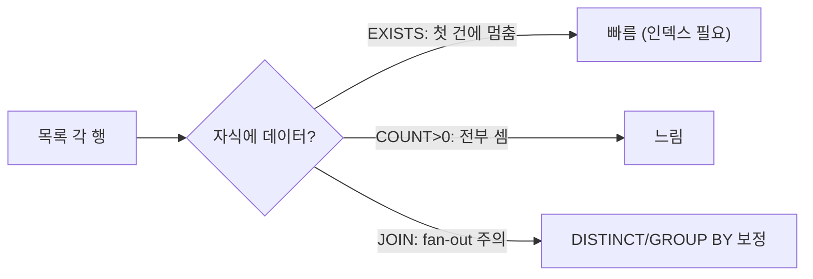

운영 목록 화면에는 "알림 동의 여부", "연락처 남김 여부" 같은 예/아니오 컬럼이 자주 붙는다. 본질은 하나다. **각 행마다 관련 테이블에 데이터가 한 건이라도 있는지**를 표시하는 것. 흔히 카운트 서브쿼리(`(SELECT COUNT(*) ...) > 0`)로 처리하지만, 존재 여부엔 그게 맞지 않다. 세는 일과 있는지 확인하는 일은 다르기 때문이다.

## 핵심: 세지 말고 멈춰라

`COUNT(*)`는 조건에 맞는 행을 **전부 다 센다**. 100건이 있어도 1건만 확인하면 충분한데 100건을 끝까지 읽는다. 반면 `EXISTS`는 **첫 한 건을 찾는 순간 멈춘다(short-circuit)**. 이것이 핵심 차이다.

```sql
-- 나쁨: 다 센다. 0/양수만 알면 되는데 전부 스캔
SELECT u.id, u.name,
  (SELECT COUNT(*) FROM notification n WHERE n.user_id = u.id) > 0 AS has_noti
FROM users u;

-- 좋음: 한 건 찾으면 멈춤
SELECT u.id, u.name,
  EXISTS (SELECT 1 FROM notification n WHERE n.user_id = u.id) AS has_noti
FROM users u;
```

`SELECT 1`인지 `SELECT *`인지는 EXISTS에서 의미가 없다. 옵티마이저는 어차피 행의 존재만 보고 컬럼을 읽지 않는다.

## LEFT JOIN + IS NOT NULL 방식과의 차이

존재 여부를 조인으로도 풀 수 있다.

```sql
SELECT u.id, u.name,
  CASE WHEN n.user_id IS NOT NULL THEN 1 ELSE 0 END AS has_noti
FROM users u
LEFT JOIN (SELECT DISTINCT user_id FROM notification) n
  ON n.user_id = u.id;
```

여기서 함정은 `DISTINCT` 없이 조인하면 **행이 뻥튀기(fan-out)**된다는 점이다. 한 사용자에 알림이 50건이면 사용자 행이 50번 복제되어 나온다. 그래서 서브쿼리로 `DISTINCT`를 먼저 걸거나, 바깥에서 `GROUP BY`로 다시 접어야 한다. 그 보정 비용 때문에, **단순 존재 플래그라면 EXISTS가 더 깔끔하고 빠를 때가 많다.**

조인이 유리한 경우는 따로 있다. 존재 여부 **여러 개**를 동시에 붙이거나, 자식 테이블의 **값까지 함께** 가져와야 할 때다. 플래그 하나면 EXISTS, 자식 데이터를 끌어올 거면 조인 — 이렇게 가른다.

## 인덱스가 전부다

세 방식 모두 자식 테이블의 **조인 키에 인덱스**가 있어야 의미가 있다. `notification(user_id)`에 인덱스가 없으면 행마다 풀스캔이 돌아 N×M으로 폭발한다. EXISTS의 상관 서브쿼리는 바깥 행마다 한 번씩 평가되므로, 이 인덱스가 없으면 가장 심하게 망가진다.



## 운영 함정

- **MyBatis에서 `> 0`을 Boolean으로 매핑.** DB가 0/1을 돌려주면 `boolean` 필드에 직접 매핑되지 않는 드라이버가 있다. resultMap에서 `INT`로 받아 변환하거나, `CASE WHEN ... THEN true ELSE false END`로 명시적 불리언을 반환하라.
- **NULL 비교 함정.** `NOT EXISTS`는 NULL에 안전하지만, `NOT IN (서브쿼리)`는 서브쿼리 결과에 NULL이 하나라도 섞이면 전체가 빈 결과가 된다. "없는 것"을 찾을 땐 `NOT IN` 대신 `NOT EXISTS`를 써라.

## 면접 한 줄 Q&A

**Q. 존재 여부 확인에 COUNT보다 EXISTS가 빠른 이유는?**
A. COUNT는 조건에 맞는 행을 끝까지 모두 세지만, EXISTS는 첫 한 건을 찾는 즉시 평가를 중단하기 때문이다. 존재만 알면 되는 질의에서 나머지 행을 읽는 비용이 통째로 사라진다.
