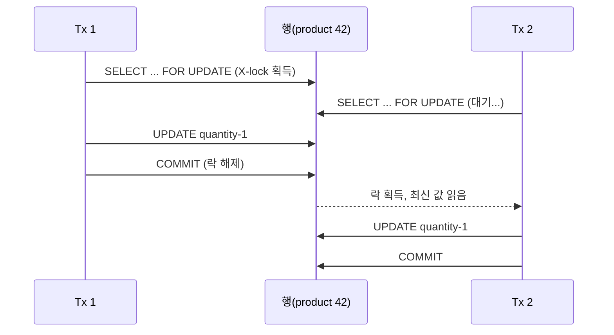

수량 차감의 정합성을 다루다 보면, "조회한 뒤 빼서 저장한다"는 평범한 흐름이 동시 요청 앞에서 무너진다. 두 트랜잭션이 같은 재고 100을 읽고 각자 1을 빼서 99를 쓰면, 두 건이 팔렸는데 재고는 1만 줄어든다. 이 **갱신 손실(lost update)**을 막는 가장 직접적인 도구가 비관적 락, `SELECT ... FOR UPDATE`다.

## 비관적 락 — "충돌은 일어난다"고 가정한다

낙관적 락은 버전 컬럼으로 "저장 시점에 충돌을 발견"하고 재시도한다. 비관적 락은 반대로 "**읽는 순간 미리 행을 잡아** 다른 트랜잭션을 못 들어오게" 한다. 충돌이 잦고 재시도 비용이 큰 재고·잔액 차감에 적합하다.

```sql
START TRANSACTION;

-- 이 행에 배타 락(X-lock)을 건다. 다른 FOR UPDATE는 여기서 대기.
SELECT quantity FROM stock WHERE product_id = 42 FOR UPDATE;

UPDATE stock SET quantity = quantity - 1 WHERE product_id = 42;

COMMIT;  -- 커밋(또는 롤백) 시점에 락 해제
```

핵심은 락이 **트랜잭션 종료까지 유지된다**는 점이다. 첫 트랜잭션이 COMMIT 할 때까지 두 번째 `FOR UPDATE`는 그 행에서 멈춰 대기한다. 그래서 두 번째는 항상 **이미 차감된 최신 값**을 읽는다.



## 락의 입자와 인덱스

InnoDB 같은 엔진에서 행 락은 사실 **인덱스 레코드에 걸린다**. `FOR UPDATE` 조건 컬럼에 인덱스가 없으면, 옵티마이저가 전체 스캔하며 훑은 행들에 락을 걸어 사실상 테이블 전체가 잠길 수 있다. 비관적 락을 쓸 땐 조건 컬럼의 인덱스가 필수다.

또한 격리 수준이 REPEATABLE READ 이상이면 갭 락(gap lock)이 끼어, 존재하지 않는 범위까지 잠가 동시성을 더 떨어뜨릴 수 있다. 단건 PK 조회로 좁히는 것이 안전하다.

## 락 대기 타임아웃

대기는 무한정이 아니다. 엔진에는 락 대기 한도가 있고(예: InnoDB의 `innodb_lock_wait_timeout`, 기본 50초), 초과하면 해당 트랜잭션만 에러로 끊긴다. 애플리케이션에서 더 짧게 제어하려면 `NOWAIT` / `SKIP LOCKED`를 쓴다.

```sql
-- 잠겨 있으면 기다리지 않고 즉시 에러 (빠른 실패)
SELECT * FROM stock WHERE product_id = 42 FOR UPDATE NOWAIT;

-- 잠긴 행은 건너뛰고 가능한 것만 (작업 큐 분배에 유용)
SELECT * FROM job_queue WHERE status='READY'
ORDER BY id LIMIT 10 FOR UPDATE SKIP LOCKED;
```

## 데드락 — 잠금 순서로 막는다

두 트랜잭션이 서로가 쥔 행을 엇갈려 기다리면 데드락이다. T1이 A→B, T2가 B→A 순으로 잡으면 교착이 발생한다.

```
T1: lock A ... 그다음 lock B 시도(대기)
T2: lock B ... 그다음 lock A 시도(대기)  → 서로 대기 = 데드락
```

엔진은 데드락을 감지하면 한쪽을 victim으로 골라 롤백시킨다. 근본 예방책은 **항상 같은 순서로 락을 잡는 것**이다. 여러 행을 잠가야 한다면 PK 오름차순처럼 전역적으로 일관된 순서를 강제한다. 데드락은 완전히 없앨 순 없으니, victim이 된 트랜잭션을 **재시도**하는 로직도 함께 둔다.

## 운영 함정

- **락 보유 구간을 짧게**: `FOR UPDATE`와 COMMIT 사이에 외부 API 호출·메일 발송 같은 느린 작업을 넣으면, 그동안 락이 유지되어 대기 행렬이 폭증한다. I/O는 락 밖으로 빼낸다.
- **자동 커밋·트랜잭션 누락**: `FOR UPDATE`는 트랜잭션 안에서만 의미 있다. 자동 커밋 모드면 SELECT 직후 락이 풀려 무용지물이다. 트랜잭션 경계를 반드시 확인한다.

## 면접 한 줄 Q&A

- **Q. FOR UPDATE는 무엇을 막나?** A. 갱신 손실. 읽는 순간 행에 배타 락을 걸어, 커밋까지 다른 트랜잭션의 같은 행 접근을 직렬화한다.
- **Q. 데드락을 줄이려면?** A. 모든 트랜잭션이 동일한 순서로 락을 획득하게 하고, 보유 시간을 최소화하며, victim 롤백 시 재시도한다.
