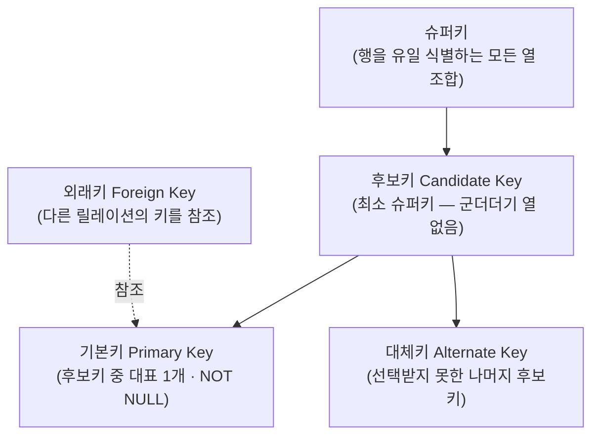
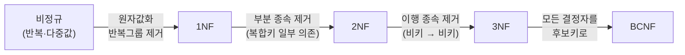

## "주문서 한 장에 다 넣었는데 뭐가 문제죠?"

신규 서비스의 첫 테이블은 거의 예외 없이 **넓고 평평한 한 장의 표**입니다. 주문 한 건에 고객 이름·전화번호·상품명·단가·주소까지 전부 한 행에 욱여넣죠. 처음엔 조인도 없고 쿼리도 짧아서 좋아 보입니다. 그러다 고객이 전화번호를 바꾸면 그 고객의 모든 주문 행을 찾아 고쳐야 하고, 한 행이라도 놓치면 같은 고객 전화번호가 둘로 갈립니다. 주문이 0건인 신규 고객은 **저장할 자리조차 없고**, 마지막 주문을 지우면 고객 정보까지 통째로 사라집니다.

이건 코딩 실수가 아니라 **표 구조 자체의 결함**입니다. [앞 글]()에서 DBMS가 무결성을 책임진다고 했는데, 그 무결성을 **구조 수준에서 보장**하도록 표를 설계하는 이론이 정규화입니다. 이 글은 "1NF·2NF·3NF를 외우는" 글이 아니라, **각 단계가 정확히 어떤 종속을 제거해 어떤 이상현상을 막는지**, 그리고 왜 PostgreSQL에서 이게 외래키·조인 비용과 직결되는지를 끝까지 따라갑니다.

## 관계형 모델: 표가 아니라 "집합"이다

관계형 모델에서 가장 먼저 바로잡을 오해는 "테이블 = 엑셀 시트"라는 직관입니다. 이론적으로 **릴레이션(relation)은 튜플의 집합(set)**입니다. 집합이라는 단어에서 세 가지 성질이 따라 나옵니다.

- **중복 행이 없다**: 집합의 원소는 유일하므로, 이론적 릴레이션엔 완전히 같은 튜플이 둘 존재할 수 없습니다. 그래서 모든 행을 유일하게 식별하는 **키**가 반드시 존재합니다.
- **행·열에 순서가 없다**: `SELECT *`의 행 순서가 보장되지 않는 건 버그가 아니라 모델의 본질입니다. 순서가 필요하면 `ORDER BY`로 명시해야 합니다.
- **각 칸은 도메인(domain)에 속하는 단일 원자값**: 한 칸에 콤마로 묶은 값 목록을 넣는 순간 이 전제가 깨지고, 그게 바로 1NF 위반입니다.

도메인은 "그 열이 가질 수 있는 값의 집합"입니다. PostgreSQL에서 도메인은 단순히 `integer`·`text` 같은 타입이 아니라 `CREATE DOMAIN`으로 제약까지 묶어 정의할 수 있는 일급 개념입니다(`CREATE DOMAIN email AS text CHECK (VALUE ~ '@')`). 키는 세 종류로 구분합니다.



기본키는 후보키 중 하나를 "대표"로 고른 것뿐이고, 외래키는 **다른 릴레이션의 키를 가리키는 포인터**입니다. 정규화로 표를 쪼갠다는 건 결국 이 외래키로 조각들을 다시 이어 붙일 수 있게 만든다는 뜻입니다.

## 이상현상(Anomaly): 쪼개야 하는 진짜 이유

쪼개기 전에 "안 쪼개면 뭐가 터지는가"를 정확히 봐야 합니다. 아래 한 장짜리 주문 테이블을 봅시다.

| 주문ID | 고객ID | 고객전화 | 상품코드 | 상품명 | 단가 | 수량 |
|---|---|---|---|---|---|---|
| 1001 | C1 | 010-1111 | P9 | 키보드 | 30000 | 2 |
| 1002 | C1 | 010-1111 | P7 | 마우스 | 15000 | 1 |
| 1003 | C2 | 010-2222 | P9 | 키보드 | 30000 | 1 |

여기서 세 가지 이상현상이 동시에 발생합니다.

- **갱신 이상(update anomaly)**: 고객 C1의 전화번호가 바뀌면 1001·1002 두 행을 모두 고쳐야 합니다. 하나라도 빠뜨리면 "한 고객에 전화번호 둘"이라는 모순이 생깁니다. 같은 사실이 여러 행에 **중복 저장**됐기 때문입니다.
- **삽입 이상(insertion anomaly)**: 아직 주문이 없는 신규 고객을 등록하려면, 상품·단가 칸을 NULL로 둔 가짜 주문 행을 만들어야 합니다. "주문"이라는 사건 없이는 "고객"이라는 사실을 저장할 수 없습니다.
- **삭제 이상(deletion anomaly)**: C2의 유일한 주문 1003을 지우면, C2라는 고객이 존재한다는 사실과 P9의 단가까지 함께 증발합니다.

근본 원인은 하나입니다. **서로 다른 사실(고객 / 상품 / 주문)이 한 릴레이션에 뒤섞여 있다.** 정규화는 "한 릴레이션은 하나의 사실만 말한다"가 되도록 종속 관계를 따라 표를 분해하는 작업입니다.

## 함수 종속(Functional Dependency): 정규화의 자

분해의 기준은 감이 아니라 **함수 종속**입니다. `X → Y`는 "X 값이 정해지면 Y 값이 유일하게 결정된다"는 뜻입니다. 위 표에서:

- `고객ID → 고객전화` (고객이 정해지면 전화번호 하나로 결정)
- `상품코드 → 상품명, 단가` (상품이 정해지면 이름·단가 결정)
- `{주문ID, 상품코드} → 수량` (주문의 어떤 상품인지가 정해져야 수량 결정)

정규화의 모든 단계는 결국 **"키가 아닌 것이 키가 아닌 것을 결정하거나, 키의 일부만으로 결정되는" 종속을 제거**하는 일입니다. 아래 애니메이션이 위 한 장짜리 표가 이 종속들을 따라 세 조각으로 분해되는 과정을 보여줍니다 — 키(파랑)는 남고, 그 키에 종속된 속성(초록)이 자기 자리를 찾아 떨어져 나갑니다.

<div class="norm-split" markdown="0">
<style>
.norm-split{margin:1.4rem 0;overflow-x:auto}
.norm-split svg{width:100%;max-width:720px;height:auto;display:block;margin:0 auto;font-family:inherit}
.norm-split .lbl{fill:currentColor;font-size:11px;font-weight:600}
.norm-split .sub{fill:currentColor;font-size:9px;opacity:.6}
.norm-split .frame{fill:none;stroke:currentColor;stroke-width:1.3;opacity:.45}
.norm-split .key{fill:#1971c2}
.norm-split .attr{fill:#2f9e44}
.norm-split .dup{fill:#e03131}
/* 통합 표는 사라지고, 분해 표 3개가 차례로 나타난다 */
.norm-split .big{opacity:1;animation:nsbig 8s ease-in-out infinite}
.norm-split .t-order{opacity:0;animation:nsorder 8s ease-in-out infinite}
.norm-split .t-cust{opacity:0;animation:nscust 8s ease-in-out infinite}
.norm-split .t-prod{opacity:0;animation:nsprod 8s ease-in-out infinite}
.norm-split .arrm{opacity:0;fill:currentColor;animation:nsarr 8s ease-in-out infinite}
@keyframes nsbig{0%,30%{opacity:1}45%,100%{opacity:.12}}
@keyframes nsorder{0%,40%{opacity:0}52%,100%{opacity:1}}
@keyframes nscust{0%,55%{opacity:0}67%,100%{opacity:1}}
@keyframes nsprod{0%,70%{opacity:0}82%,100%{opacity:1}}
@keyframes nsarr{0%,42%{opacity:0}55%,100%{opacity:.5}}
</style>
<svg viewBox="0 0 700 320" role="img" aria-label="중복이 가득한 단일 주문 테이블이 함수 종속을 따라 주문·고객·상품 세 테이블로 분해되는 정규화 과정 애니메이션">
  <!-- 통합 표 -->
  <g class="big">
    <text class="lbl" x="40" y="30">통합 주문표 (중복 · 이상현상)</text>
    <rect class="frame" x="40" y="40" width="380" height="80"/>
    <rect class="key" x="40" y="40" width="60" height="20"/>
    <rect class="key" x="100" y="40" width="60" height="20"/>
    <rect class="dup" x="160" y="40" width="70" height="20"/>
    <rect class="attr" x="230" y="40" width="60" height="20"/>
    <rect class="dup" x="290" y="40" width="70" height="20"/>
    <rect class="attr" x="360" y="40" width="60" height="20"/>
    <text class="sub" x="50" y="78" fill="#fff">주문·고객·상품이 한 표에 — 빨강=중복 저장</text>
  </g>
  <!-- 분해 화살표 -->
  <polygon class="arrm" points="350,128 360,148 340,148"/>
  <!-- 주문 -->
  <g class="t-order">
    <text class="lbl" x="40" y="178">주문 (orders)</text>
    <rect class="frame" x="40" y="186" width="180" height="44"/>
    <rect class="key" x="40" y="186" width="55" height="18"/>
    <rect class="key" x="95" y="186" width="55" height="18"/>
    <rect class="attr" x="150" y="186" width="35" height="18"/>
    <rect class="key" x="185" y="186" width="35" height="18"/>
    <text class="sub" x="44" y="222">order_id · product_code(FK) · qty · cust_id(FK)</text>
  </g>
  <!-- 고객 -->
  <g class="t-cust">
    <text class="lbl" x="40" y="258">고객 (customers)</text>
    <rect class="frame" x="40" y="266" width="180" height="40"/>
    <rect class="key" x="40" y="266" width="60" height="18"/>
    <rect class="attr" x="100" y="266" width="120" height="18"/>
    <text class="sub" x="44" y="300">cust_id(PK) · phone</text>
  </g>
  <!-- 상품 -->
  <g class="t-prod">
    <text class="lbl" x="430" y="258">상품 (products)</text>
    <rect class="frame" x="430" y="266" width="230" height="40"/>
    <rect class="key" x="430" y="266" width="60" height="18"/>
    <rect class="attr" x="490" y="266" width="90" height="18"/>
    <rect class="attr" x="580" y="266" width="80" height="18"/>
    <text class="sub" x="434" y="300">product_code(PK) · name · price</text>
  </g>
</svg>
</div>

## 단계별 분해: 어떤 종속을 제거하는가

각 정규형은 "직전 정규형을 만족하면서, 추가로 한 종류의 나쁜 종속을 더 제거한" 상태입니다. 핵심만 짚으면 이렇습니다.



- **1NF — 원자값**: 한 칸에 하나의 값만. `취미: '등산,독서'`처럼 콤마로 묶거나, `전화1·전화2·전화3` 같은 반복 그룹 열을 두지 않습니다. 위반하면 `LIKE '%등산%'` 같은 조회밖에 못 하고 인덱스를 제대로 못 탑니다. (PostgreSQL은 배열·`jsonb`로 다중값을 1급으로 다루기도 하지만, 그건 "1NF를 어겨도 된다"가 아니라 "그 다중값을 하나의 원자적 속성으로 의도했을 때" 쓰는 도구입니다 — 18편 NoSQL에서 다시 봅니다.)
- **2NF — 부분 종속 제거**: 1NF이면서, **복합 기본키의 일부만으로 결정되는** 비키 속성을 없앱니다. 위 주문상세 표의 키가 `{주문ID, 상품코드}`인데 `상품명·단가`는 `상품코드`만으로 결정되죠. 이 부분 종속이 상품 정보를 주문마다 중복시키는 범인입니다. → `products` 테이블로 분리.
- **3NF — 이행 종속 제거**: 2NF이면서, **비키 속성이 다른 비키 속성을 결정하는** 이행 종속(`키 → A → B`)을 없앱니다. 주문 표에 `우편번호 → 시/도`가 있으면, 우편번호(비키)가 시/도(비키)를 결정하는 이행 종속입니다. → 주소 테이블로 분리.
- **BCNF — 모든 결정자가 후보키**: 3NF의 미세한 예외(후보키가 여럿이고 겹칠 때)까지 막아, **`X → Y`인 모든 X가 슈퍼키**가 되도록 합니다. 실무 대부분은 3NF면 충분하고, BCNF는 복수 후보키가 겹치는 드문 스키마에서 의미가 생깁니다.

> **암기 슬로건 — "the key, the whole key, and nothing but the key."** 모든 비키 속성은 (1NF) 키에, (2NF) 키 **전체**에, (3NF) 키 **외엔 아무것도 아닌 것**에 의존해야 한다. 한 문장에 1·2·3NF가 다 들어 있습니다.

## PostgreSQL에서 정규화를 강제하기: 외래키와 무결성

정규화는 종이 위 이론이 아니라 **제약(constraint)으로 강제**해야 의미가 있습니다. 조각낸 테이블이 외래키 없이 흩어져 있으면, "고객 테이블에 없는 cust_id를 가진 주문"이 생겨 오히려 무결성이 더 나빠집니다.

```sql
CREATE TABLE customers (
  cust_id   bigint PRIMARY KEY,
  phone     text NOT NULL
);
CREATE TABLE products (
  product_code text PRIMARY KEY,
  name         text NOT NULL,
  price        numeric NOT NULL CHECK (price >= 0)
);
CREATE TABLE orders (
  order_id     bigint,
  product_code text REFERENCES products(product_code),
  cust_id      bigint REFERENCES customers(cust_id),
  qty          int NOT NULL CHECK (qty > 0),
  PRIMARY KEY (order_id, product_code)         -- 복합키
);
```

여기서 PostgreSQL 내부에서 벌어지는 일을 알아둬야 함정을 피합니다.

- **외래키는 공짜가 아니다**: `REFERENCES`는 내부적으로 **트리거**(`RI_ConstraintTrigger`)로 구현됩니다. 자식 행을 INSERT/UPDATE할 때마다 부모를 조회해 존재를 검증합니다. 그래서 **참조되는 부모 컬럼엔 인덱스(PK가 자동 생성)가 반드시 있고**, 부모를 DELETE/UPDATE할 때 자식을 거꾸로 찾아야 하므로 **자식의 외래키 컬럼에도 인덱스를 직접 걸어줘야** 합니다. PostgreSQL은 외래키 컬럼에 인덱스를 자동 생성하지 **않습니다** — 이걸 빼먹으면 부모 삭제 한 번이 자식 전체 Seq Scan을 유발합니다.
- **NULL과 부분 외래키**: 외래키 컬럼이 NULL이면 참조 검사를 통과합니다(MATCH SIMPLE 기본 동작). "선택적 참조"는 이걸로 표현합니다.
- **`ON DELETE` 정책**: 부모 삭제 시 자식을 어떻게 할지(`RESTRICT`/`CASCADE`/`SET NULL`)를 명시하지 않으면 기본은 `NO ACTION`(트랜잭션 끝에 검사). CASCADE는 편하지만 대량 삭제가 연쇄되어 락·WAL을 폭증시킬 수 있으니 신중히.

이제 갱신 이상은 사라집니다. 고객 전화번호는 `customers`의 **단 한 행**에만 있으니 한 번만 고치면 되고(`UPDATE customers SET phone=... WHERE cust_id=...`), 신규 고객은 주문 없이도 `customers`에 넣을 수 있으며(삽입 이상 해소), 마지막 주문을 지워도 고객·상품 정보는 멀쩡합니다(삭제 이상 해소).

## 반정규화: 그래서 다시 합치는 이유

정규화의 비용은 명확합니다. **사실을 흩어 놓았으니 다시 모으려면 조인**이 필요합니다. 주문 한 건을 화면에 뿌리려면 `orders ⋈ customers ⋈ products` 3개 테이블을 조인해야 하고, 트래픽이 커지면 이 조인이 [조인 알고리즘]()의 비용(해시 빌드, 정렬, 랜덤 I/O)으로 돌아옵니다.

그래서 의도적으로 정규형을 어기는 **반정규화(denormalization)**를 합니다. 핵심은 트레이드오프를 정확히 인지하는 것입니다.

| | 정규화 | 반정규화 |
|---|---|---|
| 저장 | 중복 최소(쓰기 1곳) | 중복 허용(읽기 빠름) |
| 쓰기 | 단순·일관성 자동 | 갱신 시 모든 사본 동기화 필요 |
| 읽기 | 조인 비용 | 조인 회피·집계 미리 계산 |
| 무결성 | 구조가 보장 | 애플리케이션/트리거가 책임 |

반정규화는 "중복을 다시 들이는 대신, 그 중복을 동기화할 책임을 떠안는" 거래입니다. PostgreSQL에서는 위험한 수동 복제 대신 **머티리얼라이즈드 뷰(`MATERIALIZED VIEW` + `REFRESH ... CONCURRENTLY`)**나 **생성 컬럼(`GENERATED ALWAYS AS`)**으로 중복을 통제된 방식으로 둘 수 있습니다. 특히 [샤딩]()처럼 데이터를 여러 노드로 흩는 분산 환경에서는, 교차 노드 조인이 너무 비싸 **반정규화가 사실상 강제**되기도 합니다. 규칙은 하나입니다 — **정규화로 시작해, 측정된 병목에 한해 의도적으로 반정규화하라.** 처음부터 반정규화로 시작하면 정규화로 막을 수 있었던 이상현상을 코드로 막느라 평생 고생합니다.

## 면접/리뷰 단골 질문

- **Q. 정규화를 왜 하나? 한마디로.** → 같은 사실을 한 곳에만 저장해 **삽입·갱신·삭제 이상현상**을 구조적으로 제거하려고. 중복이 사라지면 갱신 시 한 곳만 고치면 된다.
- **Q. 2NF와 3NF의 차이는?** → 2NF는 **복합키의 일부**에만 의존하는 부분 종속 제거, 3NF는 **비키가 비키**를 결정하는 이행 종속 제거. "the whole key"(2NF) vs "nothing but the key"(3NF).
- **Q. 후보키·기본키·외래키 구분?** → 후보키=행을 유일 식별하는 최소 열 집합(여럿일 수 있음), 기본키=후보키 중 대표로 고른 NOT NULL 하나, 외래키=다른 릴레이션의 키를 참조하는 포인터.
- **Q. PostgreSQL에서 외래키 컬럼에 인덱스를 따로 걸어야 하나?** → 그렇다. 참조되는 부모 컬럼은 PK라 인덱스가 있지만, **자식의 FK 컬럼은 자동 인덱스가 안 생긴다.** 없으면 부모 DELETE/UPDATE 시 자식 Seq Scan이 터진다.
- **Q. BCNF는 언제 의미가 있나?** → 후보키가 여럿이고 서로 겹치는(복합 후보키가 중첩) 드문 스키마. 결정자가 후보키가 아닌 종속이 남으면 3NF여도 이상현상이 가능해 BCNF로 더 분해한다. 실무 대부분은 3NF로 충분.
- **Q. 반정규화는 언제?** → 정규화로 설계한 뒤, EXPLAIN으로 **측정된 조인/집계 병목**이 확인됐을 때만. 대신 중복 동기화 책임(머티리얼라이즈드 뷰·트리거)을 함께 설계한다.

## 정리

- 릴레이션은 표가 아니라 **튜플의 집합** — 중복 없음·순서 없음·원자값이 본질이고, 그래서 키가 반드시 존재한다.
- 한 표에 여러 사실을 섞으면 **삽입·갱신·삭제 이상현상**이 생긴다. 정규화는 함수 종속을 따라 "한 표 = 한 사실"로 분해하는 작업.
- 1NF(원자값) → 2NF(부분 종속 제거) → 3NF(이행 종속 제거) → BCNF(모든 결정자가 후보키). "the key, the whole key, and nothing but the key."
- 분해한 조각은 **외래키로 강제**해야 무결성이 산다. PostgreSQL FK는 트리거 기반이라 **자식 FK 컬럼 인덱스를 직접 걸어야** 한다.
- 정규화의 대가는 조인 비용. **측정된 병목에 한해** 머티리얼라이즈드 뷰·생성 컬럼으로 통제된 반정규화를 한다 — 정규화로 시작하라.

> 다음 글: 이렇게 설계한 테이블에 `SELECT` 한 줄을 던지면 엔진 안에서 무슨 일이 벌어질까요? 파서·플래너·옵티마이저·익스큐터를 따라가는 [SELECT 한 줄이 도는 길]()로 이어집니다.
