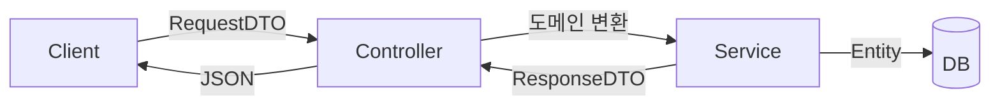

요청 객체와 저장 객체를 분리하는 작업을 하다 보면, 처음엔 "왜 똑같은 필드를 두 번 쓰냐"는 의문이 든다. 엔티티를 그대로 `@RequestBody`로 받으면 코드가 짧아진다. 하지만 그 편의는 **보안 구멍과 계층 결합**이라는 비용을 숨기고 있다.

## 엔티티 직접 바인딩의 위험 — over-posting

엔티티를 요청 본문에 바로 바인딩하면, 클라이언트는 그 객체의 **모든 필드**를 채워 보낼 수 있다. 서버가 의도한 입력 필드만 받는 게 아니라, 노출되면 안 되는 필드까지 외부 입력이 침투한다. 이것이 over-posting(mass assignment) 취약점이다.

```java
// 위험: User 엔티티를 그대로 받는다
@PostMapping("/users")
public User create(@RequestBody User user) {
    return userRepository.save(user);
}
```

`User`에 `role`, `point`, `createdAt` 필드가 있다고 하자. 공격자가 `{"name":"홍길동","role":"ADMIN","point":999999}`를 보내면, 바인더는 친절하게 `role`과 `point`까지 채워 그대로 저장한다. 권한 상승이 한 줄의 JSON으로 일어난다.

## DTO — 입력의 경계를 명시한다

요청 DTO는 "이 API가 받을 필드는 정확히 이것뿐"이라는 **계약**이다. 받을 필드만 정의하고, 도메인 객체로 변환할 때 서버가 통제하는 값(role, 생성일, 상태)은 서버가 채운다.

```java
public class CreateUserRequest {
    @NotBlank private String name;
    @Email    private String email;
    // role, point, createdAt 은 아예 없음 → 외부에서 못 넣는다
}

@PostMapping("/users")
public UserResponse create(@Valid @RequestBody CreateUserRequest req) {
    User user = User.builder()
        .name(req.getName())
        .email(req.getEmail())
        .role(Role.USER)              // 서버가 강제
        .createdAt(Instant.now())     // 서버가 강제
        .build();
    return UserResponse.from(userRepository.save(user));
}
```

응답도 마찬가지다. 엔티티를 그대로 반환하면 비밀번호 해시·내부 플래그가 JSON으로 새어 나간다. **응답 DTO**로 내보낼 필드를 명시적으로 고른다.

## 계층 분리라는 더 큰 이유

over-posting 차단은 표면적 이득이고, 본질은 **계층 간 결합 끊기**다. 엔티티를 컨트롤러까지 노출하면, API 스펙이 곧 DB 스키마가 된다. 컬럼명을 바꾸면 API가 깨지고, API 요구가 바뀌면 테이블을 건드려야 한다. DTO는 이 둘 사이의 **완충층**이다.



API 표현과 영속 모델이 독립적으로 진화할 수 있다는 것 — 이게 DTO를 두는 진짜 값이다.

## 매핑 비용의 트레이드오프

공짜는 아니다. DTO ↔ 엔티티 변환 코드가 늘고, 필드가 양쪽에 중복된다. 이 비용을 줄이는 선택지:

- **수동 매핑/정적 팩토리**: `UserResponse.from(user)`. 명시적이고 디버깅이 쉽다. 소규모에 적합.
- **매핑 라이브러리(MapStruct 등)**: 컴파일 타임에 매퍼를 생성해 리플렉션 없이 빠르다. 필드가 많을 때 보일러플레이트를 줄인다.

리플렉션 기반 런타임 매퍼는 편하지만 느리고, 필드 누락을 컴파일 타임에 못 잡으니 핫패스에선 피한다.

## 운영 함정

- **DTO에 도메인 로직 누수**: DTO는 데이터 운반체다. 여기에 계산·검증 로직을 넣기 시작하면 또 다른 도메인 모델이 되어 책임이 흐려진다. 로직은 도메인 객체·서비스에.
- **과한 DTO 폭발**: 모든 API마다 요청·응답 DTO를 따로 두면 클래스가 폭증한다. 단순 조회는 공유해도 무방하다. **분리의 기준은 "외부 입력을 받는가"** — 입력 경계엔 항상 전용 요청 DTO를 둔다.

## 핵심 요약

- 엔티티 직접 바인딩 = over-posting 위험. 받을 필드만 가진 요청 DTO로 입력 경계를 좁힌다.
- 서버 통제 값(role·생성일·상태)은 절대 클라이언트 입력으로 받지 않고 서버가 채운다.
- DTO는 API 표현과 DB 스키마를 분리하는 완충층. 매핑 비용은 정적 팩토리·MapStruct로 관리한다.
