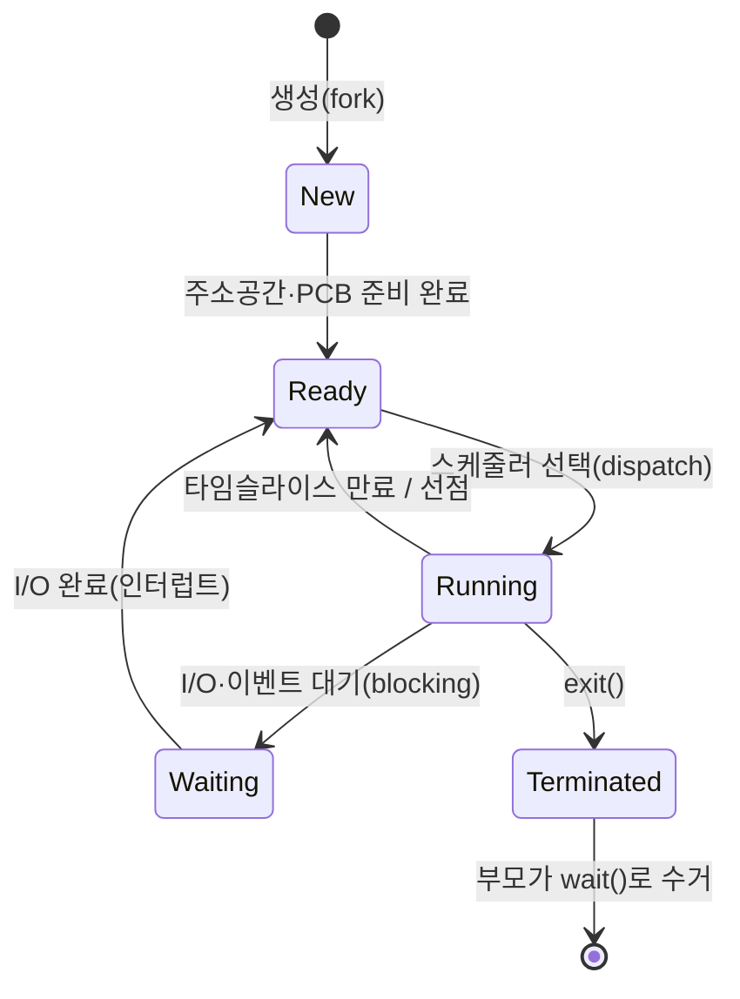

## "프로그램과 프로세스는 같은 말이 아니다"

`/usr/bin/python`은 디스크에 가만히 누워 있는 **바이트 덩어리**입니다 — 죽어 있는 명령의 묶음이죠. 그런데 `python`을 두 번 실행하면, 같은 파일에서 태어난 **두 개의 살아 있는 실행 인스턴스**가 각자의 메모리·각자의 진행 상태를 갖고 따로 돕니다. 디스크의 바이트가 **프로그램**, 메모리에서 살아 도는 실행 인스턴스가 **프로세스**입니다.

[앞 글]()에서 OS는 CPU를 시분할로 여러 프로세스에 나눠준다고 했습니다. 그렇다면 "프로세스 하나"란 정확히 무엇으로 이루어진 실체일까요? 이 글은 프로세스의 해부도 — **주소 공간 + 실행 문맥(PCB)** — 를 펼쳐 보고, 유닉스가 새 프로세스를 만드는 기묘하고 우아한 방식인 `fork`/`exec`, 그리고 그걸 빠르게 만드는 **copy-on-write**까지 따라갑니다.

## 프로세스 = 주소 공간 + 실행 문맥

프로세스를 구성하는 건 크게 둘입니다.

- **주소 공간(address space)**: 그 프로세스가 보는 메모리 전체. 코드·전역변수·힙·스택이 여기 들어갑니다. 핵심은 이게 **가상**이라는 것 — 각 프로세스는 "0번지부터 나 혼자 메모리를 다 쓴다"는 환상을 받습니다(상세는 10편 가상 메모리).
- **실행 문맥(PCB)**: "지금 어디까지 실행했나"를 담는 커널 자료구조. 레지스터 값·프로그램 카운터·프로세스 상태·열린 파일 목록·메모리 맵 포인터 등. 리눅스에선 `task_struct`입니다.

먼저 주소 공간의 지도를 봅시다. 높은 주소에서 낮은 주소로, 스택은 **아래로** 자라고 힙은 **위로** 자라며 가운데 빈 공간을 향해 서로 다가갑니다.

<div class="os-aspace" markdown="0">
<style>
.os-aspace{margin:1.4rem 0;overflow-x:auto}
.os-aspace svg{width:100%;max-width:680px;height:auto;display:block;margin:0 auto;font-family:inherit}
.os-aspace .seg{stroke:currentColor;stroke-width:1.4;opacity:.85}
.os-aspace .lbl{fill:currentColor;font-size:12px;font-weight:600}
.os-aspace .ins{font-size:11px;font-weight:600}
.os-aspace .sub{fill:currentColor;font-size:10px;opacity:.6}
.os-aspace .stk{fill:#1971c2}.os-aspace .hp{fill:#2f9e44}
.os-aspace .neu{fill:currentColor;opacity:.06}
.os-aspace .grow{opacity:.45;transform-box:fill-box}
.os-aspace .sgrow{transform-origin:50% 0%;animation:osasstk 4.5s ease-in-out infinite}
.os-aspace .hgrow{transform-origin:50% 100%;animation:osashp 4.5s ease-in-out infinite}
@keyframes osasstk{0%{transform:scaleY(0)}45%{transform:scaleY(.92)}60%{transform:scaleY(.92)}100%{transform:scaleY(0)}}
@keyframes osashp{0%{transform:scaleY(0)}45%{transform:scaleY(.92)}60%{transform:scaleY(.92)}100%{transform:scaleY(0)}}
.os-aspace .ar{fill:currentColor;opacity:.5;animation:osasar 4.5s ease-in-out infinite}
@keyframes osasar{0%,100%{opacity:.15}45%{opacity:.7}}
</style>
<svg viewBox="0 0 680 360" role="img" aria-label="프로세스 가상 주소 공간 레이아웃 — 높은 주소의 스택이 아래로, 힙이 위로 자라며 가운데 빈 공간을 향해 다가가는 애니메이션">
  <text class="sub" x="560" y="58" text-anchor="end">0x7FFF… 높은 주소</text>
  <text class="sub" x="560" y="332" text-anchor="end">0x0 낮은 주소</text>

  <rect class="seg stk" x="370" y="50" width="190" height="40" rx="4" style="opacity:.85"/>
  <text class="ins" x="465" y="74" text-anchor="middle" fill="#fff">Stack ↓ (지역변수·함수 프레임)</text>
  <rect class="grow stk sgrow" x="400" y="92" width="130" height="78" rx="2"/>
  <polygon class="ar" points="360,100 372,100 366,114"/>
  <text class="sub" x="350" y="108" text-anchor="end">함수 호출마다</text>

  <text class="sub" x="465" y="135" text-anchor="middle" style="opacity:.55">↕ 빈 공간 · mmap·공유 라이브러리</text>

  <rect class="grow hp hgrow" x="400" y="172" width="130" height="78" rx="2"/>
  <polygon class="ar" points="360,250 372,250 366,236"/>
  <text class="sub" x="350" y="246" text-anchor="end">malloc마다</text>

  <rect class="seg hp" x="370" y="250" width="190" height="34" rx="4" style="opacity:.85"/>
  <text class="ins" x="465" y="271" text-anchor="middle" fill="#fff">Heap ↑ (malloc/new)</text>
  <rect class="seg neu" x="370" y="284" width="190" height="22"/>
  <text class="sub" x="465" y="299" text-anchor="middle" style="opacity:.8">BSS (0으로 초기화된 전역)</text>
  <rect class="seg neu" x="370" y="306" width="190" height="22"/>
  <text class="sub" x="465" y="321" text-anchor="middle" style="opacity:.8">Data (초기화된 전역)</text>
  <rect class="seg neu" x="370" y="328" width="190" height="24"/>
  <text class="sub" x="465" y="344" text-anchor="middle" style="opacity:.8">Text (코드 · 읽기전용)</text>

  <text class="lbl" x="20" y="170">하나의 프로세스가</text>
  <text class="lbl" x="20" y="188">보는 메모리 전체</text>
  <text class="sub" x="20" y="212">= 가상 주소 공간.</text>
  <text class="sub" x="20" y="228">각 프로세스는 "혼자</text>
  <text class="sub" x="20" y="242">다 쓴다"는 환상을</text>
  <text class="sub" x="20" y="256">받는다(10편).</text>
  <text class="sub" x="20" y="284" style="opacity:.8">스택·힙이 만나면</text>
  <text class="sub" x="20" y="298" style="opacity:.8">→ stack overflow</text>
</svg>
</div>

여기서 두 가지를 봐두세요. **(1)** 코드(Text)는 읽기 전용이라 같은 프로그램을 여러 번 띄워도 물리 메모리에서 **공유**됩니다 — 메모리를 아끼는 첫 번째 트릭. **(2)** 스택과 힙은 빈 공간을 사이에 두고 반대 방향으로 자랍니다. 재귀가 너무 깊으면 스택이 한계를 넘어 `stack overflow`, 힙이 끝없이 커지면 메모리 부족(OOM)이 됩니다.

## PCB: 커널이 들고 있는 프로세스의 신분증

주소 공간이 "프로세스가 보는 메모리"라면, **PCB(Process Control Block)** 는 "커널이 그 프로세스에 대해 아는 모든 것"입니다. 리눅스의 `task_struct`에는 대략 이런 게 들어 있습니다.

| 항목 | 내용 | 왜 필요한가 |
|---|---|---|
| PID / PPID | 프로세스 ID, 부모 ID | 식별·계층(프로세스 트리) |
| 상태 | running/ready/waiting… | 스케줄러가 누굴 돌릴지 결정 |
| 레지스터·PC | 멈춘 순간의 CPU 문맥 | **컨텍스트 스위치 시 저장/복원**(6편) |
| 메모리 맵 | 페이지 테이블 포인터 | 주소 공간 전환 |
| 파일 디스크립터 표 | 열린 파일·소켓 | `read()`의 `fd` 0,1,2가 여기 |
| 우선순위·스케줄링 정보 | nice·vruntime 등 | CFS 스케줄링(5편) |
| 부모/자식·시그널 | 관계·대기 상태 | `wait()`·시그널 전달(7편) |

컨텍스트 스위치란 결국 **"실행 중인 프로세스의 레지스터를 PCB에 저장하고, 다음 프로세스의 PCB에서 레지스터를 복원하는 것"** 입니다. PCB가 곧 프로세스의 "세이브 파일"인 셈입니다.

## 프로세스의 일생: 상태 전이

프로세스는 태어나서 죽을 때까지 정해진 상태들을 오갑니다. 핵심은 **Running ↔ Ready ↔ Waiting** 삼각형입니다.



- **Ready → Running**: 스케줄러가 골라 CPU를 줌(dispatch). CPU가 1개면 한 번에 하나만 Running.
- **Running → Ready**: 타임슬라이스가 끝나거나 더 급한 프로세스에 **선점**당함. 일을 못 끝낸 게 아니라 차례를 넘긴 것.
- **Running → Waiting**: `read()`로 디스크를 기다리는 등 **블로킹**. CPU를 자발적으로 내려놓음 → 그동안 다른 프로세스가 CPU를 씀(이게 시분할이 효율적인 이유).
- **Terminated → 수거**: 죽은 뒤에도 종료 코드를 부모가 `wait()`로 거둘 때까지 PCB가 남습니다. 이 짧은 유령 상태가 **좀비**입니다.

> **현실 체크 — 좀비와 고아.** **좀비(zombie)**: 자식이 죽었는데 부모가 `wait()`를 안 해 종료 정보가 PCB에 남은 상태. 좀비는 메모리는 거의 안 쓰지만 **PID를 점유**해, 쌓이면 PID 고갈로 새 프로세스를 못 만듭니다. **고아(orphan)**: 부모가 먼저 죽은 자식. 고아는 `init`(PID 1)이 입양해 대신 `wait()` 해주므로 좀비가 안 됩니다. 즉 **좀비를 만드는 건 죽은 자식이 아니라 게으른 부모**입니다.

## fork/exec: 새 프로세스를 만드는 유닉스의 방식

다른 OS는 "프로그램을 지정해 새 프로세스 생성"을 한 번에 합니다. 유닉스는 기묘하게도 이를 **둘로 쪼갭니다**.

- **`fork()`**: 호출한 프로세스(부모)를 **통째로 복제**해 거의 똑같은 자식을 만듭니다. 자식은 부모의 주소 공간·열린 파일·레지스터를 그대로 물려받습니다. `fork()`는 **두 번 리턴**합니다 — 부모에겐 자식의 PID, 자식에겐 0.
- **`exec()`**: 현재 프로세스의 주소 공간을 **새 프로그램 이미지로 통째 교체**합니다. PID는 그대로지만 코드·데이터가 싹 갈립니다. 성공하면 리턴하지 않습니다(돌아올 코드가 사라졌으니).

이 둘을 붙인 **fork → (자식에서) exec** 가 셸이 명령을 실행하는 바로 그 패턴입니다.

```c
#include <unistd.h>
#include <sys/wait.h>

pid_t pid = fork();              /* 여기서 프로세스가 둘로 갈라진다 */
if (pid == 0) {                  /* ── 자식: 반환값 0 ── */
    char *argv[] = {"ls", "-l", NULL};
    execvp("ls", argv);          /* 주소공간을 ls로 교체 → 성공 시 리턴 안 함 */
    _exit(127);                  /* execvp 실패했을 때만 도달 */
} else if (pid > 0) {            /* ── 부모: 반환값 = 자식 PID ── */
    int status;
    waitpid(pid, &status, 0);    /* 자식 종료를 거둔다 → 좀비 방지 */
}
```

왜 굳이 둘로 쪼갰을까요? **fork와 exec 사이의 빈틈**이 강력하기 때문입니다. 자식이 `exec` 하기 직전에 파일 디스크립터를 조작할 수 있어, 셸의 **리다이렉션·파이프**(`ls > out.txt`, `a | b`)가 바로 이 틈에서 구현됩니다 — fork 후 자식의 stdout을 파일/파이프로 바꿔치기한 뒤 exec. 한 번에 합쳐진 API였다면 불가능했을 유연함입니다.

## COW: fork가 통째 복제인데 왜 빠른가

여기서 의문이 생깁니다. `fork()`가 부모의 주소 공간을 **통째로 복사**한다면, 수 GB짜리 프로세스를 fork할 때마다 수 GB를 복사해야 할 텐데? 게다가 대부분은 fork 직후 곧장 `exec`로 다 갈아엎는데 — 그 복사는 순전히 낭비입니다.

해법이 **copy-on-write(COW)** 입니다. fork 시점엔 **아무것도 복사하지 않고**, 부모·자식이 같은 물리 페이지를 **공유**하되 전부 **읽기 전용**으로 표시합니다. 둘 중 하나가 어떤 페이지에 **쓰려는 순간**에만, 그 페이지에서 page fault가 나고 커널이 **그 페이지 하나만** 복제해 갈라줍니다.

<div class="os-cow" markdown="0">
<style>
.os-cow{margin:1.4rem 0;overflow-x:auto}
.os-cow svg{width:100%;max-width:700px;height:auto;display:block;margin:0 auto;font-family:inherit}
.os-cow .bx{stroke:currentColor;stroke-width:1.5}
.os-cow .lbl{fill:currentColor;font-size:11px;font-weight:600}
.os-cow .sub{fill:currentColor;font-size:9.5px;opacity:.6}
.os-cow .pg{fill:currentColor;opacity:.08;stroke:currentColor;stroke-width:1.3}
.os-cow .par{fill:#1971c2}.os-cow .chi{fill:#f08c00}
.os-cow .ln{stroke:currentColor;opacity:.4;stroke-width:1.6;fill:none}
.os-cow .lnp{stroke:#1971c2}.os-cow .lnc{stroke:#f08c00}
.os-cow .flash{fill:#e03131;opacity:0;animation:oscowfl 6s ease-in-out infinite}
@keyframes oscowfl{0%,45%{opacity:0}52%{opacity:.85}62%,100%{opacity:0}}
.os-cow .copy{opacity:0;animation:oscowcp 6s ease-in-out infinite}
@keyframes oscowcp{0%,52%{opacity:0}60%,100%{opacity:1}}
.os-cow .old{animation:oscowold 6s ease-in-out infinite}
@keyframes oscowold{0%,50%{opacity:.55}58%,100%{opacity:0}}
.os-cow .new{opacity:0;animation:oscownew 6s ease-in-out infinite}
@keyframes oscownew{0%,53%{opacity:0}61%,100%{opacity:.7}}
.os-cow .ph{fill:currentColor;font-size:10px;font-weight:600;opacity:0}
.os-cow .ph1{animation:oscowp1 6s ease-in-out infinite}
.os-cow .ph2{animation:oscowp2 6s ease-in-out infinite}
@keyframes oscowp1{0%,42%{opacity:.75}48%,100%{opacity:0}}
@keyframes oscowp2{0%,52%{opacity:0}60%,100%{opacity:.75}}
</style>
<svg viewBox="0 0 700 290" role="img" aria-label="fork 직후 부모와 자식이 같은 물리 페이지를 읽기전용으로 공유하다가, 쓰기가 일어난 페이지만 복제되어 갈라지는 copy-on-write 애니메이션">
  <rect class="bx par" x="30" y="40" width="120" height="44" rx="6" style="fill:#1971c2;opacity:.85"/>
  <text class="lbl" x="90" y="67" text-anchor="middle" fill="#fff">부모 프로세스</text>
  <rect class="bx chi" x="30" y="206" width="120" height="44" rx="6" style="fill:#f08c00;opacity:.85"/>
  <text class="lbl" x="90" y="233" text-anchor="middle" fill="#fff">자식 (fork)</text>

  <rect class="pg" x="360" y="50" width="100" height="38" rx="4"/><text class="sub" x="410" y="73" text-anchor="middle">물리페이지 P1</text>
  <rect class="pg" x="360" y="126" width="100" height="38" rx="4"/><text class="sub" x="410" y="149" text-anchor="middle">물리페이지 P2</text>
  <rect class="pg" x="360" y="202" width="100" height="38" rx="4"/><text class="sub" x="410" y="225" text-anchor="middle">물리페이지 P3</text>
  <rect class="flash" x="360" y="126" width="100" height="38" rx="4"/>

  <rect class="pg copy" x="560" y="206" width="100" height="38" rx="4" style="stroke:#f08c00"/>
  <text class="sub copy" x="610" y="229" text-anchor="middle">P2' (복제)</text>

  <path class="ln lnp" d="M150,55 L360,66"/>
  <path class="ln lnp" d="M150,60 L360,142"/>
  <path class="ln lnp" d="M150,65 L360,218"/>
  <path class="ln lnc" d="M150,222 L360,80"/>
  <path class="ln lnc old" d="M150,226 L360,150"/>
  <path class="ln lnc" d="M150,230 L360,228"/>
  <path class="ln lnc new" d="M150,232 L560,224"/>

  <text class="ph ph1" x="350" y="278" text-anchor="middle">fork 직후: 모든 페이지 공유 · 전부 읽기전용</text>
  <text class="ph ph2" x="350" y="278" text-anchor="middle">자식이 P2에 쓰기 → 그 페이지만 복제(P2')되어 분리</text>
</svg>
</div>

COW 덕분에 `fork()`는 GB짜리 프로세스든 거의 **즉시** 끝납니다(페이지 테이블만 복제). 그리고 fork 직후 곧장 `exec` 하면 공유 페이지를 단 한 장도 복사하지 않고 그대로 버리니, 낭비가 0에 수렴합니다. **"필요할 때까지 미룬다(lazy)"** — OS 전반을 관통하는 핵심 철학이고, 디맨드 페이징(12편)에서 다시 만납니다.

> **현실 체크 — Redis의 fork와 COW.** Redis는 디스크 스냅샷(RDB)을 만들 때 `fork()` 한 자식이 메모리를 그대로 보며 저장합니다. 평소엔 COW로 공짜지만, **저장 중 부모가 많은 키를 수정**하면 그만큼 페이지가 복제돼 메모리가 순간 최대 2배까지 튈 수 있습니다. "fork는 공짜"가 아니라 "**쓰기 전까지** 공짜"임을 잊으면 프로덕션에서 OOM을 맞습니다.

## 직접 들여다보기: /proc로 프로세스 해부하기

리눅스는 모든 프로세스의 내부를 `/proc/<pid>/` 가상 파일로 노출합니다 — 이 글의 모든 개념을 눈으로 확인할 수 있습니다.

```bash
# 주소 공간 레이아웃을 그대로 본다 (text/heap/stack/공유라이브러리 매핑)
cat /proc/self/maps
#   ...-... r-xp  /usr/bin/cat        ← Text (읽기+실행)
#   ...-... rw-p  [heap]              ← Heap
#   ...-... rw-p  [stack]             ← Stack

# PCB의 사람이 읽을 수 있는 요약 (상태·메모리·스레드 수·fd 수)
grep -E 'State|VmRSS|Threads' /proc/self/status

# 프로세스 계층(트리)과 부모-자식 관계
pstree -p
ps -ef                     # PID·PPID·실행 명령
ps aux | awk '$8 ~ /Z/'    # 좀비(STAT에 Z) 찾기
```

`cat /proc/self/maps` 한 줄로, 위에서 그림으로 본 주소 공간이 실제 프로세스에 그대로 있다는 걸 확인할 수 있습니다.

## 면접/리뷰 단골 질문

- **Q. 프로그램과 프로세스의 차이는?** → 프로그램은 디스크의 정적 바이트, 프로세스는 메모리에서 실행 중인 동적 인스턴스(주소 공간 + PCB). 한 프로그램에서 여러 프로세스가 나올 수 있다.
- **Q. fork()는 무엇을 반환하나?** → 두 번 반환한다. 부모에겐 자식 PID(>0), 자식에겐 0, 실패 시 -1. 이 반환값으로 부모/자식 코드 경로를 가른다.
- **Q. fork가 전체 복사인데 왜 안 느린가?** → copy-on-write. 처음엔 페이지를 공유(읽기전용)하고, 쓰기가 일어난 페이지만 그때 복제한다. fork 직후 exec 하면 복사가 거의 0.
- **Q. 좀비 프로세스란? 어떻게 막나?** → 자식이 죽었으나 부모가 `wait()`로 종료 코드를 안 거둔 상태. 부모가 `wait()/waitpid()` 하거나 SIGCHLD 처리로 막는다. 부모가 먼저 죽은 고아는 init이 입양해 좀비가 안 된다.
- **Q. 스택과 힙은 어느 방향으로 자라나?** → 스택은 높은 주소에서 낮은 주소로(아래로), 힙은 낮은 주소에서 높은 주소로(위로). 가운데 빈 공간에서 만나면 overflow.

## 정리

- 프로세스 = **가상 주소 공간**(Text·Data·BSS·Heap↑·Stack↓) + **PCB**(레지스터·상태·fd표·메모리맵 = `task_struct`).
- PCB는 프로세스의 "세이브 파일" — 컨텍스트 스위치는 곧 PCB에 레지스터를 저장/복원하는 일.
- 상태는 **Running↔Ready↔Waiting** 삼각형 + New/Terminated. 죽고도 안 거둬지면 **좀비**, 부모 잃으면 **고아**(init이 입양).
- 유닉스는 생성을 **fork(복제) + exec(교체)** 로 쪼개, 그 틈에서 리다이렉션·파이프를 구현한다.
- `fork()`가 빠른 이유는 **COW** — 쓰기 전까지 공유. "필요할 때까지 미룬다"는 OS의 핵심 철학.

> 다음 글: 한 프로세스 안에서 **여러 실행 흐름**을 돌리는 **스레드와 동시성** — 주소 공간은 공유하되 스택·레지스터는 따로 갖는 가벼운 실행 단위, 그리고 그게 부르는 race condition의 세계로 이어집니다.
