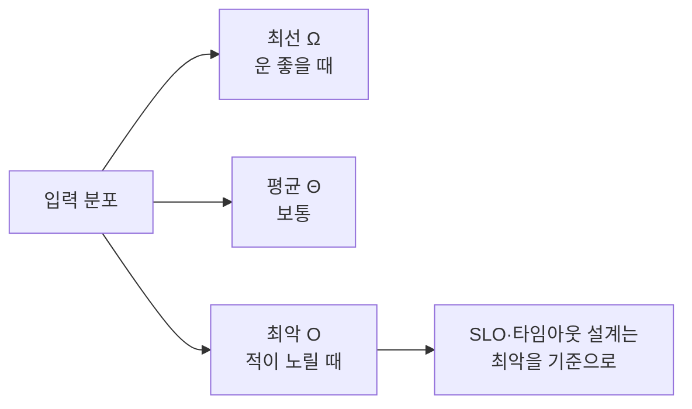

## 왜 "초"가 아니라 "n에 대한 함수"로 재나

알고리즘이 빠른지 느린지를 **스톱워치**로 재면 안 됩니다. 같은 코드도 CPU·언어·캐시 상태에 따라 측정값이 출렁이고, 무엇보다 **입력이 커질 때 어떻게 변하는지**를 말해주지 못합니다. 우리가 정말 알고 싶은 건 "지금 1만 건에서 0.1초인데, **1억 건이 되면** 어떻게 되나?"입니다.

그래서 알고리즘의 비용을 **입력 크기 `n`에 대한 함수**로 표현하고, `n`이 충분히 커질 때의 **증가율(growth rate)** 만 봅니다. 상수 배수와 낮은 차수 항을 버리는 이 추상화가 바로 **점근 분석(asymptotic analysis)** 이고, 그 표기법이 **Big-O**입니다.

## 증가율이 전부다 — 같은 n에서도 운명이 갈린다

아래는 입력 `n`이 커질 때 연산 횟수가 어떻게 벌어지는지를 실제로 **달리게** 한 것입니다. 처음엔 다 비슷해 보이지만, `n`이 커질수록 곡선의 등급(class)이 모든 것을 결정합니다.

<div class="bigo-race" markdown="0">
<style>
.bigo-race{margin:1.4rem 0;overflow-x:auto}
.bigo-race svg{width:100%;max-width:720px;height:auto;display:block;margin:0 auto;font-family:inherit}
.bigo-race .ax{stroke:currentColor;opacity:.25;stroke-width:1}
.bigo-race .lbl{fill:currentColor;font-size:11px;font-weight:600}
.bigo-race .sub{fill:currentColor;font-size:9.5px;opacity:.6}
.bigo-race .c1{fill:none;stroke:#2f9e44;stroke-width:2.4;stroke-dasharray:1400;stroke-dashoffset:1400;animation:bigodraw 6s ease-out infinite}
.bigo-race .c2{fill:none;stroke:#1971c2;stroke-width:2.4;stroke-dasharray:1400;stroke-dashoffset:1400;animation:bigodraw 6s ease-out infinite}
.bigo-race .c3{fill:none;stroke:#f08c00;stroke-width:2.4;stroke-dasharray:1400;stroke-dashoffset:1400;animation:bigodraw 6s ease-out infinite}
.bigo-race .c4{fill:none;stroke:#e8590c;stroke-width:2.4;stroke-dasharray:1400;stroke-dashoffset:1400;animation:bigodraw 6s ease-out infinite}
.bigo-race .c5{fill:none;stroke:#e03131;stroke-width:2.6;stroke-dasharray:1400;stroke-dashoffset:1400;animation:bigodraw 6s ease-out infinite}
@keyframes bigodraw{0%{stroke-dashoffset:1400}70%{stroke-dashoffset:0}100%{stroke-dashoffset:0}}
</style>
<svg viewBox="0 0 720 320" role="img" aria-label="입력 n이 커질 때 O(1) O(log n) O(n) O(n log n) O(n제곱) O(2의 n승)의 연산 횟수 곡선이 점점 벌어지며 그려지는 애니메이션">
  <line class="ax" x1="60" y1="280" x2="700" y2="280"/>
  <line class="ax" x1="60" y1="20" x2="60" y2="280"/>
  <text class="sub" x="690" y="298" text-anchor="end">입력 크기 n →</text>
  <text class="sub" x="52" y="28" text-anchor="end">연산 횟수 ↑</text>
  <path class="c5" d="M60,280 L120,278 L170,270 L210,250 L245,215 L275,165 L300,95 L320,30"/>
  <path class="c4" d="M60,280 L160,275 L260,262 L360,238 L460,202 L560,154 L660,94 L700,64"/>
  <path class="c3" d="M60,280 L160,256 L260,228 L360,196 L460,160 L560,120 L660,76 L700,58"/>
  <path class="c2" d="M60,280 L160,218 L260,182 L360,156 L460,136 L560,120 L660,106 L700,101"/>
  <path class="c1" d="M60,272 L700,272"/>
  <text class="lbl" x="326" y="26" fill="#e03131">O(2ⁿ)</text>
  <text class="lbl" x="700" y="60" fill="#e8590c" text-anchor="end">O(n²)</text>
  <text class="lbl" x="700" y="50" fill="#f08c00" text-anchor="end" dy="-12">O(n log n)</text>
  <text class="lbl" x="700" y="98" fill="#1971c2" text-anchor="end">O(n)</text>
  <text class="lbl" x="640" y="116" fill="#2f9e44" text-anchor="end">O(log n)</text>
  <text class="lbl" x="200" y="266" fill="#2f9e44">O(1)</text>
</svg>
</div>

핵심은 **n이 작을 때의 순간이 아니라, n이 커질 때의 기울기**입니다. `O(2ⁿ)`은 처음엔 바닥을 기다가 `n`이 30만 되어도 천장을 뚫습니다. 입력 100만 건 기준으로 감을 잡아봅시다.

| 등급 | 이름 | n=10 | n=1,000 | n=1,000,000 | 대표 예 |
|------|------|------|---------|-------------|---------|
| `O(1)` | 상수 | 1 | 1 | 1 | 배열 인덱스 접근, 해시 조회 |
| `O(log n)` | 로그 | 3 | 10 | 20 | [이진 탐색](), 균형 트리 |
| `O(n)` | 선형 | 10 | 1,000 | 1,000,000 | 배열 1회 순회 |
| `O(n log n)` | 선형로그 | 33 | 10,000 | 2천만 | [비교 정렬]() |
| `O(n²)` | 제곱 | 100 | 100만 | 1조 | 이중 루프, 버블 정렬 |
| `O(2ⁿ)` | 지수 | 1,024 | 10³⁰⁰ | 우주가 끝남 | 부분집합 완전탐색 |

`O(n²)`와 `O(n log n)`의 차이는 "조금 느리다"가 아니라, 100만 건에서 **1조 번 vs 2천만 번** — 5만 배입니다. 알고리즘 선택이 하드웨어 업그레이드를 압도하는 이유입니다.

## O, Ω, Θ — 위·아래·정확히

Big-O는 사실 **상한(upper bound)** 만 말합니다. 엄밀히는 세 가지가 있습니다.

- **`O(f(n))` (빅오)**: "아무리 나빠도 이보다 빠르다" — **상한**.
- **`Ω(f(n))` (빅오메가)**: "아무리 좋아도 이보다 느리다" — **하한**.
- **`Θ(f(n))` (빅세타)**: 상한과 하한이 같을 때 — **정확한 차수**.

수식으로는, 어떤 상수 $c>0$와 $n_0$가 존재해서 $n \ge n_0$인 모든 $n$에 대해

$$0 \le f(n) \le c \cdot g(n) \implies f(n) \in O(g(n))$$

이 성립하면 됩니다. 즉 **상수 배수와 작은 항을 무시**한다는 약속입니다. $3n^2 + 100n + 7$은 그냥 $O(n^2)$입니다 — `n`이 커지면 $n^2$ 항이 지배하니까요.

> 일상 대화에선 "퀵정렬은 O(n log n)"이라고 하지만, 엄밀히는 **평균** $\Theta(n\log n)$, **최악** $O(n^2)$입니다. "이 알고리즘은 O(n²)야"라는 말이 최악인지 평균인지를 구분하는 습관이 면접과 장애 대응을 가릅니다.

## 최선·평균·최악 — 어느 것을 말하고 있나

같은 알고리즘도 입력에 따라 비용이 다릅니다. 해시 테이블 조회는 **평균 O(1)** 이지만 충돌이 몰리면 **최악 O(n)** 입니다. 시스템을 설계할 때 중요한 건 보통 **최악**과 **평균** 둘 다입니다 — 평균이 좋아도 최악이 사용자 한 명의 요청을 1초간 멈추게 한다면 SLO를 깹니다.



악의적 입력으로 최악을 유도하는 것이 바로 **알고리즘 복잡도 공격**입니다(예: 의도적 해시 충돌로 서버를 O(n²)에 빠뜨리는 HashDoS). "평균만 보면 된다"가 통하지 않는 영역입니다.

## 분할상환(amortized) — 가끔 비싼데 평균은 싸다

여기서 가장 오해가 많은 개념. **동적 배열**(Java `ArrayList`, C++ `vector`, Python `list`)에 원소를 `n`번 추가한다고 합시다. 보통은 빈 자리에 그냥 넣어 **O(1)**. 그런데 꽉 차면 **2배 크기의 새 배열을 만들어 전부 복사**합니다 — 그 순간만 **O(n)**.

그럼 추가 1회는 O(n)일까요? 아닙니다. **드물게** 일어나는 비싼 복사 비용을 전체 횟수로 **나눠 갚으면(amortize)**, 추가 1회의 평균은 **O(1)** 입니다. 아래에서 직접 보세요 — 대부분 싸게 들어가다, 용량이 차는 순간(빨강)에만 전체를 복사하고 용량이 2배로 점프합니다.

<div class="bigo-amort" markdown="0">
<style>
.bigo-amort{margin:1.4rem 0;overflow-x:auto}
.bigo-amort svg{width:100%;max-width:680px;height:auto;display:block;margin:0 auto;font-family:inherit}
.bigo-amort .lbl{fill:currentColor;font-size:11px;font-weight:600}
.bigo-amort .sub{fill:currentColor;font-size:9.5px;opacity:.6}
.bigo-amort .cap{fill:none;stroke:currentColor;stroke-width:1.5;opacity:.45}
.bigo-amort .cell{fill:#1971c2;opacity:0}
.bigo-amort .copyflash{fill:#e03131;opacity:0}
.bigo-amort .bar{fill:#2f9e44;opacity:.8}
.bigo-amort .spike{fill:#e03131;opacity:.85}
.bigo-amort .c0{animation:bigocell 8s linear infinite;animation-delay:0s}
.bigo-amort .c1{animation:bigocell 8s linear infinite;animation-delay:.5s}
.bigo-amort .c2{animation:bigocell 8s linear infinite;animation-delay:1s}
.bigo-amort .c3{animation:bigocell 8s linear infinite;animation-delay:1.5s}
.bigo-amort .c4{animation:bigocell 8s linear infinite;animation-delay:2s}
.bigo-amort .c5{animation:bigocell 8s linear infinite;animation-delay:2.5s}
.bigo-amort .c6{animation:bigocell 8s linear infinite;animation-delay:3s}
.bigo-amort .c7{animation:bigocell 8s linear infinite;animation-delay:3.5s}
@keyframes bigocell{0%{opacity:0}4%{opacity:.85}100%{opacity:.85}}
.bigo-amort .grow{animation:bigogrow 8s linear infinite}
@keyframes bigogrow{0%,24%{transform:scaleX(.5);opacity:.3}26%,49%{transform:scaleX(.5)}26%{opacity:.45}50%{transform:scaleX(1);opacity:.45}100%{transform:scaleX(1);opacity:.45}}
.bigo-amort .flash2{animation:bigoflash 8s linear infinite}
@keyframes bigoflash{0%,24%{opacity:0}25%{opacity:.7}30%{opacity:0}49%{opacity:0}50%{opacity:.7}55%{opacity:0}100%{opacity:0}}
</style>
<svg viewBox="0 0 680 200" role="img" aria-label="동적 배열에 원소를 추가할 때 대부분 O(1)로 들어가다 용량이 차면 두 배로 늘리며 전체를 복사하는 분할상환 애니메이션">
  <text class="sub" x="20" y="34">동적 배열 (용량이 차면 2배로 재할당)</text>
  <rect class="cap grow" x="20" y="48" width="320" height="40" rx="6" style="transform-origin:20px 68px"/>
  <rect class="copyflash flash2" x="20" y="48" width="320" height="40" rx="6" style="transform-origin:20px 68px"/>
  <rect class="cell c0" x="26"  y="54" width="32" height="28" rx="3"/>
  <rect class="cell c1" x="64"  y="54" width="32" height="28" rx="3"/>
  <rect class="cell c2" x="102" y="54" width="32" height="28" rx="3"/>
  <rect class="cell c3" x="140" y="54" width="32" height="28" rx="3"/>
  <rect class="cell c4" x="178" y="54" width="32" height="28" rx="3"/>
  <rect class="cell c5" x="216" y="54" width="32" height="28" rx="3"/>
  <rect class="cell c6" x="254" y="54" width="32" height="28" rx="3"/>
  <rect class="cell c7" x="292" y="54" width="32" height="28" rx="3"/>
  <text class="sub" x="20" y="126">추가 1회 비용</text>
  <line class="cap" x1="20" y1="180" x2="660" y2="180"/>
  <rect class="bar" x="40"  y="168" width="20" height="12"/>
  <rect class="bar" x="70"  y="168" width="20" height="12"/>
  <rect class="bar" x="100" y="168" width="20" height="12"/>
  <rect class="spike" x="130" y="138" width="20" height="42"/>
  <rect class="bar" x="160" y="168" width="20" height="12"/>
  <rect class="bar" x="190" y="168" width="20" height="12"/>
  <rect class="bar" x="220" y="168" width="20" height="12"/>
  <rect class="bar" x="250" y="168" width="20" height="12"/>
  <rect class="spike" x="280" y="118" width="20" height="62"/>
  <rect class="bar" x="310" y="168" width="20" height="12"/>
  <text class="sub" x="150" y="134" text-anchor="middle" fill="#e03131">복사!</text>
  <text class="sub" x="300" y="114" text-anchor="middle" fill="#e03131">복사!</text>
  <text class="lbl" x="470" y="100" fill="#2f9e44">평균 = O(1)</text>
  <text class="sub" x="470" y="118">비싼 복사를 전체로 나눠 갚음</text>
</svg>
</div>

왜 정확히 O(1)일까요? 1, 2, 4, 8, …, n으로 2배씩 늘리면 **총 복사 비용**은 $1 + 2 + 4 + \dots + n < 2n = O(n)$입니다. 이걸 `n`번의 추가로 나누면 **추가당 평균 O(1)**. 핵심은 "**2배(곱셈)** 로 늘린다"는 것 — 만약 매번 +1씩(덧셈) 늘리면 복사 총합이 $O(n^2)$가 되어 추가당 O(n)으로 망합니다.

> 이것이 `ArrayList`가 `capacity`를 1.5~2배로 키우는 이유입니다. **분할상환 O(1)** 는 "매 연산이 O(1)"이 아니라 "**충분히 많이 하면 1회 평균이 O(1)**"이라는, 미묘하지만 결정적인 약속입니다.

분할상환을 분석하는 방법은 세 가지입니다.

| 기법 | 아이디어 |
|------|----------|
| 집계법(aggregate) | n번 연산 총비용을 구해 n으로 나눔 |
| 회계법(accounting) | 싼 연산에 "요금"을 미리 적립해 비싼 연산 때 인출 |
| 잠재법(potential) | 자료구조의 "위치 에너지" Φ로 비용 변화를 추적 |

## 시간만이 아니다 — 공간, 그리고 캐시라는 현실

복잡도는 **시간(time)** 과 **공간(space)** 둘 다 있습니다. 메모이제이션은 시간을 사서 공간을 쓰는([동적계획법]()의 핵심) 전형적 트레이드오프입니다.

그리고 Big-O가 **숨기는 상수**가 현실에서 결정적일 때가 있습니다. 같은 `O(n)`이라도 **메모리를 연속으로 훑는** 배열 순회는 캐시 친화적이라 빠르고, 포인터를 따라 메모리를 점프하는 [연결 리스트]() 순회는 캐시 미스로 수십 배 느릴 수 있습니다. 점근적으로 같아도 **상수 인자**가 다릅니다.

```text
배열:      [a][b][c][d]  → 한 캐시라인에 여러 원소, 예측 가능한 prefetch
연결리스트: a → ? → ? → ? → 매번 다른 메모리, 캐시 미스 폭발
```

그래서 실무 규칙: **먼저 점근 등급을 맞추고**(O(n²)→O(n log n)), 그 다음 같은 등급 안에서 **상수와 캐시**를 줄입니다. 순서를 거꾸로 하면(작은 상수에 집착하며 나쁜 등급을 방치) 입력이 커질 때 무너집니다.

## 프로덕션에서 마주치는 함정

| 함정 | 증상 | 해법 |
|------|------|------|
| 숨은 O(n) 안의 루프 | "리스트인데 `in` 으로 멤버십 검사" → 전체 O(n²) | `set`/`map`(해시) O(1) 조회로 |
| 문자열 `+=` 누적 | 불변 문자열을 n번 이어붙여 O(n²) | `StringBuilder`/`join` |
| N+1 쿼리 | 1건마다 쿼리 1번 → DB 왕복 O(n) | 일괄 조회(IN)·조인 |
| 최악 무시 | 평균 O(1)인데 HashDoS로 O(n²) | 랜덤 시드 해시, 트리화(Java 8 HashMap) |
| 조기 최적화 | 측정 없이 상수 깎기 | 먼저 프로파일링 → 등급부터 |

## 면접/리뷰 단골 질문

- **Q. O와 Θ의 차이?** → O는 상한("이보다 빠르다"), Θ는 상한·하한이 같은 정확한 차수. 퀵정렬은 평균 Θ(n log n), 최악 O(n²).
- **Q. 동적 배열 추가가 O(1)인 이유?** → 분할상환. 2배씩 늘리면 총 복사 O(n)을 n번으로 나눠 추가당 평균 O(1). +1씩 늘리면 O(n)으로 망함.
- **Q. O(n log n)과 O(n²) 중 작은 n에선 후자가 빠를 수도 있나?** → 가능. 상수가 작으면 작은 n에서 역전(그래서 퀵정렬도 작은 구간은 삽입정렬로 전환). 하지만 n이 커지면 등급이 이긴다.
- **Q. 평균이 좋으면 최악은 무시해도 되나?** → 아니다. SLO·타임아웃은 최악 기준. 악의적 입력(복잡도 공격)이 최악을 노린다.
- **Q. 같은 O(n)인데 왜 속도 차이?** → 숨은 상수와 캐시 지역성. 배열 순회 vs 연결리스트 순회.

## 정리

- 알고리즘 비용은 초가 아니라 **입력 n에 대한 증가율**로 잰다 — 상수·낮은 차수는 버리는 **점근 분석**.
- **O(상한)·Ω(하한)·Θ(정확)** 를 구분하고, **최선·평균·최악** 중 무엇을 말하는지 늘 의식한다.
- **분할상환**은 "가끔 비싼 연산"을 전체로 나눠 갚아 평균 비용을 낮추는 분석 — 동적 배열의 2배 증가가 대표.
- 등급을 먼저 맞추고, 같은 등급 안에서 **상수·캐시 지역성**을 줄인다. Big-O가 숨기는 현실을 잊지 말 것.

> 이 글은 「알고리즘 A-Z」 시리즈의 출발점입니다. 다음 글부터 [배열·연결 리스트]()를 시작으로 자료구조와 알고리즘을 하나씩, 왜 그렇게 설계됐는지와 함께 파고듭니다.
</content>
</invoke>
