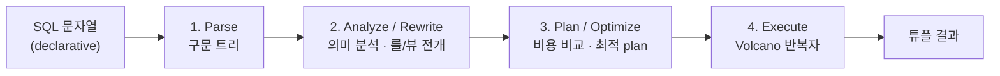

## "쿼리만 바꿨는데 왜 100배 빨라지지?"

같은 데이터, 같은 결과를 주는 두 SQL이 있는데 하나는 12ms, 하나는 1.2초입니다. 더 황당한 건 **똑같은 SQL인데** 어제는 빠르다가 오늘 갑자기 느려지는 경우죠. 인덱스를 건드린 적도 없는데 말입니다.

이걸 "DB가 원래 변덕스러워"로 넘기면 영영 못 고칩니다. 진짜 이유는, 우리가 던지는 SQL이 **무엇을 원하는지(declarative)**만 적은 선언문이고, **어떻게 가져올지(procedural)**는 엔진이 매번 새로 결정하기 때문입니다. `SELECT`는 명령이 아니라 **요청서**입니다. 그 요청서가 엔진 안에서 토큰으로 쪼개지고, 트리가 되고, 여러 실행 계획 후보 중 비용이 가장 싼 하나로 컴파일되어, 마침내 한 튜플씩 위로 끌려 올라옵니다.

[앞 글]()에서 정규화로 "데이터를 어떻게 놓을지"를 봤다면, 이 글은 "그 데이터를 어떻게 꺼낼지"를 엔진의 눈으로 끝까지 따라갑니다. PostgreSQL 소스(`src/backend/`)의 단계 이름을 그대로 짚으며 가겠습니다.

## SQL은 선언적이다 — 그래서 누군가 절차로 번역해야 한다

`SELECT name FROM users WHERE age > 30`은 "나이 30 초과인 사람의 이름"이라는 **집합의 정의**일 뿐, 테이블을 처음부터 끝까지 훑으라는 말도, 인덱스를 타라는 말도 아닙니다. 같은 결과를 내는 물리적 방법은 보통 수십 가지입니다.

- `users`를 통째로 순차 스캔(Seq Scan)하며 `age > 30`을 필터
- `age` 인덱스로 30 초과 구간만 스캔(Index Scan) 후 힙에서 `name`을 꺼냄
- 다른 테이블과의 조인이 끼면 — 어느 쪽을 먼저 읽나? 어떤 조인 알고리즘? 순서만 해도 N!가지

결과는 전부 똑같습니다. 하지만 비용은 천차만별입니다. **이 중 가장 싼 길을 고르는 일**이 옵티마이저의 존재 이유이고, 관계형 DB가 50년을 살아남은 핵심 무기입니다. SQL이 "방법"까지 적게 했다면 우리는 인덱스를 바꿀 때마다 모든 쿼리를 다시 짜야 했을 겁니다.

## 한 SELECT의 일생 — 네 단계

PostgreSQL은 백엔드 프로세스가 쿼리 문자열을 받으면 `exec_simple_query()`(`src/backend/tcop/postgres.c`)를 시작으로 네 단계를 거칩니다.



각 단계의 산출물은 다음 단계의 입력이 되는 **트리**입니다. 자료구조가 한 번에 하나씩 정교해진다고 보면 됩니다.

### 1단계 — Parse: 문자열을 구문 트리로

`raw_parser()`(`src/backend/parser/`)가 Flex 렉서로 토큰을 쪼개고 Bison 문법(`gram.y`)으로 **원시 파스 트리(raw parse tree)**를 만듭니다. 이 단계는 순수하게 **문법**만 봅니다. `SELCT`라고 오타 내면 여기서 syntax error가 납니다. 하지만 `SELECT zzz FROM users`처럼 **문법은 맞지만 존재하지 않는 컬럼**은 이 단계를 통과합니다 — 카탈로그를 아직 안 봤으니까요. 산출물은 `SelectStmt` 같은 노드입니다.

### 2단계 — Analyze & Rewrite: 의미를 채우고 뷰를 펼친다

`parse_analyze()`가 시스템 카탈로그(`pg_class`, `pg_attribute` 등)를 조회해 **의미 분석**을 합니다. 테이블·컬럼이 실제로 존재하는지, 타입이 맞는지를 검증하고, 이름을 OID로 해석해 `Query` 노드를 만듭니다. `zzz` 컬럼이 없다는 `column does not exist` 에러가 여기서 납니다.

이어서 **rewriter**(`src/backend/rewrite/`)가 룰 시스템을 적용합니다. 가장 흔한 예가 **뷰 전개**: 뷰는 사실 `ON SELECT DO INSTEAD` 룰로 구현돼 있어, 뷰를 참조하는 쿼리는 이 단계에서 원본 테이블 쿼리로 치환됩니다. `row-level security` 정책도 여기서 `WHERE` 조건으로 주입됩니다. 그래서 뷰를 써도 별도 실행 오버헤드가 없는 것입니다 — 실행 전에 평평하게 펴지니까요.

### 3단계 — Plan & Optimize: 가능한 길을 모두 따져 가장 싼 길

여기가 핵심입니다. `Query` 노드(논리적 "무엇")를 받아 `planner()`(`src/backend/optimizer/`)가 물리적 실행 계획(`PlannedStmt`, "어떻게")으로 바꿉니다. PostgreSQL의 플래너는 **비용 기반 옵티마이저(CBO)**입니다.

1. 각 테이블에 대한 **접근 경로(access path)** 후보 생성 — Seq Scan, Index Scan, Bitmap Heap Scan 등.
2. 조인이 있으면 **조인 순서와 알고리즘**(Nested Loop / Hash / Merge)의 조합을 탐색. 동적 계획법으로 부분 문제(어떤 테이블 집합을 조인하는 최적 경로)를 쌓아 올립니다. 테이블이 `geqo_threshold`(기본 12)를 넘으면 전수 탐색 대신 유전 알고리즘(GEQO)으로 전환합니다 — 안 그러면 조합 폭발하니까요.
3. 각 후보에 **추정 비용(cost)**을 매기고 가장 싼 것을 고릅니다.

비용은 추상 단위입니다. `seq_page_cost`(기본 1.0), `random_page_cost`(기본 4.0 — 랜덤 I/O가 순차보다 비싸다는 가정), `cpu_tuple_cost`(0.01) 같은 파라미터에 **예상 처리 행 수(cardinality)**를 곱해 더한 값이죠. 그 행 수 추정의 정확도가 곧 플랜 품질을 좌우하는데, 추정은 `ANALYZE`가 수집해 `pg_statistic`에 넣어둔 통계(n_distinct, MCV, 히스토그램)에 기반합니다. **"어제는 빨랐는데 오늘 느린"의 90%는 이 통계가 낡았거나(stale) 데이터 분포가 틀어진 경우입니다.** 통계가 "이 조건에 10행 나온다"고 거짓말하면 옵티마이저는 Nested Loop를 고르는데, 실제로 100만 행이면 재앙이 됩니다. (통계의 세계는 [카디널리티와 통계 글]()에서 깊게 다룹니다.)

### 4단계 — Execute: Volcano 반복자 모델

옵티마이저가 고른 `PlannedStmt`는 **plan 노드의 트리**입니다. 익스큐터(`src/backend/executor/`)는 이 트리를 **Volcano(Iterator) 모델**로 돌립니다. 핵심은 모든 노드가 똑같은 인터페이스를 갖는다는 것입니다.

- 각 노드는 `ExecProcNode()` 호출 한 번에 **튜플 하나**를 반환합니다(요청 시 생산, demand-driven / pull 방식).
- 루트(보통 결과를 클라이언트로 보내는 노드)가 자식에게 "다음 튜플 줘"를 호출하면, 자식이 또 자기 자식에게 "다음 튜플 줘"를 호출하는 식으로 트리 아래까지 재귀합니다.
- 리프(Scan 노드)가 힙/인덱스에서 튜플 하나를 길어 올리면, 그게 위로 한 칸씩 흘러 올라가며 필터·조인·정렬·집계를 거칩니다.

이 설계의 아름다움은 **노드의 조합 가능성**입니다. Scan 위에 Filter, 그 위에 HashJoin, 또 그 위에 Sort, Limit을... 모두가 "튜플 하나 줘 / 튜플 하나 줄게"라는 같은 계약만 지키면 자유롭게 쌓입니다. 그래서 `LIMIT 10`이 붙으면 정렬이 끝나기도 전에 위에서 10개만 당기고 멈출 수 있습니다(pull 모델의 이점). 단점은 튜플마다 함수 호출 오버헤드가 커서, 현대 PG는 표현식 평가에 **JIT 컴파일**(LLVM)을 도입해 이를 완화합니다.

아래 애니메이션은 그 "당김"을 보여줍니다. 루트가 아래로 "다음 튜플 줘" 요청을 내리면(빨강), 리프 Scan이 힙에서 튜플 하나를 길어 위로 올려 보냅니다(파랑). 한 번에 트리 전체가 아니라 **한 튜플씩** 흐릅니다.

<div class="sqlpipe-volcano" markdown="0">
<style>
.sqlpipe-volcano{margin:1.4rem 0;overflow-x:auto}
.sqlpipe-volcano svg{width:100%;max-width:520px;height:auto;display:block;margin:0 auto;font-family:inherit}
.sqlpipe-volcano .vlbl{fill:currentColor;font-size:11px;font-weight:600}
.sqlpipe-volcano .vsub{fill:currentColor;font-size:9px;opacity:.6}
.sqlpipe-volcano .vbx{fill:none;stroke:currentColor;stroke-width:1.4;opacity:.5}
.sqlpipe-volcano .vedge{stroke:currentColor;stroke-width:1.4;opacity:.35}
.sqlpipe-volcano .vdown{fill:#e03131;offset-path:path('M 230,84 L 230,150 L 230,216');animation:sqlpipeDown 4s ease-in-out infinite}
.sqlpipe-volcano .vup{fill:#1971c2;offset-path:path('M 250,216 L 250,150 L 250,84');animation:sqlpipeUp 4s ease-in-out infinite}
@keyframes sqlpipeDown{0%{offset-distance:0%;opacity:0}5%{opacity:1}45%{offset-distance:100%;opacity:1}50%,100%{offset-distance:100%;opacity:0}}
@keyframes sqlpipeUp{0%,50%{offset-distance:0%;opacity:0}55%{opacity:1}95%{offset-distance:100%;opacity:1}100%{offset-distance:100%;opacity:0}}
</style>
<svg viewBox="0 0 480 270" role="img" aria-label="Volcano 반복자 모델에서 루트가 아래로 다음 튜플을 요청하고 리프 스캔이 튜플 하나를 위로 올려 보내는 pull 방식 애니메이션">
  <rect class="vbx" x="160" y="40" width="160" height="36" rx="4"/>
  <text class="vlbl" x="240" y="62" text-anchor="middle">Result (루트)</text>
  <rect class="vbx" x="160" y="116" width="160" height="36" rx="4"/>
  <text class="vlbl" x="240" y="138" text-anchor="middle">Filter</text>
  <rect class="vbx" x="160" y="216" width="160" height="36" rx="4"/>
  <text class="vlbl" x="240" y="238" text-anchor="middle">Index Scan (리프)</text>
  <line class="vedge" x1="240" y1="76" x2="240" y2="116"/>
  <line class="vedge" x1="240" y1="152" x2="240" y2="216"/>
  <circle class="vdown" r="6"/>
  <circle class="vup" r="6"/>
  <text class="vsub" x="120" y="150" text-anchor="end">요청 ↓</text>
  <text class="vsub" x="360" y="150" text-anchor="start">튜플 ↑</text>
  <text class="vsub" x="240" y="266" text-anchor="middle">호출 한 번 = 튜플 하나 (demand-driven pull)</text>
</svg>
</div>

아래 애니메이션이 네 단계 전체를 한눈에 보여줍니다 — 문자열이 트리가 되고, 후보 플랜 중 싼 것이 선택되고, 결과가 흘러나오기까지.

<div class="sqlpipe-flow" markdown="0">
<style>
.sqlpipe-flow{margin:1.4rem 0;overflow-x:auto}
.sqlpipe-flow svg{width:100%;max-width:740px;height:auto;display:block;margin:0 auto;font-family:inherit}
.sqlpipe-flow .lbl{fill:currentColor;font-size:12px;font-weight:600}
.sqlpipe-flow .sub{fill:currentColor;font-size:9.5px;opacity:.6}
.sqlpipe-flow .bx{fill:none;stroke:currentColor;stroke-width:1.4;opacity:.45}
.sqlpipe-flow .stxt{fill:currentColor;font-size:10px;font-family:inherit}
.sqlpipe-flow .s1{opacity:0;animation:sqlpipeS1 9s ease-in-out infinite}
.sqlpipe-flow .s2{opacity:0;animation:sqlpipeS2 9s ease-in-out infinite}
.sqlpipe-flow .s3{opacity:0;animation:sqlpipeS3 9s ease-in-out infinite}
.sqlpipe-flow .s4{opacity:0;animation:sqlpipeS4 9s ease-in-out infinite}
.sqlpipe-flow .cheap{fill:#2f9e44}
.sqlpipe-flow .dear{fill:#e03131;opacity:0;animation:sqlpipeDear 9s ease-in-out infinite}
.sqlpipe-flow .nodfill{fill:#1971c2}
@keyframes sqlpipeS1{0%,6%{opacity:0}12%,100%{opacity:1}}
@keyframes sqlpipeS2{0%,30%{opacity:0}36%,100%{opacity:1}}
@keyframes sqlpipeS3{0%,54%{opacity:0}60%,100%{opacity:1}}
@keyframes sqlpipeS4{0%,78%{opacity:0}84%,100%{opacity:1}}
@keyframes sqlpipeDear{0%,54%{opacity:0}60%,100%{opacity:.35}}
</style>
<svg viewBox="0 0 740 270" role="img" aria-label="SQL 문자열이 파스 트리로, 다시 비용 비교를 거쳐 최적 실행 계획으로, 마지막으로 튜플 결과로 변환되는 4단계 파이프라인 애니메이션">
  <!-- stage headers -->
  <text class="lbl" x="80" y="20" text-anchor="middle">1. Parse</text>
  <text class="lbl" x="260" y="20" text-anchor="middle">2. Analyze/Rewrite</text>
  <text class="lbl" x="450" y="20" text-anchor="middle">3. Plan (cost 비교)</text>
  <text class="lbl" x="650" y="20" text-anchor="middle">4. Execute</text>

  <!-- 1: SQL string -->
  <g class="s1">
    <rect class="bx" x="20" y="40" width="120" height="64" rx="4"/>
    <text class="stxt" x="30" y="62">SELECT name</text>
    <text class="stxt" x="30" y="78">FROM users</text>
    <text class="stxt" x="30" y="94">WHERE age &gt; 30</text>
  </g>

  <!-- 2: parse tree -->
  <g class="s2">
    <circle class="nodfill" cx="260" cy="48" r="9"/>
    <circle class="nodfill" cx="225" cy="86" r="8"/>
    <circle class="nodfill" cx="260" cy="86" r="8"/>
    <circle class="nodfill" cx="295" cy="86" r="8"/>
    <line x1="260" y1="57" x2="225" y2="78" stroke="currentColor" stroke-width="1.2" opacity=".5"/>
    <line x1="260" y1="57" x2="260" y2="78" stroke="currentColor" stroke-width="1.2" opacity=".5"/>
    <line x1="260" y1="57" x2="295" y2="78" stroke="currentColor" stroke-width="1.2" opacity=".5"/>
    <text class="sub" x="260" y="112" text-anchor="middle">Query 노드 (OID 해석)</text>
  </g>

  <!-- 3: candidate plans, cheap vs expensive -->
  <g class="s3">
    <rect class="bx cheap" x="390" y="40" width="120" height="26" rx="4" fill="#2f9e44" opacity=".85"/>
    <text class="stxt" x="450" y="57" text-anchor="middle" fill="#fff">Index Scan · 12</text>
    <rect class="bx dear" x="390" y="74" width="120" height="26" rx="4"/>
    <text class="stxt dear" x="450" y="91" text-anchor="middle">Seq Scan · 1840</text>
    <text class="sub" x="450" y="116" text-anchor="middle">↑ 싼 plan 채택</text>
  </g>

  <!-- 4: executor tree (volcano) -->
  <g class="s4">
    <rect class="bx" x="600" y="40" width="100" height="20" rx="3"/>
    <text class="stxt" x="650" y="54" text-anchor="middle">Result</text>
    <rect class="bx" x="600" y="66" width="100" height="20" rx="3"/>
    <text class="stxt" x="650" y="80" text-anchor="middle">Filter</text>
    <rect class="bx" x="600" y="92" width="100" height="20" rx="3"/>
    <text class="stxt" x="650" y="106" text-anchor="middle">Index Scan</text>
    <line x1="650" y1="60" x2="650" y2="66" stroke="currentColor" stroke-width="1.2" opacity=".5"/>
    <line x1="650" y1="86" x2="650" y2="92" stroke="currentColor" stroke-width="1.2" opacity=".5"/>
    <text class="sub" x="650" y="128" text-anchor="middle">pull: 위가 "다음 튜플" 요청</text>
  </g>

  <!-- arrows between stages -->
  <g class="s2"><polygon points="150,72 168,66 168,78" fill="currentColor" opacity=".4"/></g>
  <g class="s3"><polygon points="330,72 348,66 348,78" fill="currentColor" opacity=".4"/></g>
  <g class="s4"><polygon points="525,72 543,66 543,78" fill="currentColor" opacity=".4"/></g>

  <!-- result tuples flowing out -->
  <g class="s4">
    <text class="lbl" x="370" y="180" text-anchor="middle">결과 튜플이 한 개씩 위로 끌려 올라온다</text>
    <rect class="bx" x="120" y="200" width="70" height="22" rx="3"/><text class="stxt" x="155" y="215" text-anchor="middle">Alice</text>
    <rect class="bx" x="200" y="200" width="70" height="22" rx="3"/><text class="stxt" x="235" y="215" text-anchor="middle">Bob</text>
    <rect class="bx" x="280" y="200" width="70" height="22" rx="3"/><text class="stxt" x="315" y="215" text-anchor="middle">Carol</text>
    <text class="sub" x="370" y="244" text-anchor="middle">선언적 요청 → 절차적 실행 → 같은 결과, 최소 비용</text>
  </g>
</svg>
</div>

## EXPLAIN으로 plan 트리를 직접 본다

추상적인 얘기를 실물로 봅시다. `EXPLAIN`은 옵티마이저가 고른 plan 트리를 그대로 출력합니다. `ANALYZE`를 붙이면 **실제로 실행**해 추정치와 실측치를 함께 보여줍니다.

```sql
EXPLAIN (ANALYZE, BUFFERS)
SELECT u.name, count(*)
FROM users u JOIN orders o ON o.user_id = u.id
WHERE u.age > 30
GROUP BY u.name;
```

```text
HashAggregate  (cost=2451.0..2473.5 rows=1800 width=40)
                                    (actual time=18.2..19.1 rows=1792 loops=1)
  Group Key: u.name
  ->  Hash Join  (cost=210.0..2100.0 rows=70000 width=32)
                                    (actual time=2.1..12.8 rows=69840 loops=1)
        Hash Cond: (o.user_id = u.id)
        ->  Seq Scan on orders o  (cost=0..1200 rows=70000 width=8) ...
        ->  Hash  (cost=185.0..185.0 rows=2000 width=24) ...
              ->  Index Scan using users_age_idx on users u
                    (cost=0.3..185.0 rows=2000 width=24)
                    Index Cond: (age > 30)
  Buffers: shared hit=842 read=15
```

트리를 **안쪽(아래)에서 바깥(위)으로** 읽습니다. 리프에서 Seq Scan과 Index Scan이 튜플을 만들고 → Hash Join이 둘을 매칭하고 → HashAggregate가 그룹별로 집계합니다. 정확히 위 애니메이션의 Volcano 트리 구조죠.

여기서 봐야 할 단 하나: **`rows` 추정 vs `actual rows`**. 둘이 한두 자릿수씩 어긋나면(예: 추정 10, 실제 100000) 옵티마이저가 그 잘못된 가정 위에서 조인 알고리즘과 순서를 골랐다는 뜻 — 슬로우 쿼리의 출발점입니다. `cost`는 추상 단위라 절대값보다 **노드 간 상대 비중**과 추정/실측 괴리를 봅니다. (EXPLAIN을 본격적으로 읽는 법과 세 조인 알고리즘은 [EXPLAIN·조인 글]()에서.)

## 왜 옵티마이저가 필요한가 — 그리고 그 한계

요점은 **같은 결과를 내는 길의 비용이 수백 배 차이 난다**는 것입니다. 100만 행 `orders`에서 한 고객의 주문을 찾을 때, Seq Scan은 100만 행을 다 읽지만 인덱스는 몇 페이지만 읽습니다. 사람이 매번 손으로 최적 경로를 짤 수는 없습니다 — 데이터 분포는 변하고, 인덱스는 추가·삭제되며, 조인 순서 조합은 폭발하니까요. 옵티마이저는 **현재 통계 기준으로** 자동으로 다시 고릅니다. 이게 인덱스 하나 추가했을 뿐인데 쿼리가 빨라지는 이유입니다 — SQL은 한 글자도 안 고쳤는데 플랜이 바뀝니다.

다만 옵티마이저는 **만능이 아닙니다.**

- **통계가 거짓이면** 최적 가정이 무너집니다. → `ANALYZE`(또는 autovacuum), `CREATE STATISTICS`로 상관 컬럼 통계 보강.
- **반복 쿼리**는 매번 플래닝하면 낭비라, prepared statement는 generic plan을 캐시할 수 있습니다. 단, 파라미터 분포가 들쭉날쭉하면 캐시된 일반 플랜이 나쁠 수 있습니다(`plan_cache_mode`).
- **함수로 감싼 컬럼**(`WHERE lower(email) = ...`)은 인덱스를 못 타게 만들어 옵티마이저의 선택지를 좁힙니다. → 표현식 인덱스로 길을 열어줘야 합니다. (인덱스 활용은 [B-Tree 인덱스 글]()에서.)

```sql
-- 통계 갱신: 플랜이 갑자기 나빠졌을 때 첫 응급처치
ANALYZE users;
-- 한 세션의 슬로우 쿼리 누적 보기 (확장 필요)
SELECT query, calls, mean_exec_time
FROM pg_stat_statements ORDER BY mean_exec_time DESC LIMIT 5;
```

## 면접/리뷰 단골 질문

- **Q. SQL이 선언적이라는 게 무슨 뜻인가?** → "무엇을 원하는지"만 적고 "어떻게 가져올지"는 안 적는다는 뜻. 그 "어떻게"를 옵티마이저가 매 실행마다 통계 기반으로 결정한다.
- **Q. parse 단계에서 잡히는 에러와 analyze 단계에서 잡히는 에러의 차이는?** → parse는 문법만 본다(오타·구문 오류). analyze는 카탈로그를 봐서 테이블/컬럼 존재·타입을 검증한다. 존재하지 않는 컬럼 에러는 analyze에서 난다.
- **Q. 옵티마이저가 plan을 고르는 기준은?** → 추정 cost. 접근 경로·조인 순서·조인 알고리즘 조합마다 예상 행 수(카디널리티) × 페이지/CPU 비용으로 cost를 매겨 최소를 고른다. 행 수 추정은 `pg_statistic` 통계에 의존.
- **Q. Volcano(iterator) 모델이란?** → 모든 plan 노드가 `한 번 호출 = 튜플 하나 반환` 인터페이스를 갖고, 위 노드가 아래 노드에서 튜플을 당겨오는(pull) 방식. 노드 조합이 자유롭고 LIMIT 같은 조기 종료가 자연스럽다. 단점은 튜플당 호출 오버헤드(→ JIT로 완화).
- **Q. 뷰는 실행 시 느린가?** → 아니다. 뷰는 rewrite 단계에서 원본 테이블 쿼리로 펼쳐진 뒤 함께 최적화되므로 별도 런타임 오버헤드가 없다.
- **Q. 같은 쿼리가 어제는 빠르고 오늘 느린 이유는?** → 대개 통계가 낡았거나 데이터 분포가 바뀌어 옵티마이저가 다른(나쁜) 플랜을 골랐기 때문. EXPLAIN ANALYZE로 추정 rows와 실제 rows 괴리를 확인하고 ANALYZE로 통계를 갱신한다.

## 정리

- SQL은 **선언적 요청서**다. "어떻게"는 엔진이 매번 결정하므로, 같은 결과라도 비용은 수백 배 차이 날 수 있다.
- 한 SELECT의 일생: **Parse**(문법→파스 트리) → **Analyze/Rewrite**(카탈로그·의미 분석, 뷰/룰 전개) → **Plan**(비용 기반으로 최적 plan 선택) → **Execute**(Volcano 반복자).
- 옵티마이저는 접근 경로·조인 순서·조인 알고리즘의 cost를 비교하며, cost의 핵심 변수는 통계 기반 **카디널리티 추정**이다.
- 익스큐터는 plan 노드 트리를 **pull 방식**으로 돌린다 — 노드가 자유롭게 조합되고 조기 종료가 자연스럽다.
- 진단의 출발점은 `EXPLAIN (ANALYZE, BUFFERS)`의 **추정 rows vs 실제 rows** 괴리. 어긋나면 통계를 의심하라.

> 다음 글: 이렇게 끌려 올라오는 튜플이 실제로는 디스크 어디에 어떻게 누워 있는지 — [페이지·힙·로우 저장 구조]()로 한 층 더 내려갑니다.
