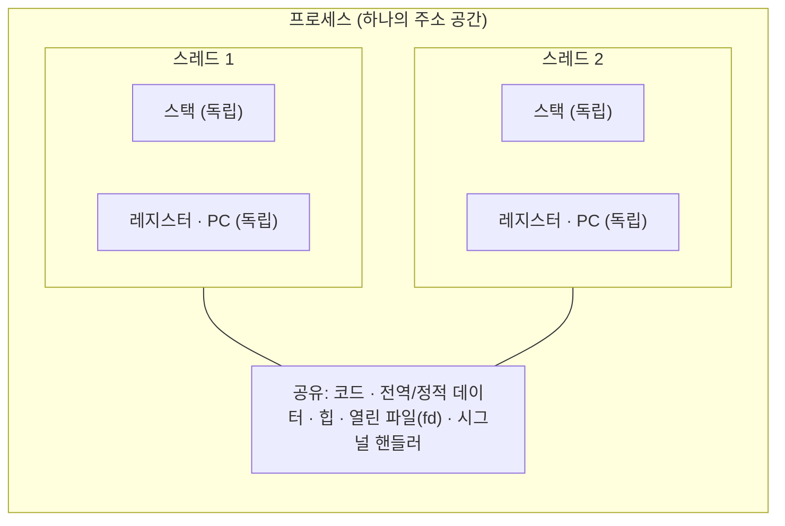
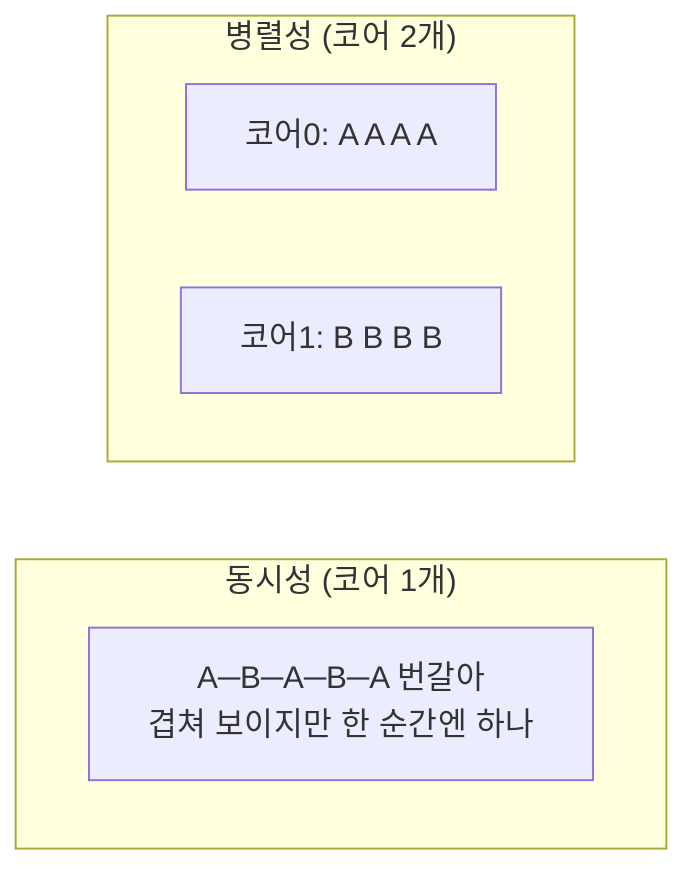

## "프로세스는 하나인데, 어떻게 여러 일이 동시에 도나"

웹 서버 프로세스 하나가 수천 개의 요청을 동시에 처리합니다. 게임 하나가 렌더링·물리·네트워크·사운드를 한꺼번에 굴립니다. 그런데 [3편]에서 본 프로세스는 "주소 공간 + 실행 상태"의 한 덩어리였습니다. 프로세스를 요청 수만큼 `fork()` 한 걸까요? 아닙니다 — 그러기엔 주소 공간 복제가 너무 무겁고, 무엇보다 **서로 메모리를 공유해야** 하는데 프로세스는 격리돼 있습니다.

답은 **스레드(thread)** 입니다. 하나의 프로세스 안에서 **여러 개의 독립적인 실행 흐름**을 돌리는 것. 이 글은 스레드가 정확히 무엇을 공유하고 무엇을 따로 갖는지, 왜 그 설계가 강력하면서 동시에 위험한지 — 그리고 그 위험(다음 편의 race condition)이 어디서 태어나는지를 끝까지 따라갑니다.

## 프로세스 vs 스레드: 무엇을 나누고 무엇을 공유하나

스레드의 본질은 한 문장입니다: **"주소 공간은 공유하되, 실행에 필요한 최소한(스택·레지스터·PC)만 따로 갖는다."**



| 자원 | 프로세스 간 | 같은 프로세스의 스레드 간 |
|---|---|---|
| 코드(text) | 별도 | **공유** |
| 전역/정적 데이터 | 별도 | **공유** |
| 힙(heap) | 별도 | **공유** ← race의 무대 |
| 열린 파일(fd 테이블) | 별도 | **공유** |
| **스택** | 별도 | **별도** (스레드마다 자기 스택) |
| **레지스터·PC** | 별도 | **별도** (스레드마다 자기 실행 위치) |

이 표 하나가 스레드의 모든 장점과 모든 위험을 동시에 설명합니다. 힙·전역 데이터를 공유하니 **데이터를 주고받는 비용이 0**입니다(포인터만 넘기면 끝). 하지만 바로 그 공유 때문에, 두 스레드가 같은 변수를 동시에 건드리면 **서로의 작업을 짓밟습니다** — 이게 다음 편 race condition의 씨앗입니다.

아래 그림에서 두 스레드는 각자 자기 **스택**과 **PC**(현재 실행 위치)를 갖지만, 화살표는 둘 다 가운데 **공유 힙**을 가리킵니다. 두 화살표가 번갈아 깜빡이는 게 "둘이 같은 메모리를 만지는 순간"입니다.

<div class="ot-mem" markdown="0">
<style>
.ot-mem{margin:1.4rem 0;overflow-x:auto}
.ot-mem svg{width:100%;max-width:700px;height:auto;display:block;margin:0 auto;font-family:inherit}
.ot-mem .box{fill:none;stroke:currentColor;stroke-width:1.5}
.ot-mem .proc{stroke-dasharray:6 4;opacity:.55}
.ot-mem .lbl{fill:currentColor;font-size:12px;font-weight:600}
.ot-mem .sub{fill:currentColor;font-size:10px;opacity:.65}
.ot-mem .t1{fill:#1971c2;opacity:.85}
.ot-mem .t2{fill:#f08c00;opacity:.85}
.ot-mem .shared{fill:#2f9e44;opacity:.16;stroke:#2f9e44;stroke-width:1.5}
.ot-mem .heap{fill:#2f9e44;opacity:0}
.ot-mem .ha{animation:otheap1 3.6s ease-in-out infinite}
.ot-mem .hb{animation:otheap2 3.6s ease-in-out infinite}
@keyframes otheap1{0%,50%,100%{opacity:0}25%{opacity:.5}}
@keyframes otheap2{0%,50%,100%{opacity:0}75%{opacity:.5}}
.ot-mem .arr{stroke-width:2.4;fill:none;stroke-linecap:round}
.ot-mem .arr1{stroke:#1971c2;opacity:.2;animation:otarr1 3.6s ease-in-out infinite}
.ot-mem .arr2{stroke:#f08c00;opacity:.2;animation:otarr2 3.6s ease-in-out infinite}
@keyframes otarr1{0%,50%,100%{opacity:.18}25%{opacity:.95}}
@keyframes otarr2{0%,50%,100%{opacity:.18}75%{opacity:.95}}
.ot-mem .pc{r:5}
.ot-mem .pc1{fill:#1971c2;animation:otpc1 2.4s ease-in-out infinite}
.ot-mem .pc2{fill:#f08c00;animation:otpc2 2.4s ease-in-out infinite}
@keyframes otpc1{0%{cy:96}50%{cy:150}100%{cy:96}}
@keyframes otpc2{0%{cy:150}50%{cy:96}100%{cy:150}}
</style>
<svg viewBox="0 0 700 300" role="img" aria-label="하나의 프로세스 주소 공간 안에서 두 스레드가 각자 독립된 스택과 PC를 가지면서 가운데 공유 힙을 번갈아 접근하는 구조 애니메이션">
  <rect class="box proc" x="20" y="30" width="660" height="250" rx="12"/>
  <text class="lbl" x="36" y="22">프로세스 — 하나의 주소 공간</text>

  <text class="lbl t1" x="120" y="58" text-anchor="middle" style="fill:#1971c2;opacity:1">스레드 1</text>
  <rect class="box" x="50" y="70" width="140" height="44" rx="6" style="stroke:#1971c2"/>
  <text class="sub" x="120" y="97" text-anchor="middle">스택 ① (독립)</text>
  <rect class="box" x="50" y="124" width="140" height="36" rx="6" style="stroke:#1971c2"/>
  <text class="sub" x="120" y="146" text-anchor="middle">레지스터·PC ①</text>
  <circle class="pc pc1" cx="44"/>

  <text class="lbl t2" x="580" y="58" text-anchor="middle" style="fill:#f08c00;opacity:1">스레드 2</text>
  <rect class="box" x="510" y="70" width="140" height="44" rx="6" style="stroke:#f08c00"/>
  <text class="sub" x="580" y="97" text-anchor="middle">스택 ② (독립)</text>
  <rect class="box" x="510" y="124" width="140" height="36" rx="6" style="stroke:#f08c00"/>
  <text class="sub" x="580" y="146" text-anchor="middle">레지스터·PC ②</text>
  <circle class="pc pc2" cx="656"/>

  <rect class="shared" x="150" y="205" width="400" height="56" rx="8"/>
  <rect class="heap ha" x="300" y="205" width="100" height="56" rx="8"/>
  <rect class="heap hb" x="300" y="205" width="100" height="56" rx="8"/>
  <text class="lbl" x="350" y="228" text-anchor="middle">공유 영역</text>
  <text class="sub" x="350" y="248" text-anchor="middle">코드 · 전역데이터 · <tspan style="font-weight:700">힙</tspan> · 파일 디스크립터(fd)</text>

  <path class="arr arr1" d="M 120,160 L 120,185 L 320,185 L 330,203"/>
  <path class="arr arr2" d="M 580,160 L 580,185 L 380,185 L 370,203"/>
</svg>
</div>

> **현실 체크 — "스레드가 가벼운 이유는 공유 때문이다."** 새 프로세스는 주소 공간 전체(페이지 테이블·매핑)를 새로 세워야 하지만, 새 스레드는 스택과 레지스터 세트만 만들면 됩니다. 그래서 생성·전환이 훨씬 싸고, 같은 프로세스 내 스레드 전환은 **페이지 테이블/TLB를 갈아엎지 않아** 더 쌉니다(이 TLB 비용은 6편 컨텍스트 스위치에서 자세히). 대신 그 공유가 동기화라는 숙제를 떠넘깁니다.

## 동시성 ≠ 병렬성

면접 단골이자 가장 많이 헷갈리는 구분입니다.

- **동시성(concurrency)**: 여러 작업이 **논리적으로 겹쳐** 진행됨. CPU 코어가 1개여도 성립 — 시분할로 번갈아 돌면 "동시에 진행 중"입니다. 구조의 문제(어떻게 쪼개고 조율하나).
- **병렬성(parallelism)**: 여러 작업이 **물리적으로 같은 순간** 실행됨. 코어가 2개 이상이어야 가능. 실행의 문제(정말로 동시에 돈다).



핵심: **동시성은 병렬성 없이도 가능하고, 둘은 직교한다.** 단일 코어에서도 동시성 버그(race)는 똑같이 터집니다 — 다음 절의 인터리빙 때문입니다. "코어가 하나니까 race는 없겠지"는 위험한 착각입니다(타임 슬라이스 경계에서 언제든 끊깁니다).

## 비결정성이 태어나는 곳: 인터리빙

스레드 둘이 각자 명령을 실행하는데, 단일 코어에선 한 번에 하나만 돕니다. 스케줄러는 **아무 때나** 한 스레드를 멈추고 다른 스레드로 넘어갈 수 있습니다(타이머 인터럽트). 그 결과 두 스레드의 명령이 **어떤 순서로든 뒤섞일 수 있습니다** — 이걸 인터리빙(interleaving)이라 합니다.

아래에서 스레드 A(<span style="color:#1971c2;font-weight:600">파랑</span>)와 B(<span style="color:#f08c00;font-weight:600">주황</span>)의 명령이 단일 CPU 실행 순서에 뒤섞여 떨어집니다. 중요한 건 **이 순서가 실행할 때마다 달라질 수 있다**는 점 — 같은 프로그램, 같은 입력인데 결과가 갈리는 **비결정성**의 근원입니다.

<div class="ot-inter" markdown="0">
<style>
.ot-inter{margin:1.4rem 0;overflow-x:auto}
.ot-inter svg{width:100%;max-width:700px;height:auto;display:block;margin:0 auto;font-family:inherit}
.ot-inter .lbl{fill:currentColor;font-size:11px;font-weight:600}
.ot-inter .sub{fill:currentColor;font-size:10px;opacity:.65}
.ot-inter .a{fill:#1971c2;opacity:.88}
.ot-inter .b{fill:#f08c00;opacity:.88}
.ot-inter .ins{fill:#fff;font-size:11px;font-weight:700}
.ot-inter .drop{opacity:0;animation:otdrop 6s linear infinite}
@keyframes otdrop{0%{opacity:0}3%{opacity:1}100%{opacity:1}}
.ot-inter .line{stroke:currentColor;opacity:.25;stroke-width:1.3;stroke-dasharray:3 3}
</style>
<svg viewBox="0 0 700 250" role="img" aria-label="스레드 A와 B의 명령이 단일 CPU 실행 순서에 어떤 순서로든 뒤섞여 떨어지는 인터리빙 애니메이션, 실행마다 순서가 달라지는 비결정성">
  <text class="lbl a" x="20" y="40" style="fill:#1971c2">스레드 A</text>
  <rect class="a" x="90"  y="26" width="40" height="26" rx="4"/><text class="ins" x="110" y="44" text-anchor="middle">A1</text>
  <rect class="a" x="140" y="26" width="40" height="26" rx="4"/><text class="ins" x="160" y="44" text-anchor="middle">A2</text>
  <rect class="a" x="190" y="26" width="40" height="26" rx="4"/><text class="ins" x="210" y="44" text-anchor="middle">A3</text>

  <text class="lbl b" x="20" y="88" style="fill:#f08c00">스레드 B</text>
  <rect class="b" x="90"  y="74" width="40" height="26" rx="4"/><text class="ins" x="110" y="92" text-anchor="middle">B1</text>
  <rect class="b" x="140" y="74" width="40" height="26" rx="4"/><text class="ins" x="160" y="92" text-anchor="middle">B2</text>
  <rect class="b" x="190" y="74" width="40" height="26" rx="4"/><text class="ins" x="210" y="92" text-anchor="middle">B3</text>

  <line class="line" x1="40" y1="130" x2="660" y2="130"/>
  <text class="lbl" x="20" y="170">CPU 실행 순서 →</text>

  <g class="drop" style="animation-delay:0s">   <rect class="a" x="120" y="150" width="40" height="28" rx="4"/><text class="ins" x="140" y="169" text-anchor="middle">A1</text></g>
  <g class="drop" style="animation-delay:.8s">  <rect class="b" x="170" y="150" width="40" height="28" rx="4"/><text class="ins" x="190" y="169" text-anchor="middle">B1</text></g>
  <g class="drop" style="animation-delay:1.6s"> <rect class="a" x="220" y="150" width="40" height="28" rx="4"/><text class="ins" x="240" y="169" text-anchor="middle">A2</text></g>
  <g class="drop" style="animation-delay:2.4s"> <rect class="b" x="270" y="150" width="40" height="28" rx="4"/><text class="ins" x="290" y="169" text-anchor="middle">B2</text></g>
  <g class="drop" style="animation-delay:3.2s"> <rect class="b" x="320" y="150" width="40" height="28" rx="4"/><text class="ins" x="340" y="169" text-anchor="middle">B3</text></g>
  <g class="drop" style="animation-delay:4s">   <rect class="a" x="370" y="150" width="40" height="28" rx="4"/><text class="ins" x="390" y="169" text-anchor="middle">A3</text></g>

  <text class="sub" x="430" y="170">… 이 순서는 실행마다 달라질 수 있다</text>
  <text class="sub" x="40" y="215">같은 코드 · 같은 입력 → 그래도 결과가 갈린다 = <tspan style="font-weight:700">비결정성(nondeterminism)</tspan></text>
</svg>
</div>

이 비결정성이 멀티스레드 디버깅을 악몽으로 만드는 이유입니다. 버그가 특정 인터리빙에서만 터지니, 재현이 안 되고("내 컴퓨터에선 되는데"), 디버거를 붙이면 타이밍이 바뀌어 사라집니다(하이젠버그). 그래서 우리는 "운에 맡기지 않고" 특정 인터리빙을 **강제로 막는** 도구가 필요합니다 — 락·뮤텍스·세마포어, 즉 동기화(8·9편)입니다.

## 스레드는 누가 관리하나: 유저 vs 커널 스레드

스레드를 OS 커널이 아느냐 모르느냐에 따라 모델이 갈립니다.

| | 유저레벨 스레드 (N:1) | 커널레벨 스레드 (1:1) | 하이브리드 (M:N) |
|---|---|---|---|
| 누가 스케줄 | 유저 공간 라이브러리 | **커널** | 양쪽 |
| 컨텍스트 스위치 | 매우 빠름(커널 진입 X) | 시스템콜 비용 | 중간 |
| 진짜 병렬 실행 | **불가**(커널은 1개로 봄) | **가능**(코어마다 배치) | 가능 |
| 치명적 약점 | 한 스레드가 블로킹 시스템콜 → **전부 멈춤** | 생성·전환이 상대적으로 비쌈 | 구현 복잡 |

역사적으로 M:N(유저 M개 스레드를 커널 N개에 매핑)이 이상적으로 보였지만, 구현 복잡도와 블로킹 처리 문제로 대부분 폐기됐습니다. **리눅스는 1:1** 모델 — 유저 스레드 하나가 커널 스케줄 단위(task) 하나에 정확히 대응합니다.

그 비결이 `clone()` 시스템콜입니다. 리눅스에선 프로세스와 스레드가 **같은 구조체(`task_struct`)** 로 표현되고, 무엇을 공유할지를 플래그로 정합니다. `fork()`는 거의 안 공유하고, 스레드 생성은 주소 공간·fd·시그널을 공유하도록 플래그를 켭니다.

```c
/* 개념적으로: 스레드 = "많은 것을 공유하는 clone" */
clone(fn, stack,
      CLONE_VM      |   /* 주소 공간 공유 (힙·전역) */
      CLONE_FILES   |   /* 파일 디스크립터 테이블 공유 */
      CLONE_SIGHAND |   /* 시그널 핸들러 공유 */
      CLONE_THREAD,     /* 같은 스레드 그룹(같은 PID) */
      arg);
/* fork()는 위 플래그 거의 없이 clone() — 그래서 거의 다 별도 */
```

> **현실 체크 — "PID와 TID는 다르다."** 리눅스에서 한 프로세스의 모든 스레드는 같은 **PID**(스레드 그룹 ID, `getpid()`)를 공유하지만, 각자 고유한 **TID**(`gettid()`)를 갖습니다. `ps`는 기본적으로 PID 단위로만 보여줘서 멀티스레드 프로세스가 한 줄로 뭉쳐 보입니다 — 스레드를 직접 보려면 아래 도구가 필요합니다.

## 직접 들여다보기

```c
// threads.c — gcc threads.c -o threads -lpthread
#include <pthread.h>
#include <stdio.h>
#include <unistd.h>
void *work(void *arg) {
    long id = (long)arg;
    printf("스레드 %ld 시작 (tid는 OS가 부여)\n", id);
    sleep(3);
    return NULL;
}
int main(void) {
    pthread_t t[3];
    for (long i = 0; i < 3; i++)
        pthread_create(&t[i], NULL, work, (void*)i); // 내부적으로 clone()
    for (int i = 0; i < 3; i++)
        pthread_join(t[i], NULL); // 스레드가 끝날 때까지 대기
    return 0;
}
```

```bash
# 프로세스 안의 스레드를 실제로 들여다보기
ps -L -p <pid>              # -L: 스레드(LWP)까지 펼쳐 보여줌
ls /proc/<pid>/task/        # 각 스레드가 디렉터리 하나 (TID)
top -H                      # -H: 스레드 단위로 CPU 사용률 표시
cat /proc/<pid>/status | grep Threads   # 이 프로세스의 스레드 개수
```

`ls /proc/<pid>/task/` 안의 디렉터리 개수가 곧 스레드 수입니다. 리눅스가 스레드를 "주소 공간을 공유하는 task"로 다룬다는 게 파일시스템에 그대로 드러납니다.

## 면접/리뷰 단골 질문

- **Q. 프로세스와 스레드의 차이는?** → 스레드는 주소 공간(코드·데이터·힙·fd)을 공유하고 스택·레지스터·PC만 따로 갖는다. 그래서 통신이 싸고 생성·전환이 가볍지만, 공유 때문에 동기화가 필요하다.
- **Q. 동시성과 병렬성의 차이는?** → 동시성은 논리적으로 겹쳐 진행(코어 1개로도 가능), 병렬성은 물리적으로 동시 실행(코어 여러 개 필요). 직교 개념이며, 단일 코어에서도 race는 발생한다.
- **Q. 멀티스레드 버그가 재현이 어려운 이유는?** → 스케줄러가 인터리빙을 비결정적으로 정하기 때문. 특정 순서에서만 터지고, 디버거가 타이밍을 바꿔 사라진다 → 동기화로 인터리빙을 제약해야 한다.
- **Q. 유저레벨 vs 커널레벨 스레드?** → 유저(N:1)는 전환이 빠르지만 진짜 병렬 불가 + 블로킹 콜에 전체 정지. 커널(1:1)은 진짜 병렬·독립 블로킹 가능하나 전환 비용. 리눅스는 1:1.
- **Q. 리눅스에서 스레드는 어떻게 만들어지나?** → `clone()`으로 `CLONE_VM|CLONE_FILES|CLONE_SIGHAND|CLONE_THREAD` 등을 켜서 주소 공간 등을 공유하는 task를 만든다. fork와 본질이 같고 공유 범위만 다르다.

## 정리

- 스레드는 **주소 공간을 공유하는 실행 흐름** — 공유: 코드·데이터·힙·fd / 독립: 스택·레지스터·PC.
- 공유 덕에 통신이 싸고 생성·전환이 가볍지만, 같은 메모리를 동시에 만져 **race**가 생긴다.
- **동시성(겹쳐 진행) ≠ 병렬성(물리적 동시)** — 단일 코어에서도 동시성 버그는 터진다.
- 스케줄러의 **인터리빙**은 비결정적 → 같은 코드가 실행마다 다른 결과 = 디버깅 악몽 → 동기화 필요.
- 리눅스는 **1:1** 모델, 스레드는 `clone()`으로 자원을 공유하는 task. PID(공유)와 TID(고유)는 다르다.

> 다음 글: 그럼 이 많은 스레드/프로세스 중 **누구에게 CPU를 줄 것인가** — CPU 스케줄링(5편)으로 들어가, CFS·우선순위·공정성을 끝까지 팝니다. 한편 이 글이 예고한 race condition의 정체는 동기화 편(8·9편)에서 해부합니다.
