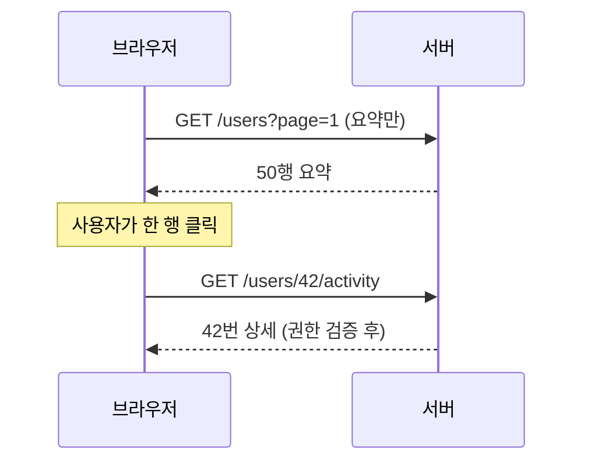

운영 화면에서 사용자 목록 옆에 "최근 활동" 같은 상세를 붙이려 할 때, 가장 게으른 설계는 목록 쿼리에 상세까지 다 조인해 한 번에 내려주는 것이다. 화면엔 50행이 보이는데, 클릭하지도 않을 50행의 상세를 미리 전부 끌어온다. 목록은 무거워지고, 정작 사용자는 한두 행만 열어본다. 이 글은 상세를 **클릭한 순간에만** 따로 조회하는 온디맨드 패턴을 다룬다.

## 핵심: 조회를 두 단계로 쪼갠다

ORM의 lazy/eager 로딩이 "엔티티 그래프를 언제 채우느냐"의 문제라면, 이건 한 단계 위 — **화면 데이터를 언제 네트워크로 가져오느냐**의 문제다. 목록 응답에는 식별자와 요약만 담고, 상세는 별도 엔드포인트로 분리한다.

```
GET /admin/users?page=1          → [{id, name, lastLoginAt}, ...]   (요약)
GET /admin/users/{id}/activity   → {recentViews:[...], orders:[...]} (상세, 클릭 시)
```

목록은 가볍게 페이징되고, 상세는 사용자가 모달을 여는 행에 대해서만 1건 조회된다. 50행 × 상세 N건의 곱이 사라지고, 실제 열람한 행 수만큼만 비용이 든다.

## 상세 엔드포인트 설계

```java
@GetMapping("/admin/users/{id}/activity")
public UserActivityResponse getActivity(@PathVariable Long id) {
    User user = userService.findById(id);          // 권한/존재 검증
    return UserActivityResponse.builder()
        .recentViews(activityService.recentViews(id, 20))  // 상한을 둔다
        .orders(orderService.recentOrders(id, 10))
        .build();
}
```

두 가지가 중요하다. 첫째, **권한 검증을 상세 조회에서도 반복**한다. 목록을 볼 수 있다고 모든 행의 상세를 볼 수 있는 건 아니다. 식별자만 바꿔 다른 사용자의 상세를 부르는 접근(IDOR)을 막아야 한다. 둘째, 상세에도 **건수 상한(`20`, `10`)**을 둔다. "최근"이라는 말 뒤에 무한 목록이 숨어 있으면 모달 하나가 응답을 폭발시킨다.



## 캐싱: 같은 모달을 다시 열 때

같은 행의 모달을 닫았다 다시 열면 또 서버를 부를 필요가 있을까. 클라이언트에서 식별자 기준으로 응답을 짧게 캐시하면 재요청이 사라진다. 다만 상세가 **자주 바뀌는 데이터**(예: 실시간 활동)면 캐시가 오히려 낡은 화면을 보여준다. 정적이면 캐시, 실시간이면 매번 조회 — 데이터의 변동성에 맞춰 정한다. 서버 측은 응답에 적절한 `Cache-Control`을 실어 클라이언트 캐시 수명을 명시하는 편이 안전하다.

## 운영 함정

- **빠른 연속 클릭의 경쟁 상태.** 사용자가 A행을 열고 곧바로 B행을 열면, A의 응답이 늦게 도착해 B 모달에 A 데이터가 그려질 수 있다. 요청에 토큰/식별자를 달아 "지금 열린 모달의 것"이 아니면 응답을 버려야 한다.
- **모달을 안 닫고 목록을 갱신.** 목록을 다시 불러도 열려 있던 모달의 상세는 그대로다. 모달이 참조하는 행이 삭제되면 상세 엔드포인트가 404를 줄 수 있으니, 상세 조회 실패를 모달에서 우아하게 처리해야 한다.

## 핵심 요약

- 목록은 요약, 상세는 별도 엔드포인트. 곱셈(행 × 상세)을 덧셈(열람한 행 수)으로 바꾼다.
- 상세 조회마다 권한을 재검증하고 건수 상한을 둔다.
- 캐싱은 데이터 변동성에 맞춰. 연속 클릭의 응답 순서 역전을 식별자로 방어한다.
