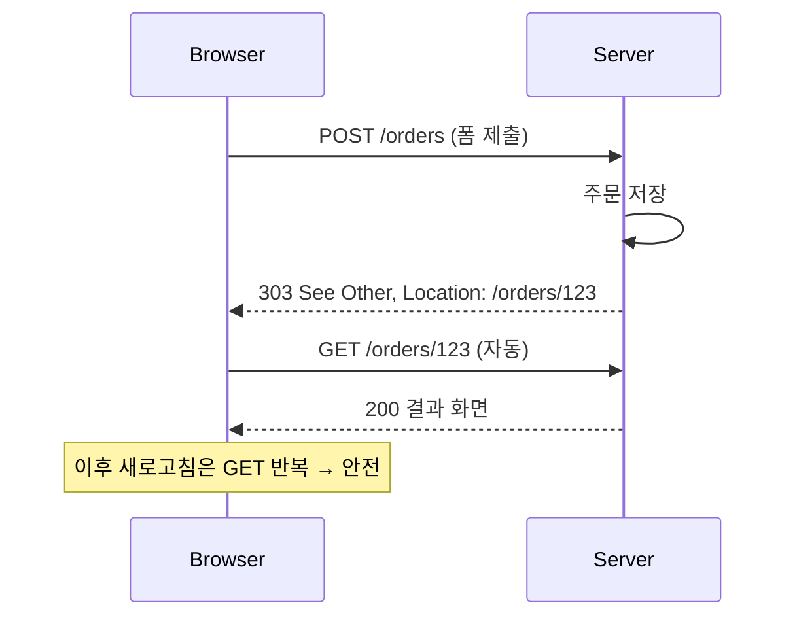

폼 등록을 다룬 주였다. 등록 버튼을 누른 뒤 결과 화면에서 새로고침(F5)을 하면 데이터가 한 번 더 들어가는 현상이 보고됐다. 사용자 입장에서는 "그냥 새로고침"이지만 브라우저 입장에서는 "방금 그 POST를 다시 보낼까요?"라는 질문이고, 사용자는 보통 별 생각 없이 확인을 누른다.

## 왜 재전송이 일어나는가

브라우저는 마지막으로 렌더한 페이지가 **어떤 HTTP 요청의 응답인지**를 기억한다. POST 요청에 서버가 직접 HTML을 응답하면, 그 화면의 "현재 요청"은 POST다. 새로고침은 "현재 요청을 그대로 다시 실행"이므로 POST 본문(폼 데이터)을 그대로 재전송한다. 그래서 브라우저가 "양식을 다시 제출하시겠습니까?" 경고를 띄우는 것이다.

핵심은 **화면을 만든 요청이 GET이면 새로고침이 안전하다**는 점이다. GET은 멱등(idempotent)하니 몇 번을 반복해도 서버 상태가 변하지 않는다.

## Post/Redirect/Get

해법은 POST 처리 직후 결과 화면을 직접 그리지 않고, **결과 페이지로 redirect(302/303)** 시키는 것이다. 그러면 브라우저가 결과 페이지를 GET으로 다시 요청하고, 화면을 만든 마지막 요청은 그 GET이 된다. 이후 새로고침은 GET 반복일 뿐이라 중복 등록이 일어나지 않는다.



`mermaid: true`를 frontmatter에 넣어야 위 다이어그램이 렌더된다.

```java
@PostMapping("/orders")
public String create(@ModelAttribute OrderForm form,
                     RedirectAttributes redirectAttributes) {
    Long id = orderService.create(form);
    // 결과 화면으로 redirect — 직접 view를 리턴하지 않는다
    redirectAttributes.addFlashAttribute("message", "주문이 등록되었습니다.");
    return "redirect:/orders/" + id;
}

@GetMapping("/orders/{id}")
public String detail(@PathVariable Long id, Model model) {
    model.addAttribute("order", orderService.find(id));
    return "orders/detail"; // GET이므로 새로고침해도 안전
}
```

## 플래시 속성

리다이렉트는 응답이 한 번 끊겼다 다시 GET이 들어오므로, 일반 모델 속성은 사라진다. "등록 완료" 같은 일회성 메시지를 다음 GET 요청까지 전달하려면 **플래시 속성**을 쓴다. 플래시 속성은 세션에 잠시 저장됐다가 다음 요청에서 모델로 옮겨지고 즉시 제거된다 — 그래서 새로고침하면 메시지는 한 번만 보이고 사라진다.

## 운영 함정

**1. PRG는 동시 더블클릭을 막지 못한다.** PRG는 *새로고침* 재전송을 막을 뿐, 사용자가 버튼을 빠르게 두 번 눌러 POST가 두 번 날아가는 것은 별개다. 이건 클라이언트 측 버튼 비활성화 + **서버 측 멱등성 키나 유니크 제약**으로 막아야 한다.

**2. redirect 경로에 신뢰 못 할 입력을 넣지 마라.** 사용자 입력을 그대로 `Location`에 붙이면 오픈 리다이렉트 취약점이 된다. 내부에서 생성한 식별자만 쓴다.

## 핵심 요약

- 새로고침 중복은 "화면을 만든 요청이 POST라서" 생긴다.
- POST → 303 redirect → GET으로 화면 요청 흐름을 만들면 새로고침이 멱등해진다.
- 일회성 메시지는 플래시 속성으로 다음 GET까지만 전달한다.
- PRG는 새로고침만 막는다. 더블클릭/동시요청은 멱등성 키나 유니크 제약으로 별도 방어한다.
