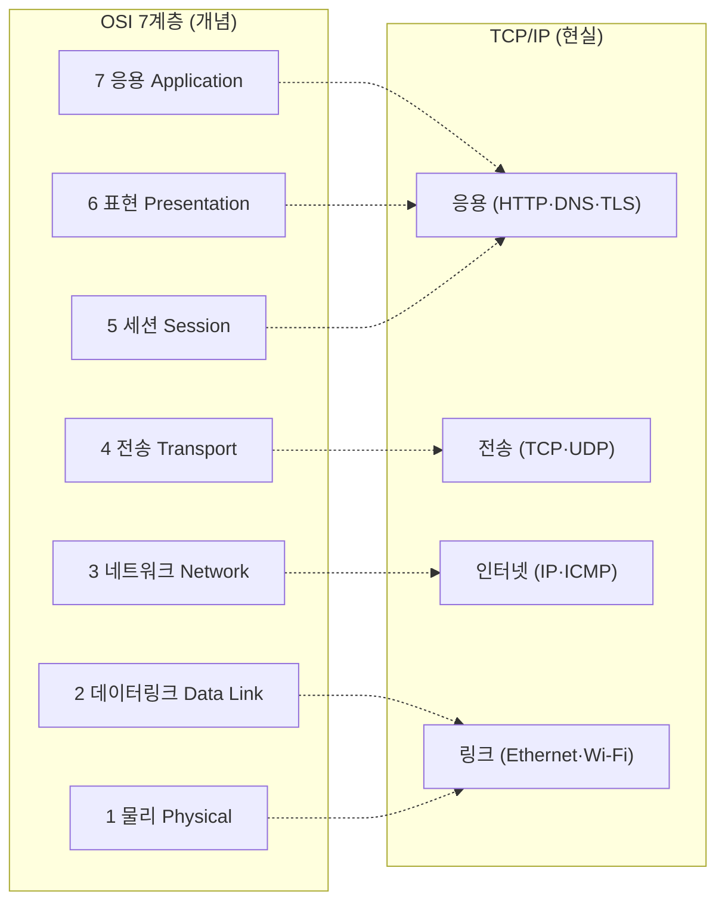

## "헤더가 왜 이렇게 여러 겹이지?"

`tcpdump`로 패킷 하나를 까보면 이더넷 헤더 안에 IP 헤더가 있고, 그 안에 TCP 헤더가 있고, 또 그 안에 HTTP가 들어 있습니다. 양파처럼 겹겹이 싸여 있죠. 이걸 "원래 그래"로 넘기면 MTU 문제, MSS 협상, 캡슐화 오버헤드, VPN 안의 패킷 같은 걸 만났을 때 매번 막힙니다.

이 겹겹의 구조는 우연이 아니라 **설계**입니다. [앞 글]()에서 본 "네트워크는 best-effort 전달만 하고 신뢰성은 끝단이 책임진다"는 분담을, 더 잘게 쪼개 **각 층이 한 가지 관심사만** 책임지게 만든 것이 계층 모델입니다. 이 글은 OSI 7계층을 외우는 게 아니라, **왜 층으로 쪼갰고**, 한 바이트가 그 층들을 어떻게 내려갔다 올라오는지를 끝까지 따라갑니다.

## 두 모델, 하나의 현실

OSI 7계층은 **개념 모델**(교과서·면접·용어의 기준)이고, 실제로 인터넷이 돌아가는 건 **TCP/IP 모델**입니다. 둘을 나란히 놓고 봐야 혼란이 없습니다.



| OSI 계층 | TCP/IP | PDU(데이터 단위) | 대표 프로토콜 | 대표 장비 | 주소 |
|---|---|---|---|---|---|
| 7 응용 | 응용 | data | HTTP, DNS, gRPC | — | — |
| 6 표현 | 응용 | data | TLS, 인코딩, 압축 | — | — |
| 5 세션 | 응용 | data | 세션 관리 | — | — |
| 4 전송 | 전송 | **세그먼트**(TCP)/데이터그램(UDP) | TCP, UDP, QUIC | L4 LB | **포트** |
| 3 네트워크 | 인터넷 | **패킷** | IP, ICMP, BGP | 라우터, L3 스위치 | **IP** |
| 2 데이터링크 | 링크 | **프레임** | Ethernet, 802.11, ARP | 스위치, 브리지 | **MAC** |
| 1 물리 | 링크 | **비트** | 전기/광 신호, 케이블 | 허브, 리피터 | — |

> **현실 체크 — "계층은 모델이지 코드가 아니다."** 리눅스 커널은 OSI를 그대로 구현하지 않습니다. 실제로는 대략 5계층(응용 / 전송 / IP / 링크 / 물리)이고, OSI의 5·6·7은 응용 프로그램과 라이브러리 안에 뭉쳐 있습니다(예: TLS는 "6계층"이라지만 실제론 응용 위 라이브러리). 계층 번호를 신성시하지 말고, **누가 무엇을 책임지는가**로 이해하세요.

## 왜 굳이 층으로 쪼갰나 — 관심사 분리와 교체 가능성

계층화의 진짜 가치는 **각 층이 위·아래 층의 내부를 몰라도 된다**는 데 있습니다. 이걸 캡슐화된 인터페이스라고 부릅니다.

- **교체 가능성**: Wi-Fi든 이더넷이든 LTE든, 위의 IP 입장에선 "프레임을 다음 홉으로 던져주는 무언가"일 뿐입니다. 물리 매체를 갈아끼워도 TCP·HTTP는 한 줄도 안 바뀝니다. 노트북을 Wi-Fi에서 유선으로 바꿔도 브라우저가 멀쩡한 이유입니다.
- **독립적 진화**: HTTP/1.1 → HTTP/2 → HTTP/3로 응용·전송이 바뀌는 동안 IP는 그대로입니다. 반대로 IPv4 → IPv6로 3계층이 바뀌어도 위층은 거의 영향이 없습니다.
- **관심사 분리**: 전송 계층은 "신뢰성·순서"만, 네트워크 계층은 "목적지까지 길 찾기"만, 링크 계층은 "옆 노드까지 한 홉"만 책임집니다. 디버깅할 때 문제를 한 층에 가둘 수 있습니다.

이게 [앞 글]()의 "끝단 책임" 원칙을 일반화한 **end-to-end 원칙**입니다 — 네트워크 중간은 단순하게(전달만), 똑똑한 기능은 끝단으로.

## 캡슐화: 한 바이트가 옷을 껴입는 과정

송신 호스트에서 데이터는 위에서 아래로 내려가며 각 계층의 **헤더를 덧입습니다**(캡슐화). 수신 호스트에서는 아래에서 위로 올라가며 헤더를 한 겹씩 **벗깁니다**(역캡슐화). 아래 애니메이션에서 `HTTP` 데이터가 내려가며 TCP·IP·Ethernet 헤더를 차례로 껴입고, 다 입은 프레임이 선로로 나갑니다.

<div class="osi-encap" markdown="0">
<style>
.osi-encap{margin:1.4rem 0;overflow-x:auto}
.osi-encap svg{width:100%;max-width:720px;height:auto;display:block;margin:0 auto;font-family:inherit}
.osi-encap .lbl{fill:currentColor;font-size:12px;font-weight:600}
.osi-encap .sub{fill:currentColor;font-size:9.5px;opacity:.55}
.osi-encap .seg{stroke:currentColor;stroke-width:1.4;opacity:.9}
.osi-encap .data{fill:#2f9e44}
.osi-encap .htcp{fill:#1971c2}
.osi-encap .hip{fill:#f08c00}
.osi-encap .heth{fill:#e03131}
.osi-encap .htcp,.osi-encap .hip,.osi-encap .heth{opacity:0}
.osi-encap .htcp{animation:osihtcp 6s ease-in-out infinite}
.osi-encap .hip{animation:osihip 6s ease-in-out infinite}
.osi-encap .heth{animation:osiheth 6s ease-in-out infinite}
.osi-encap .arrm{fill:currentColor;opacity:.4;animation:osiarr 6s ease-in-out infinite}
@keyframes osihtcp{0%,15%{opacity:0}25%,100%{opacity:.85}}
@keyframes osihip{0%,40%{opacity:0}50%,100%{opacity:.85}}
@keyframes osiheth{0%,65%{opacity:0}75%,100%{opacity:.85}}
@keyframes osiarr{0%,8%{opacity:0}20%,90%{opacity:.5}100%{opacity:0}}
</style>
<svg viewBox="0 0 700 300" role="img" aria-label="HTTP 데이터가 아래로 내려가며 TCP·IP·Ethernet 헤더를 차례로 덧입는 캡슐화 과정 애니메이션">
  <text class="lbl" x="20" y="34">응용 (HTTP)</text>
  <rect class="seg data" x="300" y="20" width="120" height="26" rx="3"/>
  <text class="sub" x="360" y="37" text-anchor="middle" fill="#fff">DATA</text>
  <polygon class="arrm" points="350,52 360,68 340,68"/>

  <text class="lbl" x="20" y="100">전송 (TCP)</text>
  <rect class="seg htcp" x="250" y="86" width="50" height="26" rx="3"/>
  <text class="sub seg htcp" x="275" y="103" text-anchor="middle" fill="#fff">TCP</text>
  <rect class="seg data" x="300" y="86" width="120" height="26" rx="3"/>
  <text class="sub" x="360" y="103" text-anchor="middle" fill="#fff">DATA</text>
  <polygon class="arrm" points="335,118 345,134 325,134"/>

  <text class="lbl" x="20" y="166">네트워크 (IP)</text>
  <rect class="seg hip" x="200" y="152" width="50" height="26" rx="3"/>
  <text class="sub seg hip" x="225" y="169" text-anchor="middle" fill="#fff">IP</text>
  <rect class="seg htcp" x="250" y="152" width="50" height="26" rx="3"/>
  <text class="sub seg htcp" x="275" y="169" text-anchor="middle" fill="#fff">TCP</text>
  <rect class="seg data" x="300" y="152" width="120" height="26" rx="3"/>
  <text class="sub" x="360" y="169" text-anchor="middle" fill="#fff">DATA</text>
  <polygon class="arrm" points="320,184 330,200 310,200"/>

  <text class="lbl" x="20" y="232">링크 (Ethernet)</text>
  <rect class="seg heth" x="150" y="218" width="50" height="26" rx="3"/>
  <text class="sub seg heth" x="175" y="235" text-anchor="middle" fill="#fff">ETH</text>
  <rect class="seg hip" x="200" y="218" width="50" height="26" rx="3"/>
  <text class="sub seg hip" x="225" y="235" text-anchor="middle" fill="#fff">IP</text>
  <rect class="seg htcp" x="250" y="218" width="50" height="26" rx="3"/>
  <text class="sub seg htcp" x="275" y="235" text-anchor="middle" fill="#fff">TCP</text>
  <rect class="seg data" x="300" y="218" width="120" height="26" rx="3"/>
  <text class="sub" x="360" y="235" text-anchor="middle" fill="#fff">DATA</text>
  <rect class="seg heth" x="420" y="218" width="40" height="26" rx="3"/>
  <text class="sub seg heth" x="440" y="235" text-anchor="middle" fill="#fff">FCS</text>
  <text class="sub" x="175" y="270">↑ 헤더는 앞에, 트레일러(FCS)는 뒤에 붙는다 → 완성된 "프레임"이 선로로</text>
</svg>
</div>

여기서 두 가지를 꼭 봐두세요. **(1)** 각 계층이 붙이는 헤더는 그 계층의 주소·제어 정보입니다 — TCP는 포트·순서번호, IP는 출발/목적 IP, Ethernet은 MAC·FCS. **(2)** 아래 계층은 위 계층이 준 덩어리를 **그냥 페이로드(payload)로 취급**할 뿐, 그 안을 들여다보지 않습니다. IP 입장에서 TCP 세그먼트는 "내용물"이고, Ethernet 입장에서 IP 패킷은 또 "내용물"입니다. 이 무지가 바로 계층의 힘입니다.

## 두 호스트 사이: 내려갔다, 라우터를 거쳐, 올라온다

종단 간 통신은 송신 호스트에서 **전 계층을 내려가** 비트로 나가고, 라우터들은 **필요한 층까지만** 올라가 처리한 뒤 다시 내려보내며, 최종 수신 호스트에서 **전 계층을 올라옵니다**. 라우터는 3계층 장비라 IP까지만 보고, 스위치는 2계층이라 프레임까지만 봅니다.

<div class="osi-flow" markdown="0">
<style>
.osi-flow{margin:1.4rem 0;overflow-x:auto}
.osi-flow svg{width:100%;max-width:720px;height:auto;display:block;margin:0 auto;font-family:inherit}
.osi-flow .bx{fill:none;stroke:currentColor;stroke-width:1.4;opacity:.5}
.osi-flow .lbl{fill:currentColor;font-size:10px;font-weight:600}
.osi-flow .cap{fill:currentColor;font-size:11px;font-weight:600}
.osi-flow .sub{fill:currentColor;font-size:9px;opacity:.55}
.osi-flow .path{stroke:currentColor;opacity:.25;stroke-width:1.4;fill:none}
.osi-flow .pk{fill:#1971c2;animation:osipk 5s linear infinite}
@keyframes osipk{
  0%{offset-distance:0%;opacity:0}
  4%{opacity:1}
  96%{opacity:1}
  100%{offset-distance:100%;opacity:0}}
.osi-flow .pk{offset-path:path('M 60,40 L 60,210 L 350,210 L 350,90 L 350,210 L 640,210 L 640,40');}
</style>
<svg viewBox="0 0 700 250" role="img" aria-label="송신 호스트에서 전 계층을 내려가 라우터를 거쳐 수신 호스트에서 전 계층을 올라오는 흐름 애니메이션">
  <text class="cap" x="60" y="22" text-anchor="middle">송신 호스트</text>
  <text class="cap" x="350" y="22" text-anchor="middle">라우터 (L3)</text>
  <text class="cap" x="640" y="22" text-anchor="middle">수신 호스트</text>
  <g>
    <rect class="bx" x="20" y="32" width="80" height="24"/><text class="lbl" x="60" y="48" text-anchor="middle">응용</text>
    <rect class="bx" x="20" y="62" width="80" height="24"/><text class="lbl" x="60" y="78" text-anchor="middle">전송</text>
    <rect class="bx" x="20" y="92" width="80" height="24"/><text class="lbl" x="60" y="108" text-anchor="middle">네트워크</text>
    <rect class="bx" x="20" y="122" width="80" height="24"/><text class="lbl" x="60" y="138" text-anchor="middle">링크</text>
    <rect class="bx" x="20" y="152" width="80" height="24"/><text class="lbl" x="60" y="168" text-anchor="middle">물리</text>
  </g>
  <g>
    <rect class="bx" x="310" y="92" width="80" height="24"/><text class="lbl" x="350" y="108" text-anchor="middle">네트워크</text>
    <rect class="bx" x="310" y="122" width="80" height="24"/><text class="lbl" x="350" y="138" text-anchor="middle">링크</text>
    <rect class="bx" x="310" y="152" width="80" height="24"/><text class="lbl" x="350" y="168" text-anchor="middle">물리</text>
    <text class="sub" x="350" y="186" text-anchor="middle">IP까지만 보고 다음 홉 결정</text>
  </g>
  <g>
    <rect class="bx" x="600" y="32" width="80" height="24"/><text class="lbl" x="640" y="48" text-anchor="middle">응용</text>
    <rect class="bx" x="600" y="62" width="80" height="24"/><text class="lbl" x="640" y="78" text-anchor="middle">전송</text>
    <rect class="bx" x="600" y="92" width="80" height="24"/><text class="lbl" x="640" y="108" text-anchor="middle">네트워크</text>
    <rect class="bx" x="600" y="122" width="80" height="24"/><text class="lbl" x="640" y="138" text-anchor="middle">링크</text>
    <rect class="bx" x="600" y="152" width="80" height="24"/><text class="lbl" x="640" y="168" text-anchor="middle">물리</text>
  </g>
  <path class="path" d="M 60,176 L 60,210 L 640,210 L 640,176"/>
  <circle class="pk" r="6"/>
  <text class="sub" x="350" y="234" text-anchor="middle">↓ 내려가며 캡슐화 · 물리선로 통과 · ↑ 올라가며 역캡슐화</text>
</svg>
</div>

이 그림이 라우팅·스위칭을 이해하는 토대입니다. 라우터는 매 홉마다 IP 헤더를 보고 **목적지까지 길**을 정하지만([라우팅 글]()), 실제로 "옆 노드에게 프레임을 건네는" 일은 2계층([이더넷·스위치 글]())이 합니다.

## 캡슐화가 만든 실전 함정: MTU와 오버헤드

계층마다 헤더가 붙는다는 건 **payload가 줄어든다**는 뜻입니다. 이더넷의 기본 MTU는 1500바이트인데, 여기서 IP 헤더(20) + TCP 헤더(20)를 빼면 실제 데이터(MSS)는 1460바이트뿐입니다.

```text
[Ethernet 14] [ IP 20 ][ TCP 20 ][ ───── DATA 최대 1460 ───── ] [FCS 4]
└────────────────── MTU 1500 (IP 페이로드 기준) ──────────────────┘
```

이게 실무에서 자주 터지는 지점입니다.

- **VPN·터널링**: IPsec/GRE/VXLAN은 기존 패킷을 또 한 겹 캡슐화합니다. 헤더가 더 붙으니 MTU를 초과해 단편화(fragmentation)되거나, DF(Don't Fragment) 비트 때문에 패킷이 조용히 드롭됩니다. 증상은 "ping은 되는데 큰 파일 전송만 멈춤" — 전형적인 **MTU/MSS 블랙홀**입니다.
- **해법**: 경로 MTU 발견(PMTUD)에 의존하되, ICMP가 방화벽에 막히면 깨지므로 **MSS clamping**(`iptables ... --set-mss`)으로 TCP 협상 단계에서 세그먼트 크기를 강제합니다.

```bash
# 인터페이스 MTU 확인
ip link show eth0          # mtu 1500
# 단편화 없이 통과하는 최대 크기 탐색 (DF 비트 + 크기 조절)
ping -M do -s 1472 8.8.8.8 # 1472 + ICMP 8 + IP 20 = 1500
# 패킷의 계층 구조를 눈으로 — 캡슐화가 보인다
sudo tcpdump -i eth0 -nv 'tcp port 443'
```

## 면접/리뷰 단골 질문

- **Q. OSI와 TCP/IP의 차이는?** → OSI는 7계층 개념 모델(용어·교육 기준), TCP/IP는 4계층 실제 구현. 현업은 TCP/IP로 돌고, 대화는 OSI 용어로 한다. 리눅스 실구현은 대략 5계층.
- **Q. 캡슐화가 뭐고 왜 하나?** → 각 계층이 자기 헤더를 붙여 아래로 넘기는 것. 하위 계층은 상위 PDU를 불투명한 payload로 취급 → 관심사 분리·교체 가능성을 얻는다.
- **Q. 라우터와 스위치는 몇 계층 장비인가?** → 라우터 3계층(IP 보고 라우팅), 스위치 2계층(MAC 보고 포워딩). L3 스위치는 둘을 합친 것.
- **Q. MSS가 1460인 이유는?** → MTU 1500 − IP 20 − TCP 20. 옵션이 붙으면 더 줄고, 터널링하면 더 줄어 MTU 문제가 생긴다.
- **Q. 세그먼트·패킷·프레임의 차이는?** → 같은 데이터의 계층별 이름. 전송=세그먼트, 네트워크=패킷, 링크=프레임.

## 정리

- 계층화의 본질은 **관심사 분리 + 교체 가능성** — 한 층을 바꿔도 다른 층이 안 무너진다(IPv4↔IPv6, Wi-Fi↔이더넷).
- **캡슐화**: 내려가며 헤더를 껴입고, 올라가며 벗는다. 하위 계층은 상위 PDU를 불투명 payload로 본다.
- 데이터 단위 이름: 전송=**세그먼트**, 네트워크=**패킷**, 링크=**프레임**, 물리=**비트**.
- 장비는 자기 계층까지만 본다: 라우터=IP(3), 스위치=MAC(2).
- 헤더 누적은 공짜가 아니다 → **MTU/MSS** 문제. 터널링·VPN에서 특히 조심, MSS clamping으로 해결.

> 다음 글: 가장 아래에서 "옆 노드에게 한 홉" 전달을 책임지는 [이더넷·MAC·스위치]()로 내려갑니다. 위쪽으로는 [TCP]()와 [HTTP의 진화]()가 이어집니다.
