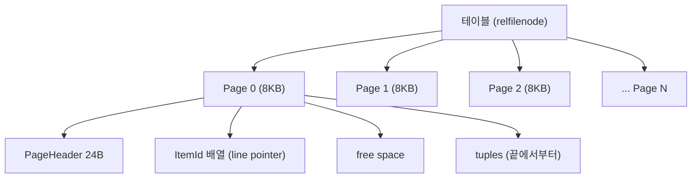
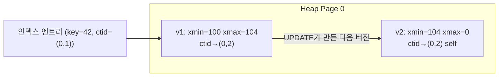

## "DELETE했는데 왜 디스크가 안 줄지?"

100만 건을 `DELETE` 했는데 테이블 크기가 그대로입니다. `UPDATE`만 반복했을 뿐인데 디스크가 계속 부풀고, 어떤 컬럼은 `EXPLAIN`에 안 잡히는 별도 영역에 들어가 있습니다. 이런 현상은 "DB가 이상해서"가 아니라, **PostgreSQL이 데이터를 디스크에 어떻게 올려놓는가**를 모르면 전부 미스터리로 남습니다.

[앞 글]()에서 SELECT 한 줄이 파서·플래너·익스큐터를 거쳐 실행되는 길을 봤다면, 이번 글은 그 익스큐터가 실제로 **디스크의 어느 바이트를 읽고 쓰는지**까지 내려갑니다. 페이지(page), 힙(heap), 튜플(tuple) — 이 세 단어가 인덱스·MVCC·WAL을 이해하는 토대입니다.

## 모든 것은 8KB 페이지로 쪼개진다

PostgreSQL은 테이블을 하나의 거대한 바이트 덩어리로 다루지 않습니다. 디스크와 메모리 사이의 **I/O 단위**를 고정 크기 블록으로 잘라서 다루는데, 이게 **페이지(page)** 이고 기본 크기는 **8KB**(`BLCKSZ`, 컴파일 타임 상수)입니다. 테이블 파일(`base/<db_oid>/<relfilenode>`)은 이 8KB 블록이 0번부터 차곡차곡 이어 붙은 것이며, 1GB를 넘으면 `.1`, `.2` 세그먼트 파일로 나뉩니다.

왜 하필 페이지 단위일까요?

- **I/O 진폭의 단위**: 디스크는 바이트가 아니라 블록 단위로 읽고 씁니다. 한 행만 필요해도 그 행이 든 페이지 전체를 메모리(`shared_buffers`)로 올립니다. 버퍼 풀의 적재·교체·고정(pin)도 전부 페이지 단위입니다.
- **원자성의 단위**: 크래시 복구와 WAL의 full page write도 페이지를 기준으로 동작합니다(→복구 편).
- **잠금·가시성의 단위**: 버퍼 락, visibility map의 비트도 페이지에 대응됩니다.



## 한 페이지 안을 해부하면 — 양쪽에서 자라는 구조

페이지 내부가 이 글의 핵심입니다. 8KB 한 장은 네 영역으로 나뉘는데, 절묘하게도 **두 영역이 서로를 향해 양쪽 끝에서 자랍니다.**

| 영역 | 위치 | 내용 |
|---|---|---|
| **PageHeaderData** | 맨 앞 24바이트 | `pd_lsn`(마지막 변경 WAL 위치), `pd_lower`/`pd_upper`(free space 경계), `pd_special`, `pd_flags` |
| **ItemId 배열** | 헤더 바로 뒤 → 앞에서 뒤로 증가 | 각 4바이트짜리 **라인 포인터**(line pointer). `lp_off`(튜플 시작 오프셋) + `lp_len`(길이) + `lp_flags` |
| **free space** | 가운데 | `pd_lower`와 `pd_upper` 사이의 빈 공간 |
| **튜플(item)** | 맨 뒤 → 뒤에서 앞으로 증가 | 실제 행 데이터. HeapTupleHeader + 사용자 데이터 |

새 행을 넣을 때마다 **앞에서는 ItemId가 하나씩 늘고**(`pd_lower` 증가), **뒤에서는 튜플 본문이 하나씩 채워집니다**(`pd_upper` 감소). 둘이 만나 free space가 바닥나면 그 페이지는 꽉 찬 것이고, 새 행은 다음 페이지(또는 FSM이 알려주는 빈 페이지)로 갑니다.

이 "포인터는 앞에서, 데이터는 뒤에서"라는 한 칸 비틀기가 왜 중요할까요? **튜플을 옮겨도 외부에서 그 행을 가리키는 주소는 안 바뀌게** 하기 위해서입니다. 인덱스나 다른 튜플은 행을 `(블록번호, ItemId 인덱스)` 즉 **ctid**로 가리킵니다. VACUUM이 페이지 안에서 튜플을 압축(조각모음)해 물리 위치를 옮겨도, ItemId의 `lp_off`만 갱신하면 ctid는 그대로 유효합니다. 인덱스가 살아 있는 이유가 이 간접 참조 한 겹에 있습니다.

<div class="pgpage-fill" markdown="0">
<style>
.pgpage-fill{margin:1.4rem 0;overflow-x:auto}
.pgpage-fill svg{width:100%;max-width:720px;height:auto;display:block;margin:0 auto;font-family:inherit}
.pgpage-fill .lbl{fill:currentColor;font-size:12px;font-weight:600}
.pgpage-fill .sub{fill:currentColor;font-size:10px;opacity:.6}
.pgpage-fill .frame{fill:none;stroke:currentColor;stroke-width:1.6;opacity:.7}
.pgpage-fill .hdr{fill:currentColor;opacity:.25}
.pgpage-fill .free{fill:#2f9e44;opacity:0;animation:pgpfree 8s ease-in-out infinite}
.pgpage-fill .lp1{fill:#1971c2;opacity:0;animation:pgplp1 8s ease-in-out infinite}
.pgpage-fill .lp2{fill:#1971c2;opacity:0;animation:pgplp2 8s ease-in-out infinite}
.pgpage-fill .lp3{fill:#1971c2;opacity:0;animation:pgplp3 8s ease-in-out infinite}
.pgpage-fill .tp1{fill:#f08c00;opacity:0;animation:pgptp1 8s ease-in-out infinite}
.pgpage-fill .tp2{fill:#f08c00;opacity:0;animation:pgptp2 8s ease-in-out infinite}
.pgpage-fill .tp3{fill:#f08c00;opacity:0;animation:pgptp3 8s ease-in-out infinite}
.pgpage-fill .arr{stroke:currentColor;stroke-width:1.4;opacity:.5;marker-end:url(#pgparrow)}
.pgpage-fill #pgparrow path{fill:currentColor;opacity:.5}
@keyframes pgpfree{0%{opacity:.35}90%,100%{opacity:.1}}
@keyframes pgplp1{0%,8%{opacity:0}14%,100%{opacity:.9}}
@keyframes pgplp2{0%,40%{opacity:0}46%,100%{opacity:.9}}
@keyframes pgplp3{0%,72%{opacity:0}78%,100%{opacity:.9}}
@keyframes pgptp1{0%,8%{opacity:0}14%,100%{opacity:.9}}
@keyframes pgptp2{0%,40%{opacity:0}46%,100%{opacity:.9}}
@keyframes pgptp3{0%,72%{opacity:0}78%,100%{opacity:.9}}
</style>
<svg viewBox="0 0 700 300" role="img" aria-label="8KB 페이지에서 라인 포인터(ItemId)는 앞에서 뒤로, 튜플은 뒤에서 앞으로 채워지며 가운데 free space가 줄어드는 애니메이션">
  <defs><marker id="pgparrow" markerWidth="8" markerHeight="8" refX="6" refY="3" orient="auto"><path d="M0,0 L6,3 L0,6 Z"/></marker></defs>
  <rect class="frame" x="40" y="40" width="620" height="200" rx="4"/>
  <!-- header -->
  <rect class="hdr" x="40" y="40" width="70" height="200"/>
  <text class="sub" x="75" y="150" text-anchor="middle" transform="rotate(-90 75 150)">PageHeader 24B</text>
  <!-- line pointers grow from left -->
  <rect class="lp1" x="112" y="40" width="34" height="26" rx="2"/>
  <rect class="lp2" x="148" y="40" width="34" height="26" rx="2"/>
  <rect class="lp3" x="184" y="40" width="34" height="26" rx="2"/>
  <text class="sub" x="165" y="84" text-anchor="middle">ItemId →</text>
  <!-- free space center -->
  <rect class="free" x="222" y="40" width="240" height="200"/>
  <text class="sub" x="342" y="150" text-anchor="middle">free space (pd_lower ↔ pd_upper)</text>
  <!-- tuples grow from right -->
  <rect class="tp1" x="612" y="180" width="46" height="58" rx="2"/>
  <rect class="tp2" x="558" y="180" width="48" height="58" rx="2"/>
  <rect class="tp3" x="500" y="180" width="52" height="58" rx="2"/>
  <text class="sub" x="560" y="168" text-anchor="middle">← tuples</text>
  <!-- pointer arrows -->
  <line class="arr" x1="129" y1="66" x2="630" y2="180"/>
  <line class="arr" x1="165" y1="66" x2="580" y2="180"/>
  <text class="lbl" x="40" y="270">ItemId는 앞에서 뒤로, 튜플 본문은 뒤에서 앞으로 — 둘이 만나면 페이지가 꽉 찬다</text>
  <text class="sub" x="40" y="290">ctid = (블록번호, ItemId 인덱스). 튜플이 페이지 안에서 옮겨져도 ItemId만 갱신하면 ctid는 유지된다</text>
</svg>
</div>

## 힙(heap) — 순서 없는 튜플 더미

이렇게 페이지에 담긴 행들의 집합이 **힙(heap)** 입니다. 자료구조의 힙(우선순위 큐)이 아니라, "정렬되지 않은 더미"라는 뜻의 힙입니다. PostgreSQL의 기본 테이블 저장 방식(heap access method)은 **행에 어떤 물리적 순서도 보장하지 않습니다.** `INSERT`는 빈 공간이 있는 아무 페이지에나 들어가고, `UPDATE`는 새 위치에 새 버전을 만듭니다.

그래서 정렬·범위 검색을 빠르게 하려면 별도의 **인덱스**가 필요합니다. 인덱스 엔트리는 `key + ctid` 형태로, 정렬된 자기 구조를 타고 내려가 마지막에 ctid로 힙 페이지를 가리킵니다([B-Tree 인덱스]()에서 깊게 다룹니다). 힙은 "데이터의 본체", 인덱스는 "그 본체로 가는 정렬된 지도"인 셈입니다.

`ctid`는 실제로 눈으로 볼 수 있습니다.

```sql
SELECT ctid, xmin, xmax, * FROM accounts WHERE id = 42;
--  ctid  | xmin | xmax | id | balance
-- (0,3)  | 1021 |    0 | 42 |   10000
--  ↑ 0번 블록의 3번 ItemId
```

## 한 튜플의 속살 — HeapTupleHeader

이제 튜플 하나의 내부입니다. 사용자가 본 `(42, 10000)` 같은 한 행 앞에는, 사용자에게 안 보이는 **23바이트의 HeapTupleHeader**가 붙어 있습니다. 이 헤더가 MVCC와 가시성의 모든 것을 짊어집니다.

```text
┌────────────── HeapTupleHeader (23B + 정렬 패딩) ──────────────┐
│ t_xmin   (4B)  이 튜플을 INSERT한 트랜잭션 ID                   │
│ t_xmax   (4B)  이 튜플을 DELETE/UPDATE한 트랜잭션 ID (없으면 0) │
│ t_cid / t_xvac (4B)  union: 커맨드 ID 등                       │
│ t_ctid   (6B)  자기/다음 버전의 위치 (블록,오프셋)             │
│ t_infomask2 (2B)  컬럼 수(하위 11비트) + HOT/키갱신 플래그     │
│ t_infomask  (2B)  xmin/xmax 커밋 상태, NULL 존재, TOAST 등     │
│ t_hoff   (1B)  헤더+null bitmap 끝까지의 오프셋 (데이터 시작)  │
├──────────────────────────────────────────────────────────────┤
│ null bitmap (가변, NULL 컬럼이 있을 때만)                      │
│ ── t_hoff 만큼 패딩 ──                                         │
│ 사용자 데이터 (컬럼들, 타입 정렬 규칙대로 패딩)                 │
└──────────────────────────────────────────────────────────────┘
```

핵심 필드를 하나씩 봅시다.

- **`t_xmin` / `t_xmax`**: 이 튜플이 "어느 트랜잭션부터 어느 트랜잭션까지 살아 있는가"를 기록합니다. `UPDATE`는 기존 튜플을 제자리에서 고치지 않고, **옛 튜플의 `t_xmax`에 자기 XID를 찍고 새 튜플을 INSERT**합니다. 즉 한 행을 100번 갱신하면 죽은 버전이 디스크에 99개 쌓입니다(dead tuple). 이것이 [MVCC]()의 핵심이자, 서두의 "DELETE했는데 디스크가 안 주는" 현상(bloat)의 원인입니다.
- **`t_ctid`**: 보통은 자기 자신을 가리키지만, 이 튜플이 `UPDATE`되었다면 **다음 버전의 위치**를 가리켜 버전 체인을 만듭니다.
- **`t_infomask`**: 16비트 플래그 모음. `HEAP_HASNULL`(null bitmap 존재), `HEAP_HASVARWIDTH`, `HEAP_HASEXTERNAL`(TOAST된 컬럼 있음), 그리고 `HEAP_XMIN_COMMITTED`/`HEAP_XMAX_COMMITTED` 같은 **힌트 비트**. 힌트 비트는 매번 `pg_xact`(commit log)를 안 뒤져도 되게, 한 번 판정한 커밋 여부를 캐시해 두는 최적화입니다.
- **`null bitmap`**: 컬럼별 NULL 여부를 1비트씩. NULL인 컬럼은 데이터 영역에 자리를 안 차지하므로, `HEAP_HASNULL`이 꺼져 있으면 bitmap 자체가 생략됩니다.



정렬(alignment)도 실무에서 의외로 큰 영향을 줍니다. `int8`/`timestamp`는 8바이트 경계에 정렬되어야 해서, `bool, int8, bool` 순으로 선언하면 패딩이 끼어 공간이 낭비됩니다. **큰 고정폭 타입을 앞쪽에, 작은 것·가변폭을 뒤쪽에** 배치하면 같은 컬럼으로도 행 크기를 줄일 수 있습니다.

## 큰 값은 어디로 가나 — TOAST

페이지는 8KB인데, 길이 10KB짜리 `text`를 넣으면 어떻게 될까요? 한 튜플은 한 페이지를 넘을 수 없습니다(정확히는 페이지의 1/4, 약 2KB를 넘는 값이 대상). 그래서 PostgreSQL은 **TOAST**(The Oversized-Attribute Storage Technique)로 큰 값을 처리합니다.

- 임계값(`TOAST_TUPLE_THRESHOLD`, 약 2KB)을 넘는 행은, 먼저 가변폭 컬럼을 **압축(pglz/lz4)** 해 보고,
- 그래도 크면 그 컬럼을 잘게 **청크(chunk)** 로 쪼개 별도의 **TOAST 테이블**(`pg_toast.pg_toast_<oid>`)에 저장합니다.
- 원래 튜플 자리에는 실제 값 대신 **TOAST 포인터**(어느 TOAST 테이블의 어느 OID인지)만 남고, `t_infomask`에 `HEAP_HASEXTERNAL`이 켜집니다.

컬럼별 저장 전략은 `ALTER TABLE ... ALTER COLUMN ... SET STORAGE`로 지정합니다: `PLAIN`(TOAST 금지, 고정폭 전용), `EXTENDED`(압축+외부, 기본), `EXTERNAL`(압축 없이 외부 — substring 같은 부분 접근이 빨라짐), `MAIN`(압축은 하되 가능한 본체 유지).

실무 포인트: **큰 컬럼을 안 건드리는 쿼리는 TOAST를 안 읽습니다.** `SELECT id, name FROM docs`는 거대한 `body` 컬럼이 있어도 빠른 반면, `SELECT *`는 매 행마다 TOAST 테이블을 조인하듯 따라가 느려집니다. "왜 `SELECT *`만 느리지?"의 흔한 정체입니다.

## FILLFACTOR — 일부러 페이지를 비워두는 이유

기본적으로 PostgreSQL은 힙 페이지를 100% 채웁니다. 그런데 `UPDATE`가 잦은 테이블이라면, 페이지에 **새 버전이 들어갈 여유**를 남겨두는 게 유리합니다. 이게 `FILLFACTOR`입니다.

```sql
ALTER TABLE accounts SET (fillfactor = 85);  -- 페이지를 85%까지만 채움
```

왜 비워둘까요? **HOT(Heap-Only Tuple) update** 때문입니다. `UPDATE`로 만든 새 버전이 **같은 페이지 안에** 들어가고, 변경된 컬럼이 어떤 인덱스에도 안 걸려 있다면, PostgreSQL은 인덱스를 전혀 안 건드리고 페이지 내부의 ItemId 체인만 이어 붙입니다. 그러면:

- 모든 인덱스에 새 엔트리를 추가하는 비용이 사라지고,
- 인덱스 bloat도 줄며,
- 페이지 내부 정리(HOT pruning)로 죽은 버전을 VACUUM 없이도 일부 회수합니다.

FILLFACTOR로 페이지에 여유 공간을 남겨두면 HOT update가 성공할 확률이 올라갑니다. 반대로 FILLFACTOR가 100이고 페이지가 꽉 차 있으면, 새 버전은 다른 페이지로 가야 하고(non-HOT) 모든 인덱스를 갱신해야 합니다. 단, FILLFACTOR를 낮추면 같은 데이터에 더 많은 페이지가 필요해 읽기 I/O가 늘어나므로, **UPDATE가 잦은 테이블에만** 적용하는 트레이드오프입니다.

```sql
-- HOT update가 잘 일어나는지 진단
SELECT relname, n_tup_upd, n_tup_hot_upd,
       round(100.0 * n_tup_hot_upd / NULLIF(n_tup_upd,0), 1) AS hot_pct
FROM pg_stat_user_tables WHERE relname = 'accounts';
```

## 페이지를 눈으로 — pageinspect

지금까지의 구조는 추상이 아니라 직접 들여다볼 수 있습니다.

```sql
CREATE EXTENSION pageinspect;

-- 0번 블록의 페이지 헤더: lower/upper로 free space 경계를 본다
SELECT lower, upper, special, pagesize FROM page_header(get_raw_page('accounts', 0));

-- 0번 블록의 라인 포인터들과 각 튜플의 xmin/xmax/ctid
SELECT lp, lp_off, lp_len, t_xmin, t_xmax, t_ctid, t_infomask
FROM heap_page_items(get_raw_page('accounts', 0));

-- 테이블이 차지하는 디스크 크기 (TOAST 포함/제외)
SELECT pg_size_pretty(pg_table_size('accounts'));      -- 힙 + TOAST + FSM/VM
SELECT pg_size_pretty(pg_relation_size('accounts'));   -- 힙 본체만
```

`lower`와 `upper` 사이가 바로 위 애니메이션의 free space이고, `lp_len`이 0인 라인 포인터는 죽은 튜플을 가리켰다가 회수된 자리(LP_DEAD/UNUSED)입니다.

## 면접/리뷰 단골 질문

- **Q. PostgreSQL 페이지가 8KB인 이유는?** → 디스크/버퍼 풀의 I/O·잠금·복구 단위를 고정 크기 블록으로 두기 위해서. `BLCKSZ` 컴파일 상수이며, 한 행이 페이지를 넘으면 TOAST로 분리한다.
- **Q. 한 페이지 안에서 라인 포인터와 튜플은 어떻게 배치되나?** → ItemId(line pointer)는 헤더 뒤에서 앞→뒤로(pd_lower 증가), 튜플 본문은 페이지 끝에서 뒤→앞으로(pd_upper 감소) 자란다. 가운데가 free space.
- **Q. ctid가 뭐고 왜 간접 참조를 두나?** → `(블록번호, ItemId)`로 튜플 위치를 가리킨다. ItemId 한 겹을 두어, 페이지 내부에서 튜플을 옮겨도 외부(인덱스 등) 참조를 깨지 않게 한다.
- **Q. xmin/xmax는 무엇인가?** → 튜플을 만든/지운 트랜잭션 ID. UPDATE는 옛 튜플 xmax를 찍고 새 튜플을 INSERT → MVCC와 bloat의 근원.
- **Q. TOAST는 언제 동작하나?** → 행이 ~2KB(TOAST_TUPLE_THRESHOLD)를 넘으면 가변폭 컬럼을 압축/외부 청크로 분리하고, 본체엔 포인터만 남긴다. 큰 컬럼을 안 읽는 쿼리는 TOAST를 안 건드린다.
- **Q. FILLFACTOR를 낮추면 좋은 점/나쁜 점은?** → 페이지에 여유를 남겨 HOT update 성공률↑(인덱스 갱신·bloat↓). 대신 같은 데이터에 페이지가 더 필요해 읽기 I/O↑. UPDATE 잦은 테이블에만.

## 정리

- 테이블은 **8KB 페이지**의 연속이고, 페이지가 디스크-메모리 **I/O·잠금·복구의 단위**다.
- 한 페이지 안에서 **ItemId(line pointer)는 앞에서, 튜플은 뒤에서** 자라 가운데 free space를 메운다. ctid의 간접 참조가 VACUUM의 조각모음을 가능케 한다.
- **힙은 순서 없는 더미** — 정렬·검색은 ctid를 가리키는 인덱스가 책임진다.
- 튜플 앞 **HeapTupleHeader**의 `xmin/xmax/ctid/infomask/null bitmap`가 MVCC·가시성·bloat의 모든 출발점이다.
- 큰 값은 **TOAST**로 압축·분리되고, 잦은 UPDATE는 **FILLFACTOR+HOT update**로 인덱스 비용을 아낀다.

> 다음 글: 이렇게 힙에 흩어진 튜플을 ctid로 가리켜 수억 건에서 한 건을 밀리초에 찾는 [B-Tree 인덱스]()로 이어집니다. 튜플 헤더의 xmin/xmax는 [MVCC 내부]()에서, 페이지 변경 기록은 [WAL과 크래시 복구]()에서 다시 만납니다.
</content>
</invoke>
