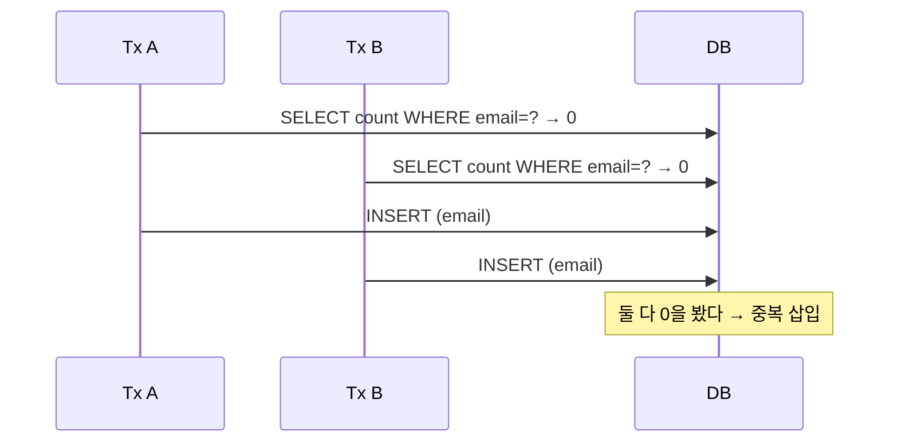

중복 등록 방지를 다룬 주였다. 흔한 첫 구현은 "있는지 먼저 조회하고, 없으면 넣는다"이다. 단일 사용자가 천천히 쓰는 동안에는 완벽해 보인다. 하지만 두 요청이 거의 동시에 들어오는 순간 이 방어는 종이처럼 찢어진다.

## 선조회-후삽입의 경쟁 윈도

`SELECT`로 존재 여부를 확인하고 `INSERT`하는 코드에는 두 문장 사이에 시간 간격이 있다. 그 사이 다른 트랜잭션이 같은 검사를 통과해 같은 값을 넣을 수 있다. 이 간격이 **경쟁 윈도(race window)**다.



`mermaid: true`가 있어야 위 다이어그램이 렌더된다. 두 트랜잭션 모두 상대의 `INSERT`를 보기 전에 `SELECT`를 끝냈다. 일반적인 격리 수준(READ COMMITTED)에서는 커밋되지 않은 상대의 삽입이 보이지 않으므로, 둘 다 "없음"을 확신하고 넣는다. 이건 애플리케이션 코드가 아무리 정성껏 검사해도 구조적으로 못 막는다.

## DB 유니크 제약은 원자적이다

해법은 검사를 DB 엔진에 맡기는 것이다. 유니크 인덱스에 대한 삽입은 **인덱스 잠금 수준에서 원자적으로** 중복을 판정한다. 두 동시 삽입 중 하나만 성공하고 나머지는 제약 위반 예외로 거부된다. 검사와 삽입 사이에 윈도가 없다 — 인덱스 자체가 직렬화 지점이다.

```sql
-- 한 사용자가 같은 상품을 장바구니에 한 번만
ALTER TABLE cart_items
  ADD CONSTRAINT uq_cart_user_product UNIQUE (user_id, product_id);
```

여기서 중요한 건 **복합 유니크**다. "한 사용자당 상품 1회"처럼 유일성이 여러 컬럼의 조합으로 정의될 때, 단일 컬럼 유니크로는 표현할 수 없다. `(user_id, product_id)` 조합 전체가 유일해야 한다.

## 예외를 정상 흐름으로 처리

DB가 막으면 애플리케이션은 던져진 예외를 사용자 친화적으로 번역하면 된다.

```java
try {
    cartRepository.insert(userId, productId);
} catch (DuplicateKeyException e) {
    // 제약 위반 = 이미 담긴 상품. 정상적인 분기로 처리
    throw new AlreadyInCartException(productId);
}
```

선조회는 **사용자 경험용 빠른 경로**로 남겨둘 수 있다(대부분의 경우 중복이 아니므로 깔끔한 메시지를 빨리 준다). 하지만 진짜 방어선은 항상 DB 제약이다. 코드 검사는 최선의 노력, DB 제약은 보증이다.

## 운영 함정

**1. 유니크가 NULL을 어떻게 보는지 안다.** 대부분의 엔진에서 NULL은 서로 같지 않다고 보므로, 복합 키 중 하나가 NULL이면 유니크가 사실상 무력화된다. 유니크에 들어가는 컬럼은 NOT NULL이 안전하다.

**2. 충돌 예외를 트랜잭션 롤백과 함께 다뤄라.** 제약 위반이 나면 해당 트랜잭션은 보통 중단 상태가 된다. 같은 트랜잭션 안에서 후속 쿼리를 이어가려다 또 실패하지 않도록, 예외를 잡으면 트랜잭션 경계를 정리해야 한다.

## 핵심 요약

- 선조회-후삽입은 동시 요청 앞에서 구조적으로 깨진다(경쟁 윈도).
- 유일성이 조합으로 정의되면 복합 유니크 제약으로 표현한다.
- DB 제약이 유일한 보증이고, 애플리케이션 검사는 UX용 빠른 경로일 뿐이다.
- 제약 위반 예외를 비즈니스 분기로 번역하고, 트랜잭션 정리를 잊지 않는다.
