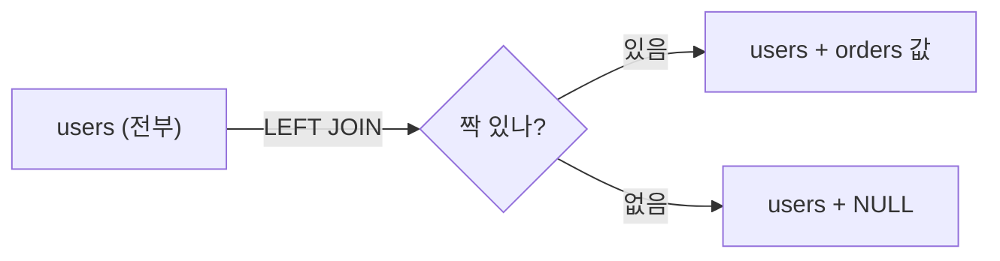

연관 데이터를 조인해 조회하는 주였다. 목록을 만들었는데 분명 존재하는 행 몇 개가 결과에서 사라졌다. 데이터가 지워진 게 아니라, **조인이 그 행을 떨군 것**이다. 조인의 동작을 정확히 알면 이 현상은 버그가 아니라 정의 그대로의 결과임을 알 수 있다.

## 내부 조인은 교집합이다

`INNER JOIN`은 두 테이블에서 **양쪽 모두 조건을 만족하는 짝이 있는 행만** 결과로 낸다. `users`와 `orders`를 `user_id`로 내부 조인하면, 주문이 하나도 없는 사용자는 결과에 등장하지 않는다. 짝이 없기 때문이다.

```sql
-- 주문 없는 사용자는 사라진다
SELECT u.id, u.name, o.amount
FROM users u
INNER JOIN orders o ON o.user_id = u.id;
```

이건 옵티마이저의 변덕이 아니라 관계대수의 정의다. 내부 조인은 데카르트 곱에서 조인 조건을 만족하는 행만 남기는 연산이고, 한쪽에 짝이 없으면 그 조합 자체가 존재하지 않는다.

## 외부 조인으로 보존하기

"주문이 없어도 사용자는 다 보여야 한다"면 `LEFT JOIN`을 쓴다. 왼쪽(`users`)의 모든 행을 보존하고, 오른쪽에 짝이 없으면 오른쪽 컬럼을 **NULL로 채운다**.

```sql
SELECT u.id, u.name, o.amount
FROM users u
LEFT JOIN orders o ON o.user_id = u.id;
-- 주문 없는 사용자도 나오고, o.amount는 NULL
```



`mermaid: true`를 frontmatter에 넣어야 이 다이어그램이 보인다.

## WHERE가 outer를 inner로 되돌리는 함정

가장 자주 당하는 함정이다. `LEFT JOIN`으로 주문 없는 사용자까지 살려놓고, `WHERE`에 오른쪽 테이블 컬럼 조건을 걸면 그 행이 다시 사라진다.

```sql
-- 의도: 미결제 주문을 가진 사용자 + 주문 없는 사용자도 보고 싶다?
SELECT u.id, o.status
FROM users u
LEFT JOIN orders o ON o.user_id = u.id
WHERE o.status = 'UNPAID';   -- ❌ 주문 없는 사용자(o.status가 NULL)가 탈락
```

`LEFT JOIN`은 짝 없는 행의 `o.status`를 NULL로 채우는데, `WHERE o.status = 'UNPAID'`는 NULL을 거짓으로 판정해 그 행을 버린다. 결국 left join이 inner join과 똑같아진다. 조인 단계의 "보존"을 필터 단계가 무효화한 것이다.

**해결: 오른쪽 테이블에 대한 조건은 ON 절로 옮긴다.**

```sql
SELECT u.id, o.status
FROM users u
LEFT JOIN orders o
       ON o.user_id = u.id
      AND o.status = 'UNPAID';   -- ✅ 조인 단계에서 필터, 보존 유지
-- 주문 없는 사용자는 o.status=NULL로 그대로 남는다
```

`ON`의 조건은 "어떤 행을 짝으로 인정할지"를 정하고 보존을 유지한다. `WHERE`의 조건은 조인이 끝난 결과를 거른다 — NULL을 떨구면서 outer를 죽인다. 둘의 적용 시점이 다르다는 것이 핵심이다.

## 운영 함정

**1. NULL 비교는 거짓도 참도 아니다.** `o.status = 'X'`뿐 아니라 `o.status <> 'X'`도 NULL이면 거짓이다. outer join 후 오른쪽 컬럼을 WHERE에서 비교하는 순간 보존이 깨진다. "짝 없는 행을 살릴지"는 `IS NULL` 분기로 명시한다.

**2. 집계에서 COUNT 대상을 조심하라.** left join 후 `COUNT(*)`는 NULL 행도 1로 세지만 `COUNT(o.id)`는 NULL을 0으로 센다. "주문 수"를 원하면 후자다.

## 핵심 요약

- inner join은 교집합 — 짝 없는 행은 정의상 사라진다.
- 한쪽을 다 보존하려면 left join, 짝 없으면 반대편은 NULL.
- 오른쪽 테이블 조건을 WHERE에 두면 NULL이 떨어져 outer가 inner로 퇴화한다. 보존하려면 그 조건을 ON으로 옮긴다.

**면접 한 줄 Q&A**
Q. LEFT JOIN을 썼는데 INNER JOIN처럼 동작한다. 왜?
A. 오른쪽 테이블 컬럼 조건을 WHERE에 걸어 짝 없는 행의 NULL이 필터에서 탈락했기 때문. 조건을 ON 절로 옮기면 보존된다.
