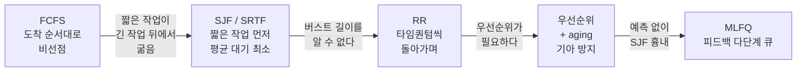
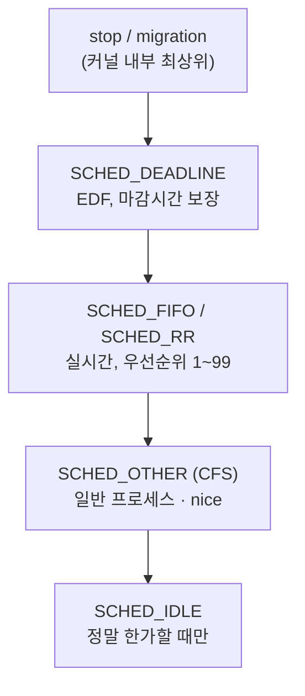

## "1ms 안에, 다음 주자를 골라라"

타이머 인터럽트가 울립니다. 방금 돌던 프로세스의 타임 슬라이스가 끝났고, 준비 큐에는 실행을 기다리는 프로세스가 수십 개 쌓여 있습니다. 커널은 **지금 당장**, 1밀리초도 안 되는 시간에 결정해야 합니다 — **다음으로 CPU를 누구에게 줄 것인가?**

이 결정이 초당 수천 번 일어납니다. 너무 단순하게 고르면 영상 재생이 끊기고(응답성↓), 너무 정교하게 고르면 고르는 데 드는 비용이 일하는 시간을 잡아먹습니다(오버헤드↑). 게다가 "공정"과 "빠름"은 자주 충돌합니다. 이 글은 스케줄러가 푸는 이 **다목적 최적화 문제**를, FCFS 같은 교과서 알고리즘에서 시작해 실제 리눅스가 매일 돌리는 **CFS**까지 따라갑니다.

## 스케줄러가 동시에 만족시켜야 하는 것들

스케줄링은 단일 정답이 없습니다. 워크로드(배치 서버냐, 데스크톱이냐)에 따라 무엇을 우선할지가 달라지기 때문입니다. 핵심 지표 다섯 가지를 구분하는 게 출발점입니다.

| 지표 | 정의 | 누가 중시하나 |
|---|---|---|
| **CPU 이용률** | CPU가 노는 시간 최소화 | 서버·클라우드(비용) |
| **처리량(throughput)** | 단위 시간당 끝낸 작업 수 | 배치 처리 |
| **반환 시간(turnaround)** | 제출~완료까지 총 시간 | 배치 작업 |
| **대기 시간(waiting)** | 준비 큐에서 기다린 총 시간 | 모든 워크로드 |
| **응답 시간(response)** | 제출~**첫 반응**까지 | 대화형·데스크톱 |

> **핵심 긴장 — "처리량 vs 응답성".** 긴 작업을 끊지 않고 몰아주면 문맥 전환이 줄어 **처리량**은 좋아지지만, 그 뒤에 줄 선 짧은 작업의 **응답 시간**은 끔찍해집니다. 반대로 자주 끊어 번갈아 주면 응답성은 좋아지지만 문맥 전환(6편) 비용이 누적됩니다. 모든 스케줄링 알고리즘은 결국 **이 두 축 사이 어딘가**에 점을 찍는 일입니다.

## 선점 vs 비선점 — 끊을 수 있는가

스케줄러의 가장 근본적인 갈림길입니다.

- **비선점(non-preemptive)**: 한번 CPU를 잡은 프로세스는 스스로 양보(I/O 대기·종료)할 때까지 안 뺏깁니다. 구현이 단순하지만, 긴 작업 하나가 전체를 멈춰 세웁니다.
- **선점(preemptive)**: 타이머 인터럽트로 강제로 뺏어 다른 프로세스에 줍니다. 응답성이 좋지만, 공유 자료를 만지는 도중에 뺏기면 경쟁 상태(8편)가 생겨 동기화가 필요해집니다.

현대 범용 OS(리눅스·윈도·macOS)는 전부 **선점형**입니다. 데스크톱에서 무한 루프 프로그램을 실행해도 마우스가 움직이는 이유가 이것입니다.

## 고전 알고리즘 — 트레이드오프의 박물관

각 알고리즘은 어떤 지표를 위해 무엇을 희생했는지를 보여주는 표본입니다.



- **FCFS(First-Come, First-Served)**: 도착 순서대로. 단순하지만 **호위 효과(convoy effect)** — 1초짜리 작업 100개가 100초짜리 작업 하나 뒤에 줄 서면 전부 100초를 기다립니다. 평균 대기가 폭발합니다.
- **SJF / SRTF**: 가장 짧은 작업 먼저(SRTF는 선점형). **평균 대기 시간이 수학적으로 최적**입니다. 치명적 약점은 **버스트 길이를 미리 알 수 없다**는 것 — 그래서 과거 실행을 지수 가중 평균으로 *예측*해야 하고, 긴 작업은 굶을 수 있습니다.
- **RR(Round Robin)**: 모두에게 똑같은 **타임 퀀텀(q)**을 주고 돌아가며. 응답성이 좋아 대화형에 적합. q가 크면 FCFS에 수렴하고, q가 너무 작으면 문맥 전환 오버헤드가 일하는 시간을 잡아먹습니다(보통 q = 10~100ms).
- **우선순위(Priority)**: 중요한 일 먼저. 문제는 **기아(starvation)** — 낮은 우선순위는 영영 못 돕니다. 해법이 **에이징(aging)**: 오래 기다릴수록 우선순위를 슬슬 올려줍니다.
- **MLFQ(다단계 피드백 큐)**: 여러 우선순위 큐를 두고, CPU를 오래 쓰는 프로세스는 **아래 큐로 강등**, I/O로 자주 양보하는(대화형) 프로세스는 위 큐에 유지. **버스트 길이를 모른 채 SJF를 근사**하는 영리한 트릭입니다.

### 라운드 로빈을 눈으로

아래에서 준비 큐의 프로세스 A·B·C·D가 각자 **타임 퀀텀**만큼 CPU를 쓰고(가운데 CPU가 그 색으로 채워짐, 아래 퀀텀 막대가 차오름), 끝나면 **큐의 맨 뒤로 회전**합니다. 맨 아래 간트 타임라인에 실제 CPU 점유가 A→B→C→D→다시 A로 쌓입니다.

<div class="os-rr" markdown="0">
<style>
.os-rr{margin:1.4rem 0;overflow-x:auto}
.os-rr svg{width:100%;max-width:700px;height:auto;display:block;margin:0 auto;font-family:inherit}
.os-rr .lbl{fill:currentColor;font-size:11px;font-weight:600}
.os-rr .sub{fill:currentColor;font-size:10px;opacity:.6}
.os-rr .cpu{fill:currentColor;opacity:.08;stroke:currentColor;stroke-width:1.5}
.os-rr .cf{opacity:0}
.os-rr .ca{animation:osrrcpu 8s steps(1) infinite}
.os-rr .cb{animation:osrrcpu 8s steps(1) infinite 2s}
.os-rr .cc{animation:osrrcpu 8s steps(1) infinite 4s}
.os-rr .cd{animation:osrrcpu 8s steps(1) infinite 6s}
@keyframes osrrcpu{0%{opacity:.9}25%{opacity:0}100%{opacity:0}}
.os-rr .qbar{fill:currentColor;opacity:.45;transform-origin:left center;transform-box:fill-box;animation:osrrq 2s linear infinite}
@keyframes osrrq{0%{transform:scaleX(0)}100%{transform:scaleX(1)}}
.os-rr .qhead{fill:none;stroke:currentColor;stroke-width:2;rx:6;animation:osrrhead 8s steps(1) infinite}
@keyframes osrrhead{0%{transform:translateX(0)}25%{transform:translateX(74px)}50%{transform:translateX(148px)}75%{transform:translateX(222px)}100%{transform:translateX(0)}}
.os-rr .sl{opacity:0;animation:osrrsl 8s linear infinite}
@keyframes osrrsl{0%{opacity:0}3%{opacity:.85}100%{opacity:.85}}
</style>
<svg viewBox="0 0 700 250" role="img" aria-label="라운드 로빈 스케줄링: 네 프로세스가 타임 퀀텀씩 CPU를 점유하고 준비 큐 뒤로 회전하며, 간트 타임라인에 점유가 쌓이는 애니메이션">
  <text class="lbl" x="20" y="22">준비 큐 (앞 → 뒤)</text>
  <rect x="20"  y="32" width="64" height="32" rx="6" style="fill:#1971c2;opacity:.85"/><text class="sub" x="52"  y="52" text-anchor="middle" fill="#fff" style="opacity:1">A</text>
  <rect x="94"  y="32" width="64" height="32" rx="6" style="fill:#f08c00;opacity:.85"/><text class="sub" x="126" y="52" text-anchor="middle" fill="#fff" style="opacity:1">B</text>
  <rect x="168" y="32" width="64" height="32" rx="6" style="fill:#2f9e44;opacity:.85"/><text class="sub" x="200" y="52" text-anchor="middle" fill="#fff" style="opacity:1">C</text>
  <rect x="242" y="32" width="64" height="32" rx="6" style="fill:#e03131;opacity:.85"/><text class="sub" x="274" y="52" text-anchor="middle" fill="#fff" style="opacity:1">D</text>
  <rect class="qhead" x="18" y="30" width="68" height="36" rx="6"/>
  <path d="M 306,48 q 40,0 40,40 l 0,6" stroke="currentColor" stroke-width="1.4" opacity=".4" fill="none"/>
  <text class="sub" x="360" y="56">퀀텀 끝 → 큐 맨 뒤로 회전 ↺</text>

  <rect class="cpu" x="470" y="96" width="120" height="60" rx="10"/>
  <text class="lbl" x="530" y="90" text-anchor="middle">CPU</text>
  <rect class="cf ca" x="470" y="96" width="120" height="60" rx="10" style="fill:#1971c2"/>
  <rect class="cf cb" x="470" y="96" width="120" height="60" rx="10" style="fill:#f08c00"/>
  <rect class="cf cc" x="470" y="96" width="120" height="60" rx="10" style="fill:#2f9e44"/>
  <rect class="cf cd" x="470" y="96" width="120" height="60" rx="10" style="fill:#e03131"/>
  <text class="sub" x="530" y="130" text-anchor="middle" fill="#fff" style="opacity:.95">실행 중</text>
  <text class="sub" x="530" y="172" text-anchor="middle">타임 퀀텀</text>
  <rect x="472" y="178" width="116" height="8" rx="4" style="fill:currentColor;opacity:.12"/>
  <rect class="qbar" x="472" y="178" width="116" height="8" rx="4"/>

  <text class="lbl" x="20" y="206">CPU 점유 타임라인 →</text>
  <rect class="sl" x="20"  y="214" width="80" height="24" rx="3" style="fill:#1971c2;opacity:.85;animation-delay:0s"/>
  <rect class="sl" x="102" y="214" width="80" height="24" rx="3" style="fill:#f08c00;opacity:.85;animation-delay:2s"/>
  <rect class="sl" x="184" y="214" width="80" height="24" rx="3" style="fill:#2f9e44;opacity:.85;animation-delay:4s"/>
  <rect class="sl" x="266" y="214" width="80" height="24" rx="3" style="fill:#e03131;opacity:.85;animation-delay:6s"/>
  <text class="sub" x="430" y="231">→ 다시 A부터 (라운드 반복)</text>
</svg>
</div>

## 리눅스의 답: CFS — "완전 공정 스케줄러"

리눅스는 2007년(2.6.23)부터 **CFS(Completely Fair Scheduler)**를 씁니다. 발상이 우아합니다: *"이상적인 멀티태스킹 CPU라면 N개 프로세스가 각자 1/N씩 동시에 받을 것이다. 현실의 단일 CPU에서 그 이상에 최대한 가깝게 가자."*

핵심 장치가 **vruntime(가상 실행 시간)** 입니다. 각 프로세스는 실제로 CPU를 쓴 시간을 vruntime에 누적합니다. 그리고 스케줄러의 규칙은 단 하나:

> **언제나 vruntime이 가장 작은(= 그동안 CPU를 가장 적게 쓴) 프로세스를 실행한다.**

이렇게 하면 적게 쓴 쪽이 계속 뽑혀 자연히 균형이 맞습니다. "가장 작은 것"을 매번 빠르게 찾으려고, CFS는 프로세스들을 **vruntime을 키로 한 레드-블랙 트리**에 담고 **가장 왼쪽 노드**를 O(log N)에 뽑습니다.

우선순위는 어떻게? **nice 값(-20~+19)을 weight로 변환**해, vruntime을 **weight에 반비례하게** 누적시킵니다. 우선순위가 높은(nice가 작은) 프로세스는 같은 1ms를 써도 vruntime이 **천천히** 올라가 → 더 자주 뽑혀 → 더 많은 CPU를 받습니다. nice 1단계 차이는 약 1.25배의 CPU 비중 차이입니다.

```text
vruntime += 실제_실행시간 × (NICE_0_가중치 / 내_가중치)
          ↑ 가중치 큰(우선순위 높은) 프로세스일수록 vruntime이 더 천천히 증가
          → 레드-블랙 트리에서 더 자주 "가장 왼쪽"이 됨 → CPU를 더 많이 차지
```

### vruntime의 공정성을 눈으로

아래에서 세 프로세스의 **vruntime 막대**가 자랍니다. 스케줄러는 매 순간 **가장 짧은(가장 적게 쓴)** 프로세스를 골라(◀ PICK) 실행시키고, 그러면 그 막대가 한 칸 자랍니다. 결과적으로 셋의 길이가 **늘 비슷하게** 유지됩니다 — 이게 "완전 공정"의 의미입니다.

<div class="os-vr" markdown="0">
<style>
.os-vr{margin:1.4rem 0;overflow-x:auto}
.os-vr svg{width:100%;max-width:680px;height:auto;display:block;margin:0 auto;font-family:inherit}
.os-vr .lbl{fill:currentColor;font-size:11px;font-weight:600}
.os-vr .sub{fill:currentColor;font-size:10px;opacity:.6}
.os-vr .track{fill:currentColor;opacity:.1}
.os-vr .cell{opacity:0;animation:osvrcell 9s linear infinite}
@keyframes osvrcell{0%{opacity:0}2%{opacity:.85}100%{opacity:.85}}
.os-vr .pick{fill:currentColor;animation:osvrpick 3s steps(1) infinite}
@keyframes osvrpick{0%{transform:translateY(0)}33.33%{transform:translateY(44px)}66.66%{transform:translateY(88px)}100%{transform:translateY(0)}}
</style>
<svg viewBox="0 0 680 200" role="img" aria-label="CFS vruntime: 세 프로세스의 vruntime 막대가 번갈아 자라며 늘 비슷한 길이로 유지되어 공정성을 보이는 애니메이션, 스케줄러는 매번 가장 짧은 막대를 선택">
  <text class="lbl" x="20" y="20">vruntime (작을수록 우선 선택) →</text>
  <polygon class="pick" points="24,62 24,82 40,72" />
  <text class="sub" x="50" y="58">A</text>
  <rect class="track" x="70" y="60" width="540" height="20" rx="4"/>
  <rect class="cell" x="72"  y="60" width="86" height="20" rx="3" style="fill:#1971c2;animation-delay:0s"/>
  <rect class="cell" x="160" y="60" width="86" height="20" rx="3" style="fill:#1971c2;animation-delay:3s"/>
  <rect class="cell" x="248" y="60" width="86" height="20" rx="3" style="fill:#1971c2;animation-delay:6s"/>

  <text class="sub" x="50" y="102">B</text>
  <rect class="track" x="70" y="104" width="540" height="20" rx="4"/>
  <rect class="cell" x="72"  y="104" width="86" height="20" rx="3" style="fill:#f08c00;animation-delay:1s"/>
  <rect class="cell" x="160" y="104" width="86" height="20" rx="3" style="fill:#f08c00;animation-delay:4s"/>
  <rect class="cell" x="248" y="104" width="86" height="20" rx="3" style="fill:#f08c00;animation-delay:7s"/>

  <text class="sub" x="50" y="146">C</text>
  <rect class="track" x="70" y="148" width="540" height="20" rx="4"/>
  <rect class="cell" x="72"  y="148" width="86" height="20" rx="3" style="fill:#2f9e44;animation-delay:2s"/>
  <rect class="cell" x="160" y="148" width="86" height="20" rx="3" style="fill:#2f9e44;animation-delay:5s"/>
  <rect class="cell" x="248" y="148" width="86" height="20" rx="3" style="fill:#2f9e44;animation-delay:8s"/>

  <text class="sub" x="340" y="190" text-anchor="middle">세 막대가 늘 비슷한 길이로 유지된다 = 완전 공정(각자 1/N)</text>
</svg>
</div>

> **현실 체크 — "새로 깬 프로세스는 vruntime이 0이 아니다."** I/O를 마치고 막 깨어난 프로세스의 vruntime을 0으로 두면, 그동안 멈춰 있던 그 프로세스가 한참 동안 트리의 맨 왼쪽을 독차지해 다른 모두를 굶깁니다. 그래서 CFS는 깨어나는 작업의 vruntime을 **현재 최소 vruntime 근처로 보정**합니다(약간의 보너스만 줘 대화형 응답성은 살림). "공정"은 공짜가 아니라 이런 디테일의 누적입니다.

## 모든 작업이 평등하진 않다 — 스케줄링 클래스

실시간 제어(브레이크 ECU)와 백그라운드 백업을 같은 잣대로 다룰 순 없습니다. 리눅스는 **스케줄링 클래스**를 우선순위 순으로 쌓아, 위 클래스에 일감이 있으면 아래는 아예 못 돕니다.



- **SCHED_FIFO / SCHED_RR**: 고정 우선순위 실시간. FIFO는 자발적으로 양보 전까지 안 뺏기고, RR은 같은 우선순위끼리 타임 퀀텀으로 번갈아.
- **SCHED_DEADLINE**: "마감 시간"을 선언하면 EDF(Earliest Deadline First)로 보장. 주기적 실시간 작업에 최적.
- **SCHED_OTHER**: 우리가 짜는 거의 모든 프로그램. CFS가 nice로 공정 분배.

> **시대 메모.** CFS는 오랫동안 리눅스 일반 스케줄러의 표준이었지만, 그 후속으로 지연(latency)을 1급 시민으로 다루는 **EEVDF(Earliest Eligible Virtual Deadline First)** 가 메인라인에 들어와 6.6 커널부터 CFS를 대체합니다. vruntime 기반 공정성이라는 큰 그림은 이어지되, "공정함 + 마감 기반 응답성"으로 한 걸음 더 갑니다.

## 직접 만져보기

```bash
# 우선순위 낮춰 실행(배경 작업) / 이미 도는 프로세스 우선순위 조정
nice -n 10 ./batch_job        # nice +10 (양보)
sudo renice -n -5 -p 1234     # PID 1234를 우선순위 높임

# 실시간 클래스로 실행 (주의: 시스템 멈출 수 있음)
sudo chrt -f 50 ./latency_critical   # SCHED_FIFO 우선순위 50
chrt -p 1234                          # PID의 정책/우선순위 조회

# 프로세스의 스케줄링 클래스·우선순위·nice 한눈에
ps -o pid,pri,ni,cls,comm -p 1234     # cls: TS=일반, FF=FIFO, RR, DLN

# 커널이 이 프로세스에 대해 아는 모든 스케줄 통계 (vruntime 포함)
cat /proc/1234/sched          # se.vruntime, sum_exec_runtime ...
cat /proc/1234/schedstat      # 실행시간 / 대기시간 / 타임슬라이스 수
```

`/proc/<pid>/sched`의 `se.vruntime`을 두 프로세스에서 비교해 보면, 방금 본 "가장 작은 vruntime이 다음 차례"라는 규칙이 실제 숫자로 보입니다.

## 면접/리뷰 단골 질문

- **Q. 선점과 비선점의 차이와 트레이드오프는?** → 선점은 타이머로 강제 회수 → 응답성↑이나 공유자료 경쟁 상태(8편) 발생 → 동기화 필요. 비선점은 단순하나 긴 작업이 전체를 막는다.
- **Q. SJF가 평균 대기 최적인데 왜 안 쓰나?** → 다음 버스트 길이를 알 수 없어서. 과거 기반 예측은 부정확하고 긴 작업이 굶는다. MLFQ가 예측 없이 SJF를 근사한다.
- **Q. 라운드 로빈의 타임 퀀텀은 어떻게 정하나?** → 너무 크면 FCFS화(응답성↓), 너무 작으면 문맥 전환 오버헤드가 커진다. 보통 문맥 전환 비용의 수십 배(10~100ms).
- **Q. CFS는 어떻게 공정성을 보장하나?** → vruntime(weight 반비례로 누적된 실행시간)이 최소인 프로세스를 레드-블랙 트리의 맨 왼쪽에서 O(log N)으로 뽑는다. nice는 weight를 바꿔 vruntime 증가 속도를 조절한다.
- **Q. 우선순위 스케줄링의 기아 문제와 해법은?** → 낮은 우선순위가 영영 실행 못 됨 → 에이징(대기할수록 우선순위 상승)으로 해결.
- **Q. 실시간 스케줄링은 일반 스케줄링과 뭐가 다른가?** → 공정성이 아니라 **마감 보장**이 목표. SCHED_FIFO/RR(고정 우선순위), SCHED_DEADLINE(EDF)이 CFS보다 항상 우선한다.

## 정리

- 스케줄링은 **처리량↔응답성** 사이의 다목적 최적화다. 워크로드마다 정답이 다르다.
- 고전 알고리즘은 트레이드오프 표본이다: FCFS(호위 효과), SJF/SRTF(최적이나 예측 불가), RR(퀀텀 트레이드오프), 우선순위(기아→aging), MLFQ(예측 없는 SJF 근사).
- 리눅스 **CFS**: vruntime이 가장 작은 프로세스를 레드-블랙 트리 맨 왼쪽에서 선택 → 완전 공정. nice는 weight로 vruntime 증가 속도를 바꿔 우선순위를 구현한다.
- 작업이 다 평등하진 않다 → **스케줄링 클래스**(DEADLINE > RT > CFS > IDLE)로 실시간을 일반보다 항상 우선.
- 후속 **EEVDF**는 공정성에 마감 기반 응답성을 더해 CFS를 잇는다(6.6+).

> 다음 글: 스케줄러가 "다음 주자"를 골랐다면, 실제로 CPU의 주인을 바꾸는 일 — 레지스터·스택·페이지 테이블을 통째로 갈아끼우는 **[문맥 전환(context switch)]()**의 진짜 비용으로 이어집니다.
