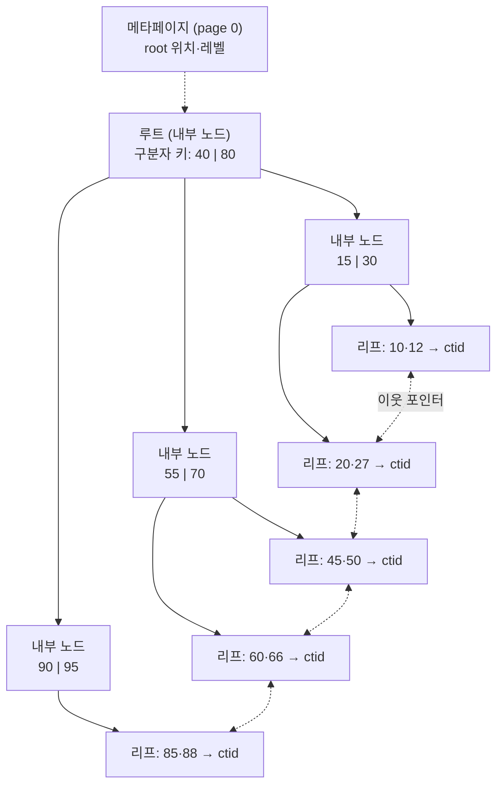
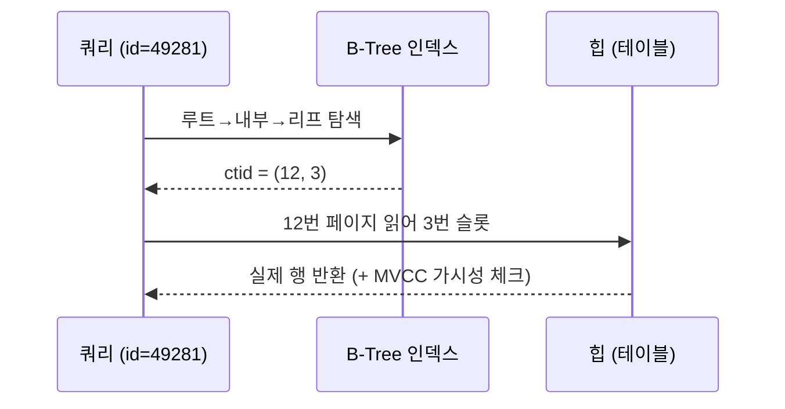

## "인덱스 걸었는데 왜 디스크가 불타죠?"

수억 건짜리 테이블에 `WHERE id = 49281` 한 줄을 던지면 결과가 1밀리초 만에 돌아옵니다. 같은 테이블을 인덱스 없이 훑으면 수십 초가 걸립니다. 둘의 차이는 "메모리에서 빠르게 비교했냐"가 아닙니다. **디스크를 몇 번 건드렸느냐**의 차이입니다.

[앞 글]()에서 데이터는 8KB **페이지** 단위로 디스크에 흩어진 **힙(heap)**에 순서 없이 쌓인다는 걸 봤습니다. 그러면 "id가 49281인 튜플"이 몇 번 페이지에 있는지 힙만 봐서는 알 길이 없습니다. 전부 읽어보는 수밖에요(Seq Scan). 인덱스는 이 문제를 **"디스크를 적게 만지는 자료구조"**로 푸는 장치입니다.

그런데 왜 하필 B-Tree일까요? 메모리에서라면 이진 탐색 트리나 해시가 더 빠른데. 이 글은 사용법이 아니라, **디스크 위에서 왜 B-Tree여야 하는지**, 노드가 페이지와 어떻게 1:1로 대응되는지, 그리고 데이터가 들어올 때 **노드가 쪼개지며(split) 트리가 자라는** 과정을 PostgreSQL 내부 수준에서 따라갑니다.

## 왜 B-Tree인가: I/O 비용은 비교 횟수가 아니다

알고리즘 수업에서는 "비교 O(log n)"을 빠름의 기준으로 씁니다. 하지만 디스크에서는 **한 번의 랜덤 I/O가 메모리 접근보다 수만 배 비쌉니다.** SSD 한 번의 랜덤 읽기는 ~100µs, 메모리는 ~100ns 수준이죠. 그러니 디스크 자료구조의 진짜 목표는 "비교를 줄이기"가 아니라 **"디스크를 만지는 횟수(=트리 높이)를 줄이기"** 입니다.

이진 탐색 트리(BST)를 디스크에 그대로 올렸다고 해봅시다. 노드 하나에 키 1개, 자식 2개. 1억 건이면 트리 높이가 log₂(10⁸) ≈ **27**. 운 나쁘면 한 번 내려갈 때마다 페이지 하나를 읽으니 최악 27번의 랜덤 I/O입니다. 너무 많습니다.

B-Tree의 발상은 단순합니다. **노드 하나를 페이지 하나(8KB)만큼 뚱뚱하게** 만드는 것. 한 페이지에 키를 수백 개 담으면, 각 노드가 자식을 수백 개 가지는 **다진(多進) 트리**가 됩니다. fan-out이 수백이면 높이가 폭락합니다.

$$ \text{height} \approx \log_{\text{fanout}}(N) $$

fan-out이 약 300이라면, 1억 건도 log₃₀₀(10⁸) ≈ **3.2** — 즉 **루트·내부·리프 단 3~4층**이면 충분합니다. 게다가 루트와 상위 내부 노드는 거의 항상 `shared_buffers`(버퍼 풀)에 캐시돼 있으니, 실제 디스크 I/O는 리프 한두 번뿐입니다. 이것이 "수억 건에서 밀리초"의 정체입니다.

| 자료구조 | 노드당 키 | 1억 건 높이 | 디스크 친화 |
|---|---|---|---|
| 이진 탐색 트리 | 1 | ~27 | 나쁨 (높이 큼) |
| 해시 | — | 1 (등치) | 등치만, 범위·정렬 불가 |
| **B-Tree** | **수백** | **~3** | **좋음 (낮은 높이 + 범위 OK)** |

> **왜 해시가 아니라 B-Tree가 기본인가?** 해시 인덱스는 `=`(등치)에는 O(1)이지만 정렬 순서를 보존하지 않아 `>`, `<`, `BETWEEN`, `ORDER BY`를 못 합니다. B-Tree는 키를 **정렬 상태로** 보관하므로 등치·범위·정렬·정렬된 prefix를 한 자료구조로 처리합니다. 그래서 `CREATE INDEX`의 기본값입니다. (해시·GIN·GiST·BRIN의 세계는 [7편]()에서.)

## 노드 = 페이지: B-Tree는 디스크 위에 산다

PostgreSQL의 B-Tree는 학술적 B-Tree가 아니라 **Lehman & Yao의 B⁺-Tree 변종(B-link tree)**입니다. 핵심 성질 두 가지만 잡으면 됩니다.

1. **모든 노드는 8KB 페이지 하나다.** 인덱스도 힙처럼 페이지의 연속(`base_index_relfilenode`)으로 디스크에 저장됩니다. 0번 페이지는 메타페이지(루트가 어느 페이지인지, 트리 레벨 등을 가리킴).
2. **실제 데이터(키와 포인터)는 리프에만 있다.** 내부 노드는 "이 키보다 작으면 왼쪽, 크면 오른쪽" 라우팅을 위한 **구분자(separator) 키**만 가집니다. 검색은 항상 리프까지 내려가야 끝납니다.



리프 노드는 **정렬된 키 + 오른쪽/왼쪽 이웃 페이지 포인터**를 가집니다. 이 이웃 포인터가 결정적입니다. `WHERE age BETWEEN 20 AND 60`을 만나면, B-Tree는 20이 있는 리프를 한 번 찾아 내려간 뒤, **트리를 다시 타지 않고** 리프 사슬을 오른쪽으로 쭉 따라가며 60까지 순차로 긁습니다. 정렬·범위·`ORDER BY`가 공짜인 이유가 바로 이 옆구리 링크입니다.

### 인덱스 엔트리는 무엇을 담나 — key + ctid

여기서 [4편]()과 연결됩니다. B-Tree 리프의 한 엔트리는 **실제 행 데이터를 담지 않습니다.** 대신 두 가지만 담습니다.

```text
[ 인덱스 키 값 ]  +  [ ctid = (블록번호, 라인포인터) ]
       49281               (12, 3)   ← 힙의 12번 페이지, 3번 슬롯
```

`ctid`는 힙 튜플의 물리 주소(TID, tuple identifier)입니다. 즉 **인덱스는 힙을 가리키는 이정표**일 뿐, 데이터의 사본이 아닙니다(커버링 인덱스는 예외 — [6편]()). 그래서 인덱스 스캔은 보통 **두 단계**입니다.



이 "인덱스에서 ctid 얻고 → 힙 다시 읽기"가 바로 `EXPLAIN`에서 보는 **Index Scan**의 실체입니다. 그리고 힙을 다시 읽을 때마다 MVCC 가시성(이 튜플이 내 트랜잭션에 보이나?)을 확인해야 하는데, 이 비용을 줄이는 게 visibility map과 Index-Only Scan입니다([10편]()에서 다룹니다). 인덱스 스캔이 Seq Scan과 언제 갈리는지는 [13편]().

## 삽입과 노드 분할(split): 트리는 위로 자란다

B-Tree가 "Balanced"인 이유, 즉 모든 리프의 깊이가 항상 같은 이유는 **트리가 잎(리프)에서 새로 나는 게 아니라 위(루트)로 자라기** 때문입니다. 그 메커니즘이 **노드 분할**입니다.

새 키를 넣을 자리는 항상 정해진 리프 하나입니다. 그 리프에 빈 공간이 있으면 정렬 위치에 끼워 넣으면 끝입니다. 문제는 **리프가 꽉 찼을 때**입니다. 8KB 페이지에 더는 못 넣습니다. 이때 일어나는 일:

1. 꽉 찬 리프를 **두 페이지로 쪼갠다**(대략 절반씩 — 단, 단조 증가 키는 90:10으로 쏠리게 분할).
2. 두 리프의 경계가 되는 키 하나를 **부모(내부 노드)로 밀어 올린다**(copy-up / push-up).
3. 부모도 꽉 차 있으면 부모도 쪼개고 또 위로 밀어 올린다 — 이게 루트까지 전파될 수 있다.
4. **루트가 쪼개지면 그 위에 새 루트가 생기고, 트리 높이가 +1** 된다.

아래 애니메이션은 이 과정을 보여줍니다. 리프가 키로 채워지다 꽉 차면 두 개로 갈라지고, 가운데 키가 부모로 올라가며, 결국 루트가 쪼개져 **새 루트가 위에 생기고 트리가 한 층 높아지는** 순간입니다.

<div class="btree-split" markdown="0">
<style>
.btree-split{margin:1.4rem 0;overflow-x:auto}
.btree-split svg{width:100%;max-width:720px;height:auto;display:block;margin:0 auto;font-family:inherit}
.btree-split .cap{fill:currentColor;font-size:11px;font-weight:600}
.btree-split .sub{fill:currentColor;font-size:9.5px;opacity:.55}
.btree-split .node{fill:none;stroke:currentColor;stroke-width:1.4;opacity:.55}
.btree-split .key{fill:currentColor;font-size:11px;font-weight:600;text-anchor:middle}
.btree-split .lnk{stroke:currentColor;stroke-width:1.2;opacity:.35;fill:none}
/* 단계별 등장 */
.btree-split .ph1{animation:bsPh1 9s ease-in-out infinite}
.btree-split .ph2{opacity:0;animation:bsPh2 9s ease-in-out infinite}
.btree-split .ph3{opacity:0;animation:bsPh3 9s ease-in-out infinite}
/* 꽉 찬 리프 → 빨강 깜빡 */
.btree-split .full{fill:#e03131;opacity:0;animation:bsFull 9s ease-in-out infinite}
/* 새 키가 들어오는 표시 */
.btree-split .newk{fill:#2f9e44}
.btree-split .promo{fill:#1971c2}
@keyframes bsPh1{0%,30%{opacity:1}40%,100%{opacity:0}}
@keyframes bsFull{0%,18%{opacity:0}24%,33%{opacity:.25}40%,100%{opacity:0}}
@keyframes bsPh2{0%,38%{opacity:0}48%,68%{opacity:1}78%,100%{opacity:0}}
@keyframes bsPh3{0%,72%{opacity:0}82%,100%{opacity:1}}
</style>
<svg viewBox="0 0 700 260" role="img" aria-label="B-Tree 리프 노드가 가득 차 두 개로 분할되고 가운데 키가 부모로 올라가며, 루트가 쪼개져 새 루트가 생기고 트리 높이가 한 층 자라는 과정 애니메이션">
  <!-- Phase 1: 단일 리프가 가득 참 -->
  <g class="ph1">
    <text class="cap" x="350" y="40" text-anchor="middle">1. 리프 하나에 키가 꽉 찬다 (8KB 한도)</text>
    <rect class="node" x="250" y="70" width="200" height="34" rx="4"/>
    <rect class="full" x="250" y="70" width="200" height="34" rx="4"/>
    <text class="key" x="285" y="92">10</text>
    <text class="key" x="325" y="92">20</text>
    <text class="key" x="365" y="92">30</text>
    <text class="key newk" x="410" y="92">40←</text>
    <text class="sub" x="350" y="128" text-anchor="middle">40을 더 넣을 자리가 없다 → 분할 필요</text>
  </g>
  <!-- Phase 2: 분할 + 가운데 키 부모로 -->
  <g class="ph2">
    <text class="cap" x="350" y="40" text-anchor="middle">2. 둘로 쪼개고, 경계 키를 부모로 밀어 올린다</text>
    <rect class="node" x="310" y="64" width="80" height="30" rx="4"/>
    <text class="key promo" x="350" y="84">30</text>
    <rect class="node" x="190" y="150" width="150" height="34" rx="4"/>
    <text class="key" x="225" y="172">10</text>
    <text class="key" x="265" y="172">20</text>
    <rect class="node" x="380" y="150" width="150" height="34" rx="4"/>
    <text class="key" x="420" y="172">30</text>
    <text class="key" x="465" y="172">40</text>
    <path class="lnk" d="M335,94 L265,150"/>
    <path class="lnk" d="M365,94 L455,150"/>
    <path class="lnk" d="M340,167 L380,167" stroke-dasharray="3 3"/>
  </g>
  <!-- Phase 3: 루트 분할 → 트리 높이 +1 -->
  <g class="ph3">
    <text class="cap" x="350" y="36" text-anchor="middle">3. 부모(루트)도 꽉 차면 또 분할 → 새 루트 생성, 높이 +1</text>
    <rect class="node" x="320" y="56" width="60" height="28" rx="4"/>
    <text class="key promo" x="350" y="75">50</text>
    <rect class="node" x="200" y="120" width="60" height="28" rx="4"/>
    <text class="key" x="230" y="139">30</text>
    <rect class="node" x="440" y="120" width="60" height="28" rx="4"/>
    <text class="key" x="470" y="139">80</text>
    <rect class="node" x="120" y="190" width="70" height="30" rx="4"/>
    <text class="key" x="155" y="210">10·20</text>
    <rect class="node" x="270" y="190" width="70" height="30" rx="4"/>
    <text class="key" x="305" y="210">40·45</text>
    <rect class="node" x="400" y="190" width="70" height="30" rx="4"/>
    <text class="key" x="435" y="210">60·70</text>
    <rect class="node" x="520" y="190" width="70" height="30" rx="4"/>
    <text class="key" x="555" y="210">85·90</text>
    <path class="lnk" d="M335,84 L230,120"/>
    <path class="lnk" d="M365,84 L470,120"/>
    <path class="lnk" d="M215,148 L155,190"/>
    <path class="lnk" d="M245,148 L305,190"/>
    <path class="lnk" d="M455,148 L435,190"/>
    <path class="lnk" d="M485,148 L555,190"/>
    <path class="lnk" d="M190,205 L270,205" stroke-dasharray="3 3"/>
    <path class="lnk" d="M340,205 L400,205" stroke-dasharray="3 3"/>
  </g>
</svg>
</div>

이 "위로 자라는" 성질 덕분에 모든 리프는 항상 루트로부터 **정확히 같은 거리**에 있습니다. 그래서 어떤 키를 찾든 I/O 횟수가 일정하고(예측 가능), 트리가 한쪽으로 기울지 않습니다. 별도의 리밸런싱 로직 없이 분할만으로 균형이 유지되는 것이 B-Tree의 우아함입니다.

### 분할은 공짜가 아니다 — 단편화·블로트·FILLFACTOR

분할 한 번은 페이지 두 개 쓰기 + 부모 갱신 + 전부 [WAL]()에 기록입니다. 그래서 삽입이 몰리면 분할이 비용 폭탄이 됩니다. 실무에서 마주치는 두 패턴:

- **랜덤 키(UUID v4) 삽입**: 삽입 위치가 트리 전역에 흩어져 여기저기서 분할이 터지고, 페이지들이 절반만 차서(50% 활용) **인덱스가 부풀어 오릅니다(bloat)**. 이래서 시간순으로 증가하는 키나 UUIDv7/ULID를 권하는 겁니다.
- **단조 증가 키(BIGSERIAL)**: 항상 오른쪽 끝에만 삽입되니, PG는 이를 감지해 **rightmost split을 90:10으로** 처리합니다. 절반씩 쪼개면 왼쪽 페이지들이 영원히 절반만 차게 되니까요.

`FILLFACTOR`(B-Tree 기본 90)는 인덱스를 처음 만들 때 페이지를 일부러 90%만 채워, 이후 삽입이 들어와도 분할 없이 받아낼 여유를 둡니다. 블로트가 심해진 인덱스는 `REINDEX (CONCURRENTLY)`로 새로 빽빽하게 다시 쌓아 회복합니다([20편]()).

```sql
-- 인덱스가 얼마나 부풀었는지 / 몇 번 스캔됐는지
SELECT indexrelname,
       pg_size_pretty(pg_relation_size(indexrelid)) AS size,
       idx_scan
FROM pg_stat_user_indexes
WHERE relname = 'orders'
ORDER BY pg_relation_size(indexrelid) DESC;

-- 트리 내부를 직접 들여다보기 (디버깅용)
CREATE EXTENSION IF NOT EXISTS pageinspect;
SELECT level, dead_items, avg_item_size, page_count
FROM bt_multi_page_stats('idx_orders_id', 1, 100);
```

## B-Tree가 강한 것과 못 하는 것

B-Tree가 키를 **정렬 상태로** 보관한다는 한 가지 사실이 강점과 약점을 모두 설명합니다.

- **강함**: 등치(`=`), 범위(`<`, `>`, `BETWEEN`), 정렬(`ORDER BY`가 인덱스 순서와 같으면 정렬 생략), 그리고 **`LIKE 'kuo%'`처럼 앞부분이 고정된** 접두사 검색. 접두사가 고정이면 정렬된 트리에서 시작 위치를 찾아 옆으로 긁으면 되니까요.
- **못 함**: `LIKE '%kuo'`(선행 와일드카드)나 `WHERE lower(email)=...`처럼 **컬럼을 함수로 감싸면** 인덱스를 못 탑니다. 정렬 기준이 원본 컬럼 값인데, 변형된 값의 시작 위치를 알 수 없기 때문입니다. (해결: 표현식 인덱스 — [6편]().) 전문검색·배열 포함 같은 "한 행에 여러 키" 문제는 GIN의 몫입니다([7편]()).

```sql
-- O: 정렬된 트리에서 'kuo'로 시작하는 구간을 찾아 옆으로 스캔
SELECT * FROM users WHERE email LIKE 'kuo%';

-- X: '%kuo'는 시작 위치를 특정 못 함 → Seq Scan
SELECT * FROM users WHERE email LIKE '%kuo';

-- X: lower(email)은 인덱스 키(email 원본)와 다른 값 → 표현식 인덱스 필요
SELECT * FROM users WHERE lower(email) = 'kuo@x.com';
```

## 면접/리뷰 단골 질문

- **Q. 왜 디스크 인덱스는 BST가 아니라 B-Tree인가?** → 디스크 비용은 비교 횟수가 아니라 **트리 높이(=랜덤 I/O 횟수)**가 좌우한다. 노드를 페이지 크기로 뚱뚱하게 만들어 fan-out을 수백으로 키우면 1억 건도 높이 ~3. BST는 노드당 키 1개라 높이가 수십이 된다.
- **Q. 인덱스 엔트리에는 무엇이 들어 있나?** → 키 값 + `ctid`(힙 튜플의 물리 주소: 블록번호, 라인포인터). 데이터 사본이 아니라 힙을 가리키는 이정표다. 그래서 보통 인덱스→ctid→힙의 2단계 접근(Index Scan).
- **Q. 노드 분할은 언제, 어떻게 일어나나?** → 삽입할 리프가 꽉 찼을 때. 둘로 쪼개고 경계 키를 부모로 밀어 올린다. 루트까지 전파되면 새 루트가 생기며 트리 높이가 +1. 트리는 잎이 아니라 위로 자라서 균형을 유지한다.
- **Q. UUIDv4를 PK로 쓰면 왜 인덱스가 느려지나?** → 삽입이 트리 전역에 랜덤하게 흩어져 분할이 곳곳에서 터지고, 페이지들이 절반만 차 bloat가 생긴다. 단조 증가 키(BIGSERIAL/UUIDv7)는 rightmost 90:10 분할로 빽빽하게 유지된다.
- **Q. 리프끼리의 이웃 포인터는 왜 중요한가?** → 범위 스캔·`ORDER BY` 때 트리를 다시 타지 않고 정렬된 리프 사슬을 옆으로 순차 스캔할 수 있게 해준다. B-Tree가 범위·정렬에 강한 근본 이유다.
- **Q. `LIKE '%abc'`가 인덱스를 못 타는 이유는?** → B-Tree는 키를 앞에서부터 정렬해 보관하므로 "시작 위치"를 알아야 한다. 앞이 와일드카드면 시작 위치를 특정할 수 없다.

## 정리

- 디스크 인덱스의 목표는 비교 줄이기가 아니라 **트리 높이(랜덤 I/O 횟수) 줄이기**. 그래서 노드=페이지(8KB)로 뚱뚱하게 만들어 fan-out을 키운 B-Tree가 답이다.
- **노드 하나 = 페이지 하나.** 실데이터는 리프에만 있고, 리프는 정렬 키 + **이웃 포인터**를 가져 범위·정렬을 공짜로 처리한다.
- 인덱스 엔트리 = **키 + ctid**. 인덱스는 힙의 사본이 아니라 [힙]()을 가리키는 이정표다.
- 삽입 시 리프가 꽉 차면 **분할**되고 경계 키가 위로 전파된다. 트리는 위로 자라며, 그래서 모든 리프 깊이가 항상 같다(균형).
- 분할은 공짜가 아니다 → 랜덤 키는 bloat·단편화를 부르고, `FILLFACTOR`·단조증가 키·`REINDEX`로 다스린다.

> 다음 글: 인덱스를 분명히 걸었는데도 안 타는 미스터리 — [복합·커버링·부분·표현식 인덱스]()에서 선두열 규칙과 Index-Only Scan을 파헤칩니다.
