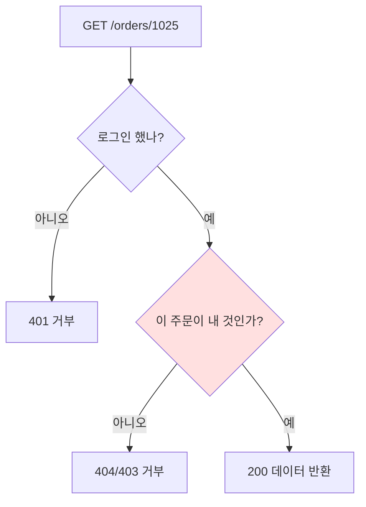

상세 조회 권한을 다룬 주였다. `/orders/1024`로 자기 주문을 보는 화면이 있었다. 그런데 로그인한 사용자가 주소창의 `1024`를 `1025`로 바꾸면 어떻게 될까. 인증은 통과했으니 화면은 열린다 — 문제는 `1025`가 **남의 주문**이라는 것이다. 이것이 IDOR이다.

## IDOR의 정체

IDOR(Insecure Direct Object Reference)는 요청에 담긴 식별자를 **소유권 검증 없이 그대로 신뢰**해 리소스를 내줄 때 생긴다. 공격이라 부르기도 민망할 만큼 단순하다 — 숫자 하나 바꾸기. 그런데 흔하고 치명적이다.

핵심 오해는 **인증(authentication)과 인가(authorization)를 혼동**하는 데 있다.

- 인증: "너는 누구냐" — 로그인 여부.
- 인가: "너는 *이 리소스에* 권한이 있느냐" — 소유/역할.

로그인했다는 사실은 "어떤 주문을 봐도 된다"를 의미하지 않는다. 인증만 검사하고 인가를 빠뜨리면, 로그인한 모든 사용자가 모든 데이터를 볼 수 있는 문이 열린다.



`mermaid: true`가 frontmatter에 있어야 위 흐름이 렌더된다. 빨간 노드가 IDOR이 잡아먹는 지점 — 많은 코드가 이 검사를 통째로 빠뜨린다.

## 소유권 검증을 매 조회에 박는다

원칙은 단순하다. **리소스를 조회하는 모든 경로에서, 그 리소스가 현재 사용자의 것인지 확인한다.** 가장 견고한 방법은 조회 쿼리 자체에 소유자 조건을 묶는 것이다.

```java
// ❌ 식별자만 신뢰 — IDOR
@GetMapping("/orders/{id}")
public OrderDto get(@PathVariable Long id) {
    return orderService.findById(id); // 누구 것인지 검사 안 함
}

// ✅ 소유권을 쿼리에 묶는다
@GetMapping("/orders/{id}")
public OrderDto get(@PathVariable Long id,
                    @AuthenticationPrincipal Long currentUserId) {
    return orderService.findOwnedById(id, currentUserId)
        .orElseThrow(() -> new NotFoundException());
}
```

```sql
-- 조회 단계에서 소유자 조건을 AND로 결합
SELECT * FROM orders
WHERE id = #{id}
  AND user_id = #{currentUserId};
```

이렇게 하면 남의 ID를 넣어도 `AND user_id = ...`가 안 맞아 결과가 0건이다. 검증을 "조회 후 if문"으로 두지 않고 **쿼리에 결합**하면 검사를 빠뜨릴 여지 자체가 줄어든다.

## 거부 응답은 404가 안전할 수 있다

권한 없는 접근에 `403 Forbidden`을 주면 "이 리소스는 존재하지만 너는 못 본다"를 알려주는 셈이라, 식별자가 유효한지 탐지(enumeration)할 단서를 준다. 민감한 리소스라면 존재 자체를 숨기려고 `404 Not Found`로 응답하는 편이 정보 노출이 적다. 무엇을 택하든 일관되게 한다.

## 운영 함정

**1. 추측 가능한 순번 ID가 IDOR을 쉽게 만든다.** 1, 2, 3… 순증가 ID는 옆 번호를 바로 시도하게 한다. ID를 UUID로 바꾸는 것은 *완화*일 뿐 *해결*이 아니다 — 소유권 검증이 없으면 UUID가 유출되는 순간 똑같이 뚫린다. 근본 방어는 항상 인가 검사다.

**2. 목록·수정·삭제에도 같은 검증을 건다.** IDOR은 GET에만 있는 게 아니다. `PUT /orders/1025`, `DELETE /orders/1025`도 소유권을 검사하지 않으면 남의 데이터를 고치고 지운다. 읽기보다 쓰기 IDOR이 더 위험하다.

## 핵심 요약

- IDOR은 요청의 식별자를 소유권 검증 없이 신뢰할 때 생긴다.
- 인증(누구냐)과 인가(이 리소스에 권한 있냐)는 다르다. 인증만으로는 못 막는다.
- 소유자 조건을 조회 쿼리에 결합해 매 접근마다 검증한다. 읽기·쓰기·삭제 전부에.
- UUID는 완화일 뿐, 인가 검사가 근본 방어다.
