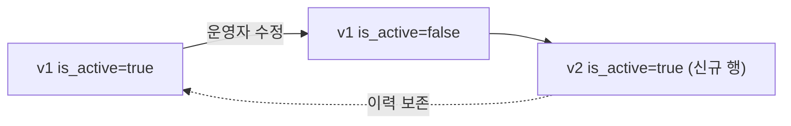

약관 동의 페이지의 링크가 바뀌어야 한다는 요청을 받았다. 코드에 URL이 하드코딩되어 있다면, 글자 하나 바꾸자고 빌드하고 배포하고 검증해야 한다. 운영 중에 자주 바뀌는 값을 코드에 두면 **변경 비용이 배포 비용**이 된다. 이 글은 이런 "콘텐츠성 설정"을 관리 테이블로 빼고 버전을 매기는 설계를 다룬다.

## 핵심: 무엇을 코드에서 빼야 하는가

모든 값을 DB로 빼는 게 답은 아니다. 기준은 **누가, 얼마나 자주 바꾸는가**다.

- **코드/배포에 둘 것** — 거의 안 바뀌고 개발자만 바꾸는 값(상수, 분기 로직).
- **프로파일/환경변수에 둘 것** — 환경마다 다르고 비밀스러운 값(키, 엔드포인트).
- **관리 테이블에 둘 것** — 운영자가 런타임에 바꾸는 콘텐츠성 값(약관 링크, 공지 문구, 노출 배너).

약관 URL은 셋째에 속한다. 운영자가 화면에서 바꾸고, 즉시 반영되고, 개발자 손이 필요 없어야 한다.

## 버전을 매기는 이유

단순히 값을 덮어쓰면 "언제 무엇이 노출됐는지"를 잃는다. 약관은 특히 **법적으로** 어떤 사용자가 어느 버전에 동의했는지 추적해야 한다. 그래서 변경마다 버전을 올리고, 과거 버전을 지우지 않는다.

```sql
CREATE TABLE link_config (
  id          BIGINT PRIMARY KEY AUTO_INCREMENT,
  config_key  VARCHAR(100) NOT NULL,   -- 'TERMS_OF_SERVICE'
  url         VARCHAR(500) NOT NULL,
  version     INT NOT NULL,            -- 변경마다 +1
  is_active   BOOLEAN NOT NULL,        -- 현재 노출 중인 버전만 true
  created_at  DATETIME NOT NULL,
  UNIQUE KEY uk_key_version (config_key, version)
);
```

새 값을 넣을 땐 행을 **추가**하고(`version+1`, `is_active=true`), 이전 활성 행은 `is_active=false`로 내린다. 과거 행은 그대로 남아 이력이 된다.



## 조회와 동의 기록

```java
public LinkConfig getActive(String key) {
    return linkConfigMapper.findActive(key);   // is_active=true 1건
}

// 사용자가 동의할 때, 동의한 '버전'을 함께 기록한다
public void agree(Long userId, String key) {
    LinkConfig active = getActive(key);
    agreementMapper.insert(userId, key, active.getVersion(), now());
}
```

핵심은 동의 기록에 **그 시점의 버전**을 박는 것이다. 나중에 약관이 v3로 바뀌어도, 이 사용자가 v2에 동의했다는 사실이 보존된다. 활성 버전만 보고 "현재 약관에 동의함"으로 기록하면, 약관이 바뀐 순간 과거 동의의 의미가 흐려진다.

## 운영 함정

- **활성 버전이 둘이 되는 경쟁 상태.** 두 운영자가 동시에 새 버전을 올리면 `is_active=true`가 두 행이 될 수 있다. 갱신을 한 트랜잭션으로 묶고(이전 행 비활성 → 새 행 삽입), `config_key` 단위로 활성 행이 하나임을 보장하는 제약이나 정렬 조회로 방어한다.
- **매 요청마다 DB 조회.** 거의 안 바뀌는데 모든 페이지 로드마다 약관 링크를 DB에서 읽으면 낭비다. 짧은 TTL 캐시를 두되, 운영자가 값을 바꾸면 캐시를 무효화해 즉시 반영되게 한다. 변경 빈도가 낮으니 캐시 효율이 매우 높다.

## 핵심 요약

- 변경 주체와 빈도로 값의 위치를 정한다. 운영자가 자주 바꾸는 콘텐츠성 값은 관리 테이블로.
- 덮어쓰지 말고 버전 행을 추가해 이력을 남긴다. 활성 버전은 한 행만.
- 동의·노출 기록엔 그 시점의 버전을 함께 박아 추적성을 확보한다.
