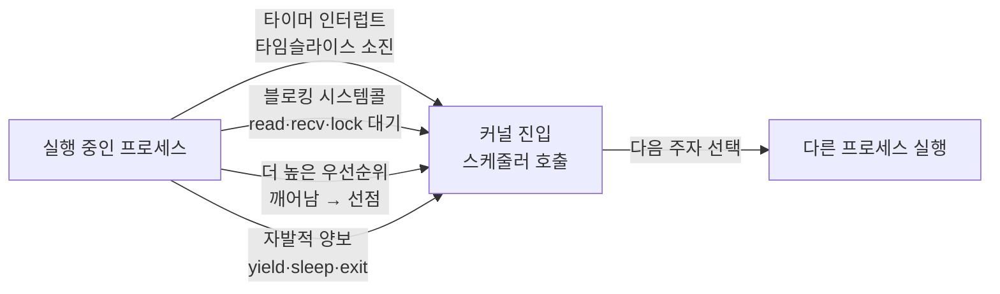

## "전환은 한 번에 몇 마이크로초나 걸릴까"

[스케줄러]()가 "이제 B를 돌려라"라고 결정하면, CPU는 돌던 A를 멈추고 B로 갈아탑니다. 이 갈아타기가 **컨텍스트 스위치(context switch)**입니다. 보통 "레지스터 몇 개 저장하고 복구하는 거니까 금방"이라고 넘깁니다. 그런데 측정해 보면 직접 비용은 1~3μs인데, **실제 체감 비용은 그 수십 배**까지 튀어 오릅니다.

그 차이가 어디서 오는지가 이 글의 핵심입니다. 컨텍스트 스위치의 진짜 비용은 레지스터 저장이 아니라, **전환 직후 텅 비어버린 캐시와 TLB**입니다. 이걸 모르면 "스레드를 많이 띄웠는데 왜 더 느려지지?", "CPU는 노는데 왜 처리량이 안 오르지?" 같은 질문 앞에서 영원히 막힙니다.

## 컨텍스트 스위치가 저장·복구하는 것

"컨텍스트"란 한 실행 흐름을 **그 순간 그대로 얼려서 나중에 되살리는 데 필요한 전부**입니다. 커널은 이걸 프로세스의 **PCB(Process Control Block)**, 리눅스에선 `task_struct`에 저장합니다.

| 무엇 | 정체 | 왜 필요 |
|---|---|---|
| **PC (program counter, RIP)** | 다음에 실행할 명령 주소 | 멈춘 바로 그 줄부터 재개하려고 |
| **범용 레지스터** | rax~r15 등 연산 중간값 | 계산 상태를 그대로 복원 |
| **SP (stack pointer, RSP)** | 스택 꼭대기 | 함수 호출 깊이·지역변수 복원 |
| **상태 레지스터 (RFLAGS)** | 비교 결과·플래그 | 분기 조건 복원 |
| **CR3 (페이지 테이블 베이스)** | 이 프로세스의 주소공간 뿌리 | **다른 프로세스로 갈 때만** 교체 |

마지막 줄 **CR3**가 이 글 전체의 주인공입니다. CR3를 바꾼다는 건 "주소공간 자체를 통째로 갈아끼운다"는 뜻이고, 거기서 비싼 부작용이 줄줄이 따라 나옵니다.

## 무엇이 전환을 일으키나

컨텍스트 스위치는 내가 부르는 게 아니라 **항상 커널 모드에서** 일어납니다. 커널로 진입하는 계기는 크게 넷입니다.



- **타이머 인터럽트**: 타임슬라이스가 끝나면 하드웨어가 강제로 커널에 진입시켜 [시분할]()을 성립시킵니다(= 비자발적 전환).
- **블로킹 시스템콜**: `read()`가 디스크를 기다려야 하면, 그동안 CPU를 놀릴 이유가 없으니 커널이 다른 프로세스로 전환합니다(= 자발적 전환).
- **선점(preemption)**: 더 급한 프로세스가 깨어나면 현재 프로세스를 밀어냅니다.
- **자발적 양보**: `sched_yield()`, `sleep()`, 종료.

> **자발 vs 비자발 — 진단의 갈림길.** 리눅스는 이 둘을 따로 셉니다(`/proc/<pid>/status`의 `voluntary_ctxt_switches` / `nonvoluntary_ctxt_switches`). 자발적 전환이 폭증하면 **I/O·락 대기**가 많다는 신호이고, 비자발적 전환이 폭증하면 **CPU 경합(러너블 스레드 과다)**이라는 신호입니다. 원인이 정반대라 처방도 정반대입니다.

## 애니메이션 ①: 레지스터 파일이 통째로 교체된다

전환의 "직접 비용" 부분입니다. CPU 안의 레지스터 파일 내용을 **A의 PCB로 저장(save)**한 뒤, **B의 PCB에서 복구(restore)**해 CPU에 채워 넣습니다. 아래에서 파란 값(프로세스 A)이 왼쪽 PCB로 빠져나간 뒤, 주황 값(프로세스 B)이 오른쪽 PCB에서 레지스터 파일로 올라타는 것을 보세요.

<div class="ctx-swap" markdown="0">
<style>
.ctx-swap{margin:1.4rem 0;overflow-x:auto}
.ctx-swap svg{width:100%;max-width:720px;height:auto;display:block;margin:0 auto;font-family:inherit}
.ctx-swap .bx{fill:none;stroke:currentColor;stroke-width:1.5;opacity:.45}
.ctx-swap .lbl{fill:currentColor;font-size:12px;font-weight:600}
.ctx-swap .sub{fill:currentColor;font-size:9.5px;opacity:.6}
.ctx-swap .regbox{fill:currentColor;opacity:.06;stroke:currentColor;stroke-width:1.5}
.ctx-swap .save{fill:#1971c2;opacity:0}
.ctx-swap .load{fill:#f08c00;opacity:0}
.ctx-swap .s1{animation:ctxsave 6s ease-in-out infinite}
.ctx-swap .s2{animation:ctxsave 6s ease-in-out infinite .12s}
.ctx-swap .s3{animation:ctxsave 6s ease-in-out infinite .24s}
.ctx-swap .s4{animation:ctxsave 6s ease-in-out infinite .36s}
.ctx-swap .l1{animation:ctxload 6s ease-in-out infinite}
.ctx-swap .l2{animation:ctxload 6s ease-in-out infinite .12s}
.ctx-swap .l3{animation:ctxload 6s ease-in-out infinite .24s}
.ctx-swap .l4{animation:ctxload 6s ease-in-out infinite .36s}
@keyframes ctxsave{0%{transform:translateX(0);opacity:0}4%{opacity:1}38%{transform:translateX(-238px);opacity:1}44%{opacity:0}100%{transform:translateX(-238px);opacity:0}}
@keyframes ctxload{0%,52%{transform:translateX(0);opacity:0}58%{opacity:1}92%{transform:translateX(-238px);opacity:1}100%{transform:translateX(-238px);opacity:1}}
.ctx-swap .tagA{fill:#1971c2;animation:ctxtagA 6s ease-in-out infinite}
.ctx-swap .tagB{fill:#f08c00;opacity:0;animation:ctxtagB 6s ease-in-out infinite}
@keyframes ctxtagA{0%,40%{opacity:.85}50%,100%{opacity:0}}
@keyframes ctxtagB{0%,55%{opacity:0}65%,100%{opacity:.85}}
</style>
<svg viewBox="0 0 720 250" role="img" aria-label="레지스터 파일의 프로세스 A 값이 PCB A로 저장되고, PCB B의 값이 레지스터 파일로 복구되는 컨텍스트 스위치 애니메이션">
  <rect class="bx" x="20" y="60" width="170" height="150" rx="8"/>
  <text class="lbl" x="105" y="48" text-anchor="middle">PCB A (저장 대상)</text>
  <text class="sub" x="105" y="200" text-anchor="middle">task_struct A</text>

  <rect class="regbox" x="280" y="70" width="160" height="120" rx="8"/>
  <text class="lbl" x="360" y="48" text-anchor="middle">CPU 레지스터 파일</text>
  <rect class="tagA" x="300" y="196" width="120" height="18" rx="4"/>
  <rect class="tagB" x="300" y="196" width="120" height="18" rx="4"/>
  <text class="sub" x="360" y="209" text-anchor="middle" fill="#fff" style="opacity:1">현재 컨텍스트</text>

  <rect class="bx" x="530" y="60" width="170" height="150" rx="8"/>
  <text class="lbl" x="615" y="48" text-anchor="middle">PCB B (복구 출처)</text>
  <text class="sub" x="615" y="200" text-anchor="middle">task_struct B</text>

  <rect class="save s1" x="300" y="84" width="120" height="20" rx="3"/>
  <rect class="save s2" x="300" y="108" width="120" height="20" rx="3"/>
  <rect class="save s3" x="300" y="132" width="120" height="20" rx="3"/>
  <rect class="save s4" x="300" y="156" width="120" height="20" rx="3"/>
  <rect class="load l1" x="538" y="84" width="120" height="20" rx="3"/>
  <rect class="load l2" x="538" y="108" width="120" height="20" rx="3"/>
  <rect class="load l3" x="538" y="132" width="120" height="20" rx="3"/>
  <rect class="load l4" x="538" y="156" width="120" height="20" rx="3"/>
  <text class="sub" x="230" y="235" text-anchor="middle">① save: A의 레지스터 → PCB A</text>
  <text class="sub" x="500" y="235" text-anchor="middle">② restore: PCB B → 레지스터 (+ CR3 교체)</text>
</svg>
</div>

여기까지가 **직접 비용**입니다. 레지스터 십수 개를 메모리에 쓰고 읽는 일이라, 현대 CPU에선 보통 **수백 ns ~ 수 μs**에 끝납니다. 문제는 이 다음입니다.

## 진짜 비용은 보이지 않는다: 캐시·TLB 오염

CR3를 바꿔 주소공간을 갈아끼우는 순간, 두 개의 핵심 캐시가 무력화됩니다.

- **TLB(Translation Lookaside Buffer)**: 가상→물리 주소 변환을 캐싱하는 작은 표. 주소공간이 바뀌면 옛 매핑은 전부 무효이므로 **TLB를 비웁니다(flush)**. 전환 직후 모든 메모리 접근은 [페이지 테이블을 다시 걸어내려가는]() page table walk를 겪습니다 — 수십 사이클씩.
- **CPU 캐시(L1/L2)**: 물리적으로 비워지진 않지만, B가 쓰는 데이터·코드는 캐시에 없습니다(**cold**). 한동안 접근마다 메모리까지 내려갔다 오는 **캐시 미스**가 쏟아지다가, 자주 쓰는 데이터가 다시 올라오면서 점차 **warm**해집니다.

이 "워밍업 세금"이 직접 비용을 압도합니다. 그래서 컨텍스트 스위치의 실측 비용은 워크로드의 메모리 발자국(working set)이 클수록 커집니다 — 레지스터 개수와는 무관하게요.

## 애니메이션 ②: cold 캐시가 warm 해지는 과정

전환 직후의 메모리 접근들을 시간순으로 늘어놓은 것입니다. 막대 높이는 **접근 지연(latency)**. 처음엔 캐시·TLB가 비어 <span style="color:#e03131;font-weight:600">미스(빨강, 느림)</span>가 연달아 터지다가, working set이 캐시에 올라오면서 점점 <span style="color:#2f9e44;font-weight:600">히트(초록, 빠름)</span>로 내려앉습니다.

<div class="ctx-warm" markdown="0">
<style>
.ctx-warm{margin:1.4rem 0;overflow-x:auto}
.ctx-warm svg{width:100%;max-width:720px;height:auto;display:block;margin:0 auto;font-family:inherit}
.ctx-warm .axis{stroke:currentColor;opacity:.35;stroke-width:1.4}
.ctx-warm .lbl{fill:currentColor;font-size:11px;font-weight:600}
.ctx-warm .sub{fill:currentColor;font-size:9.5px;opacity:.6}
.ctx-warm .bar{opacity:0;animation:ctxbar 5.5s linear infinite}
@keyframes ctxbar{0%{opacity:0}6%{opacity:.9}100%{opacity:.9}}
</style>
<svg viewBox="0 0 720 230" role="img" aria-label="컨텍스트 스위치 직후 캐시 미스로 접근 지연이 높다가 캐시가 warm 해지며 지연이 낮아지는 막대 애니메이션">
  <text class="lbl" x="14" y="24">접근 지연 ↑</text>
  <line class="axis" x1="40" y1="20" x2="40" y2="180"/>
  <line class="axis" x1="40" y1="180" x2="700" y2="180"/>
  <rect class="bar" x="56"  y="46"  width="34" height="134" rx="2" style="fill:#e03131;animation-delay:0s"/>
  <rect class="bar" x="100" y="52"  width="34" height="128" rx="2" style="fill:#e03131;animation-delay:.32s"/>
  <rect class="bar" x="144" y="64"  width="34" height="116" rx="2" style="fill:#e03131;animation-delay:.64s"/>
  <rect class="bar" x="188" y="84"  width="34" height="96"  rx="2" style="fill:#e8590c;animation-delay:.96s"/>
  <rect class="bar" x="232" y="104" width="34" height="76"  rx="2" style="fill:#f08c00;animation-delay:1.28s"/>
  <rect class="bar" x="276" y="122" width="34" height="58"  rx="2" style="fill:#f08c00;animation-delay:1.6s"/>
  <rect class="bar" x="320" y="138" width="34" height="42"  rx="2" style="fill:#74b816;animation-delay:1.92s"/>
  <rect class="bar" x="364" y="148" width="34" height="32"  rx="2" style="fill:#2f9e44;animation-delay:2.24s"/>
  <rect class="bar" x="408" y="152" width="34" height="28"  rx="2" style="fill:#2f9e44;animation-delay:2.56s"/>
  <rect class="bar" x="452" y="154" width="34" height="26"  rx="2" style="fill:#2f9e44;animation-delay:2.88s"/>
  <rect class="bar" x="496" y="155" width="34" height="25"  rx="2" style="fill:#2f9e44;animation-delay:3.2s"/>
  <rect class="bar" x="540" y="155" width="34" height="25"  rx="2" style="fill:#2f9e44;animation-delay:3.52s"/>
  <rect class="bar" x="584" y="156" width="34" height="24"  rx="2" style="fill:#2f9e44;animation-delay:3.84s"/>
  <rect class="bar" x="628" y="156" width="34" height="24"  rx="2" style="fill:#2f9e44;animation-delay:4.16s"/>
  <text class="sub" x="120" y="200" text-anchor="middle">전환 직후: TLB flush + cold 캐시 → 미스 폭증</text>
  <text class="sub" x="560" y="200" text-anchor="middle">working set 적재 완료 → warm</text>
  <text class="lbl" x="690" y="174" text-anchor="end">시간 →</text>
</svg>
</div>

핵심은 이겁니다: **전환이 잦을수록 매번 이 워밍업을 처음부터 다시** 합니다. 막대가 초록으로 내려앉기도 전에 또 전환되면, 프로세스는 영원히 빨간 구간(미스)만 살다 갑니다. 이게 잦은 전환이 처리량을 죽이는 메커니즘입니다.

## 프로세스 전환 vs 스레드 전환 — TLB가 가른다

같은 "전환"이라도 비용이 크게 다릅니다. 갈림길은 **주소공간(CR3)이 바뀌느냐**입니다.

| | 프로세스 전환 | 같은 프로세스 내 스레드 전환 |
|---|---|---|
| 주소공간(CR3) | **교체됨** | 그대로 유지 |
| TLB | **flush (또는 PCID로 무효화)** | 유지 → 변환 캐시 살아있음 |
| 캐시 | cold 가능성 큼 | 공유 데이터는 warm일 수 있음 |
| 상대 비용 | 비쌈 | **상대적으로 쌈** |

스레드가 "가볍다"고 말하는 핵심 근거가 바로 이것입니다 — 스레드끼리 전환할 땐 주소공간이 그대로라 TLB를 비우지 않아도 됩니다([스레드 글]()). 단, L1/L2 캐시 오염은 스레드 전환에서도 데이터가 다르면 여전히 발생합니다.

## PCID/ASID: "전부 비우기"를 피하는 법

매 전환마다 TLB를 통째로 flush하는 건 낭비입니다. A로 곧 돌아올 텐데 A의 변환까지 버리니까요. 그래서 현대 CPU는 **TLB 엔트리마다 주소공간 태그**를 답니다 — x86은 **PCID(Process-Context ID)**, ARM은 **ASID**.

- 각 TLB 엔트리에 "이건 어느 주소공간 것"이라는 ID를 붙입니다.
- 전환 시 flush하지 않고 **현재 PCID와 일치하는 엔트리만 유효**로 봅니다.
- A→B→A로 돌아오면 A의 옛 TLB 엔트리가 아직 살아 있어 **재워밍업 없이** 재개합니다.

리눅스는 이 기능을 활용해 컨텍스트 스위치의 TLB 비용을 크게 줄입니다. (다만 Meltdown 완화책인 KPTI는 커널/유저 페이지테이블을 분리해 일부 비용을 되돌려 놓았고, PCID는 그 타격을 줄이는 데도 쓰입니다.)

## 헷갈리지 말 것: 모드 전환 ≠ 컨텍스트 스위치

가장 흔한 오해입니다. 시스템콜은 **모드 전환(mode switch)**이지 컨텍스트 스위치가 아닙니다.

- **모드 전환**: 유저 모드 ↔ 커널 모드. **같은 프로세스** 안에서 권한만 바뀜. CR3 그대로, TLB 그대로. 상대적으로 쌈.
- **컨텍스트 스위치**: **다른 프로세스/스레드**로 실행 주체가 바뀜. CR3 교체·TLB 무효화 동반. 비쌈.

`read()` 한 번은 모드 전환만 일으킬 수도, (블로킹되면) 이어서 컨텍스트 스위치까지 일으킬 수도 있습니다. 둘을 합쳐서 "시스템콜은 비싸다"고 뭉뚱그리면 최적화 방향을 못 잡습니다.

## 직접 측정하기

```bash
# 1) 시스템 전체 전환율 — cs 컬럼이 초당 컨텍스트 스위치 수
vmstat 1
#  r  b   ...   cs   us sy id wa
#          ...  9123  12 38 50  0   ← cs 폭증 + sy 높음이면 전환 과다 의심

# 2) 특정 프로세스의 자발/비자발 전환 — 원인 진단의 핵심
grep ctxt /proc/$(pgrep -n nginx)/status
#  voluntary_ctxt_switches:     20431   ← I/O·락 대기 많음
#  nonvoluntary_ctxt_switches:  88123   ← CPU 경합(러너블 과다) 많음

# 3) 프로세스별 전환율 실시간
pidstat -w 1        # cswch/s(자발) nvcswch/s(비자발)

# 4) 전환의 '간접 비용'을 직접 본다 — 미스 카운터
perf stat -e context-switches,cache-misses,dTLB-load-misses,iTLB-load-misses ./app
#  context-switches 가 오를 때 cache-misses·dTLB-misses 도 같이 뛰면
#  → 워밍업 세금을 내고 있다는 증거
```

> **현실 체크 — "스레드를 늘렸는데 느려졌다."** 코어 수보다 훨씬 많은 바쁜 스레드를 띄우면, CPU는 일하는 시간보다 **갈아타는 시간**이 늘어납니다(`nvcswch/s` 폭증). 게다가 매 전환이 캐시를 식혀 미스가 늘죠. 그래서 CPU 바운드 작업의 워커 수는 보통 **코어 수 근처**가 최적이고, 그 이상은 전환 오버헤드로 처리량이 오히려 떨어집니다. "동시성을 늘리면 빨라진다"가 항상 참이 아닌 이유입니다.

## 면접/리뷰 단골 질문

- **Q. 컨텍스트 스위치 때 무엇을 저장하나?** → PC·범용 레지스터·SP·상태 레지스터, 그리고 **다른 프로세스로 갈 때만 CR3(페이지테이블 베이스)**. CR3 교체가 TLB 무효화를 부른다.
- **Q. 진짜 비용은 어디서 오나?** → 레지스터 저장(직접비용)이 아니라 **TLB flush + cold 캐시로 인한 미스 폭증**(간접비용). working set이 클수록 비싸다.
- **Q. 프로세스 전환과 스레드 전환의 차이는?** → 스레드 전환은 주소공간(CR3)이 그대로라 TLB를 안 비워도 돼 더 싸다. 단 데이터 캐시 오염은 둘 다 가능.
- **Q. PCID/ASID는 무엇을 해결하나?** → TLB 엔트리에 주소공간 태그를 붙여 전환 시 전체 flush를 피한다. 곧 돌아올 프로세스의 변환을 살려둬 재워밍업을 줄인다.
- **Q. 시스템콜은 컨텍스트 스위치인가?** → 아니다. 그건 같은 프로세스 내 모드 전환. 블로킹되어 다른 프로세스로 넘어갈 때 비로소 컨텍스트 스위치가 더해진다.

## 정리

- 컨텍스트 스위치는 한 실행 흐름을 PCB에 얼리고 다른 흐름을 되살리는 일 — PC·레지스터·SP·(프로세스 간이면) CR3를 교체한다.
- **직접 비용**(레지스터 저장)은 작고, **간접 비용**(TLB flush + cold 캐시 → 미스 폭증)이 진짜다. 그래서 working set이 클수록 비싸다.
- 트리거는 타이머 인터럽트·블로킹 시스템콜·선점·자발적 양보. 자발/비자발 비율이 원인(I/O냐 CPU 경합이냐)을 가른다.
- 스레드 전환이 프로세스 전환보다 싼 이유는 **주소공간 유지 → TLB 보존**. PCID/ASID는 프로세스 전환의 TLB 비용까지 깎는다.
- 모드 전환(시스템콜) ≠ 컨텍스트 스위치. 잦은 전환은 매번 캐시를 식혀 처리량을 죽인다 → 워커 수는 코어 수 근처가 보통 최적.

> 다음 글: 전환과 격리를 이해했으니, 이제 분리된 프로세스들이 **어떻게 서로 대화하는가** — 파이프·시그널·공유메모리·소켓을 다루는 [IPC]()로 이어집니다. 전환을 *결정*하는 쪽은 앞 글 [CPU 스케줄링]()입니다.
