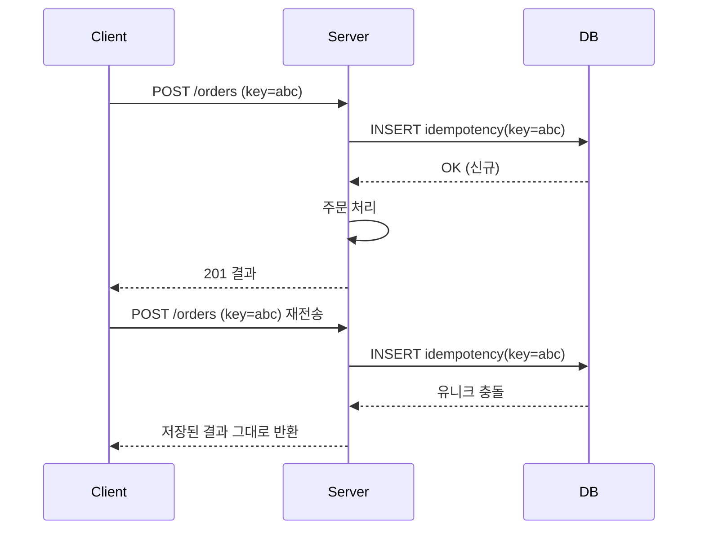

이번 주에 다룬 건 "등록 버튼을 두 번 눌렀더니 같은 데이터가 두 개 생긴다"는 문제다. 추상화하면 **같은 의미의 요청이 두 번 도착했을 때 부수효과를 한 번만 일어나게 하는 것**, 즉 멱등성(idempotency) 설계다.

## 왜 중복은 막을 수 없는가

먼저 받아들여야 할 사실: 네트워크 레벨에서 중복 요청 자체는 막을 수 없다. 사용자가 더블클릭한다. 응답이 느려서 브라우저가 재전송한다. 모바일에서 터널이 끊겼다 붙으며 재시도된다. 프록시·로드밸런서가 타임아웃 후 재시도한다. 클라이언트는 "요청이 성공했는지" 확신할 수 없을 때 다시 보내는 것이 정상 동작이다.

그래서 방어선은 클라이언트가 아니라 **서버와 DB**에 있어야 한다. 핵심 원리는 단순하다. 각 "논리적 요청"에 **고유한 키**를 부여하고, 서버는 그 키를 처음 본 경우에만 처리하고 두 번째부터는 처리하지 않고 이전 결과를 돌려준다.

## 멱등키의 동작 메커니즘

멱등키(idempotency key)는 클라이언트가 요청을 생성하는 순간 발급한 UUID다. 폼을 열 때 한 번 발급해 hidden 필드나 헤더에 싣고, 재시도해도 같은 키를 쓴다.



여기서 가장 흔한 실수는 "키가 있는지 SELECT로 확인한 뒤 없으면 INSERT"하는 것이다. 동시에 두 요청이 들어오면 둘 다 SELECT에서 "없음"을 보고 둘 다 INSERT한다 — 전형적인 TOCTOU(check-then-act) 경쟁이다. 정답은 확인을 DB의 **유니크 제약**에 맡기는 것이다. INSERT를 먼저 시도하고, 유니크 위반 예외가 나면 "이미 처리됨"으로 분기한다. 원자성을 애플리케이션이 아니라 DB 엔진이 보장하게 만드는 게 핵심이다.

## 코드 예시

```sql
CREATE TABLE idempotency_key (
  id_key      VARCHAR(64) PRIMARY KEY,   -- 유니크 보장
  resource_id BIGINT,
  status      VARCHAR(20),
  created_at  TIMESTAMP
);
```

```java
@Transactional
public OrderResult create(String idemKey, OrderCommand cmd) {
    try {
        jdbc.insertIdemKey(idemKey);          // PK 충돌 시 예외
    } catch (DuplicateKeyException e) {
        return loadExistingResult(idemKey);   // 이미 처리된 요청
    }
    Long orderId = orderRepo.save(cmd.toOrder());
    jdbc.bindResource(idemKey, orderId);
    return new OrderResult(orderId);
}
```

비즈니스 키가 자연스럽게 유니크하다면(예: `user_id + product_id + 결제회차`) 별도 멱등 테이블 없이 그 컬럼에 유니크 인덱스를 거는 것만으로도 2차 방어가 된다.

## 운영 함정

- **멱등 INSERT가 트랜잭션 밖에 있으면** 본 처리가 롤백돼도 키만 남아, 재시도 시 "이미 처리됨"으로 오판하고 영영 처리되지 않는다. 키 등록과 본 처리는 같은 트랜잭션이거나, 키에 처리 상태(PENDING/DONE)를 두고 미완료 키는 재처리를 허용해야 한다.
- **PUT/DELETE는 본래 멱등**이라 착각하기 쉽지만, "재고 1 감소" 같은 상대적 연산은 멱등이 아니다. 절대값 갱신으로 설계하거나 멱등키를 붙여야 한다.

## 핵심 요약

- 중복 요청은 막을 수 없으니 **부수효과를 한 번만** 일어나게 설계한다.
- check-then-act 대신 **유니크 제약 + INSERT 우선**으로 경쟁을 DB에 위임한다.
- 키 등록과 본 처리의 **트랜잭션 경계**를 일치시켜야 절반만 처리되는 상태가 생기지 않는다.
