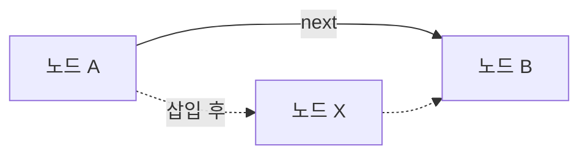
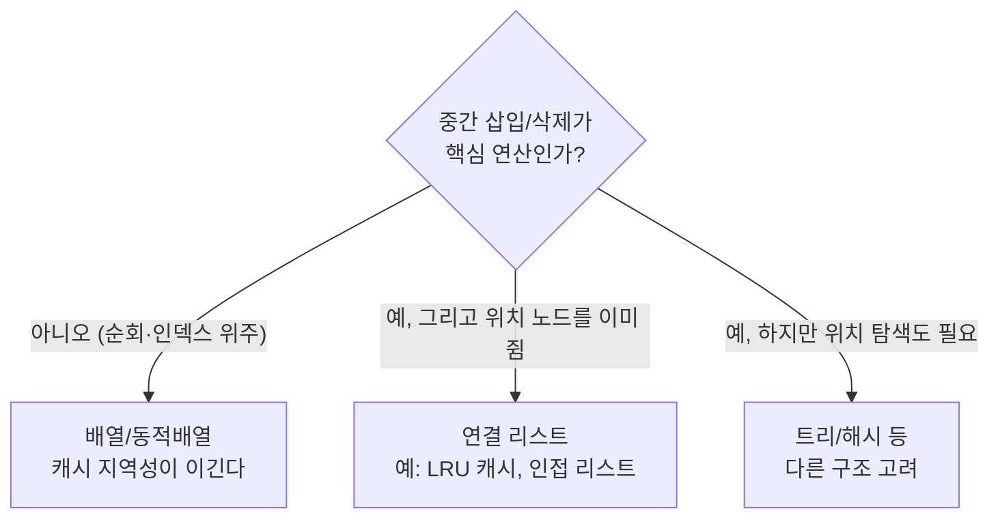

## 가장 기본인데, 가장 자주 잘못 고른다

배열과 연결 리스트는 모든 자료구조의 바닥입니다. 교과서는 "삽입/삭제가 잦으면 연결 리스트"라고 가르치지만, 실무에서 그대로 따랐다가 더 느려지는 일이 흔합니다. 이유는 [복잡도 분석]()에서 말한 **Big-O가 숨기는 상수** — 바로 **메모리 지역성(cache locality)** 때문입니다.

이 글은 두 구조를 연산별 복잡도뿐 아니라 **CPU 캐시 관점**까지 내려가 비교합니다. 같은 점근 등급에서 왜 한쪽이 수십 배 빠른지를 이해하면, 자료구조 선택이 달라집니다.

## 배열 — 연속된 메모리 한 덩어리

배열은 같은 크기의 원소가 메모리에 **빈틈없이 연속**으로 놓인 구조입니다. 그래서 `i`번째 원소 주소를 `base + i × elem_size`로 **계산만 하면** 바로 닿습니다 — 인덱스 접근이 **O(1)**.

이 연속성이 결정적인 이유는 CPU가 메모리를 **캐시 라인(보통 64바이트) 단위로 한 번에** 끌어오기 때문입니다. 배열 한 칸을 읽으면 그 옆 원소들이 공짜로 캐시에 따라옵니다. 순회할 때 CPU의 **prefetcher**가 다음 줄까지 미리 예측해 가져옵니다.

반면 연결 리스트는 노드가 메모리 여기저기 흩어져 있어, 다음 노드로 가려면 포인터가 가리키는 **예측 불가능한 주소로 점프**합니다 — 매번 캐시 미스. 아래에서 두 순회를 나란히 보세요.

<div class="arr2-cache" markdown="0">
<style>
.arr2-cache{margin:1.4rem 0;overflow-x:auto}
.arr2-cache svg{width:100%;max-width:700px;height:auto;display:block;margin:0 auto;font-family:inherit}
.arr2-cache .lbl{fill:currentColor;font-size:11px;font-weight:600}
.arr2-cache .sub{fill:currentColor;font-size:9.5px;opacity:.6}
.arr2-cache .cell{fill:none;stroke:currentColor;stroke-width:1.4;opacity:.5}
.arr2-cache .ptr{stroke:currentColor;opacity:.3;stroke-width:1.2;fill:none}
.arr2-cache .scan{fill:#2f9e44;opacity:.85}
.arr2-cache .jump{fill:#e8590c;opacity:.9}
.arr2-cache .line{fill:#1971c2;opacity:0;animation:arr2line 6s ease-in-out infinite}
@keyframes arr2line{0%{opacity:0}8%{opacity:.12}40%{opacity:.12}48%{opacity:0}100%{opacity:0}}
.arr2-cache .s{animation:arr2scan 6s ease-in-out infinite}
@keyframes arr2scan{0%{transform:translateX(0);opacity:0}6%{opacity:.85}44%{transform:translateX(330px);opacity:.85}50%{opacity:0}100%{opacity:0}}
.arr2-cache .j{animation:arr2jump 6s ease-in-out infinite}
@keyframes arr2jump{0%,50%{opacity:0}52%{transform:translate(0,0);opacity:.9}60%{transform:translate(250px,28px);opacity:.9}68%{transform:translate(70px,0);opacity:.9}76%{transform:translate(300px,32px);opacity:.9}84%{transform:translate(140px,4px);opacity:.9}92%{opacity:0}100%{opacity:0}}
</style>
<svg viewBox="0 0 700 230" role="img" aria-label="배열은 연속된 메모리를 순서대로 훑어 캐시에 함께 올라오고, 연결 리스트는 포인터를 따라 흩어진 주소로 점프하며 캐시 미스가 나는 순회 대비 애니메이션">
  <text class="sub" x="20" y="28">배열 순회 — 연속 메모리, 한 캐시 라인에 여럿</text>
  <rect class="line" x="40" y="40" width="170" height="34" rx="4"/>
  <rect class="cell" x="40"  y="40" width="40" height="34" rx="3"/>
  <rect class="cell" x="82"  y="40" width="40" height="34" rx="3"/>
  <rect class="cell" x="124" y="40" width="40" height="34" rx="3"/>
  <rect class="cell" x="166" y="40" width="40" height="34" rx="3"/>
  <rect class="cell" x="208" y="40" width="40" height="34" rx="3"/>
  <rect class="cell" x="250" y="40" width="40" height="34" rx="3"/>
  <rect class="cell" x="292" y="40" width="40" height="34" rx="3"/>
  <rect class="cell" x="334" y="40" width="40" height="34" rx="3"/>
  <rect class="scan s" x="44" y="44" width="32" height="26" rx="2"/>
  <text class="sub" x="400" y="60" fill="#2f9e44">예측 가능 · prefetch</text>
  <text class="sub" x="20" y="128">연결 리스트 순회 — 흩어진 노드, 포인터 추격</text>
  <rect class="cell" x="40"  y="140" width="40" height="34" rx="3"/>
  <rect class="cell" x="290" y="168" width="40" height="34" rx="3"/>
  <rect class="cell" x="110" y="140" width="40" height="34" rx="3"/>
  <rect class="cell" x="340" y="172" width="40" height="34" rx="3"/>
  <rect class="cell" x="180" y="144" width="40" height="34" rx="3"/>
  <path class="ptr" d="M80,157 C200,120 220,185 290,185"/>
  <path class="ptr" d="M330,185 C260,210 200,150 150,157"/>
  <path class="ptr" d="M150,157 C260,120 300,200 340,189"/>
  <rect class="jump j" x="44" y="144" width="32" height="26" rx="2"/>
  <text class="sub" x="430" y="160" fill="#e8590c">매번 캐시 미스</text>
</svg>
</div>

| 연산 | 배열 | 연결 리스트 |
|------|------|------------|
| 인덱스 접근 `a[i]` | **O(1)** | O(n) (앞에서부터 추적) |
| 값으로 탐색 | O(n) | O(n) |
| 맨 끝 삽입 | 분할상환 O(1) | O(1) (tail 보유 시) |
| **중간 삽입/삭제** | O(n) (뒤를 밀기) | **O(1)** (노드 보유 시) |
| 메모리 오버헤드 | 없음(값만) | 노드마다 포인터(들) |
| 캐시 지역성 | 매우 좋음 | 나쁨 |

## 동적 배열 — 크기를 모를 때

순수 배열은 크기가 고정입니다. `ArrayList`(Java)·`vector`(C++)·`list`(Python)는 내부에 배열을 두고, 꽉 차면 **2배 큰 배열로 옮겨 담는 동적 배열**입니다. 맨 끝 추가가 평균 **O(1)** 인 이유(2배 증가의 분할상환)는 [복잡도 편]()에서 다뤘습니다.

```java
// ArrayList 내부의 핵심 — 꽉 차면 1.5배로 늘려 복사
private Object[] grow(int minCapacity) {
    int oldCapacity = elementData.length;
    int newCapacity = oldCapacity + (oldCapacity >> 1); // ×1.5
    return elementData = Arrays.copyOf(elementData, newCapacity);
}
```

핵심은 **곱셈 증가**라는 점입니다. 매번 +1씩 늘리면 복사 총합이 $1+2+\dots+n = O(n^2)$로 망하지만, 1.5~2배로 늘리면 총 복사가 $O(n)$에 머물러 추가당 분할상환 O(1)이 됩니다.

## 중간 삽입은 왜 비싼가 — 밀어내기

배열 중간에 값을 끼우려면, 그 자리를 비우기 위해 **뒤의 원소를 전부 한 칸씩 밀어야** 합니다. 맨 앞에 넣으면 n개를 다 밀어 O(n). 아래가 그 "밀어내기"입니다.

<div class="arr2-shift" markdown="0">
<style>
.arr2-shift{margin:1.4rem 0;overflow-x:auto}
.arr2-shift svg{width:100%;max-width:620px;height:auto;display:block;margin:0 auto;font-family:inherit}
.arr2-shift .lbl{fill:currentColor;font-size:12px;font-weight:600}
.arr2-shift .sub{fill:currentColor;font-size:9.5px;opacity:.6}
.arr2-shift .cell{fill:none;stroke:currentColor;stroke-width:1.4;opacity:.5}
.arr2-shift .v{fill:currentColor;opacity:.8}
.arr2-shift .ins{fill:#2f9e44}
.arr2-shift .new{opacity:0;animation:arr2new 5s ease-in-out infinite}
@keyframes arr2new{0%,55%{opacity:0;transform:translateY(-22px)}68%{opacity:1;transform:translateY(0)}100%{opacity:1;transform:translateY(0)}}
.arr2-shift .m1{animation:arr2m 5s ease-in-out infinite}
.arr2-shift .m2{animation:arr2m 5s ease-in-out infinite}
.arr2-shift .m3{animation:arr2m 5s ease-in-out infinite}
@keyframes arr2m{0%,18%{transform:translateX(0)}45%,100%{transform:translateX(56px)}}
</style>
<svg viewBox="0 0 620 130" role="img" aria-label="배열 중간에 원소를 삽입하면 뒤쪽 원소들이 한 칸씩 오른쪽으로 밀려나 자리를 비우는 애니메이션">
  <text class="sub" x="20" y="30">index 1 위치에 삽입 → 뒤 원소들이 한 칸씩 밀림 (O(n))</text>
  <g>
    <rect class="cell" x="40"  y="44" width="52" height="44" rx="4"/>
    <text class="v lbl" x="66" y="72" text-anchor="middle">A</text>
  </g>
  <rect class="cell" x="96"  y="44" width="52" height="44" rx="4"/>
  <g class="m1"><rect class="cell" x="96"  y="44" width="52" height="44" rx="4"/><text class="v lbl" x="122" y="72" text-anchor="middle">B</text></g>
  <g class="m2"><rect class="cell" x="152" y="44" width="52" height="44" rx="4"/><text class="v lbl" x="178" y="72" text-anchor="middle">C</text></g>
  <g class="m3"><rect class="cell" x="208" y="44" width="52" height="44" rx="4"/><text class="v lbl" x="234" y="72" text-anchor="middle">D</text></g>
  <g class="new"><rect class="cell ins" x="96" y="44" width="52" height="44" rx="4" style="fill:#2f9e44;opacity:.85;stroke:none"/><text class="lbl" x="122" y="72" text-anchor="middle" fill="#fff">X</text></g>
</svg>
</div>

연결 리스트는 반대입니다. **삽입할 노드를 이미 손에 쥐고 있다면**, 앞뒤 포인터 두어 개만 고쳐 끼우면 끝 — O(1). 다만 "그 위치를 찾는" 비용이 O(n)이라, 실제로는 탐색 비용이 삽입 이득을 까먹는 경우가 많습니다.



## 그래서 무엇을 고르나



현대 하드웨어에서는 **순회·검색이 섞인 대부분의 워크로드에서 배열이 이깁니다**. 연결 리스트는 인덱스 추적이 O(n)인 데다 캐시 미스가 누적돼, "삽입 O(1)"의 이론적 이점이 실측에서 사라지기 일쑤입니다. 연결 리스트가 제값을 하는 곳은 **위치 노드를 이미 들고 있는** 경우 — LRU 캐시의 노드 이동, [그래프]()의 인접 리스트, 커널의 연결 구조 등입니다.

## 프로덕션에서 마주치는 함정

| 함정 | 증상 | 해법 |
|------|------|------|
| 큰 `List` 맨 앞에 잦은 `add(0, x)` | 매번 전체 밀기 → O(n²) | 끝에 추가 후 뒤집기, 또는 `ArrayDeque` |
| `LinkedList`에 `get(i)` 반복 | 인덱스 접근이 O(n) → 루프 전체 O(n²) | `ArrayList`로 교체, 또는 이터레이터 순회 |
| 초기 용량 미지정 | 재할당·복사 반복 | `new ArrayList<>(expectedSize)` |
| 원시값을 `List<Integer>`로 | 박싱·포인터로 캐시 파괴 | 원시 배열 `int[]` 사용 |
| 삭제 후에도 큰 배열 점유 | 메모리 누수성 점유 | `trimToSize()`/재생성 |

## 면접/리뷰 단골 질문

- **Q. 배열과 연결 리스트, 삽입이 잦으면 무조건 연결 리스트?** → 아니다. 위치를 "찾는" 비용이 O(n)이고 캐시 미스가 커서, 실측은 보통 배열이 빠르다. 노드를 이미 쥔 경우에만 연결 리스트가 유리.
- **Q. 동적 배열 추가가 O(1)인 핵심?** → 곱셈(2배) 증가의 분할상환. +1 증가면 O(n).
- **Q. 같은 O(n) 순회인데 속도 차이가 나는 이유?** → 캐시 지역성. 배열은 연속이라 캐시 라인·prefetch 이득, 연결 리스트는 포인터 점프마다 캐시 미스.
- **Q. `ArrayList`에서 중간 삭제가 O(n)인 이유?** → 빈자리를 메우려 뒤 원소를 앞으로 당겨야 해서.
- **Q. 메모리 오버헤드 차이?** → 배열은 값만, 연결 리스트는 노드마다 next(단방향)·prev(양방향) 포인터 추가.

## 정리

- 배열은 **연속 메모리** → 인덱스 O(1) + 캐시 지역성. 연결 리스트는 **포인터 추격** → 인덱스 O(n) + 캐시 미스.
- 동적 배열은 내부 배열을 **곱셈 증가**시켜 끝 추가를 분할상환 O(1)로 만든다.
- 중간 삽입/삭제는 배열이 O(n)(밀기), 연결 리스트는 노드를 쥐면 O(1)이나 탐색이 O(n).
- 현대 하드웨어에선 **의심스러우면 배열** — 연결 리스트는 "위치 노드 보유"가 보장될 때만.

> 다음 글은 이 배열·연결 리스트 위에 규칙을 얹은 [스택·큐·힙]()입니다. LIFO·FIFO·우선순위라는 접근 규칙이 어떻게 강력한 도구가 되는지 봅니다.
</content>
</invoke>
