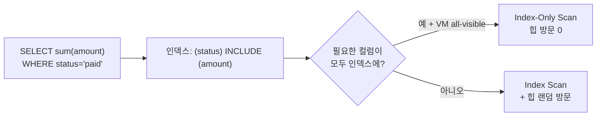
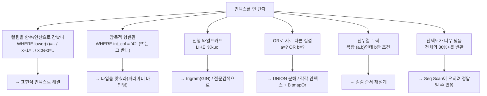

## "분명히 인덱스를 걸었는데, EXPLAIN을 보면 Seq Scan이에요"

운영 테이블에 인덱스를 정성껏 만들어 두고도, 막상 `EXPLAIN`을 까보면 `Seq Scan on orders`가 떡하니 찍혀 있는 경험. 인덱스를 안 만든 것도 아닌데 왜 안 탈까요? 혹은 인덱스를 타긴 타는데, 거대한 `Index Scan` 뒤에 `Filter`가 붙어 행의 99%를 버리고 있을 때도 있습니다.

대부분의 원인은 단순합니다. **인덱스가 처리할 수 있는 질의의 모양과, 실제로 날린 질의의 모양이 어긋났기 때문**입니다. [앞 글]()에서 B-Tree가 "정렬된 키 + 힙을 가리키는 ctid"라는 걸 봤습니다. 이 글은 그 한 줄 인덱스를 넘어, **복합 인덱스의 컬럼 순서**, **커버링/Index-Only Scan**, **부분·표현식 인덱스**, 그리고 **인덱스를 못 타는 전형적인 패턴**까지 — "왜 안 타는지"를 끝까지 따라갑니다.

## 복합 인덱스와 leftmost prefix — 사전(辭典)을 떠올려라

`CREATE INDEX ON orders (a, b, c)`로 만든 복합 인덱스는 `(a, b, c)`라는 **튜플을 사전순으로 정렬**해 B-Tree에 담습니다. 핵심은 정렬 기준이 "a를 먼저, 같으면 b를, 또 같으면 c를"이라는 점입니다. 영어 사전이 첫 글자로 먼저 묶고, 같은 첫 글자 안에서 둘째 글자로 묶는 것과 똑같습니다.

그래서 이 인덱스로 **효율적으로 좁힐 수 있는 질의의 모양**은 정해져 있습니다 — 이걸 **leftmost prefix(선두열) 규칙**이라 부릅니다.

| 질의 조건 | 인덱스 활용 | 이유 |
|---|---|---|
| `a = ?` | O (선두열만) | 선두에서 바로 범위 확정 |
| `a = ? AND b = ?` | O | a→b 순으로 정렬돼 있음 |
| `a = ? AND b = ? AND c = ?` | O (완전 활용) | 세 열 모두 정렬 키 |
| `a = ? AND c = ?` | △ (a로만 좁히고 c는 Filter) | b를 건너뛰어 c는 정렬되지 않음 |
| `b = ?` (a 조건 없음) | X (선두열 누락) | b만으로는 정렬돼 있지 않음 |
| `b = ? AND c = ?` | X | a가 없으면 진입점을 못 찾음 |

`b = ?`만으로 못 타는 이유는 직관적입니다. 사전에서 "둘째 글자가 e인 단어"를 찾으라고 하면, 첫 글자가 a든 z든 전부 흩어져 있어 결국 전체를 훑어야 합니다. 인덱스의 정렬은 **선두열부터 연속으로** 따라가야 의미가 있습니다.

아래 애니메이션은 같은 `(region, status, created_at)` 인덱스에서, **선두열 `region` 조건이 있을 때 vs 없을 때** 스캔해야 하는 범위가 어떻게 달라지는지를 보여줍니다.

<div class="idx-prefix" markdown="0">
<style>
.idx-prefix{margin:1.4rem 0;overflow-x:auto}
.idx-prefix svg{width:100%;max-width:720px;height:auto;display:block;margin:0 auto;font-family:inherit}
.idx-prefix .lbl{fill:currentColor;font-size:12px;font-weight:700}
.idx-prefix .sub{fill:currentColor;font-size:10px;opacity:.6}
.idx-prefix .cell{stroke:currentColor;stroke-width:1;opacity:.35;fill:none}
.idx-prefix .key{fill:currentColor;font-size:9.5px;opacity:.75}
.idx-prefix .scanA{fill:#2f9e44;opacity:0;animation:idxpA 6s ease-in-out infinite}
.idx-prefix .scanB{fill:#e03131;opacity:0;animation:idxpB 6s ease-in-out infinite}
.idx-prefix .ptrA{fill:#2f9e44;opacity:0;animation:idxpPtrA 6s ease-in-out infinite}
.idx-prefix .ptrB{fill:#e03131;opacity:0;animation:idxpPtrB 6s ease-in-out infinite}
@keyframes idxpA{0%,8%{opacity:0}18%,46%{opacity:.28}54%,100%{opacity:.28}}
@keyframes idxpB{0%,54%{opacity:0}64%,100%{opacity:.22}}
@keyframes idxpPtrA{0%,8%{opacity:0}18%,100%{opacity:1}}
@keyframes idxpPtrB{0%,54%{opacity:0}64%,100%{opacity:1}}
</style>
<svg viewBox="0 0 700 320" role="img" aria-label="복합 인덱스에서 선두열 region 조건이 있을 때는 좁은 범위만, 없을 때는 인덱스 전체를 스캔하게 되는 차이를 비교하는 애니메이션">
  <text class="lbl" x="20" y="24">인덱스 (region, status, created_at) — 사전순 정렬</text>
  <!-- index entries -->
  <g>
    <rect class="cell" x="20" y="40" width="660" height="26"/>
    <rect class="scanB" x="20" y="40" width="660" height="26"/>
    <rect class="scanA" x="180" y="40" width="200" height="26"/>
    <text class="key" x="30" y="57">(AP, paid, 01-02) (AP, paid, 03-01)</text>
    <text class="key" x="190" y="57">(KR, paid, 01-05) (KR, paid, 02-10) (KR, paid, 03-09)</text>
    <text class="key" x="540" y="57">(US, paid, 01-08) ...</text>
  </g>
  <rect class="ptrA" x="180" y="40" width="3" height="26"/>
  <rect class="ptrA" x="380" y="40" width="3" height="26"/>

  <!-- case A -->
  <text class="lbl" x="20" y="118" fill="#2f9e44">① region='KR' AND status='paid'  →  Index Scan</text>
  <text class="sub" x="20" y="138">선두열 region으로 진입점·종료점이 확정 → 초록 구간만 정확히 스캔</text>
  <rect class="scanA cell" x="180" y="152" width="200" height="18"/>
  <rect class="ptrA" x="180" y="148" width="200" height="3"/>
  <text class="sub" x="285" y="166" text-anchor="middle" fill="#2f9e44">읽는 범위: 좁음</text>

  <!-- case B -->
  <text class="lbl" x="20" y="220" fill="#e03131">② status='paid' (region 조건 없음)  →  사실상 전체 스캔</text>
  <text class="sub" x="20" y="240">선두열이 없어 paid가 AP·KR·US에 흩어짐 → 인덱스 전체(또는 Seq Scan)를 훑어야 함</text>
  <rect class="scanB cell" x="20" y="254" width="660" height="18"/>
  <rect class="ptrB" x="20" y="250" width="660" height="3"/>
  <text class="sub" x="350" y="268" text-anchor="middle" fill="#e03131">읽는 범위: 전체</text>
  <text class="sub" x="20" y="300">선두열 조건의 유무가 "한 구간 점프"와 "전체 순회"를 가른다.</text>
</svg>
</div>

### 컬럼 순서를 정하는 법: 등치는 앞, 범위는 뒤

복합 인덱스에서 또 하나 자주 틀리는 게 **범위 조건의 위치**입니다. B-Tree는 선두열부터 **등치(`=`)로 좁히는 동안에만** 다음 열의 정렬을 활용할 수 있습니다. 한 번 **범위(`<`, `>`, `BETWEEN`, `LIKE 'x%'`)** 조건이 등장하면, 그 뒤의 열은 더 이상 인덱스 정렬로 좁히지 못하고 Filter로만 처리됩니다.

```sql
-- 자주 날리는 질의: 특정 사용자의 최근 주문
SELECT * FROM orders
WHERE user_id = 42 AND created_at >= '2023-04-01'
ORDER BY created_at;

-- GOOD: 등치(user_id) 먼저, 범위(created_at) 나중
CREATE INDEX ON orders (user_id, created_at);

-- BAD: 범위가 앞에 오면 user_id를 정렬로 못 좁힌다
CREATE INDEX ON orders (created_at, user_id);
```

`(user_id, created_at)`이면 `user_id = 42`로 한 구간을 잡고, 그 구간 안에서 `created_at`이 이미 정렬돼 있으니 범위 스캔 + `ORDER BY` 정렬 생략까지 공짜로 얻습니다. 반대 순서는 `created_at`으로 넓은 시간대를 훑으며 `user_id`를 매 행 Filter해야 합니다. **원칙: 등치 비교 컬럼을 앞쪽에, 범위/정렬 컬럼을 맨 뒤에.** 카디널리티(선택도)가 높은 컬럼을 앞에 두라는 흔한 조언은 등치끼리일 때만 맞는 단순화입니다 — 진짜 기준은 질의의 조건 모양입니다([선택도와 통계]()).

## 커버링 인덱스와 Index-Only Scan — 힙을 안 읽는다

일반적인 인덱스 스캔은 두 단계입니다. ① 인덱스에서 조건에 맞는 엔트리(key + ctid)를 찾고, ② 그 `ctid`로 **힙(heap)을 한 번 더 방문**해 실제 행을 읽습니다([페이지·힙·로우]()). 이 ② 단계가 랜덤 I/O를 유발하는 진짜 비용입니다.

그런데 질의가 **필요로 하는 모든 컬럼이 인덱스 안에 이미 들어 있다면**, 힙을 방문할 필요가 없습니다. 인덱스만 읽고 답을 낼 수 있죠. 이것이 **Index-Only Scan**이고, 그렇게 만든 인덱스를 **커버링 인덱스**라 부릅니다.

```sql
-- 이 질의는 status로 좁히고, amount만 합산한다
SELECT sum(amount) FROM orders WHERE status = 'paid';

-- 방법 1: 그냥 다 키로
CREATE INDEX ON orders (status, amount);

-- 방법 2: INCLUDE — amount는 정렬 키가 아니라 리프에 '얹기'만
CREATE INDEX ON orders (status) INCLUDE (amount);
```

`INCLUDE`는 PostgreSQL 11+의 기능입니다. `amount`를 정렬 키로 쓰지 않을 거라면(범위·정렬에 안 쓴다면) `INCLUDE`로 리프 노드에만 페이로드로 얹는 게 낫습니다. 정렬 키가 아니니 내부 노드를 부풀리지 않아 트리가 더 얕고, 비교 연산도 가볍습니다.



### 함정: Index-Only Scan은 그냥 안 된다 — visibility map

여기서 PostgreSQL MVCC의 함정이 하나 있습니다. 인덱스 엔트리에는 **그 튜플이 현재 트랜잭션에게 보이는지(visibility)** 정보가 없습니다. 가시성은 힙 튜플의 `xmin/xmax`에 있죠([MVCC 내부]()). 그래서 원칙적으로는 가시성 확인 때문에 힙을 봐야 합니다.

이걸 우회하려고 PostgreSQL은 **visibility map(VM)** 을 둡니다 — 각 힙 페이지가 "모든 트랜잭션에게 보이는(all-visible)" 상태인지를 비트로 표시한 맵입니다. 어떤 인덱스 엔트리가 가리키는 페이지가 VM에서 all-visible이면, 힙을 안 봐도 안전하다고 보장되어 **Index-Only Scan**이 성립합니다.

문제는 VM을 갱신하는 게 **VACUUM**이라는 점입니다. 방금 대량 INSERT/UPDATE한 테이블은 VM이 비어 있어, 커버링 인덱스를 만들어도 `EXPLAIN`에 `Heap Fetches:`가 잔뜩 찍히며 사실상 일반 Index Scan처럼 동작합니다([VACUUM/freeze]()). 진단·해결은 이렇습니다.

```sql
-- Heap Fetches가 0에 가까워야 진짜 Index-Only Scan
EXPLAIN (ANALYZE, BUFFERS)
SELECT sum(amount) FROM orders WHERE status = 'paid';
--   ->  Index Only Scan ...  Heap Fetches: 124003   ← VM이 비었다는 신호

VACUUM (ANALYZE) orders;   -- VM 갱신 → 이후 Heap Fetches 급감
```

## 부분 인덱스 — 필요한 행만 색인한다

테이블의 일부 행만 자주 조회한다면, **부분 인덱스(partial index)** 로 인덱스 자체를 작게 만들 수 있습니다. `WHERE` 절을 붙여 조건을 만족하는 행만 색인합니다.

```sql
-- 미처리 주문만 조회하는 워커 큐 패턴
SELECT * FROM orders WHERE status = 'pending' ORDER BY created_at;

-- 전체의 1%만 차지하는 pending 행만 색인 → 인덱스가 100배 작아짐
CREATE INDEX ON orders (created_at) WHERE status = 'pending';
```

`pending`이 전체의 1%라면, 부분 인덱스는 1/100 크기라 더 캐시에 잘 맞고, 갱신 비용도 적습니다(주문이 `paid`로 바뀌면 인덱스에서 빠집니다). 단, 플래너가 부분 인덱스를 쓰려면 **질의의 `WHERE`가 인덱스의 술어(predicate)를 함의(imply)** 해야 합니다 — 즉 질의에 `status = 'pending'`이 명시돼야 합니다. `UNIQUE` 부분 인덱스로 "활성 행만 유일" 같은 제약도 만들 수 있습니다(`CREATE UNIQUE INDEX ON u (email) WHERE deleted_at IS NULL`).

## 표현식 인덱스 — 함수 결과에 색인한다

`WHERE lower(email) = 'a@b.com'` 같이 컬럼을 **함수로 감싸면** 일반 인덱스는 못 탑니다(뒤에서 설명). 이럴 땐 **표현식 인덱스(expression index)** 로 그 함수의 결과 자체를 색인합니다.

```sql
-- 대소문자 무시 로그인 조회
CREATE INDEX ON users (lower(email));
SELECT * FROM users WHERE lower(email) = 'kuo@example.com';  -- 이제 인덱스 탄다

-- jsonb 키 추출, 날짜 절단 등도 동일 패턴
CREATE INDEX ON events ((payload->>'type'));
CREATE INDEX ON logs (date_trunc('day', created_at));
```

표현식 인덱스는 INSERT/UPDATE 때마다 그 표현식을 계산해 저장하므로 약간의 쓰기 비용이 있고, **질의에 쓴 표현식이 인덱스 정의와 정확히 일치**해야 합니다. 통계도 표현식 단위로 따로 수집됩니다(`ANALYZE` 후 `pg_statistic`).

## 인덱스를 못 타는 전형 — 이 패턴들을 외워라

이제 처음 질문으로 돌아갑니다. 인덱스가 멀쩡한데 `Seq Scan`이 찍히거나 `Index Scan + Filter`로 비효율이 나는 전형들입니다. 정적 분류는 아래 다이어그램으로, 진단은 항상 `EXPLAIN (ANALYZE, BUFFERS)`로([EXPLAIN 읽기]()).



핵심만 짚으면.

- **함수/연산으로 감싼 컬럼**: `WHERE lower(email) = ...`, `WHERE created_at + interval '1d' > now()`, `WHERE amount * 1.1 > 100`. 인덱스는 `email` 원본 값으로 정렬돼 있는데, 질의는 `lower(email)` 값을 찾으니 진입점을 못 잡습니다. → 표현식 인덱스, 또는 가능하면 상수 쪽으로 연산을 옮겨 컬럼을 벌거벗기기(`created_at > now() - interval '1d'`).
- **암묵적 형변환**: `WHERE int_col = '42'`처럼 타입이 안 맞으면 PostgreSQL이 한쪽을 캐스팅하는데, 컬럼 쪽이 캐스팅되면(`int_col::text` 꼴) 위의 "함수로 감싼" 경우가 됩니다. 특히 `varchar` 컬럼에 숫자 리터럴, `bigint` 컬럼에 `text` 파라미터에서 자주 터집니다. → 파라미터 타입을 컬럼에 맞춰 바인딩.
- **선행 와일드카드**: `LIKE '%kuo'` / `LIKE '%kuo%'`. B-Tree는 접두사부터 비교하니 앞이 와일드카드면 진입점이 없습니다(`LIKE 'kuo%'`는 OK). → trigram GIN 인덱스나 전문검색으로([다음 글]()).
- **OR로 서로 다른 컬럼**: `WHERE a = 1 OR b = 2`는 단일 인덱스로 한 번에 못 좁힙니다. → 각 컬럼에 인덱스를 두면 플래너가 **BitmapOr**로 두 인덱스 결과를 합치거나, `UNION`으로 분해하는 게 낫습니다.
- **낮은 선택도**: 전체의 30~50% 이상을 반환하는 질의는, 인덱스로 랜덤 I/O를 잔뜩 하느니 그냥 순차로 다 읽는 `Seq Scan`이 **실제로 더 빠릅니다**. 플래너가 통계 기반 cost로 그렇게 판단한 것이니, 이건 버그가 아니라 정상입니다([카디널리티 추정]()).

## 면접/리뷰 단골 질문

- **Q. 복합 인덱스 `(a, b, c)`에 `WHERE b = ?`만 있으면 왜 못 타나?** → 인덱스는 a→b→c 사전순 정렬이라, a를 고정하지 않으면 b 값이 전 구간에 흩어진다. 선두열(leftmost prefix)이 빠지면 진입점을 못 잡는다.
- **Q. 복합 인덱스 컬럼 순서는 어떻게 정하나?** → 등치(`=`) 조건 컬럼을 앞에, 범위/정렬 컬럼을 맨 뒤에. 범위 조건이 등장하는 순간 그 뒤 컬럼은 정렬로 못 좁히고 Filter가 된다.
- **Q. 커버링 인덱스와 `INCLUDE`의 차이는?** → 둘 다 Index-Only Scan을 노린다. 키에 넣으면 정렬·범위에도 쓰지만 내부 노드를 부풀린다. `INCLUDE`는 리프에만 페이로드로 얹어, 정렬에 안 쓰는 반환 전용 컬럼에 적합하다.
- **Q. 커버링 인덱스를 만들었는데 Index-Only Scan이 안 됩니다.** → visibility map이 안 채워졌을 가능성. `EXPLAIN`의 `Heap Fetches`가 크면 VM이 비었다는 뜻 → `VACUUM`으로 갱신. all-visible 페이지여야 힙 방문을 생략한다.
- **Q. `WHERE lower(email) = ?`가 인덱스를 못 타는 이유와 해결은?** → 인덱스는 `email` 원본 정렬, 질의는 `lower(email)` 값을 찾아 진입점 불일치. `CREATE INDEX ON users (lower(email))` 표현식 인덱스로 해결.
- **Q. 인덱스가 있는데 플래너가 Seq Scan을 골랐다. 버그인가?** → 보통 정상. 반환 행이 많으면(낮은 선택도) 인덱스 랜덤 I/O보다 순차 스캔이 싸다고 cost가 판단한 것. 통계가 stale하면 오판할 수 있으니 `ANALYZE` 먼저 확인.

## 정리

- **leftmost prefix**: 복합 인덱스 `(a,b,c)`는 선두열부터 연속으로 따라가야 효율적. `a`, `a,b`, `a,b,c`는 OK, `b`만은 X.
- **컬럼 순서**: 등치 컬럼을 앞, 범위·정렬 컬럼을 뒤. 범위 조건 뒤 컬럼은 Filter로 전락한다.
- **커버링/Index-Only Scan**: 필요한 컬럼이 인덱스에 다 있으면 힙을 안 읽는다. `INCLUDE`로 반환 전용 컬럼을 얹되, visibility map(VACUUM)이 채워져야 실제로 동작한다.
- **부분·표현식 인덱스**: 자주 쓰는 일부 행만(`WHERE`), 또는 함수 결과(`lower()`, `->>`)에 색인해 작고 정확한 인덱스를 만든다.
- **못 타는 전형**: 함수로 감싼 컬럼, 암묵적 형변환, 선행 와일드카드, OR, 선두열 누락, 낮은 선택도. 진단은 항상 `EXPLAIN (ANALYZE, BUFFERS)`.

> 다음 글: B-Tree로는 안 되는 문제들 — 배열·jsonb·전문검색·공간·시계열을 위한 [Hash·GIN·GiST·BRIN 인덱스 지도]()로 넘어갑니다.
