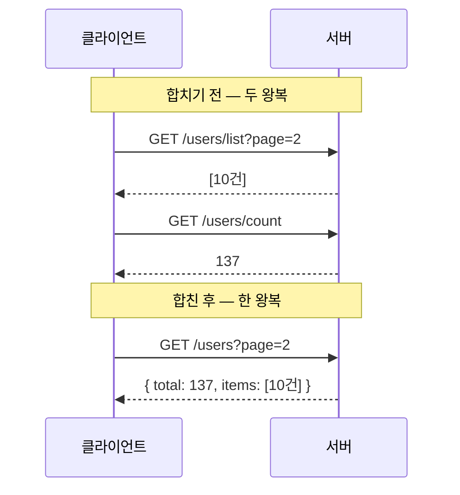

운영 목록 화면을 만들다 보면 거의 모든 화면이 두 가지를 동시에 원한다. "이번 페이지의 데이터 목록"과 "전체 몇 건인지". 처음에는 이걸 서로 다른 두 API로 만들기 쉽다. `/users/list`로 행을 가져오고, `/users/count`로 총건수를 가져온다. 동작은 한다. 그런데 화면이 깜빡이고, 페이지를 넘길 때마다 어딘가 미묘하게 어긋난다. 핵심은 **두 번의 왕복을 한 번으로 합치는 것**이다.

## 왜 두 번의 왕복이 문제인가

브라우저에서 서버까지의 왕복(round-trip)은 공짜가 아니다. 같은 서버라도 한 번의 HTTP 요청에는 DNS·TCP·TLS는 재사용한다 쳐도, 큐잉·직렬화·서버 핸들러 진입·DB 커넥션 획득이 매번 따라붙는다. 리스트와 카운트를 따로 부르면 이 고정 비용이 두 배가 된다.

더 큰 문제는 **일관성**이다. 두 요청 사이에 누군가 데이터를 추가하면, 리스트는 10건인데 카운트는 11건을 가리키는 상태가 생긴다. 페이저가 "1/3 페이지"를 그리려는 순간 총건수가 흔들리면 마지막 페이지 계산이 어긋난다. 두 요청이 별도의 트랜잭션 스냅샷을 보기 때문이다.

화면 입장에서도 두 응답의 도착 순서가 보장되지 않는다. 리스트가 먼저 와서 그려지고, 카운트가 뒤늦게 와서 페이저가 다시 그려지면 사용자 눈에는 깜빡임으로 보인다.



## 한 응답에 담기

서버는 한 엔드포인트에서 리스트와 카운트를 함께 계산해 하나의 객체로 돌려준다.

```java
public class PageResult<T> {
    private long total;        // 전체 건수
    private int page;
    private int size;
    private List<T> items;     // 현재 페이지 데이터
    // getters/setters
}

@GetMapping("/users")
public PageResult<UserDto> list(UserSearch search) {
    long total = userMapper.countBySearch(search);
    List<UserDto> items =
        total == 0 ? List.of() : userMapper.findBySearch(search);
    return new PageResult<>(total, search.getPage(), search.getSize(), items);
}
```

클라이언트는 한 번만 부른다.

```javascript
const res = await fetch(`/users?page=${page}&size=${size}`);
const { total, items } = await res.json();
renderRows(items);
renderPager(total, page, size);  // 같은 응답 → 어긋날 일 없다
```

리스트 쿼리와 카운트 쿼리는 여전히 SQL 두 방이지만, **하나의 요청·하나의 트랜잭션** 안에서 실행되므로 같은 스냅샷을 본다. 왕복은 한 번, 일관성은 보장.

## 카운트를 같이 둘 것인가, 미룰 것인가

리스트와 카운트를 한 응답에 담더라도 **카운트 쿼리를 매번 돌릴지**는 별개 결정이다. `COUNT(*)`는 조건이 복잡하고 데이터가 많으면 리스트 쿼리만큼, 때로는 더 비싸다.

- **항상 같이 계산**: 정확한 페이저가 필요한 일반 운영 화면. 가장 단순하고 안전한 기본값.
- **카운트 생략·근사**: 무한 스크롤이나 "다음 페이지 있음" 정도만 필요한 화면이라면, `size+1`건을 조회해 한 건 더 오면 다음 페이지가 있다고 판단한다. 카운트 쿼리 자체를 없앤다.
- **카운트 캐시**: 총건수가 자주 안 바뀌면 짧게 캐시하고 리스트만 매번 조회한다.

```sql
-- 다음 페이지 유무만 필요할 때: COUNT 없이 size+1 조회
SELECT * FROM users
WHERE status = #{status}
ORDER BY id DESC
LIMIT #{size} + 1;   -- 결과가 size+1이면 다음 페이지 존재
```

## 운영 함정

**함정 1 — total=0인데 리스트 쿼리를 돌린다.** 검색 결과가 0건일 때 카운트만으로 끝낼 수 있는데 습관적으로 리스트 쿼리까지 실행하면 불필요한 왕복(DB 기준)이다. 위 예시처럼 `total == 0`이면 리스트 쿼리를 건너뛴다.

**함정 2 — 합쳤다고 병렬을 포기한다.** 카운트와 리스트를 굳이 순차로 둘 이유는 없다. 둘이 독립적이면 별도 커넥션으로 병렬 실행해 둘 중 느린 쪽 시간만 쓰게 할 수 있다. 단, 커넥션 풀과 트랜잭션 경계를 정확히 이해하고 적용해야 한다. 잘 모르면 순차가 안전하다.

## 핵심 요약

- 두 번의 왕복은 고정 비용 두 배 + 두 스냅샷 사이의 불일치 + 화면 깜빡임을 부른다.
- 리스트와 카운트를 한 엔드포인트·한 트랜잭션에서 계산해 `{ total, items }` 한 객체로 돌려라.
- 정확한 페이저가 필요 없으면 `size+1` 기법으로 카운트 쿼리 자체를 없애는 것이 더 빠르다.

> **면접 한 줄**: "목록 API에서 총건수는 어떻게 주나요?" → "정확한 페이저가 필요하면 리스트와 카운트를 한 트랜잭션에서 계산해 한 응답으로 묶어 왕복과 불일치를 없애고, '다음 페이지' 정도만 필요하면 `size+1` 조회로 카운트를 생략합니다."
