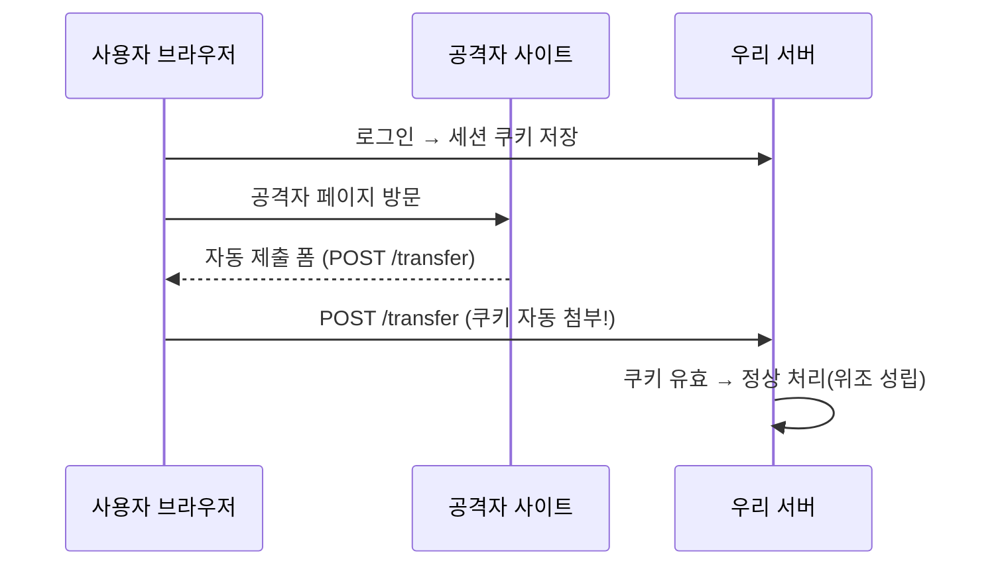

이번 주는 상태를 바꾸는 폼(등록·수정·삭제)을 다뤘다. 여기서 빠질 수 없는 게 **CSRF(Cross-Site Request Forgery)** 방어다. 읽기 화면과 달리 상태 변경은 위조되면 실제 피해가 난다.

## CSRF가 성립하는 이유

핵심은 **브라우저가 쿠키를 자동으로 보낸다**는 점이다. 사용자가 우리 사이트에 로그인하면 세션 쿠키가 브라우저에 저장된다. 그 후 사용자가 공격자가 만든 페이지를 방문하면, 그 페이지가 우리 사이트로 요청을 날리도록 만들 수 있다 — 그리고 브라우저는 **목적지가 우리 도메인이면 세션 쿠키를 알아서 첨부**한다. 요청을 누가 시작했는지(어느 사이트에서 출발했는지)는 따지지 않기 때문이다.



서버는 유효한 세션 쿠키를 봤으니 정상 요청으로 처리한다. 사용자는 클릭 한 번 안 했는데 송금·삭제가 일어난다. 인증은 통과했지만 **"이 요청을 정말 우리 화면에서 시작했는가"를 확인하지 않은 것**이 구멍이다.

## 동기화 토큰 패턴

방어의 원리는 단순하다. **공격자가 알 수 없는 비밀값을 요청마다 요구**한다. 쿠키는 자동 첨부되지만, 페이지 본문에 심긴 토큰은 다른 출처(cross-origin)에서 읽을 수 없다(동일 출처 정책). 그래서:

1. 서버가 폼을 내려줄 때 세션과 묶인 랜덤 토큰을 hidden 필드에 심는다.
2. 폼 제출 시 그 토큰이 함께 온다.
3. 서버는 세션에 저장된 토큰과 일치하는지 검증한다.

공격자 페이지는 우리 폼의 토큰값을 읽을 방법이 없으므로(동일 출처 정책이 응답 본문 읽기를 차단) 유효한 토큰을 위조할 수 없다.

```html
<form method="post" action="/orders">
  <input type="hidden" name="_csrf" value="a1b2c3d4-..."/>
  <button type="submit">주문</button>
</form>
```

```java
public void verifyCsrf(HttpSession session, String submitted) {
    String expected = (String) session.getAttribute("CSRF_TOKEN");
    if (expected == null || !expected.equals(submitted)) {
        throw new ForbiddenException("CSRF token mismatch");
    }
}
```

## SameSite 쿠키 — 브라우저 레벨 방어

토큰이 애플리케이션 레벨 방어라면, **SameSite 쿠키 속성**은 브라우저가 거드는 방어다. `SameSite=Lax`면 다른 사이트에서 시작된 요청에는 쿠키를 첨부하지 않는다(단, 최상위 GET 네비게이션은 예외). `Strict`면 그조차 막는다. 즉 CSRF의 전제인 "쿠키 자동 첨부" 자체를 끊는다.

```
Set-Cookie: SESSION=...; HttpOnly; Secure; SameSite=Lax
```

`Lax`가 현대 브라우저 기본값이라 상황이 많이 나아졌지만, 구형 브라우저나 일부 시나리오에서 빈틈이 있으므로 토큰 방어와 **병행**하는 게 정석이다. 방어는 한 겹에 의존하지 않는다.

## 운영 함정

- **GET으로 상태를 바꾸지 마라.** SameSite=Lax는 top-level GET을 통과시키므로 `GET /delete?id=1` 같은 설계는 그 자체로 위험하다. 상태 변경은 반드시 POST/PUT/DELETE로.
- **토큰을 쿠키에만 담고 끝내면(Double Submit) 서브도메인 쿠키 주입 등으로 우회될 수 있다.** 세션 저장 토큰과 대조하거나, 토큰을 HMAC으로 서명해 위조를 검증한다.

## 핵심 요약

- CSRF는 인증의 실패가 아니라 **"요청 출처 미확인"**의 실패다.
- 동기화 토큰(공격자가 못 읽는 비밀) + SameSite 쿠키(쿠키 자동첨부 차단)를 **함께** 쓴다.
- 상태 변경은 절대 GET으로 노출하지 않는다.
