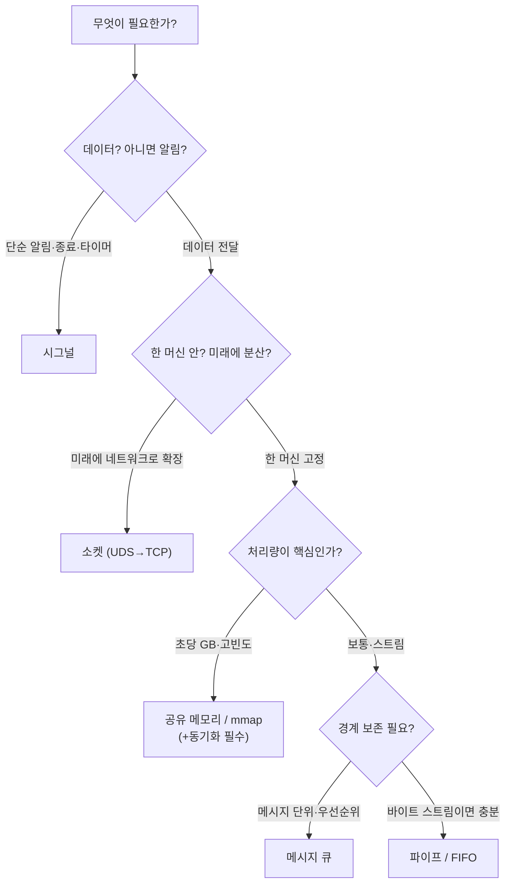

## "벽을 세워놨더니, 이제 대화를 못 한다"

운영체제는 프로세스마다 **독립된 주소 공간**을 줍니다. A 프로세스의 포인터 `0x7fff...`와 B 프로세스의 같은 주소는 전혀 다른 물리 메모리를 가리킵니다. 이 벽 덕분에 한 프로세스의 버그가 옆 프로세스를 못 건드리죠 — 보호의 핵심입니다.

그런데 현실의 프로그램은 **협력**해야 합니다. 셸의 `ps aux | grep nginx`는 `ps`의 출력이 `grep`의 입력으로 흘러가야 하고, 웹 서버는 워커 프로세스끼리 캐시를 공유해야 합니다. 벽을 세워 격리해 놓고, 그 벽에 **정해진 창구**를 뚫는 것 — 그게 프로세스 간 통신(IPC)입니다.

그래서 IPC의 본질은 언제나 같은 긴장입니다: **격리는 유지하면서, 어떻게 안전하고 빠르게 데이터를 건네줄 것인가.** 이 글은 파이프·시그널·메시지 큐·공유 메모리·소켓을 하나씩 비교하되, "API 목록"이 아니라 **각 방식이 복사 비용과 동기화 부담을 어디에 두는가**라는 한 축으로 꿰뚫습니다.

## 두 개의 축: "어떻게 건네나"와 "언제 건네나"

모든 IPC 메커니즘은 두 질문에 대한 서로 다른 답입니다.

- **데이터 전달 방식** — *복사 기반*(메시지가 커널을 거쳐 양쪽에 따로 존재)이냐, *공유 기반*(같은 물리 메모리를 양쪽이 직접 보느냐).
- **동기화 방식** — 보내는 쪽과 받는 쪽의 박자를 어떻게 맞추나. 받을 데이터가 없으면 블로킹? 버퍼가 차면 블로킹? 신호 한 번 툭 던지고 끝?

이 두 축으로 보면 난해해 보이던 API들이 한 줄에 정렬됩니다.

| 방식 | 전달 | 속도 | 동기화 | 방향/범위 | 대표 용도 |
|---|---|---|---|---|---|
| **파이프 / FIFO** | 복사(커널 버퍼) | 보통 | 블로킹 내장 | 단방향 스트림 | 셸 파이프라인, 부모-자식 |
| **시그널** | 거의 없음(번호만) | 빠름 | 비동기 인터럽트 | 알림 | 종료·타이머·자식 종료 통지 |
| **메시지 큐** | 복사(커널) | 보통 | 경계 보존·우선순위 | 다대다 메시지 | 작업 큐, 이벤트 |
| **공유 메모리** | **복사 없음** | **가장 빠름** | **직접 해야 함** | 영역 공유 | 대용량·고빈도 데이터 |
| **소켓(UDS)** | 복사(커널) | 보통 | 블로킹/논블로킹 | 양방향, 머신 간 확장 | 서비스 간 통신 |
| **mmap 파일** | 복사 없음(페이지캐시 공유) | 빠름 | 직접 해야 함 | 파일 매개 공유 | DB·로그·대용량 파일 |

핵심 직관 하나만 미리: **빠를수록 위험합니다.** 공유 메모리는 복사가 없어 가장 빠르지만, 커널이 박자를 맞춰주지 않으니 동기화를 직접 책임져야 합니다(→ [8편 동기화]). 파이프는 느린 대신 커널이 블로킹·백프레셔를 알아서 해줍니다.

## 파이프: 커널 버퍼 위의 단방향 스트림

가장 친숙한 IPC. `ps | grep`의 `|`가 바로 익명 파이프입니다. 커널 안에 **고정 크기 링 버퍼**(리눅스 기본 64KB)를 만들고, 한쪽 끝(write end)에 쓰면 다른 쪽 끝(read end)에서 읽힙니다. 단방향이고, 바이트 스트림이라 메시지 경계가 없습니다.

여기서 IPC의 동기화가 처음 등장합니다. 아래에서 Writer가 바이트를 커널 버퍼에 채워 넣고 Reader가 빼 갑니다. 생산이 소비보다 빠르면 **버퍼가 가득 차고, 그 순간 Writer는 블로킹**됩니다 — 커널이 강제로 속도를 맞추는 **백프레셔(backpressure)**입니다. 반대로 버퍼가 비면 Reader가 블로킹됩니다.

<div class="os-pipe" markdown="0">
<style>
.os-pipe{margin:1.4rem 0;overflow-x:auto}
.os-pipe svg{width:100%;max-width:720px;height:auto;display:block;margin:0 auto;font-family:inherit}
.os-pipe .bx{fill:none;stroke:currentColor;stroke-width:1.5;opacity:.5}
.os-pipe .lbl{fill:currentColor;font-size:12px;font-weight:600}
.os-pipe .sub{fill:currentColor;font-size:10px;opacity:.6}
.os-pipe .bufbg{fill:currentColor;opacity:.05;stroke:currentColor;stroke-width:1.4}
.os-pipe .slot{fill:none;stroke:currentColor;stroke-width:1;opacity:.3}
.os-pipe .fill{fill:#1971c2}
.os-pipe .s1{animation:opipes1 6s linear infinite}
.os-pipe .s2{animation:opipes2 6s linear infinite}
.os-pipe .s3{animation:opipes3 6s linear infinite}
.os-pipe .s4{animation:opipes4 6s linear infinite}
.os-pipe .s5{animation:opipes5 6s linear infinite}
@keyframes opipes1{0%,7%{opacity:0}9%,61%{opacity:.85}63%,100%{opacity:0}}
@keyframes opipes2{0%,15%{opacity:0}17%,69%{opacity:.85}71%,100%{opacity:0}}
@keyframes opipes3{0%,23%{opacity:0}25%,77%{opacity:.85}79%,100%{opacity:0}}
@keyframes opipes4{0%,31%{opacity:0}33%,85%{opacity:.85}87%,100%{opacity:0}}
@keyframes opipes5{0%,39%{opacity:0}41%,93%{opacity:.85}95%,100%{opacity:0}}
.os-pipe .inb{fill:#1971c2;animation:opipein 6s linear infinite}
@keyframes opipein{0%{transform:translateX(0);opacity:0}2%{opacity:1}38%{transform:translateX(132px);opacity:1}41%{opacity:0}100%{opacity:0}}
.os-pipe .outb{fill:#2f9e44;animation:opipeout 6s linear infinite}
@keyframes opipeout{0%,58%{opacity:0}60%{transform:translateX(0);opacity:1}94%{transform:translateX(140px);opacity:1}100%{opacity:0}}
.os-pipe .block{fill:#e03131;opacity:0;animation:opipeblock 6s linear infinite}
.os-pipe .blocktx{fill:#e03131;font-size:11px;font-weight:700;opacity:0;animation:opipeblock 6s linear infinite}
@keyframes opipeblock{0%,40%{opacity:0}44%,54%{opacity:1}58%,100%{opacity:0}}
.os-pipe .wbox{stroke:#1971c2}.os-pipe .rbox{stroke:#2f9e44}
</style>
<svg viewBox="0 0 720 220" role="img" aria-label="Writer가 커널 파이프 버퍼를 채우고 Reader가 빼 가며, 버퍼가 가득 차면 Writer가 블로킹되는 백프레셔 애니메이션">
  <rect class="bx wbox" x="20" y="80" width="120" height="60" rx="8"/>
  <text class="lbl" x="80" y="106" text-anchor="middle">Writer</text>
  <text class="sub" x="80" y="124" text-anchor="middle">write(fd, ...)</text>
  <rect class="block" x="20" y="80" width="120" height="60" rx="8" fill="#e03131" style="opacity:0"/>
  <text class="blocktx" x="80" y="70" text-anchor="middle">⛔ BLOCKED (버퍼 가득)</text>

  <rect class="bufbg" x="250" y="78" width="220" height="64" rx="8"/>
  <text class="lbl" x="360" y="64" text-anchor="middle">커널 파이프 버퍼 (고정 크기·64KB)</text>
  <g>
    <rect class="slot" x="262" y="92" width="36" height="36" rx="3"/><rect class="fill s1" x="265" y="95" width="30" height="30" rx="2"/>
    <rect class="slot" x="302" y="92" width="36" height="36" rx="3"/><rect class="fill s2" x="305" y="95" width="30" height="30" rx="2"/>
    <rect class="slot" x="342" y="92" width="36" height="36" rx="3"/><rect class="fill s3" x="345" y="95" width="30" height="30" rx="2"/>
    <rect class="slot" x="382" y="92" width="36" height="36" rx="3"/><rect class="fill s4" x="385" y="95" width="30" height="30" rx="2"/>
    <rect class="slot" x="422" y="92" width="36" height="36" rx="3"/><rect class="fill s5" x="425" y="95" width="30" height="30" rx="2"/>
  </g>

  <rect class="bx rbox" x="580" y="80" width="120" height="60" rx="8"/>
  <text class="lbl" x="640" y="106" text-anchor="middle">Reader</text>
  <text class="sub" x="640" y="124" text-anchor="middle">read(fd, ...)</text>

  <rect class="inb" x="146" y="103" width="16" height="14" rx="2"/>
  <rect class="outb" x="472" y="103" width="16" height="14" rx="2"/>
  <text class="sub" x="360" y="170" text-anchor="middle">채움 → 가득 차면 Writer 블로킹 → Reader가 빼 가면 다시 진행 (백프레셔)</text>
</svg>
</div>

파이프에서 꼭 기억할 두 가지. **(1) 양쪽 다 블로킹될 수 있다** — 이게 동기화를 *공짜로* 얻는 이유입니다. 생산-소비 속도를 커널이 맞춰줍니다. **(2) 읽는 쪽이 모두 닫힌 파이프에 쓰면 `SIGPIPE`** 가 날아옵니다(기본 동작은 프로세스 종료). `yes | head` 가 깔끔히 끝나는 것도 이 메커니즘 덕입니다. 익명 파이프는 부모-자식처럼 **fd를 물려받는 관계**에서만 쓰고, 무관한 프로세스끼리는 이름 있는 **named pipe(FIFO, `mkfifo`)**를 씁니다.

```c
int fd[2];
pipe(fd);                 // fd[0]=읽기, fd[1]=쓰기
if (fork() == 0) {        // 자식: 표준입력을 파이프 읽기 끝으로
    dup2(fd[0], STDIN_FILENO);
    close(fd[1]);
    execlp("grep", "grep", "nginx", NULL);
}
// 부모: 표준출력을 파이프 쓰기 끝으로 → 이게 셸의 `… | grep nginx`
dup2(fd[1], STDOUT_FILENO);
close(fd[0]);
```

## 시그널: 데이터가 아니라 "알림"

시그널은 IPC 중에서도 특이합니다. **데이터를 거의 안 나릅니다** — 보내는 건 번호 하나(`SIGTERM`=15, `SIGKILL`=9 …). 비동기적으로 프로세스의 정상 흐름을 **인터럽트**해 등록된 핸들러로 점프시키죠. "끝낼 시간이야"(SIGTERM), "자식이 죽었어"(SIGCHLD), "타이머 만료"(SIGALRM) 같은 **알림**에 적합합니다.

> **현실 체크 — "시그널 핸들러 안에서는 거의 아무것도 하면 안 된다."** 핸들러는 프로그램이 *임의의 지점*에서 멈춘 채 끼어듭니다. 그 순간 `malloc`이 내부 락을 쥔 상태였다면, 핸들러에서 또 `malloc`을 부르는 순간 **데드락**입니다(`printf`도 내부적으로 위험). 그래서 핸들러에서 부를 수 있는 함수는 **async-signal-safe** 목록(`write`, `_exit` 등)으로 한정됩니다. 실무 정석은 **self-pipe trick** 또는 `signalfd`/`eventfd`: 핸들러에선 파이프에 1바이트만 `write` 하고, 진짜 처리는 메인 이벤트 루프에서 합니다.

```bash
kill -l           # 시그널 번호↔이름 전체 목록
kill -TERM 1234   # 정중히 종료 요청(핸들러가 가로채 정리 가능)
kill -9 1234      # SIGKILL — 가로챌 수 없음, 커널이 즉시 회수
```

## 메시지 큐: 경계가 보존되는 복사

파이프가 바이트 스트림(경계 없음)이라면, 메시지 큐는 **메시지 단위**로 넣고 뺍니다. "100바이트 메시지 3개"를 넣으면 정확히 그 3개로 나옵니다 — 수신 측에서 직접 파싱해 경계를 복원할 필요가 없죠. POSIX `mq_*`는 **우선순위**도 지원해, 급한 메시지를 먼저 빼낼 수 있습니다. 다만 전달 시 커널 버퍼로 한 번 복사됩니다.

## 공유 메모리: 복사를 없애면 속도가 폭발한다 (그리고 위험도)

지금까지 본 파이프·메시지 큐는 모두 **데이터가 커널을 거칩니다**: 보내는 프로세스의 버퍼 → 커널 → 받는 프로세스의 버퍼. 즉 **복사가 2번**입니다. 작은 데이터면 무시할 만하지만, 초당 수 GB를 주고받는다면 이 복사가 곧 병목입니다.

공유 메모리는 발상을 뒤집습니다. 같은 물리 페이지를 **두 프로세스의 주소 공간에 동시에 매핑**해, 한쪽이 쓴 걸 다른 쪽이 **그 자리에서 즉시** 봅니다. 커널을 거치지 않으니 **복사가 0번** — IPC 중 가장 빠릅니다.

아래에서 위쪽(메시지 전달)은 데이터가 커널을 경유하며 복사가 두 번 일어나고, 아래쪽(공유 메모리)은 A가 쓴 값을 B가 **같은 페이지에서** 곧장 읽습니다.

<div class="os-shm" markdown="0">
<style>
.os-shm{margin:1.4rem 0;overflow-x:auto}
.os-shm svg{width:100%;max-width:720px;height:auto;display:block;margin:0 auto;font-family:inherit}
.os-shm .bx{fill:none;stroke:currentColor;stroke-width:1.5;opacity:.55}
.os-shm .lbl{fill:currentColor;font-size:12px;font-weight:600}
.os-shm .sub{fill:currentColor;font-size:10px;opacity:.6}
.os-shm .kbuf{fill:currentColor;opacity:.06;stroke:currentColor;stroke-width:1.3}
.os-shm .page{fill:#2f9e44;opacity:.12;stroke:#2f9e44;stroke-width:1.6}
.os-shm .c1{fill:#1971c2;animation:oshmc1 5s ease-in-out infinite}
@keyframes oshmc1{0%{transform:translateX(0);opacity:0}5%{opacity:1}40%{transform:translateX(150px);opacity:1}46%{opacity:0}100%{opacity:0}}
.os-shm .c2{fill:#f08c00;animation:oshmc2 5s ease-in-out infinite}
@keyframes oshmc2{0%,46%{opacity:0}50%{transform:translateX(0);opacity:1}88%{transform:translateX(150px);opacity:1}94%{opacity:0}100%{opacity:0}}
.os-shm .wtok{fill:#1971c2;opacity:0;animation:oshmw 5s ease-in-out infinite}
@keyframes oshmw{0%,10%{opacity:0}22%{opacity:.95}100%{opacity:.95}}
.os-shm .readhi{stroke:#f08c00;stroke-width:2.4;fill:none;opacity:0;animation:oshmr 5s ease-in-out infinite}
@keyframes oshmr{0%,55%{opacity:0}62%{opacity:1}80%{opacity:1}86%{opacity:0}100%{opacity:0}}
.os-shm .arr{stroke:currentColor;opacity:.3;stroke-width:1.3;fill:none}
</style>
<svg viewBox="0 0 720 320" role="img" aria-label="메시지 전달은 커널을 거쳐 복사가 2번, 공유 메모리는 같은 물리 페이지를 직접 읽어 복사가 0번임을 대비하는 애니메이션">
  <text class="lbl" x="20" y="22">① 메시지 전달 — 커널 경유, 복사 2회</text>
  <rect class="bx" x="20" y="36" width="120" height="52" rx="8" style="stroke:#1971c2"/>
  <text class="sub" x="80" y="66" text-anchor="middle">Process A</text>
  <rect class="kbuf" x="300" y="36" width="120" height="52" rx="8"/>
  <text class="sub" x="360" y="60" text-anchor="middle">커널 버퍼</text>
  <rect class="bx" x="580" y="36" width="120" height="52" rx="8" style="stroke:#f08c00"/>
  <text class="sub" x="640" y="66" text-anchor="middle">Process B</text>
  <line class="arr" x1="142" y1="62" x2="298" y2="62"/>
  <line class="arr" x1="422" y1="62" x2="578" y2="62"/>
  <rect class="c1" x="146" y="55" width="16" height="14" rx="2"/>
  <rect class="c2" x="426" y="55" width="16" height="14" rx="2"/>
  <text class="sub" x="220" y="50" text-anchor="middle">복사 1</text>
  <text class="sub" x="500" y="50" text-anchor="middle">복사 2</text>

  <text class="lbl" x="20" y="172">② 공유 메모리 — 같은 물리 페이지, 복사 0회</text>
  <rect class="bx" x="20" y="200" width="120" height="60" rx="8" style="stroke:#1971c2"/>
  <text class="sub" x="80" y="226" text-anchor="middle">Process A</text>
  <text class="sub" x="80" y="244" text-anchor="middle">write</text>
  <rect class="bx" x="580" y="200" width="120" height="60" rx="8" style="stroke:#f08c00"/>
  <text class="sub" x="640" y="226" text-anchor="middle">Process B</text>
  <text class="sub" x="640" y="244" text-anchor="middle">read</text>
  <rect class="page" x="300" y="196" width="120" height="68" rx="8"/>
  <text class="sub" x="360" y="190" text-anchor="middle">공유 물리 페이지</text>
  <rect class="wtok" x="330" y="216" width="60" height="28" rx="3" fill="#1971c2"/>
  <text class="sub" x="360" y="234" text-anchor="middle" fill="#fff" style="opacity:.95">data</text>
  <rect class="readhi" x="304" y="200" width="112" height="60" rx="6"/>
  <line class="arr" x1="142" y1="230" x2="298" y2="230"/>
  <line class="arr" x1="422" y1="230" x2="578" y2="230"/>
  <text class="sub" x="360" y="292" text-anchor="middle">A가 쓴 값을 B가 같은 자리에서 즉시 읽음 — 커널 경유 없음</text>
</svg>
</div>

공짜 점심은 없습니다. 커널이 박자를 안 맞춰주니, **"A가 다 썼는지" "B가 읽는 중에 A가 덮어쓰진 않는지"를 직접 보장**해야 합니다. 두 프로세스가 같은 메모리를 동시에 만지는 순간 [8편의 경쟁 상태(race condition)]가 그대로 발생합니다. 그래서 공유 메모리는 **항상 세마포어·뮤텍스 같은 동기화 도구와 짝**으로 씁니다. "가장 빠르지만 가장 손이 많이 가는" IPC인 이유입니다.

```c
// POSIX 공유 메모리 (shm_open + mmap)
int fd = shm_open("/myseg", O_CREAT | O_RDWR, 0600);
ftruncate(fd, 4096);
void *p = mmap(NULL, 4096, PROT_READ | PROT_WRITE, MAP_SHARED, fd, 0);
// 이제 p는 두 프로세스가 공유하는 메모리. 읽고 쓰면 즉시 반영.
// ※ 동기화는 별도! (예: 같은 영역에 pthread_mutex(PTHREAD_PROCESS_SHARED) 배치)
```

## 소켓과 mmap 파일: 확장성과 파일 매개 공유

**Unix 도메인 소켓(UDS)**은 소켓 API(`socket`/`bind`/`connect`)를 그대로 쓰되 한 머신 안에서만 도는 IPC입니다. TCP 루프백(`127.0.0.1`)보다 빠르고(체크섬·혼잡제어 같은 TCP/IP 스택 오버헤드가 없음), 양방향이며, **fd를 메시지로 건네는**(`SCM_RIGHTS`) 특수 능력까지 있습니다. 가장 큰 장점은 *코드를 거의 안 바꾸고* 나중에 네트워크 소켓으로 확장된다는 것 — Docker·systemd·DB 클라이언트가 UDS를 즐겨 쓰는 이유입니다. 무관한 두 프로세스를 빠르게 양방향 연결하려면 `socketpair()`가 편합니다.

**mmap 파일**은 공유 메모리의 사촌입니다. 같은 파일을 두 프로세스가 `MAP_SHARED`로 매핑하면, 둘 다 **같은 페이지 캐시 페이지**를 보게 되어 사실상 공유 메모리가 됩니다(게다가 디스크에 영속). 대용량 데이터·DB·로그 공유의 토대입니다([18편 페이지 캐시]에서 다시 만납니다).

## 무엇을 언제 쓰나 — 결정 가이드



```bash
ipcs -a            # 현재 시스템의 공유메모리·세마포어·메시지큐 현황
lsof -U            # 열려 있는 Unix 도메인 소켓
cat /proc/sys/fs/pipe-max-size   # 파이프 버퍼 최대 크기
```

## 면접/리뷰 단골 질문

- **Q. 파이프와 공유 메모리의 근본 차이는?** → 파이프는 커널 버퍼를 거치는 **복사 기반**이라 동기화(블로킹·백프레셔)를 커널이 공짜로 제공. 공유 메모리는 **복사 없는** 직접 공유라 가장 빠르지만 동기화를 직접 책임져야 한다.
- **Q. 공유 메모리가 가장 빠른데 왜 항상 안 쓰나?** → 동기화를 직접 해야 하고(경쟁 상태 위험), 정리·생명주기 관리가 번거롭다. 작은/스트림 데이터엔 파이프·소켓이 훨씬 안전하고 충분하다.
- **Q. 시그널 핸들러에서 하면 안 되는 것은?** → async-signal-safe 하지 않은 함수 호출(`malloc`/`printf` 등) — 재진입 데드락. 핸들러에선 플래그 세팅이나 self-pipe write만, 실제 처리는 메인 루프에서.
- **Q. Unix 도메인 소켓 vs TCP 루프백?** → UDS가 더 빠르다(TCP/IP 스택·체크섬·혼잡제어 생략). fd 전달 가능. 단, 같은 머신 한정 — 분산 확장이 필요하면 TCP.
- **Q. SIGKILL과 SIGTERM의 차이?** → TERM은 프로세스가 가로채 정리 후 종료 가능(graceful). KILL(9)은 가로챌 수 없고 커널이 즉시 회수 — 정리 코드도 안 돈다.

## 정리

- IPC의 본질은 **격리(보호)를 지키면서 협력시키기**. 모든 메커니즘은 *전달 방식(복사 vs 공유)* 과 *동기화 방식* 두 축의 조합이다.
- **파이프/FIFO**: 커널 버퍼 위 단방향 스트림. 블로킹·백프레셔를 공짜로 제공. SIGPIPE 주의.
- **시그널**: 데이터가 아닌 비동기 알림. 핸들러는 async-signal-safe만 — self-pipe로 메인 루프에 위임.
- **공유 메모리/mmap**: 복사 0회로 가장 빠름. 대신 동기화는 내 책임 → [8편]과 한 묶음.
- **소켓(UDS)**: 양방향·fd 전달, 코드 변경 없이 네트워크로 확장. **메시지 큐**: 경계 보존·우선순위.
- 고르는 기준: 알림이면 시그널, 분산 확장이면 소켓, 처리량이면 공유 메모리, 그 외엔 파이프.

> 다음 글: 공유 메모리를 안전하게 쓰려면 반드시 필요한 것 — 여러 실행 흐름이 같은 데이터를 만질 때 터지는 경쟁 상태와 그것을 막는 락을 [동기화 1: race condition과 락]()에서 끝까지 팝니다.
