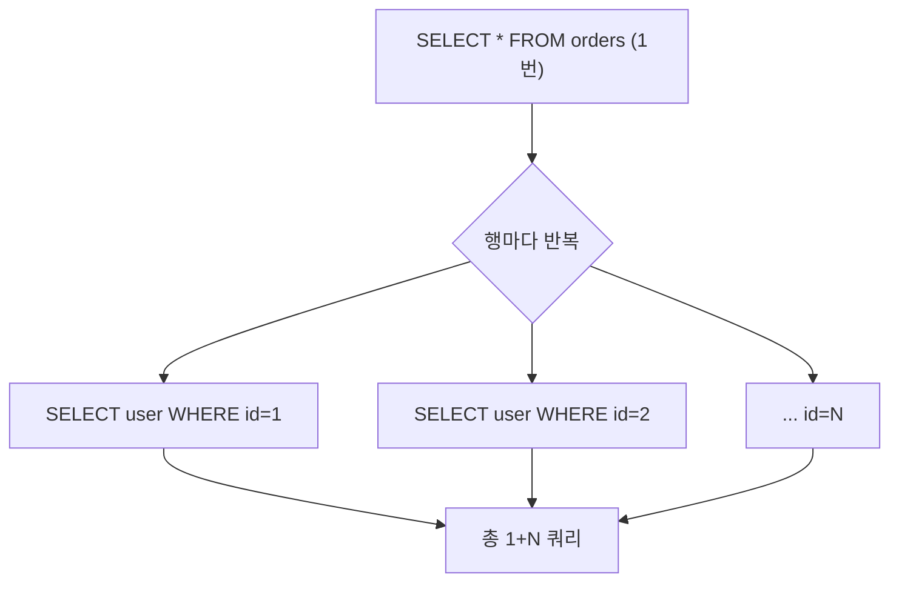

이번 주는 목록 화면의 응답 속도를 손봤다. 데이터 100건인데 화면이 느리다면, 십중팔구 범인은 **N+1 쿼리**다.

## N+1이 생기는 이유

목록을 가져오는 쿼리 1번(`SELECT * FROM orders`)으로 N개 주문을 얻는다. 그런데 각 주문마다 고객 이름을 보여줘야 해서, 행을 그리는 루프 안에서 `SELECT * FROM users WHERE id = ?`를 N번 더 날린다. 합쳐서 **1 + N번**. 이게 N+1이다.



무서운 건 **개발 환경에서 안 보인다**는 점이다. 데이터 10건이면 11번 쿼리, 로컬 DB라 1ms씩. 체감이 안 된다. 운영에서 1000건·네트워크 왕복 2ms가 되면 2초가 그냥 사라진다. 쿼리 한 번의 비용이 SQL 실행 시간보다 **왕복 지연(round-trip)**에 지배되기 때문에, 쿼리 횟수 자체가 성능을 결정한다.

## 탐지 — 쿼리 횟수를 세라

N+1은 "느리다"가 아니라 "쿼리가 많다"로 잡는다. 핵심 지표는 **요청당 쿼리 수**다.

- SQL 로깅을 켜고(MyBatis라면 매퍼 로그 DEBUG) 한 요청에서 같은 형태의 쿼리가 반복되는지 본다.
- p6spy 같은 도구로 쿼리 횟수·시간을 집계한다.
- 통합 테스트에서 "이 엔드포인트는 쿼리 N번 이하"를 단언하는 회귀 테스트를 둔다.

목록 길이에 비례해 쿼리 수가 늘면 확정이다.

## 해결 1 — 조인으로 한 번에

연관 데이터가 1:1이거나 1:N이라도 행이 적으면 조인이 가장 단순하다.

```sql
SELECT o.id, o.amount, u.name AS user_name
FROM orders o
JOIN users u ON u.id = o.user_id;   -- 쿼리 1번
```

MyBatis라면 `<resultMap>`의 `<association>`/`<collection>`으로 조인 결과를 객체 그래프에 매핑한다.

## 해결 2 — IN 배치 (2번 쿼리)

1:N에서 자식 행이 많으면 조인은 부모 행이 자식 수만큼 뻥튀기되는 카티전 곱 문제가 있다. 이때는 **부모를 먼저 가져오고, 모은 부모 ID로 자식을 IN 한 방에** 가져온 뒤 메모리에서 묶는다. 1+N이 **2번**으로 줄어든다.

```java
List<Order> orders = orderMapper.findPage(cond);          // 1번
List<Long> userIds = orders.stream()
        .map(Order::getUserId).distinct().toList();
Map<Long, User> users = userMapper.findByIds(userIds)     // 1번 (IN)
        .stream().collect(toMap(User::getId, u -> u));
orders.forEach(o -> o.setUser(users.get(o.getUserId())));
```

```sql
SELECT id, name FROM users WHERE id IN (1, 7, 12, ...);
```

## 운영 함정

- **IN 절 파라미터 폭발**: ID가 수만 개면 IN 절이 비대해지고 일부 DB는 파라미터 개수 한계에 걸린다. 1000개 단위로 청크 분할한다.
- **조인 페이징의 행 증식**: 1:N을 조인하고 `LIMIT`을 걸면 자식 행 기준으로 잘려 부모 개수가 틀어진다. 페이징은 부모 기준으로 먼저 하고 자식은 IN으로 채운다.
- **ORM의 지연 로딩**이 N+1의 단골 원인이다. 목록에서 쓸 연관은 명시적으로 한 번에 가져온다.

## 면접 한 줄 Q&A

- **Q. N+1을 왜 로컬에선 못 잡나?** A. 데이터가 적고 왕복 지연이 없어 체감되지 않는다. 쿼리 횟수로 탐지해야 한다.
- **Q. 조인과 IN 배치 중 뭘 쓰나?** A. 1:1·소량은 조인, 1:N 대량은 행 증식을 피하려 부모/자식 분리 후 IN 배치다.
