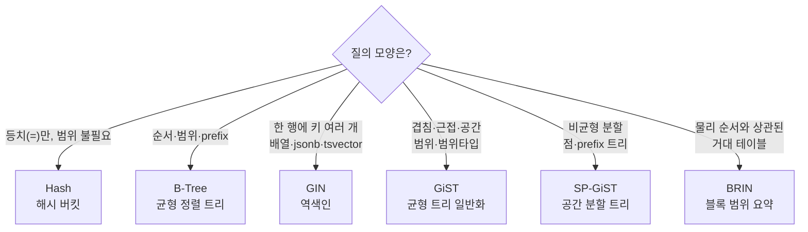
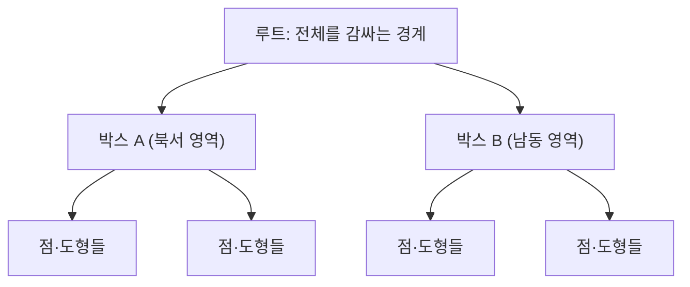

## "B-Tree를 걸었는데 왜 못 타지?"

배열 컬럼 `tags`에 `WHERE tags @> '{postgres}'`를 날리면, 멀쩡히 인덱스를 걸어둬도 `Seq Scan`이 뜹니다. `jsonb` 안의 키를 찾을 때도, 전문 검색 `to_tsvector @@ to_tsquery`를 쓸 때도, 위경도로 "반경 1km 안 가게"를 찾을 때도 마찬가지입니다. [앞 글]()에서 본 복합·커버링·부분 인덱스는 전부 **B-Tree** 위의 기법이었습니다. 그런데 위 질의들은 B-Tree로는 애초에 표현이 안 됩니다.

B-Tree가 잘하는 건 **전순서(total order) 위의 등치·범위·prefix**입니다. "한 행 = 한 키 = 트리의 한 자리"라는 전제가 깔려 있죠. 하지만 배열은 한 행에 키가 여러 개고, 공간 좌표는 1차원 순서로 줄 세울 수 없고, 거대한 append-only 로그는 인덱스 자체가 테이블만큼 커집니다. PostgreSQL이 B-Tree 말고도 **Hash·GIN·GiST·SP-GiST·BRIN**을 갖춘 이유가 이것입니다. 이 글은 각 인덱스가 **어떤 자료구조이고, 어떤 모양의 문제를 풀려고** 태어났는지를 따라갑니다.

## 한 장으로 보는 인덱스 지도

PostgreSQL의 인덱스 접근 방법(access method, `pg_am`)은 "키와 행의 관계가 어떤 모양인가"로 갈립니다.



핵심 직관 한 줄씩 먼저 깔아두겠습니다.

- **B-Tree**: 키를 "줄 세울 수 있을 때". 한 행 → 한 키.
- **Hash**: 줄 세울 필요 없이 "같다/다르다"만. 등치 전용.
- **GIN**: 한 행이 **여러 키**를 가질 때. "키 → 그 키를 가진 행 목록"의 역색인.
- **GiST**: 키를 줄 세울 수 없지만 **포함/겹침**으로 트리를 만들 수 있을 때(공간·범위·근접).
- **SP-GiST**: GiST의 사촌. 공간을 **불균형하게 분할**하는 트리(quadtree·radix).
- **BRIN**: 인덱스가 행을 가리키지 않고 **블록 묶음의 min/max만** 요약. 거대·정렬된 데이터에 초경량.

## Hash — 등치 하나만, 대신 작고 빠르게

B-Tree로도 등치(`=`)는 됩니다. 그런데 왜 Hash가 따로 있을까요? B-Tree는 키를 정렬해 저장하느라 키 전체를 트리 노드에 담습니다. Hash 인덱스는 키의 **해시값(4바이트 정수)**만 버킷에 담아, 긴 문자열·UUID처럼 키가 큰 경우 인덱스 크기가 작고 등치 조회가 O(1)에 가깝습니다.

```sql
CREATE INDEX ON sessions USING hash (session_token);
SELECT * FROM sessions WHERE session_token = 'a1b2...';  -- 등치만
```

다만 한계가 분명합니다. 범위(`<`, `BETWEEN`)·정렬·`ORDER BY`·prefix(`LIKE 'x%'`)는 **전혀** 못 합니다. 해시는 순서를 깨버리니까요. 또 PostgreSQL에서 Hash 인덱스는 **10 버전부터** WAL을 타서 크래시·복제에 안전해졌습니다(그 전엔 권장되지 않았던 흑역사). 그래도 현실에서는 "등치 전용 + 키가 매우 큼 + 인덱스 용량이 중요"가 아니면 그냥 B-Tree를 씁니다. B-Tree도 등치를 잘하고 범위·정렬까지 덤으로 주니까요.

## GIN — 한 행에 키가 여러 개일 때 (역색인)

GIN(Generalized Inverted iNdex)은 검색엔진의 그 **역색인(inverted index)**입니다. B-Tree가 "행 → 키"라면, GIN은 뒤집어서 **"키 → 그 키를 포함한 행들(ctid 목록)"**을 저장합니다. 그래서 "한 행이 여러 키를 가지는" 데이터에 맞습니다.

- 전문 검색 `tsvector`: 한 문서에 단어(lexeme)가 수백 개 → 각 단어가 키.
- 배열 `int[]`, `text[]`: 한 행에 원소가 여러 개 → 각 원소가 키.
- `jsonb`: 한 문서에 키·값이 여러 개.

구조는 두 층입니다. **(1)** 키들을 모은 **엔트리 트리**(B-Tree처럼 정렬된 키 디렉터리), **(2)** 각 키 아래에 그 키를 가진 행들의 **posting list**(ctid 묶음). 행 수가 적으면 posting list, 많아지면 압축된 **posting tree**로 바뀝니다. 한 단어가 100만 문서에 나와도 ctid를 압축해 담을 수 있는 이유입니다.

```sql
-- 전문 검색: 본문에서 'index'와 'postgres'를 모두 포함
CREATE INDEX docs_fts ON docs USING gin (to_tsvector('english', body));
SELECT * FROM docs
 WHERE to_tsvector('english', body) @@ to_tsquery('english', 'index & postgres');

-- 배열 포함: tags가 {postgres, index}를 포함
CREATE INDEX posts_tags ON posts USING gin (tags);
SELECT * FROM posts WHERE tags @> '{postgres,index}';

-- jsonb: 특정 키 존재/값 매칭 (jsonb_path_ops로 더 작게)
CREATE INDEX ev_data ON events USING gin (data jsonb_path_ops);
SELECT * FROM events WHERE data @> '{"level":"error"}';
```

GIN의 비용은 **쓰기**입니다. 한 행을 넣을 때 그 행이 가진 모든 키 엔트리를 갱신해야 하니까요. PostgreSQL은 이를 완화하려고 **fastupdate** + `gin_pending_list_limit`라는 보류 목록(pending list)을 둡니다. 신규 엔트리를 일단 비정렬 목록에 쌓아두고, 목록이 차거나 VACUUM 때 본 인덱스로 한꺼번에 병합합니다. 대신 보류 목록이 크면 **읽기 질의가 그 목록까지 순차로 훑어야** 해서 검색이 느려지는 함정이 있습니다. 검색이 갑자기 느려지면 `gin_pending_list_limit`와 보류 목록 크기를 의심하세요.

> **현실 체크 — GIN vs RUM.** GIN은 매칭 여부는 알아도 "랭킹 점수"나 단어 위치 같은 추가 정보는 인덱스에 안 담습니다. 그래서 `ORDER BY ts_rank(...)`는 인덱스가 거른 뒤 힙을 다시 읽어 정렬해야 합니다. 위치·랭킹까지 인덱스에 넣고 싶으면 확장 인덱스 `RUM`을 쓰지만, 쓰기·용량 비용이 더 큽니다.

## GiST — 줄 세울 수 없는 것을 트리로 (공간·범위·근접)

위경도 좌표는 1차원으로 정렬할 수 없습니다. `(37.5, 127.0)`이 `(35.1, 129.0)`보다 "크다"는 게 성립하지 않으니까요. GiST(Generalized Search Tree)는 이 문제를 **"키를 직접 비교하지 말고, 자식 전체를 감싸는 경계(bounding box)로 비교하자"**로 풉니다. 각 내부 노드는 자식들을 모두 포함하는 경계를 들고 있고, 검색은 질의 영역과 겹치는 가지만 따라 내려갑니다. 공간 인덱스의 **R-Tree**가 GiST 위에서 구현되는 이유입니다.



GiST가 강한 질의:

- **공간(PostGIS)**: `geometry && box`, `ST_DWithin(geom, p, 1000)` — 반경·겹침·포함.
- **범위 타입**: `tsrange`, `int4range`의 겹침 `&&`. 예약 시스템에서 "겹치는 예약 금지"를 `EXCLUDE USING gist`로 강제.
- **최근접(KNN)**: `ORDER BY geom <-> point LIMIT 5` — 거리순 상위 N을 트리를 타며 바로.

```sql
CREATE INDEX places_geo ON places USING gist (geom);
SELECT * FROM places
 WHERE ST_DWithin(geom, ST_Point(127.0, 37.5)::geography, 1000);

-- 회의실 시간대 겹침 금지(범위 + 배타 제약)
ALTER TABLE bookings
  ADD CONSTRAINT no_overlap
  EXCLUDE USING gist (room WITH =, during WITH &&);
```

GiST는 **손실(lossy)**일 수 있습니다. 경계 박스로 거르므로 "겹칠 가능성 있는 후보"를 뱉고, 정확한 판정은 힙의 실제 도형으로 다시 합니다(recheck). 그래서 EXPLAIN에 `Rows Removed by Index Recheck`가 보이면 정상입니다. 또 GiST는 균형 트리지만 삽입 순서·분할 전략에 따라 품질이 갈려, 대량 적재 후 `REINDEX`가 도움이 될 때가 있습니다.

## SP-GiST — 공간을 불균형하게 쪼개는 트리

GiST가 "겹침을 허용하는 균형 트리"라면, SP-GiST(Space-Partitioned GiST)는 **공간을 겹치지 않게, 그러나 불균형하게** 분할하는 트리들을 위한 틀입니다. quadtree(2D를 4분면으로), k-d tree, radix(prefix) 트리가 여기 올라갑니다. 데이터가 한쪽에 몰린 점 집합이나, 공통 접두사를 공유하는 문자열(IP, URL, 전화번호)에 유리합니다.

```sql
-- 점 데이터(quadtree), 텍스트 prefix(radix)
CREATE INDEX pts_sp ON points USING spgist (location);
CREATE INDEX ips_sp ON access_log USING spgist (client_ip inet_ops);
SELECT * FROM access_log WHERE client_ip << '10.0.0.0/8';  -- 서브넷 포함
```

실무 빈도는 GiST보다 낮지만, "점이 불균등하게 분포" 또는 "접두사 기반 검색"이라는 조건에서 GiST보다 작고 빠를 수 있다는 카드로 기억해두면 됩니다.

## BRIN — 인덱스가 행을 안 가리킨다 (블록 범위 요약)

지금까지의 인덱스는 모두 "키 → 행(ctid)"을 가리켰습니다. 그래서 **인덱스가 테이블만큼 커지는** 게 정상이죠. BRIN(Block Range INdex)은 발상을 뒤집습니다. **개별 행이 아니라, 연속된 블록 묶음(기본 128페이지=1MB) 단위로 그 안의 min/max 같은 요약만** 저장합니다.

[4편의 페이지·힙]()을 떠올리면, 거대한 로그·시계열 테이블은 보통 **시간 순으로 append**됩니다. 즉 물리적으로 앞 블록엔 옛날 데이터, 뒤 블록엔 최신 데이터가 모입니다(통계의 `correlation`이 1에 가까움). 이때 BRIN은 "블록 0~127은 created_at이 1월, 128~255는 2월…" 같은 요약만 들고 있다가, `WHERE created_at >= '3월'`이면 **3월 범위와 겹치는 블록 묶음만** 읽고 나머지는 통째로 건너뜁니다.

```sql
CREATE INDEX log_brin ON logs USING brin (created_at) WITH (pages_per_range = 128);
SELECT * FROM logs WHERE created_at >= '2026-03-01' AND created_at < '2026-04-01';
```

장점은 압도적인 **용량**입니다. 10억 행 테이블에 B-Tree는 수십 GB지만, BRIN은 블록 묶음당 한 줄이라 **메가바이트 단위**로 끝납니다. 대신 정밀도는 낮아서, 후보 블록을 다 읽은 뒤 행을 일일이 recheck합니다. 결정적으로 **물리 순서와 키가 상관(correlation)이 높아야** 효과가 납니다. 무작위로 흩어진 컬럼에 걸면 모든 블록 범위의 min/max가 전 구간을 덮어, 결국 전체를 읽게 됩니다(BRIN의 가장 흔한 오용). 적재 순서가 흐트러졌다면 `brin_summarize_new_values()` 또는 `CLUSTER`로 물리 정렬을 회복시키세요.

## 같은 질의, 다르게 좁히는 세 인덱스 (애니메이션)

같은 "찾기"라도 인덱스마다 좁히는 방식이 다릅니다. 아래는 **전문 검색(GIN)·공간 반경(GiST)·시간 범위(BRIN)**가 후보를 어떻게 추려내는지를 나란히 보여줍니다. GIN은 키에서 행 목록으로 점프하고, GiST는 겹치는 가지만 따라 내려가며, BRIN은 겹치는 블록 묶음만 통과시킵니다.

<div class="idx-narrow" markdown="0">
<style>
.idx-narrow{margin:1.4rem 0;overflow-x:auto}
.idx-narrow svg{width:100%;max-width:720px;height:auto;display:block;margin:0 auto;font-family:inherit}
.idx-narrow .cap{fill:currentColor;font-size:12px;font-weight:700}
.idx-narrow .sub{fill:currentColor;font-size:9.5px;opacity:.6}
.idx-narrow .bx{fill:none;stroke:currentColor;stroke-width:1.3;opacity:.45}
.idx-narrow .lex{fill:#9c36b5;opacity:.85}
.idx-narrow .post{fill:#1971c2;opacity:0;animation:idxnPost 6s ease-in-out infinite}
@keyframes idxnPost{0%,20%{opacity:0}30%,90%{opacity:.9}100%{opacity:0}}
.idx-narrow .gbranch{stroke:#2f9e44;stroke-width:2;fill:none;opacity:0;animation:idxnG 6s ease-in-out infinite}
@keyframes idxnG{0%,30%{opacity:0}42%,90%{opacity:.95}100%{opacity:0}}
.idx-narrow .ghit{fill:#2f9e44;opacity:0;animation:idxnGh 6s ease-in-out infinite}
@keyframes idxnGh{0%,48%{opacity:0}58%,90%{opacity:.9}100%{opacity:0}}
.idx-narrow .blk{fill:currentColor;opacity:.12}
.idx-narrow .blkhit{fill:#f08c00;opacity:0;animation:idxnB 6s ease-in-out infinite}
@keyframes idxnB{0%,62%{opacity:0}74%,90%{opacity:.85}100%{opacity:0}}
.idx-narrow .scan{fill:#e03131;offset-path:path('M 500,150 L 660,150');animation:idxnScan 6s ease-in-out infinite}
@keyframes idxnScan{0%,62%{offset-distance:0%;opacity:0}66%{opacity:1}88%{offset-distance:100%;opacity:1}100%{opacity:0}}
</style>
<svg viewBox="0 0 700 250" role="img" aria-label="전문검색 GIN은 키에서 행목록으로, 공간 GiST는 겹치는 가지만, 시간범위 BRIN은 겹치는 블록 묶음만 골라 좁히는 과정을 나란히 비교하는 애니메이션">
  <!-- GIN -->
  <text class="cap" x="100" y="22" text-anchor="middle">GIN · 전문검색</text>
  <text class="sub" x="100" y="36" text-anchor="middle">키 → 행 목록(역색인)</text>
  <rect class="bx" x="40" y="48" width="120" height="22"/><text class="sub" x="100" y="63" text-anchor="middle" fill="#9c36b5">"index"</text>
  <circle class="lex" cx="55" cy="59" r="4"/>
  <rect class="post" x="40" y="80" width="26" height="18" rx="2"/>
  <rect class="post" x="72" y="80" width="26" height="18" rx="2"/>
  <rect class="post" x="104" y="80" width="26" height="18" rx="2"/>
  <text class="sub" x="100" y="116" text-anchor="middle">posting list(ctid)</text>

  <!-- GiST -->
  <text class="cap" x="350" y="22" text-anchor="middle">GiST · 공간 반경</text>
  <text class="sub" x="350" y="36" text-anchor="middle">겹치는 가지만 따라간다</text>
  <circle class="bx" cx="350" cy="60" r="10"/>
  <path class="gbranch" d="M 350,70 L 320,95"/>
  <path class="gbranch" d="M 350,70 L 380,95"/>
  <rect class="bx" x="305" y="96" width="30" height="22"/>
  <rect class="bx" x="365" y="96" width="30" height="22"/>
  <circle class="ghit" cx="380" cy="107" r="5"/>
  <circle class="ghit" cx="372" cy="112" r="4"/>
  <text class="sub" x="350" y="134" text-anchor="middle">경계 겹치는 노드만</text>

  <!-- BRIN -->
  <text class="cap" x="600" y="22" text-anchor="middle">BRIN · 시간 범위</text>
  <text class="sub" x="600" y="36" text-anchor="middle">겹치는 블록 묶음만</text>
  <rect class="blk" x="520" y="48" width="36" height="22"/><text class="sub" x="538" y="63" text-anchor="middle">1월</text>
  <rect class="blk" x="560" y="48" width="36" height="22"/><text class="sub" x="578" y="63" text-anchor="middle">2월</text>
  <rect class="blkhit" x="600" y="48" width="36" height="22"/><text class="sub" x="618" y="63" text-anchor="middle" fill="#fff">3월</text>
  <rect class="blk" x="640" y="48" width="36" height="22"/><text class="sub" x="658" y="63" text-anchor="middle">4월</text>
  <text class="sub" x="600" y="92" text-anchor="middle">min/max 요약으로 스킵</text>

  <text class="sub" x="350" y="170" text-anchor="middle">세 인덱스 모두 "후보"만 좁힌 뒤, 힙에서 정확 판정(recheck)한다</text>
</svg>
</div>

GIN은 "키에서 출발해 행 목록으로 점프", GiST는 "위에서 내려오며 겹치는 가지만 선택", BRIN은 "거대한 블록 바다에서 안 겹치는 묶음을 건너뛰기"입니다. 셋 다 마지막엔 힙을 다시 읽어 정확히 판정한다는 공통점이 있습니다(인덱스는 후보를 좁히는 1차 필터).

## GIN의 두 층 구조 (애니메이션)

GIN을 한 번 더 깊게 봅시다. 문서를 넣으면 그 안의 단어들이 **엔트리 트리**에 등록되고, 각 단어 아래 **posting list**에 문서의 ctid가 쌓입니다. 검색 시엔 단어로 트리를 타고 내려가 posting list를 곧장 읽습니다 — 한 행을 위해 트리를 한 번 타는 B-Tree와 정반대로, **한 키가 여러 행을 가리키는** 모습이 핵심입니다.

<div class="gin-build" markdown="0">
<style>
.gin-build{margin:1.4rem 0;overflow-x:auto}
.gin-build svg{width:100%;max-width:680px;height:auto;display:block;margin:0 auto;font-family:inherit}
.gin-build .cap{fill:currentColor;font-size:11px;font-weight:600}
.gin-build .sub{fill:currentColor;font-size:9.5px;opacity:.6}
.gin-build .bx{fill:none;stroke:currentColor;stroke-width:1.3;opacity:.5}
.gin-build .doc{fill:#1971c2;opacity:.85}
.gin-build .key{fill:#9c36b5}
.gin-build .ln{stroke:#9c36b5;stroke-width:1.4;opacity:0;animation:ginbLn 5.5s ease-in-out infinite}
@keyframes ginbLn{0%,25%{opacity:0}40%,95%{opacity:.7}100%{opacity:0}}
.gin-build .ctid{fill:#2f9e44;opacity:0}
.gin-build .c1{animation:ginbC1 5.5s ease-in-out infinite}
.gin-build .c2{animation:ginbC2 5.5s ease-in-out infinite}
.gin-build .c3{animation:ginbC3 5.5s ease-in-out infinite}
@keyframes ginbC1{0%,45%{opacity:0}55%,95%{opacity:.9}100%{opacity:0}}
@keyframes ginbC2{0%,60%{opacity:0}70%,95%{opacity:.9}100%{opacity:0}}
@keyframes ginbC3{0%,75%{opacity:0}85%,95%{opacity:.9}100%{opacity:0}}
</style>
<svg viewBox="0 0 680 230" role="img" aria-label="문서의 단어들이 GIN 엔트리 트리에 등록되고 각 단어 아래 posting list에 문서 ctid가 쌓이는 두 층 구조 애니메이션">
  <text class="cap" x="80" y="22">문서(행)</text>
  <rect class="bx" x="30" y="32" width="110" height="40"/>
  <text class="doc" x="40" y="50" font-size="10">"postgres index"</text>
  <text class="sub" x="40" y="65">ctid (0,1)</text>

  <text class="cap" x="330" y="22" text-anchor="middle">엔트리 트리 (정렬된 키 디렉터리)</text>
  <rect class="bx" x="250" y="40" width="80" height="22"/><text class="key" x="290" y="55" text-anchor="middle" font-size="10">index</text>
  <rect class="bx" x="345" y="40" width="80" height="22"/><text class="key" x="385" y="55" text-anchor="middle" font-size="10">postgres</text>

  <path class="ln" d="M 140,52 L 250,51"/>
  <path class="ln" d="M 140,52 L 345,51"/>

  <text class="cap" x="330" y="115" text-anchor="middle">posting list (각 키 → ctid 묶음)</text>
  <rect class="bx" x="230" y="128" width="120" height="24"/>
  <rect class="ctid c1" x="236" y="132" width="26" height="16" rx="2"/>
  <rect class="ctid c2" x="266" y="132" width="26" height="16" rx="2"/>
  <rect class="ctid c3" x="296" y="132" width="26" height="16" rx="2"/>
  <text class="sub" x="290" y="168" text-anchor="middle">"index" → (0,1)(3,4)(9,2)…</text>

  <rect class="bx" x="345" y="128" width="120" height="24"/>
  <rect class="ctid c1" x="351" y="132" width="26" height="16" rx="2"/>
  <rect class="ctid c2" x="381" y="132" width="26" height="16" rx="2"/>
  <text class="sub" x="405" y="168" text-anchor="middle">"postgres" → (0,1)(5,7)…</text>

  <path class="ln" d="M 290,62 L 290,128"/>
  <path class="ln" d="M 385,62 L 405,128"/>

  <text class="sub" x="330" y="205" text-anchor="middle">한 문서가 여러 키에 등록 · 검색은 키로 점프해 posting list를 곧장 읽는다</text>
</svg>
</div>

## 무엇을 언제 쓰나 — 결정표

| 인덱스 | 자료구조 | 강한 질의 | 약한/불가 | 대표 연산자/타입 | 비고 |
|---|---|---|---|---|---|
| **B-Tree** | 균형 정렬 트리 | 등치·범위·정렬·prefix | 한 행 다중 키, 공간 | `= < > BETWEEN LIKE 'x%'` | 기본값. [5편]() |
| **Hash** | 해시 버킷 | 등치 전용, 큰 키 절약 | 범위·정렬·prefix | `=` | PG10+ WAL 안전 |
| **GIN** | 역색인(2층) | 전문검색·배열·jsonb 포함 | 범위·정렬, 쓰기 부하 | `@@ @> ?` tsvector·array·jsonb | fastupdate·pending list 주의 |
| **GiST** | 균형 트리(경계 박스) | 공간·범위 겹침·KNN | 큰 카디널리티 등치 | `&& <-> @>` geometry·range | 손실→recheck, PostGIS |
| **SP-GiST** | 불균형 분할 트리 | 점 분포·prefix·서브넷 | 범용성 낮음 | `<< @>` inet·point·text | quadtree·radix |
| **BRIN** | 블록 범위 min/max | 거대·물리정렬된 범위 | 무작위 분포, 정밀 조회 | `< > BETWEEN` 시계열·로그 | correlation 의존, 초경량 |

빠른 결정 흐름:

1. **순서가 의미 있나?**(범위·정렬·prefix) → B-Tree.
2. **등치만 + 키가 매우 큼**? → Hash(아니면 그냥 B-Tree).
3. **한 행에 키가 여러 개**(배열·jsonb·전문검색)? → GIN.
4. **겹침·근접·공간·범위타입**? → GiST(점·prefix면 SP-GiST 검토).
5. **수억 행 + 물리적으로 정렬되어 append**? → BRIN(용량이 다른 모든 인덱스를 압도).

## 프로덕션 함정 모음

- **GIN인데 검색이 느려졌다** → `fastupdate` 보류 목록이 비대. `gin_pending_list_limit` 확인, `VACUUM`으로 병합 유도, 대량 적재 후엔 일시적으로 fastupdate를 끄기도.
- **BRIN을 걸었는데 효과가 없다** → 키와 물리 순서의 `correlation`이 낮음. `pg_stats.correlation` 확인 → 낮으면 `CLUSTER` 또는 BRIN 포기.
- **GiST가 후보를 너무 많이 뱉는다** → `Rows Removed by Index Recheck` 폭증. 경계 품질이 나쁨 → 대량 적재 후 `REINDEX`, 또는 적절한 연산자 클래스 확인.
- **`@>`인데 Seq Scan** → 컬럼 타입에 맞는 인덱스(GIN/GiST)가 없거나, 연산자가 해당 opclass에 없음. `EXPLAIN`으로 스캔 종류 확인.
- **인덱스 종류 선택은 EXPLAIN으로 검증** → `EXPLAIN (ANALYZE, BUFFERS)`로 Bitmap Index Scan/Index Scan, recheck 행수, 읽은 버퍼 수를 보고 판단([13편]()).

## 면접/리뷰 단골 질문

- **Q. GIN과 B-Tree의 근본 차이?** → B-Tree는 "행 → 한 키"(전순서 정렬), GIN은 "키 → 여러 행"의 역색인. 한 행이 여러 값을 가질 때(배열·jsonb·tsvector) GIN.
- **Q. GiST가 공간 데이터를 다루는 원리는?** → 키를 직접 비교하지 않고 자식을 감싸는 경계 박스로 트리를 구성. 검색은 질의 영역과 겹치는 가지만 따라가고, 손실이라 힙에서 recheck.
- **Q. BRIN이 작은 이유와 전제 조건은?** → 행이 아니라 블록 묶음의 min/max만 저장하므로 메가바이트급. 단 키와 물리 저장 순서의 correlation이 높아야(시계열 append 등) 블록 스킵 효과가 난다.
- **Q. Hash 인덱스는 왜 잘 안 쓰나?** → 등치만 되고 범위·정렬을 못 하는데, B-Tree가 등치도 잘하고 범위·정렬까지 덤으로 준다. 키가 매우 크고 등치 전용일 때만 용량 이점.
- **Q. GIN의 쓰기 비용을 어떻게 완화하나?** → fastupdate + pending list로 신규 엔트리를 모았다가 일괄 병합. 대신 보류 목록이 크면 검색이 느려질 수 있다.
- **Q. `WHERE tags @> '{a}'`가 Seq Scan을 타는 이유?** → 배열 포함 연산자는 B-Tree opclass에 없다. GIN(또는 GiST) 인덱스를 만들어야 인덱스 스캔이 가능하다.

## 정리

- B-Tree의 전제는 "한 행 = 한 키 = 전순서". 이 전제를 벗어나는 질의가 다른 인덱스의 존재 이유다.
- **Hash**=등치 전용, **GIN**=한 행 다중 키의 역색인(전문검색·배열·jsonb), **GiST**=경계 박스 트리(공간·범위·KNN), **SP-GiST**=불균형 분할(점·prefix), **BRIN**=블록 범위 요약(거대·정렬 데이터에 초경량).
- GIN은 읽기 강·쓰기 약(pending list로 완화), GiST·BRIN은 손실이라 마지막에 힙 recheck를 한다.
- BRIN은 키와 **물리 순서의 correlation**이 생명 — 무작위 컬럼에 걸면 무용지물.
- 결국 인덱스 선택은 "질의의 모양"이 결정한다. 의심되면 `EXPLAIN (ANALYZE, BUFFERS)`로 검증하라.

> 다음 글: 인덱스 지도를 마쳤으니, 이제 그 인덱스와 데이터를 안전하게 묶는 [트랜잭션과 ACID]()로 넘어갑니다. 원자성과 영속성이 대체 어떻게 보장되는지를 WAL과 fsync까지 따라갑니다.
