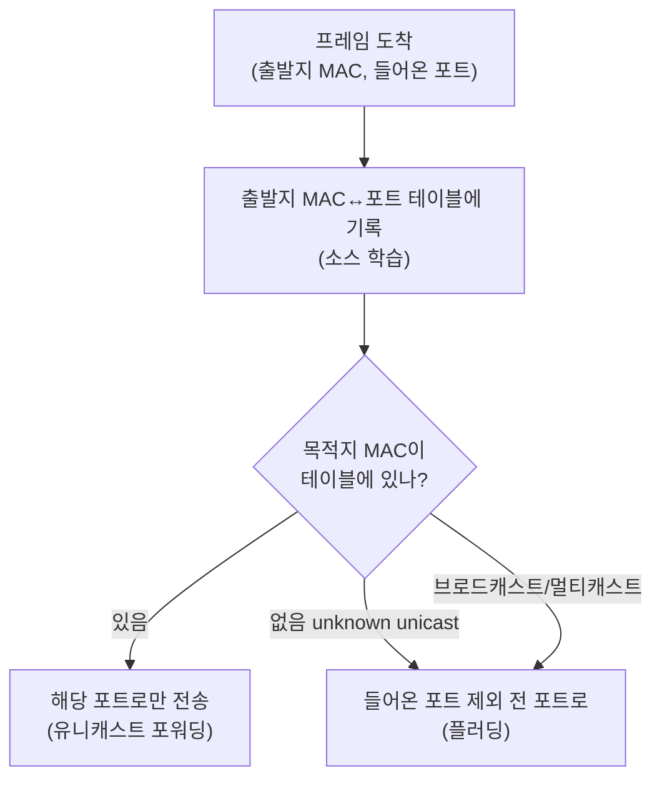
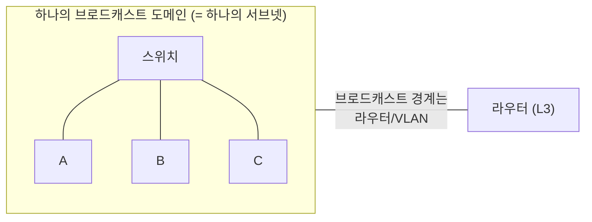

## "스위치는 누가 어디 꽂혀 있는지 어떻게 알지?"

라우터는 라우팅 테이블을 설정하거나 프로토콜로 채웁니다. 그런데 스위치는 아무 설정 없이 전원만 꽂아도, 잠깐 지나면 "A는 1번 포트, B는 5번 포트"를 정확히 알고 트래픽을 그쪽으로만 보냅니다. **누가 가르쳐주지도 않았는데** 말이죠.

이 "스스로 배우는" 동작이 2계층의 핵심입니다. [OSI 글]()에서 본 링크 계층은 "옆 노드에게 프레임을 한 홉 건네는" 일을 책임집니다. 이 글은 이더넷 프레임의 실제 비트 구조부터, 스위치가 MAC 주소를 학습하는 메커니즘, 그리고 충돌·브로드캐스트 도메인이라는 두 경계까지 — 2계층을 "스위치는 빠른 허브" 수준에서 "디버깅 가능한 메커니즘"으로 끌어올립니다.

## 이더넷 프레임: 실제 비트 구조

링크 계층의 PDU는 **프레임**입니다. IEEE 802.3 이더넷 프레임의 실제 필드는 이렇습니다.

<div class="eth-frame" markdown="0">
<style>
.eth-frame{margin:1.4rem 0;overflow-x:auto}
.eth-frame svg{width:100%;max-width:700px;height:auto;display:block;margin:0 auto;font-family:inherit}
.eth-frame .fld{stroke:currentColor;stroke-width:1.4;fill:currentColor;fill-opacity:.06}
.eth-frame .nm{fill:currentColor;font-size:10.5px;font-weight:600}
.eth-frame .sz{fill:currentColor;font-size:9px;opacity:.55}
.eth-frame .scan{fill:#1971c2;opacity:.22;animation:ethscan 6s ease-in-out infinite}
.eth-frame .acc{stroke:#f08c00}
.eth-frame .fcs{stroke:#2f9e44;fill:#2f9e44;fill-opacity:0;animation:ethfcs 6s ease-in-out infinite}
.eth-frame .bit{fill:#1971c2;animation:ethbit 6s linear infinite}
@keyframes ethscan{0%{transform:translateX(0);opacity:0}6%{opacity:.22}90%{transform:translateX(612px);opacity:.22}100%{transform:translateX(612px);opacity:0}}
@keyframes ethfcs{0%,82%{fill-opacity:0}90%,100%{fill-opacity:.25}}
@keyframes ethbit{0%{transform:translateX(0);opacity:0}3%{opacity:1}8%{transform:translateX(40px);opacity:0}100%{opacity:0}}
</style>
<svg viewBox="0 0 660 120" role="img" aria-label="이더넷 프레임 필드가 왼쪽부터 순서대로 읽히고 마지막에 FCS로 무결성을 검사하는 구조 애니메이션">
  <rect class="fld" x="20"  y="40" width="68" height="34" rx="3"/>
  <rect class="fld" x="92"  y="40" width="30" height="34" rx="3"/>
  <rect class="fld acc" x="126" y="40" width="92" height="34" rx="3"/>
  <rect class="fld acc" x="222" y="40" width="92" height="34" rx="3"/>
  <rect class="fld" x="318" y="40" width="72" height="34" rx="3"/>
  <rect class="fld" x="394" y="40" width="176" height="34" rx="3"/>
  <rect class="fld fcs" x="574" y="40" width="58" height="34" rx="3"/>
  <text class="nm" x="54"  y="60" text-anchor="middle">Preamble</text><text class="sz" x="54"  y="72" text-anchor="middle">7B</text>
  <text class="nm" x="107" y="60" text-anchor="middle">SFD</text><text class="sz" x="107" y="72" text-anchor="middle">1B</text>
  <text class="nm" x="172" y="60" text-anchor="middle">목적지MAC</text><text class="sz" x="172" y="72" text-anchor="middle">6B</text>
  <text class="nm" x="268" y="60" text-anchor="middle">출발지MAC</text><text class="sz" x="268" y="72" text-anchor="middle">6B · 학습재료</text>
  <text class="nm" x="354" y="60" text-anchor="middle">EtherType</text><text class="sz" x="354" y="72" text-anchor="middle">2B</text>
  <text class="nm" x="482" y="60" text-anchor="middle">Payload</text><text class="sz" x="482" y="72" text-anchor="middle">46~1500B</text>
  <text class="nm" x="603" y="60" text-anchor="middle">FCS</text><text class="sz" x="603" y="72" text-anchor="middle">4B · CRC</text>
  <rect class="scan" x="20" y="38" width="14" height="38" rx="2"/>
  <circle class="bit" cx="8" cy="57" r="4"/>
  <text class="sz" x="603" y="92" text-anchor="middle" fill="#2f9e44">검증 ✓</text>
</svg>
</div>

```text
Preamble(7) · SFD(1) · 목적지MAC(6) · 출발지MAC(6) · EtherType(2) · Payload(46~1500) · FCS(4)
```

| 필드 | 크기 | 역할 |
|---|---|---|
| Preamble + SFD | 8B | 수신측 클럭 동기화, 프레임 시작 표시 |
| **목적지 MAC** | 6B | 어디로 보낼지(이 프레임을 받을 NIC) |
| **출발지 MAC** | 6B | 누가 보냈는지 — **스위치 학습의 재료** |
| **EtherType** | 2B | 상위 프로토콜 식별: `0x0800`=IPv4, `0x86DD`=IPv6, `0x0806`=ARP, `0x8100`=VLAN 태그 |
| Payload | 46~1500B | 상위 계층(보통 IP 패킷). 46B 미만이면 패딩 |
| **FCS** | 4B | CRC-32 체크섬. 깨진 프레임은 **조용히 폐기**(재전송은 상위 계층 몫) |

EtherType이 0x0800이면 payload를 IP로, 0x0806이면 [ARP]()로 넘깁니다 — 이게 [OSI 글]에서 말한 "역캡슐화 시 어느 상위 계층에 줄지"를 결정하는 실제 필드입니다.

### MAC 주소 48비트: 그냥 난수가 아니다

MAC은 48비트(6바이트), `00:1A:2B:3C:4D:5E`처럼 표기합니다. 구조가 있습니다.

- **앞 24비트 = OUI**(Organizationally Unique Identifier): 제조사 식별. `00:1A:2B`로 벤더를 역추적할 수 있습니다.
- **뒤 24비트**: 제조사가 장치마다 부여.
- **첫 바이트의 하위 2비트**: I/G 비트(개별/그룹 — `01:00:5E...`처럼 멀티캐스트면 1), U/L 비트(전역/로컬 관리 — 프라이버시 위해 OS가 무작위화하면 1).
- **브로드캐스트 주소**: `FF:FF:FF:FF:FF:FF` — 같은 브로드캐스트 도메인의 **모두에게**.

```bash
ip link show eth0          # link/ether 00:1a:2b:3c:4d:5e
# OUI로 벤더 확인, 인터페이스 통계
ethtool -P eth0            # Permanent address (NIC에 박힌 원본 MAC)
```

## 스위치는 어떻게 배우나: 소스 학습 + 플러딩

스위치의 마법은 **MAC 주소 테이블(CAM 테이블)** 하나로 설명됩니다. 동작은 단 두 규칙입니다.

1. **소스 학습**: 프레임이 들어오면 **출발지 MAC**과 **들어온 포트**를 테이블에 기록한다.
2. **목적지 조회**: 목적지 MAC이 테이블에 있으면 **그 포트로만** 보낸다(포워딩). 없으면(unknown unicast) 들어온 포트만 빼고 **전 포트로 보낸다**(플러딩).

처음엔 테이블이 비어 있어 플러딩하지만, 응답이 돌아오면 그 출발지를 학습해 다음부터는 정확히 한 포트로만 보냅니다. 아래 애니메이션: A→B 첫 프레임은 B 위치를 몰라 **플러딩**(<span style="color:#e03131;font-weight:600">빨강, 전 포트로</span>)되지만, B가 응답하면서 스위치가 B를 학습해, 그 다음 A→B는 **B 포트로만**(<span style="color:#2f9e44;font-weight:600">초록, 유니캐스트</span>) 갑니다.

<div class="eth-learn" markdown="0">
<style>
.eth-learn{margin:1.4rem 0;overflow-x:auto}
.eth-learn svg{width:100%;max-width:700px;height:auto;display:block;margin:0 auto;font-family:inherit}
.eth-learn .bx{fill:none;stroke:currentColor;stroke-width:1.5;opacity:.5}
.eth-learn .lbl{fill:currentColor;font-size:12px;font-weight:600}
.eth-learn .sub{fill:currentColor;font-size:10px;opacity:.6}
.eth-learn .wire{stroke:currentColor;opacity:.25;stroke-width:1.4}
.eth-learn .flood{fill:#e03131;opacity:0;animation:ethflood 6s ease-in-out infinite}
.eth-learn .uni{fill:#2f9e44;opacity:0;animation:ethuni 6s ease-in-out infinite}
.eth-learn .row2{opacity:0;animation:ethrow 6s ease-in-out infinite}
@keyframes ethflood{0%{opacity:0;transform:translate(0,0)}5%{opacity:1}25%{opacity:1;transform:translate(0,0)}45%{opacity:.7;transform:translate(120px,0)}50%{opacity:0}100%{opacity:0}}
@keyframes ethuni{0%,55%{opacity:0;transform:translate(0,0)}60%{opacity:1}90%{opacity:1;transform:translate(120px,70px)}100%{opacity:0}}
@keyframes ethrow{0%,45%{opacity:0}55%,100%{opacity:.9}}
</style>
<svg viewBox="0 0 700 240" role="img" aria-label="첫 프레임은 목적지를 몰라 전 포트로 플러딩되고, 응답으로 학습한 뒤에는 한 포트로만 유니캐스트하는 스위치 MAC 학습 애니메이션">
  <rect class="bx" x="270" y="70" width="160" height="100" rx="10"/>
  <text class="lbl" x="350" y="60" text-anchor="middle">스위치 (CAM 테이블)</text>
  <text class="sub" x="350" y="110" text-anchor="middle">port1 → A  (학습됨)</text>
  <text class="sub row2" x="350" y="132" text-anchor="middle">port3 → B  (응답으로 학습)</text>
  <!-- hosts -->
  <circle class="bx" cx="60" cy="60" r="18"/><text class="lbl" x="60" y="65" text-anchor="middle">A</text>
  <circle class="bx" cx="60" cy="190" r="18"/><text class="lbl" x="60" y="195" text-anchor="middle">C</text>
  <circle class="bx" cx="640" cy="60" r="18"/><text class="lbl" x="640" y="65" text-anchor="middle">B</text>
  <circle class="bx" cx="640" cy="190" r="18"/><text class="lbl" x="640" y="195" text-anchor="middle">D</text>
  <line class="wire" x1="78" y1="65" x2="270" y2="95"/>
  <line class="wire" x1="78" y1="185" x2="270" y2="150"/>
  <line class="wire" x1="430" y1="95" x2="622" y2="65"/>
  <line class="wire" x1="430" y1="150" x2="622" y2="185"/>
  <!-- flood: from A copies to B, C, D -->
  <rect class="flood" x="250" y="60" width="16" height="12" rx="2"/>
  <rect class="flood" x="250" y="190" width="16" height="12" rx="2"/>
  <!-- unicast: A to B only -->
  <rect class="uni" x="430" y="88" width="16" height="12" rx="2"/>
  <text class="sub" x="350" y="200" text-anchor="middle">① unknown → 플러딩(빨강)   ② 학습 후 → 유니캐스트(초록)</text>
</svg>
</div>



> **왜 플러딩이 안전한가?** 잘못된 포트로 보내도 그 포트의 호스트는 "내 MAC이 아니네" 하고 프레임을 버립니다(NIC의 목적지 MAC 필터링). 그래서 처음 모를 때 전부에게 뿌려도 통신은 깨지지 않고, 단지 잠깐 비효율적일 뿐입니다. 테이블 엔트리는 보통 **300초(aging time)** 후 만료돼, 장치가 옮겨가도 자동으로 갱신됩니다.

## 허브 vs 스위치, 그리고 두 개의 도메인

스위치를 제대로 이해하려면 그 전 세대인 **허브**와 비교하고, **충돌 도메인**과 **브로드캐스트 도메인**을 구분해야 합니다.

| | 허브 (1계층) | 스위치 (2계층) |
|---|---|---|
| 동작 | 들어온 신호를 **전 포트로 무조건** 복사 | MAC 테이블로 **목적지 포트에만** |
| 충돌 도메인 | **전체가 하나** (다 같이 충돌) | **포트마다 분리** |
| 대역폭 | 전 포트가 공유 | 포트별 전용(풀듀플렉스) |
| 동시 통신 | 한 번에 하나 | A↔B와 C↔D **동시** |

- **충돌 도메인(Collision Domain)**: 동시에 신호를 보내면 충돌하는 범위. 허브는 전체가 한 도메인이라 CSMA/CD가 필요했지만, **스위치는 포트마다 분리**되고 풀듀플렉스라 충돌 자체가 사라졌습니다. 그래서 현대 LAN에서 CSMA/CD는 사실상 유물입니다.
- **브로드캐스트 도메인(Broadcast Domain)**: 브로드캐스트(`FF:FF...`)가 도달하는 범위. **스위치는 브로드캐스트를 막지 못합니다** — 전 포트로 플러딩하니까요. 이 도메인을 나누려면 **라우터** 또는 **VLAN**이 필요합니다.



이 "브로드캐스트 도메인 = 하나의 서브넷"이라는 등식이 [IP·서브넷팅 글]()과 2계층을 잇는 다리입니다. 같은 서브넷 안의 통신은 MAC(2계층)으로, 다른 서브넷으로 나가는 통신은 [ARP]()와 라우터(3계층)로 — 이게 다음 글들의 핵심입니다.

## VLAN: 한 스위치를 여러 브로드캐스트 도메인으로

물리 스위치 한 대를 논리적으로 쪼개는 게 **VLAN**입니다. IEEE 802.1Q는 이더넷 프레임의 출발지 MAC 뒤에 **4바이트 태그**(`0x8100` + VLAN ID 12비트)를 끼워, 같은 스위치라도 VLAN 10과 VLAN 20을 **서로 다른 브로드캐스트 도메인**으로 격리합니다.

- VLAN ID는 12비트 → 1~4094개. 부서·환경(prod/dev)별 격리, 트렁크 포트(여러 VLAN을 한 링크로)에서 활용.
- 클라우드의 가상 네트워크 격리(예: VXLAN)는 이 발상을 24비트(1600만 개)로 확장한 것 — [VPC 글]()의 토대입니다.

## 프로덕션 함정과 디버깅

- **MAC 테이블 오버플로 / MAC flooding 공격**: CAM 테이블은 유한합니다(수천~수만). 위조된 출발지 MAC을 폭주시켜 테이블을 꽉 채우면, 스위치가 **모든 프레임을 플러딩**하게 되어 공격자가 트래픽을 엿볼 수 있습니다. 방어는 **포트 보안**(포트당 MAC 수 제한).
- **MTU 불일치**: 점보 프레임(9000)을 한쪽만 켜면 큰 프레임이 조용히 드롭됩니다. 양 끝과 중간 스위치의 MTU를 맞춰야 합니다.
- **루프와 브로드캐스트 스톰**: 스위치를 케이블로 고리 모양으로 연결하면 브로드캐스트가 무한 증식해 망이 마비됩니다 → **STP(Spanning Tree Protocol)** 가 루프를 끊습니다.

```bash
ip -s link show eth0       # RX/TX 패킷·에러·드롭 카운터
ethtool eth0               # Speed/Duplex/Link 협상 상태 (half면 충돌 의심)
ethtool -S eth0            # NIC 상세 통계 (crc_errors 등)
bridge fdb show            # 리눅스 브리지의 MAC 포워딩 테이블(= CAM)
sudo tcpdump -e -i eth0    # -e: 이더넷 헤더(출발/목적 MAC)까지 출력
# (스위치 장비) show mac address-table  ← Cisco/Arista 등에서 CAM 직접 확인
```

## 면접/리뷰 단골 질문

- **Q. 스위치는 목적지 포트를 어떻게 아나?** → 들어오는 프레임의 출발지 MAC을 학습해 CAM 테이블을 채운다. 모르는 목적지는 플러딩, 알면 해당 포트로만 유니캐스트.
- **Q. 허브와 스위치의 결정적 차이는?** → 허브는 충돌 도메인이 하나(공유·반이중), 스위치는 포트마다 충돌 도메인이 분리(전용·전이중). 스위치는 동시 통신이 가능.
- **Q. 스위치는 브로드캐스트 도메인을 나누나?** → 못 나눈다. 브로드캐스트는 전 포트로 플러딩. 나누려면 라우터 또는 VLAN.
- **Q. EtherType의 역할은?** → payload의 상위 프로토콜 식별(0x0800 IPv4, 0x0806 ARP, 0x86DD IPv6, 0x8100 VLAN). 역캡슐화 시 어느 계층에 넘길지 결정.
- **Q. 깨진 프레임은 어떻게 되나?** → FCS(CRC-32) 검사 실패 시 조용히 폐기. 재전송 보장은 상위 계층(TCP)의 몫.

## 정리

- 이더넷 프레임 = **목적지/출발지 MAC + EtherType + payload + FCS**. EtherType이 상위 계층을, FCS가 무결성을 담당.
- 스위치는 **소스 학습 + 플러딩** 단 두 규칙으로 CAM 테이블을 채워, 모르면 뿌리고 알면 한 포트로만 보낸다.
- 스위치는 **충돌 도메인을 포트별로 분리**하지만 **브로드캐스트 도메인은 못 나눈다** → 라우터/VLAN이 필요.
- **브로드캐스트 도메인 = 하나의 서브넷** — 2계층(MAC)과 3계층(IP)을 잇는 핵심 등식.

> 다음 글: 그 "서브넷"이 무엇이고 어떻게 IP 주소 공간을 쪼개는지 — [IP 주소와 서브넷팅]()으로 이어집니다. 같은 서브넷 안에서 IP를 MAC으로 바꾸는 [ARP]()도 곧 다룹니다.
