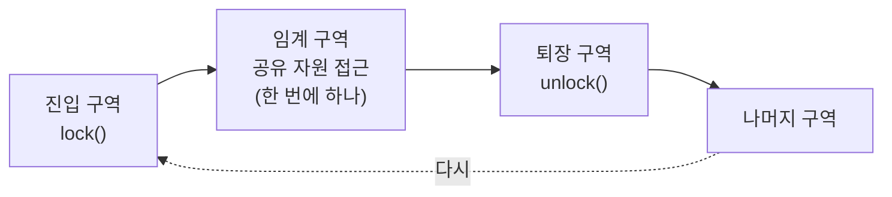

## "`count++` 한 줄이 왜 깨지나"

스레드 두 개가 전역 변수 `count`를 각각 100만 번 1씩 올립니다. 끝나면 200만이어야 합니다. 그런데 돌릴 때마다 1,983,442 … 1,996,051 … **매번 다른, 200만보다 작은 수**가 나옵니다. 코드는 분명 `count++` 한 줄인데요.

범인은 "한 줄"이라는 착각입니다. [앞 글]()에서 봤듯 스레드는 같은 주소 공간을 공유하고, 단일 CPU 위에서 명령들이 **언제든 인터리빙**될 수 있습니다. `count++`는 사실 세 개의 기계 명령이고, 그 사이를 다른 스레드가 비집고 들어오면 갱신이 통째로 증발합니다. 이 글은 그 증발이 일어나는 **정확한 순간**을 들여다보고, 그걸 막는 가장 기본 도구인 락 — 그중 뮤텍스와 스핀락을 **언제 무엇을** 써야 하는지까지 따라갑니다.

## `count++`는 원자적이지 않다

고급 언어의 `count++`는 컴파일하면 보통 세 단계로 펼쳐집니다.

```text
load   r1 ← [count]    ; 메모리에서 레지스터로 읽기
add    r1 ← r1 + 1     ; 레지스터에서 1 더하기
store  [count] ← r1    ; 다시 메모리로 쓰기
```

이 세 단계 **사이 어디서든** 스케줄러가 다른 스레드로 전환할 수 있습니다(타이머 인터럽트 한 번이면 충분). 두 스레드가 둘 다 "옛날 값"을 읽은 뒤 각자 +1 해서 쓰면, 두 번 올렸는데 결과는 한 번만 오른 것처럼 됩니다 — **갱신 분실(lost update)**.

아래 타임라인에서 스레드 A(<span style="color:#1971c2;font-weight:600">파랑</span>)와 B(<span style="color:#f08c00;font-weight:600">주황</span>)가 `count=0`에서 시작합니다. 둘 다 0을 읽고, 둘 다 1을 계산하고, 둘 다 1을 씁니다. **두 번 증가시켰는데 결과는 1**입니다.

<div class="os-race" markdown="0">
<style>
.os-race{margin:1.4rem 0;overflow-x:auto}
.os-race svg{width:100%;max-width:720px;height:auto;display:block;margin:0 auto;font-family:inherit}
.os-race .lbl{fill:currentColor;font-size:12px;font-weight:600}
.os-race .sub{fill:currentColor;font-size:10px;opacity:.6}
.os-race .axis{stroke:currentColor;opacity:.25;stroke-width:1.4}
.os-race .opA{fill:#1971c2}
.os-race .opB{fill:#f08c00}
.os-race .step{opacity:0}
.os-race .s1{animation:osrace 7s linear infinite}
.os-race .s2{animation:osrace 7s linear infinite}
.os-race .s3{animation:osrace 7s linear infinite}
.os-race .s4{animation:osrace 7s linear infinite}
.os-race .s5{animation:osrace 7s linear infinite}
.os-race .s6{animation:osrace 7s linear infinite}
@keyframes osrace{0%,5%{opacity:0}10%,100%{opacity:1}}
.os-race .cnt{fill:#e03131;font-size:14px;font-weight:700;opacity:0;animation:oscnt 7s linear infinite}
@keyframes oscnt{0%,88%{opacity:0}92%,100%{opacity:1}}
.os-race .marker{fill:#e03131;opacity:0;animation:osmark 7s linear infinite}
@keyframes osmark{0%,84%{opacity:0}88%,100%{opacity:.85}}
</style>
<svg viewBox="0 0 720 250" role="img" aria-label="두 스레드 A와 B의 load-add-store가 인터리빙되어 두 번 증가시켰는데도 count가 1에 머무는 경쟁 상태 타임라인">
  <text class="lbl" x="10" y="22">스레드 A</text>
  <text class="lbl" x="10" y="92">스레드 B</text>
  <line class="axis" x1="120" y1="40" x2="700" y2="40"/>
  <line class="axis" x1="120" y1="110" x2="700" y2="110"/>
  <text class="sub" x="120" y="150">시간 →  (둘 다 count=0을 읽었다)</text>

  <g class="step s1"><rect class="opA" x="130" y="26" width="92" height="26" rx="4"/><text class="sub" x="176" y="43" text-anchor="middle" fill="#fff" style="opacity:1">load 0</text></g>
  <g class="step s2"><rect class="opB" x="240" y="96" width="92" height="26" rx="4"/><text class="sub" x="286" y="113" text-anchor="middle" fill="#fff" style="opacity:1">load 0</text></g>
  <g class="step s3"><rect class="opA" x="350" y="26" width="92" height="26" rx="4"/><text class="sub" x="396" y="43" text-anchor="middle" fill="#fff" style="opacity:1">add → 1</text></g>
  <g class="step s4"><rect class="opB" x="350" y="96" width="92" height="26" rx="4"/><text class="sub" x="396" y="113" text-anchor="middle" fill="#fff" style="opacity:1">add → 1</text></g>
  <g class="step s5"><rect class="opA" x="470" y="26" width="100" height="26" rx="4"/><text class="sub" x="520" y="43" text-anchor="middle" fill="#fff" style="opacity:1">store 1</text></g>
  <g class="step s6"><rect class="opB" x="590" y="96" width="100" height="26" rx="4"/><text class="sub" x="640" y="113" text-anchor="middle" fill="#fff" style="opacity:1">store 1</text></g>

  <line class="marker" x1="470" y1="20" x2="470" y2="180" stroke="#e03131" stroke-width="1.4" stroke-dasharray="3 3"/>
  <text class="cnt" x="360" y="210" text-anchor="middle">결과 count = 1  (2가 아니라!) — 갱신 하나가 증발</text>
</svg>
</div>

핵심은 **"동시에 일어나서"가 아니라 "끼어들 수 있어서"** 깨진다는 점입니다. 단일 코어에서도, 인터리빙 순서가 비결정적이기 때문에 똑같이 터집니다. 그래서 결과가 입력이 아니라 **타이밍**에 의존하게 되는 상황을 **경쟁 상태(race condition)** 라 부릅니다.

## 임계 구역과 상호 배제

문제의 본질은 "공유 자원을 만지는 코드 조각이 중간에 끼어들기를 허용한다"는 것입니다. 이 조각이 **임계 구역(critical section)** 이고, 한 번에 한 스레드만 들어가게 만드는 것이 **상호 배제(mutual exclusion)** 입니다.

올바른 동기화 도구가 갖춰야 할 세 가지 성질:

- **상호 배제**: 임계 구역 안에는 최대 한 스레드.
- **진행(progress)**: 아무도 안 들어가 있으면, 들어가려는 스레드 중 하나는 반드시 들어갈 수 있어야 한다(불필요한 차단 금지).
- **한정 대기(bounded waiting)**: 들어가려는 스레드는 유한 시간 안에 차례가 온다(굶기지 않음).



소프트웨어만으로(Peterson 알고리즘 등) 상호 배제를 만들 수도 있지만, 현대 CPU의 명령 재배치(out-of-order)와 캐시 때문에 순수 소프트웨어 방식은 깨지기 쉽습니다. 그래서 실전에서는 **하드웨어가 보장하는 원자 명령** 위에 락을 쌓습니다.

## 원자성의 뿌리: TAS와 CAS

하드웨어는 "읽고-수정하고-쓰기"를 **쪼갤 수 없는 한 명령**으로 제공합니다. 이게 모든 락의 토대입니다.

- **TAS(Test-And-Set)**: 메모리를 1로 세팅하면서 **이전 값**을 돌려준다. 이전이 0이었으면 내가 락을 잡은 것.
- **CAS(Compare-And-Swap)**: "이 주소가 아직 `expected`면 `new`로 바꿔라"를 원자적으로. 바뀌면 성공, 아니면 누가 먼저 손댔다는 뜻 → 재시도. 락 없는(lock-free) 자료구조의 심장.
- **LL/SC(Load-Linked/Store-Conditional)**: ARM·RISC-V 계열. 읽은 뒤 그 사이 아무도 안 건드렸을 때만 쓰기 성공.

```c
/* CAS로 직접 만든 카운터 — 락 없이 원자적 증가 */
#include <stdatomic.h>
atomic_int count = 0;

void inc(void) {
    int old = atomic_load(&count);
    while (!atomic_compare_exchange_weak(&count, &old, old + 1))
        ; /* 실패 = 그 사이 누가 바꿈 → old 갱신되어 자동 재시도 */
}
```

> **현실 체크 — 원자 ≠ 가시성.** 원자 명령이 "찢긴 쓰기"는 막아도, 한 코어가 쓴 값을 다른 코어가 **언제 보는지**는 별개 문제입니다(캐시·명령 재배치). 그래서 `volatile`만으론 부족하고 **메모리 배리어**(혹은 acquire/release 시맨틱)가 필요합니다. `pthread_mutex`·C11 atomic은 이 배리어를 내부에 포함하므로, 직접 lock-free를 짜는 게 아니라면 표준 동기화 객체를 쓰는 게 안전합니다.

## 뮤텍스 vs 스핀락 — 기다리는 방식의 차이

락을 못 잡았을 때 **어떻게 기다리느냐**가 둘을 가릅니다.

- **스핀락**: 락이 풀릴 때까지 `while(test_and_set)` 루프를 **계속 돌며** 기다린다(busy-wait). 잠들지 않으니 깨어나는 비용이 0 → 임계 구역이 **아주 짧을 때** 유리. 대신 기다리는 내내 CPU를 태운다.
- **뮤텍스**: 락을 못 잡으면 커널에 요청해 스레드를 **재운다(sleep)**. CPU를 양보하니 다른 일이 돌 수 있지만, 재우고 깨우는 데 [컨텍스트 스위치]() 비용이 든다 → 임계 구역이 **길거나 경합이 심할 때** 유리.

아래에서 두 스레드가 각각 락을 기다립니다. 위(스핀락)는 대기 스레드가 <span style="color:#e03131;font-weight:600">CPU를 계속 태우며</span> 회전하고, 아래(뮤텍스)는 <span style="opacity:.6">잠들었다가</span> 락이 풀리는 순간 깨어납니다.

<div class="os-lock" markdown="0">
<style>
.os-lock{margin:1.4rem 0;overflow-x:auto}
.os-lock svg{width:100%;max-width:720px;height:auto;display:block;margin:0 auto;font-family:inherit}
.os-lock .lbl{fill:currentColor;font-size:12px;font-weight:600}
.os-lock .sub{fill:currentColor;font-size:10px;opacity:.6}
.os-lock .box{fill:none;stroke:currentColor;stroke-width:1.4;opacity:.45}
.os-lock .hold{fill:#2f9e44}
.os-lock .spin{fill:#e03131;transform-origin:175px 70px;animation:osspin 1.1s linear infinite}
@keyframes osspin{from{transform:rotate(0deg)}to{transform:rotate(360deg)}}
.os-lock .burn{fill:#e03131;font-size:10px;font-weight:600}
.os-lock .sleep{fill:currentColor;opacity:.35}
.os-lock .wake{fill:#2f9e44;opacity:0;animation:oswake 4s ease-in-out infinite}
@keyframes oswake{0%,55%{opacity:0}65%,85%{opacity:.9}100%{opacity:0}}
.os-lock .zz{fill:currentColor;font-size:13px;opacity:0;animation:oszz 4s ease-in-out infinite}
@keyframes oszz{0%,55%{opacity:.45}65%,100%{opacity:0}}
.os-lock .cpu{stroke:#e03131;stroke-width:2;fill:none;opacity:.5;stroke-dasharray:3 4}
</style>
<svg viewBox="0 0 720 230" role="img" aria-label="스핀락은 대기 중 CPU를 계속 소모하며 회전하고, 뮤텍스는 잠들었다가 락이 풀릴 때 깨어나는 비교 애니메이션">
  <text class="lbl" x="10" y="24">스핀락 · 락 풀릴 때까지 계속 확인 (CPU 소모)</text>
  <rect class="box" x="120" y="48" width="110" height="44" rx="8"/>
  <text class="sub" x="175" y="40" text-anchor="middle">대기 스레드</text>
  <circle class="cpu" cx="175" cy="70" r="26"/>
  <polygon class="spin" points="175,52 181,70 175,88 169,70"/>
  <text class="burn" x="300" y="74">↻ test_and_set 루프 — CPU 100% 점유</text>

  <text class="lbl" x="10" y="140">뮤텍스 · 못 잡으면 sleep → 락 해제 시 커널이 깨움</text>
  <rect class="box" x="120" y="158" width="110" height="44" rx="8"/>
  <text class="sub" x="175" y="150" text-anchor="middle">대기 스레드</text>
  <text class="zz" x="175" y="186" text-anchor="middle">z z Z</text>
  <circle class="wake" cx="175" cy="180" r="12"/>
  <text class="sub" x="300" y="176">sleep 중 CPU 양보 → 다른 스레드 실행 가능</text>
  <text class="sub" x="300" y="192" fill="#2f9e44" style="opacity:.9">락 해제 신호 → 깨어나 진입 (전환 비용 발생)</text>
</svg>
</div>

| | 스핀락 | 뮤텍스 |
|---|---|---|
| 대기 방식 | busy-wait(계속 확인) | sleep(재움) |
| 대기 중 CPU | **태움** | 양보 |
| 깨어나는 비용 | 거의 0 | 컨텍스트 스위치 |
| 유리한 상황 | 임계 구역 매우 짧음, 멀티코어 | 임계 구역 길거나 경합 심함 |
| 인터럽트 컨텍스트 | **가능**(잠들면 안 되는 곳) | 불가(잠들 수 있어서) |

> **현실 체크 — 단일 코어 스핀락은 자살.** 코어가 하나인데 스핀락을 잡은 스레드가 선점당하면, 대기 스레드는 **있지도 않은 락 해제를 기다리며 자기 타임 슬라이스를 통째로 낭비**합니다(락 가진 스레드는 CPU를 못 받아 영영 못 풉니다). 그래서 리눅스 커널은 스핀락을 잡는 동안 선점·인터럽트를 끄고, 유저 공간은 보통 둘을 섞은 **적응형 뮤텍스**(잠깐 스핀하다 안 되면 sleep)를 씁니다 — glibc의 `PTHREAD_MUTEX_ADAPTIVE_NP`.

## 직접 재현하고 관찰하기

```c
/* 락 없이 = 깨지고, 뮤텍스 씌우면 = 정확해진다 */
#include <pthread.h>
long count = 0;
pthread_mutex_t m = PTHREAD_MUTEX_INITIALIZER;

void *worker(void *_) {
    for (int i = 0; i < 1000000; i++) {
        pthread_mutex_lock(&m);     /* ← 빼고 돌리면 결과가 2,000,000 미만 */
        count++;                    /* 임계 구역 */
        pthread_mutex_unlock(&m);
    }
    return NULL;
}
```

```bash
# 락 경합이 성능을 어떻게 갉아먹는지 — 시스템콜(futex) 폭증을 본다
strace -c -f ./a.out          # 경합 심하면 futex 호출 수가 치솟는다
perf stat -e task-clock,context-switches ./a.out
# false sharing(서로 다른 변수가 같은 캐시라인) 진단
perf c2c record ./a.out && perf c2c report
```

뮤텍스의 sleep/wake는 리눅스에서 **futex**(fast userspace mutex)로 구현됩니다 — 경합이 없으면 유저 공간에서 원자 연산만으로 끝내고, **경합할 때만** 커널로 내려가 재우고 깨웁니다. `strace`에서 `futex` 호출이 폭증한다면 락 경합이 병목이라는 신호입니다.

## 면접/리뷰 단골 질문

- **Q. `count++`가 왜 race가 되나?** → load·add·store 3단계라 그 사이 인터리빙되면 두 스레드가 같은 옛 값을 읽고 덮어써 갱신이 분실된다. 단일 코어에서도 발생한다.
- **Q. 임계 구역의 정확성 조건 셋은?** → 상호 배제, 진행, 한정 대기.
- **Q. 뮤텍스와 스핀락은 언제 무엇을?** → 임계 구역이 매우 짧고 멀티코어면 스핀락(전환 비용 회피), 길거나 경합이 심하면 뮤텍스(CPU 양보). 인터럽트 컨텍스트처럼 잠들면 안 되는 곳은 스핀락.
- **Q. CAS가 뭐고 왜 중요한가?** → "값이 기대치면 교체"를 원자적으로 수행. 실패 시 재시도하는 패턴으로 락 없는 자료구조를 만든다.
- **Q. 원자 연산만 쓰면 동기화 끝인가?** → 아니다. 찢긴 쓰기는 막아도 가시성·재배치는 메모리 배리어(acquire/release)가 필요하다.

## 정리

- `count++`는 load·add·store 3단계라 **원자가 아니다** → 인터리빙되면 갱신 분실(race condition).
- 공유 자원을 만지는 코드가 **임계 구역**, 한 번에 하나만 들이는 게 **상호 배제**. 올바른 락은 상호배제·진행·한정대기를 만족해야 한다.
- 모든 락의 뿌리는 하드웨어 **원자 명령**(TAS·CAS·LL/SC). CAS 재시도로 lock-free도 가능.
- **스핀락**은 busy-wait(짧은 임계구역), **뮤텍스**는 sleep(긴 임계구역·심한 경합). 단일 코어 스핀락은 위험, 실전은 적응형 뮤텍스.
- 원자성과 가시성은 별개 — 메모리 배리어가 필요하고, 표준 동기화 객체(futex 기반 뮤텍스)는 이를 포함한다.

> 다음 글: 락만으론 "자원 N개"나 "순서 조건"을 못 다룹니다. 카운팅 세마포어·컨디션 변수, 그리고 락이 만드는 함정인 [데드락]()으로 이어집니다.
