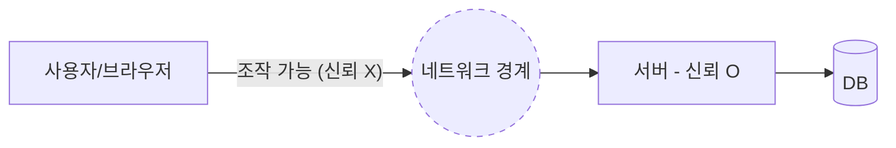

## 들어가며

어느 주, 입력 폼의 유효성 검증을 손봤다. 화면에서 빨간 글씨로 "필수 입력입니다"를 띄우는 일이다. 그런데 이걸 만지면서 한 가지 질문이 따라온다. **브라우저에서 이미 막았는데, 서버에서 또 막아야 하나?** 답은 항상 "그렇다"다. 이유를 정확히 이해하면 검증 코드를 어디에 둘지 헷갈리지 않는다.

## 핵심 개념: 신뢰 경계(Trust Boundary)

클라이언트는 **사용자가 완전히 통제하는 환경**이다. 브라우저 개발자 도구를 열어 JS를 멈추거나, 검증 함수를 통째로 덮어쓰거나, 아예 브라우저 없이 `curl`로 요청을 직접 쏠 수 있다. 즉 클라이언트에서 돌아가는 모든 코드는 **공격자가 마음대로 바꿀 수 있는 코드**다.

그래서 보안 관점에서 신뢰 경계는 네트워크를 사이에 두고 그어진다. 경계 안쪽(서버)은 내가 통제하고, 바깥쪽(클라이언트)은 통제할 수 없다. 검증의 본질은 **"경계를 넘어 들어오는 데이터를 믿지 않는 것"**이다.



이 그림에서 점선 경계를 넘어온 값은 무조건 의심한다. 클라이언트 검증을 통과했다는 사실은 서버에게 **아무런 보증도 되지 않는다.**

## 두 검증의 역할 분담

- **클라이언트 검증 = UX.** 서버 왕복 없이 즉시 피드백을 준다. 빈 칸을 비웠을 때 바로 빨간 글씨를 띄워 사용자 경험을 매끄럽게 한다. **편의이지 방어선이 아니다.**
- **서버 검증 = 안전.** 실제로 데이터 무결성과 보안을 책임진다. 이게 없으면 DB에 깨진 데이터가 들어가고, SQL 인젝션·권한 우회 같은 사고로 이어진다.

## 코드 예시

서버에서는 선언적 검증을 쓰면 깔끔하다.

```java
public class CreateOrderRequest {
    @NotBlank
    @Size(max = 100)
    private String productName;

    @NotNull
    @Min(1) @Max(999)
    private Integer quantity;

    @Email
    private String contactEmail;
}

@PostMapping("/orders")
public ResponseEntity<?> create(@Valid @RequestBody CreateOrderRequest req) {
    // @Valid 실패 시 여기 도달하기 전에 예외 발생 → 400 응답
    return ResponseEntity.ok(orderService.create(req));
}
```

`@Valid`는 단순 형식 검증이다. 형식만으로 표현 못 하는 규칙(재고가 충분한가, 이 사용자가 이 주문을 만들 권한이 있는가)은 **서비스 계층에서 한 번 더** 검증한다. 형식 검증과 비즈니스 검증은 다른 층위다.

```java
public Order create(CreateOrderRequest req) {
    Product p = productRepo.findById(req.getProductId())
        .orElseThrow(() -> new NotFoundException("product"));
    if (p.getStock() < req.getQuantity()) {
        throw new BusinessException("재고 부족");
    }
    // ...
}
```

## 운영 함정

**함정 1 — "프런트에서 막으니 서버는 대충."** API가 외부에 노출된 순간, 누군가는 화면을 거치지 않고 요청을 보낸다. 모바일 앱·외부 연동·자동화 스크립트 모두 화면을 안 쓴다. 서버 검증이 비면 그대로 뚫린다.

**함정 2 — 클라이언트와 서버 규칙 불일치.** 화면에선 최대 50자인데 서버는 100자까지 받으면, 사용자는 막혔다고 느끼지만 API로는 통과한다. 반대면 화면은 통과시켰는데 서버가 거절해 사용자가 당황한다. **규칙의 단일 출처(SSOT)**를 정해 두고 양쪽을 맞춘다.

## 핵심 요약

- 클라이언트 검증은 우회 가능하므로 **방어선이 아니다.** 서버 검증이 진짜 방어선이다.
- 두 검증은 중복이 아니라 **역할 분담**이다. 클라이언트는 UX, 서버는 안전.
- 면접 한 줄 Q&A — **"프런트에서 다 막는데 왜 서버에서 또?"** → 클라이언트는 신뢰 경계 밖이라 조작·우회가 자유롭고, API는 화면 없이도 호출되기 때문이다.
