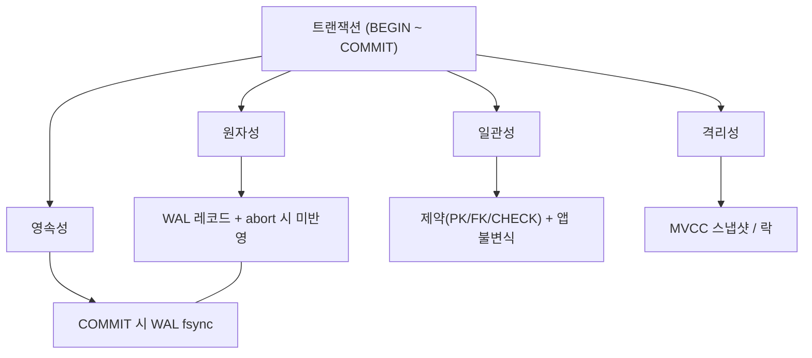
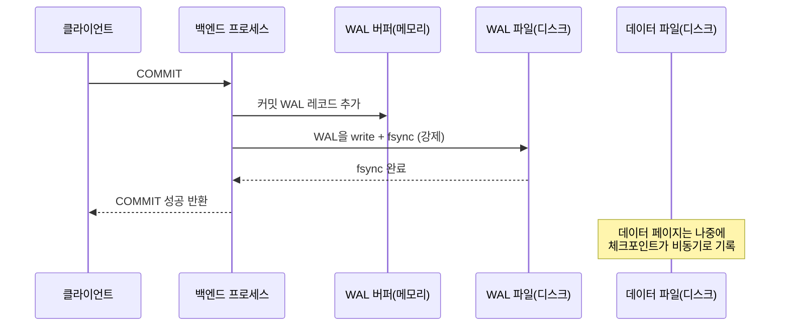

## "분명 COMMIT 했는데, 정전 후에 그 주문이 없어요"

계좌이체 코드를 짜봅니다. A 계좌에서 1만 원을 빼고 B 계좌에 1만 원을 더합니다. UPDATE 두 줄. 그런데 첫 번째 UPDATE가 끝나고 두 번째가 실행되기 직전에 프로세스가 죽으면? A의 돈은 사라졌는데 B는 받지 못했습니다. 또는 `COMMIT`이 성공을 반환한 직후 서버 전원이 나갔는데, 재부팅하니 그 데이터가 없습니다. 둘 다 "원래 그런 것"이 아니라 **DBMS가 막아야 하는 사고**입니다.

ACID는 이 사고들을 막겠다는 **약속**입니다. 그런데 면접에서 "ACID가 뭐죠?" 하면 "원자성·일관성·격리성·영속성이요"까지는 나오는데, **"그래서 그걸 누가 어떻게 구현하나요?"** 에서 막힙니다. 이 글은 정의 암기가 아니라, 네 글자 각각을 **"어느 컴포넌트가 무슨 메커니즘으로 보장하는가"** 로 분해합니다. [앞 글]()에서 인덱스로 데이터를 빠르게 찾는 법을 봤다면, 이번엔 그 데이터의 변경을 **안전하게** 묶는 단위 — 트랜잭션 — 으로 내려갑니다. 분산은 다루지 않습니다([17편]()). 단일 노드, 즉 PostgreSQL 한 대 안에서 벌어지는 일에 집중합니다.

## ACID는 네 사람이 나눠 맡는다

ACID를 하나의 마법으로 보면 안 됩니다. 네 글자는 **서로 다른 컴포넌트**가, **서로 다른 메커니즘**으로 책임집니다. 먼저 전체 지도를 그리고 하나씩 파고듭니다.

| 글자 | 보장하는 것 | 누가 | 어떻게 |
|---|---|---|---|
| **A** 원자성 | 전부 아니면 전무 | WAL + 트랜잭션 매니저 | 커밋 전까진 미반영 / abort 시 되돌림 |
| **C** 일관성 | 규칙을 깨지 않음 | 제약 + 애플리케이션 | 제약 위반 시 트랜잭션 실패 |
| **I** 격리성 | 동시 실행이 직렬처럼 | 동시성 제어(MVCC·락) | 스냅샷·락으로 간섭 차단 |
| **D** 영속성 | 커밋되면 살아남음 | WAL fsync | 커밋 시 로그를 디스크에 강제 |

핵심 통찰 하나: **A와 D는 같은 부품(WAL)에서 나옵니다.** 원자성은 "커밋 전까진 없던 일로 되돌릴 수 있어야" 하고, 영속성은 "커밋된 건 디스크에 박혀야" 하는데, 둘 다 WAL(Write-Ahead Log)이라는 한 로그가 책임집니다. 그래서 이 글의 무게중심은 자연스럽게 WAL에 실립니다. 반면 C는 절반이 애플리케이션 몫이고, I는 [동시성 제어]()라는 큰 주제라 다음 글들로 넘깁니다.



## 원자성 — "절반만 일어난 일"이 존재할 수 없게

원자성은 트랜잭션 안의 모든 변경이 **하나의 분리 불가능한 단위**로 취급된다는 것입니다. 전부 반영되거나, 전부 없던 일이 되거나. 그 중간은 없습니다. 앞의 계좌이체에서 "A는 빠졌는데 B는 안 들어온" 상태가 외부에 절대 보이지 않아야 합니다.

PostgreSQL은 이걸 **추가 기록(append)** 방식으로 풉니다. UPDATE/INSERT/DELETE는 디스크의 데이터 페이지를 곧장 덮어쓰는 게 아니라, 먼저 **WAL 레코드**를 쓰고 메모리(shared_buffers)의 페이지를 더티(dirty)로 만들 뿐입니다. 그리고 — 여기가 PG의 묘미인데 — UPDATE조차 기존 튜플을 제자리 수정하지 않고 **새 버전 튜플을 추가하고 옛 튜플에 xmax를 마킹**합니다(MVCC, [10편]()). 즉 커밋 전까지 옛 버전은 멀쩡히 남아 있습니다.

그래서 **롤백이 싸집니다.** abort가 결정되면 PG는 옛 데이터를 복사해 되돌릴 필요가 없습니다. 단지 "이 트랜잭션 ID(xid)는 abort됐다"고 `pg_xact`(구 clog)에 표시만 하면, 그 xid가 만든 새 튜플들은 어떤 스냅샷에도 **보이지 않게** 됩니다. 죽은 튜플은 나중에 [VACUUM]()이 청소합니다. Oracle류의 undo 로그가 "되돌릴 정보를 따로 적어두는" 방식이라면, PG는 "옛 버전을 그냥 안 지우고 두는" 방식이라 abort가 거의 공짜입니다.

크래시 한가운데서 죽으면? 재시작 시 복구 과정([12편]())이 WAL을 재생(redo)하는데, **커밋 레코드가 WAL에 없는 트랜잭션**의 변경은 재생되지 않거나 보이지 않게 처리됩니다. 결국 원자성의 본질은 이 한 줄입니다 — **"커밋 레코드가 로그에 박혔는가"가 그 트랜잭션의 존재 여부를 결정한다.**

<div class="acid-atom" markdown="0">
<style>
.acid-atom{margin:1.4rem 0;overflow-x:auto}
.acid-atom svg{width:100%;max-width:720px;height:auto;display:block;margin:0 auto;font-family:inherit}
.acid-atom .lbl{fill:currentColor;font-size:12px;font-weight:600}
.acid-atom .sub{fill:currentColor;font-size:10px;opacity:.6}
.acid-atom .box{fill:none;stroke:currentColor;stroke-width:1.4;opacity:.45}
.acid-atom .ch{opacity:0}
.acid-atom .ch1{fill:#1971c2;animation:acidch1 8s ease-in-out infinite}
.acid-atom .ch2{fill:#1971c2;animation:acidch2 8s ease-in-out infinite}
.acid-atom .ch3{fill:#1971c2;animation:acidch3 8s ease-in-out infinite}
.acid-atom .commit{fill:#2f9e44;opacity:0;animation:acidcommit 8s ease-in-out infinite}
.acid-atom .applied{fill:#2f9e44;opacity:0;animation:acidapplied 8s ease-in-out infinite}
.acid-atom .stamp{fill:currentColor;font-size:11px;font-weight:700;opacity:0;animation:acidstamp 8s ease-in-out infinite}
@keyframes acidch1{0%,8%{opacity:0}14%,72%{opacity:.9}80%,100%{opacity:0}}
@keyframes acidch2{0%,22%{opacity:0}28%,72%{opacity:.9}80%,100%{opacity:0}}
@keyframes acidch3{0%,36%{opacity:0}42%,72%{opacity:.9}80%,100%{opacity:0}}
@keyframes acidcommit{0%,52%{opacity:0}58%,72%{opacity:1}80%,100%{opacity:0}}
@keyframes acidapplied{0%,72%{opacity:0}80%,96%{opacity:.95}100%{opacity:0}}
@keyframes acidstamp{0%,72%{opacity:0}80%,96%{opacity:.9}100%{opacity:0}}
</style>
<svg viewBox="0 0 700 240" role="img" aria-label="트랜잭션이 여러 변경을 버퍼에 모았다가 COMMIT 순간 데이터 페이지에 한꺼번에 원자적으로 반영되는 과정 애니메이션">
  <text class="lbl" x="20" y="30">트랜잭션 버퍼 (커밋 전 — 외부에 안 보임)</text>
  <rect class="box" x="20" y="44" width="300" height="120" rx="4"/>
  <rect class="ch ch1" x="36" y="58" width="268" height="26" rx="3"/>
  <text class="sub ch ch1" x="48" y="76" fill="#fff">UPDATE A 잔액 -10000</text>
  <rect class="ch ch2" x="36" y="92" width="268" height="26" rx="3"/>
  <text class="sub ch ch2" x="48" y="110" fill="#fff">UPDATE B 잔액 +10000</text>
  <rect class="ch ch3" x="36" y="126" width="268" height="26" rx="3"/>
  <text class="sub ch ch3" x="48" y="144" fill="#fff">INSERT 이체로그</text>

  <text class="commit" x="360" y="108" font-size="22" font-weight="800">COMMIT →</text>

  <text class="lbl" x="470" y="30">데이터 페이지 (디스크)</text>
  <rect class="box" x="470" y="44" width="210" height="120" rx="4"/>
  <rect class="applied" x="486" y="58" width="178" height="26" rx="3"/>
  <text class="sub applied" x="498" y="76" fill="#fff">A -10000  ✓</text>
  <rect class="applied" x="486" y="92" width="178" height="26" rx="3"/>
  <text class="sub applied" x="498" y="110" fill="#fff">B +10000  ✓</text>
  <rect class="applied" x="486" y="126" width="178" height="26" rx="3"/>
  <text class="sub applied" x="498" y="144" fill="#fff">로그 1건  ✓</text>

  <text class="stamp" x="350" y="200" text-anchor="middle">전부 모였다가 → COMMIT 한 순간에 통째로 반영 (rollback이면 통째로 사라짐)</text>
</svg>
</div>

## 트랜잭션 경계: BEGIN, COMMIT, ROLLBACK, 그리고 자동커밋

원자성의 단위를 정하는 게 **트랜잭션 경계**입니다. `BEGIN`으로 열고, `COMMIT`으로 묶어 확정하거나 `ROLLBACK`으로 통째로 버립니다.

```sql
BEGIN;
  UPDATE accounts SET balance = balance - 10000 WHERE id = 'A';
  UPDATE accounts SET balance = balance + 10000 WHERE id = 'B';
  INSERT INTO transfer_log(src, dst, amount) VALUES ('A', 'B', 10000);
COMMIT;   -- 이 줄이 반환되어야 비로소 셋 다 확정
```

함정은 **자동커밋(autocommit)** 입니다. PostgreSQL은 `BEGIN` 없이 던진 SQL 한 줄을 **암묵적으로 한 트랜잭션으로 감싸 즉시 커밋**합니다(`psql` 기본). 그래서 위 세 UPDATE를 `BEGIN` 없이 따로 실행하면, 각각이 독립 트랜잭션이라 두 번째에서 죽으면 첫 번째는 이미 확정되어 돈이 사라집니다. **"여러 문장이 전부 아니면 전무여야 한다"면 반드시 명시적 `BEGIN ... COMMIT`으로 묶어야** 합니다. 많은 ORM/드라이버가 자동커밋을 기본으로 켜두므로, 멀티 문장 작업에선 트랜잭션을 명시적으로 열었는지 항상 확인하세요.

### 세이브포인트 — 트랜잭션 안의 부분 되돌리기

긴 트랜잭션에서 "여기까진 살리고 여기부터만 취소"하고 싶을 때 **세이브포인트(savepoint)** 를 씁니다.

```sql
BEGIN;
  INSERT INTO orders ...;             -- 꼭 살려야 함
  SAVEPOINT before_optional;
  INSERT INTO recommendation_cache ...;  -- 실패해도 무방
  -- 위에서 에러가 나면:
  ROLLBACK TO SAVEPOINT before_optional;  -- 여기까지만 취소, orders는 유지
COMMIT;
```

PG에서 한 가지 꼭 알아야 할 점: **트랜잭션 중 한 문장이 에러를 내면 트랜잭션 전체가 abort 상태**가 되어 이후 모든 문장이 `current transaction is aborted, commands ignored until end of transaction block`으로 거부됩니다. 이때 깔끔히 회복하는 유일한 방법이 세이브포인트로 되돌리는 것입니다. 내부적으로 세이브포인트는 **서브트랜잭션(subxid)** 으로 구현되어 자식 xid를 따로 받습니다. 그래서 세이브포인트를 루프 안에서 남발하면 subxid가 폭증해 성능이 무너집니다(`pg_subtrans`, `SubtransSLRU` 경합).

## 일관성 — 절반은 DB, 절반은 당신

C(Consistency)는 ACID에서 가장 오해가 많은 글자입니다. "데이터가 일관적이다"는 모호한 말 같지만, 트랜잭션 맥락에서는 정확히 **"트랜잭션은 DB를 한 유효한 상태에서 다른 유효한 상태로만 옮긴다"** 는 뜻입니다. 여기서 "유효함"의 일부는 DB가, 일부는 애플리케이션이 정의합니다.

- **DB가 강제하는 일관성**: 선언적 제약 — PRIMARY KEY/UNIQUE, FOREIGN KEY, NOT NULL, CHECK, 도메인. 트랜잭션이 이 중 하나라도 위반하면 커밋이 거부되고 abort됩니다. 예컨대 `CHECK (balance >= 0)`가 걸려 있으면, 잔액을 음수로 만드는 UPDATE는 제약 위반으로 실패하고 원자성에 의해 트랜잭션 전체가 무효가 됩니다. 이게 ACID의 A와 C가 맞물리는 지점입니다 — **C 위반이 A를 통해 전부 취소**됩니다.
- **애플리케이션이 책임지는 일관성**: "이체 후 두 계좌 합계가 보존되어야 한다" 같은 **비즈니스 불변식**은 DB가 모릅니다. `CHECK` 한 줄로 표현 못 하는 규칙은 트랜잭션 안에서 올바른 순서로 올바른 갱신을 하도록 **개발자가** 보장해야 합니다. 그래서 흔히 "ACID의 C는 DBMS의 기능이라기보다 트랜잭션이 보존해야 할 *전제*"라고 말합니다.

> 참고: FK 같은 일부 제약은 `DEFERRABLE INITIALLY DEFERRED`로 **커밋 시점까지 검사를 미룰** 수 있습니다. 순환 참조나 일괄 적재에서 중간 상태가 잠시 제약을 위반해도, 커밋 순간에만 맞으면 됩니다. 제약 검사 타이밍 자체가 트랜잭션 경계와 엮여 있다는 좋은 예입니다.

## 격리성 — 한 줄 예고, 본편은 다음 글

I(Isolation)는 "동시에 도는 여러 트랜잭션이 마치 한 줄로 차례차례 실행된 것처럼 보이게" 하는 것입니다. 단일 트랜잭션만 있으면 공짜지만, 동시 실행이 끼면 dirty read·non-repeatable read·phantom·lost update·write skew 같은 이상현상이 생깁니다. PostgreSQL은 이를 **MVCC 스냅샷**(읽기는 락 없이 자기 시점의 버전을 봄)과 **락**(쓰기-쓰기 충돌 직렬화)으로 막습니다. 이 큰 주제는 [다음 글의 격리 수준]()과 [MVCC 내부](), [잠금/데드락]()으로 이어집니다. 여기서는 "I는 동시성 제어가 구현한다"만 못 박고 넘어갑니다.

## 영속성 — "COMMIT이 반환됐다 = 디스크에 안전하다"의 진짜 의미

이 글의 클라이맥스입니다. D(Durability)는 **"COMMIT이 성공을 돌려줬다면, 그 직후 정전이 나도 데이터는 살아 있다"** 는 약속입니다. 그런데 변경된 데이터 페이지는 아직 메모리(shared_buffers)에만 더티 상태로 있을 수 있습니다 — 디스크의 실제 테이블 파일엔 안 써졌을 수 있죠. 그럼 무엇이 살아남게 만들까요?

답은 **WAL을 커밋 시점에 디스크로 강제(fsync)하는 것**입니다. 이게 Write-Ahead Logging의 황금률입니다 — **데이터 페이지보다 그 변경을 설명하는 로그를 먼저, 그리고 반드시 디스크에 안착시킨다.** 순서는 이렇습니다.



여기서 두 가지가 결정적입니다. **(1)** `COMMIT`이 반환되기 *전에* WAL이 디스크에 fsync까지 끝납니다. 그래서 반환 = "이 변경을 재구성할 로그가 디스크에 있다"가 보장됩니다. **(2)** 정작 데이터 페이지는 천천히, 체크포인터/백그라운드 라이터가 비동기로 내려씁니다. 크래시가 나면 마지막 [체크포인트]() 이후의 WAL을 **redo**해서 데이터 파일을 따라잡힙니다. 즉 **데이터는 로그로 복원되므로, 데이터 파일이 최신이 아니어도 영속성은 깨지지 않습니다.**

왜 WAL을 디스크에 먼저 쓰는 게 데이터 파일에 직접 쓰는 것보다 빠를까요? WAL은 **순차 추가(sequential append)** 라 디스크 헤드가 안 움직이고, 데이터 페이지는 테이블 곳곳에 흩어진 **랜덤 쓰기**라 느리기 때문입니다. 변경을 빠른 순차 로그로 먼저 안전하게 만든 뒤, 느린 랜덤 쓰기는 한가할 때 모아서 — 이게 WAL의 핵심 아이디어입니다.

### fsync는 공짜가 아니다 — group commit과 트레이드오프

`fsync`는 OS 버퍼 캐시까지 거치지 않고 **물리 매체에 실제로 기록되었음을 보장하라**는 호출입니다. 회전 디스크에선 수 ms, SSD라도 수십~수백 μs가 걸립니다. 커밋마다 fsync를 하면 초당 커밋 수가 디스크의 fsync 속도에 묶입니다. 그래서 PG는 **group commit**을 씁니다: 비슷한 시점에 커밋하려는 여러 백엔드의 WAL을 **모아서 한 번의 fsync로** 함께 내려보냅니다. `commit_delay`/`commit_siblings`로 살짝 기다렸다 뭉치게 튜닝할 수 있습니다.

영속성의 강도 자체를 거래할 수도 있습니다 — `synchronous_commit` 파라미터로.

| 설정 | 동작 | 의미 |
|---|---|---|
| `on` (기본) | 커밋 시 로컬 WAL fsync 완료까지 대기 | 크래시에도 손실 0 (단일 노드) |
| `off` | fsync를 기다리지 않고 즉시 반환 | 크래시 시 **최근 몇 백 ms 커밋 손실 가능**, 단 원자성/일관성은 유지 |
| `local`/`remote_*` | 동기 복제 시 어디까지 기다릴지 | 복제 단계라 [15편]() 영역 |

`synchronous_commit = off`의 미묘함을 정확히 알아야 합니다. 이건 **데이터를 깨뜨리지 않습니다** — abort된 일부 트랜잭션만 보이는 일은 없습니다(원자성 유지). 다만 정상 커밋된 최근 트랜잭션 일부가 통째로 사라질 수 있습니다(영속성만 완화). "로그가 깨질 수 있는" `fsync = off`(절대 운영에서 쓰지 말 것)와는 전혀 다른 차원입니다.

또 하나 숨은 보호 장치 — **full page write**. 8KB 페이지를 디스크에 쓰는 도중 정전이 나면 페이지가 반만 써진 **torn page**가 될 수 있습니다. PG는 체크포인트 후 각 페이지의 **첫 변경 시 페이지 전체를 WAL에 한 번 기록**해, 복구 때 찢어진 페이지를 통짜로 덮어쓸 수 있게 합니다. 이 때문에 체크포인트 직후 WAL 양이 늘지만, 영속성의 무결성을 위한 비용입니다([12편]()).

<div class="acid-wal" markdown="0">
<style>
.acid-wal{margin:1.4rem 0;overflow-x:auto}
.acid-wal svg{width:100%;max-width:720px;height:auto;display:block;margin:0 auto;font-family:inherit}
.acid-wal .lbl{fill:currentColor;font-size:11px;font-weight:600}
.acid-wal .sub{fill:currentColor;font-size:9.5px;opacity:.6}
.acid-wal .track{fill:none;stroke:currentColor;stroke-width:1.4;opacity:.4}
.acid-wal .rec{fill:#1971c2;offset-path:path('M 70,70 L 470,70');animation:acidwalrec 6s linear infinite}
.acid-wal .rec2{animation-delay:.5s}
.acid-wal .rec3{animation-delay:1s}
@keyframes acidwalrec{0%{offset-distance:0%;opacity:0}6%{opacity:1}70%{offset-distance:100%;opacity:1}71%,100%{offset-distance:100%;opacity:0}}
.acid-wal .fsync{fill:#2f9e44;opacity:0;animation:acidfsync 6s ease-in-out infinite}
.acid-wal .ack{fill:currentColor;font-weight:700;opacity:0;animation:acidack 6s ease-in-out infinite}
.acid-wal .lazy{fill:#f08c00;offset-path:path('M 300,120 L 300,180 L 600,180');animation:acidlazy 6s ease-in-out infinite}
@keyframes acidfsync{0%,55%{opacity:0}60%,85%{opacity:.95}90%,100%{opacity:0}}
@keyframes acidack{0%,62%{opacity:0}68%,90%{opacity:.9}100%{opacity:0}}
@keyframes acidlazy{0%,70%{offset-distance:0%;opacity:0}76%{opacity:1}94%{offset-distance:100%;opacity:1}100%{offset-distance:100%;opacity:0}}
</style>
<svg viewBox="0 0 700 230" role="img" aria-label="변경이 WAL 로그에 순차 기록되고 COMMIT 시 fsync로 디스크에 강제된 뒤 성공을 반환하고, 데이터 페이지는 나중에 비동기로 기록되는 영속성 흐름 애니메이션">
  <text class="lbl" x="20" y="40">변경</text>
  <text class="lbl" x="500" y="40">WAL 디스크 (순차)</text>
  <rect class="track" x="60" y="56" width="420" height="28" rx="4"/>
  <rect class="rec" x="-6" y="60" width="14" height="20" rx="2"/>
  <rect class="rec rec2" x="-6" y="60" width="14" height="20" rx="2"/>
  <rect class="rec rec3" x="-6" y="60" width="14" height="20" rx="2"/>
  <rect class="fsync" x="486" y="52" width="120" height="36" rx="4"/>
  <text class="sub fsync" x="546" y="74" text-anchor="middle" fill="#fff">fsync 완료</text>
  <text class="ack" x="546" y="108" text-anchor="middle" font-size="12">→ COMMIT 성공 반환</text>

  <text class="lbl" x="20" y="190">데이터 페이지</text>
  <rect class="track" x="500" y="166" width="120" height="32" rx="4"/>
  <text class="sub" x="560" y="186" text-anchor="middle">나중에 비동기</text>
  <rect class="lazy" x="-6" y="172" width="16" height="16" rx="3"/>
  <text class="sub" x="300" y="218" text-anchor="middle">로그 먼저(순차·fsync) → 안전 보장 후 반환 / 데이터는 체크포인트가 천천히</text>
</svg>
</div>

## 실전 진단: 내 커밋이 정말 디스크에 가고 있나

```sql
-- 현재 영속성 강도 확인
SHOW synchronous_commit;          -- on 이어야 무손실(단일 노드)
SHOW fsync;                       -- 반드시 on (off는 데이터 파손 위험)

-- 커밋 처리량/롤백 비율 (롤백이 비정상적으로 많으면 앱 로직/제약 충돌 의심)
SELECT datname, xact_commit, xact_rollback,
       round(100.0*xact_rollback/nullif(xact_commit+xact_rollback,0),2) AS rollback_pct
FROM pg_stat_database WHERE datname = current_database();

-- WAL 생성량 모니터링 (full page write 영향 등)
SELECT pg_size_pretty(pg_wal_lsn_diff(pg_current_wal_lsn(), '0/0')) AS wal_so_far;

-- 오래 열린 트랜잭션 추적 (긴 트랜잭션은 VACUUM 방해 + 락 보유)
SELECT pid, state, now()-xact_start AS xact_age, query
FROM pg_stat_activity
WHERE xact_start IS NOT NULL ORDER BY xact_age DESC LIMIT 5;
```

가장 흔한 프로덕션 사고 둘. **(1) 방치된 idle-in-transaction**: `BEGIN`만 하고 `COMMIT`/`ROLLBACK`을 안 한 채 커넥션을 잡고 있으면, 그 트랜잭션 스냅샷이 죽은 튜플 청소를 막아 [bloat]()가 쌓이고 락이 안 풀립니다. `idle_in_transaction_session_timeout`으로 강제 종료하세요. **(2) 무지성 synchronous_commit=off**: 처리량은 오르지만 크래시 시 "방금 결제 성공 응답을 받았는데 DB엔 없는" 상황이 생깁니다. 결제·주문 같은 경로엔 절대 쓰면 안 됩니다(반면 분석 로그 적재엔 합리적인 거래).

## 면접/리뷰 단골 질문

- **Q. ACID 각각을 누가 구현하나?** → 원자성=WAL+abort 마킹(미커밋은 미반영), 일관성=제약+앱 불변식, 격리성=MVCC 스냅샷/락, 영속성=커밋 시 WAL fsync. A와 D는 같은 WAL에서 나온다.
- **Q. "COMMIT 반환됨 = 디스크 안전"인 이유는?** → 반환 전에 커밋 WAL 레코드를 fsync까지 끝내기 때문. 데이터 페이지는 아직 메모리에 있어도 WAL redo로 복원되므로 영속성이 깨지지 않는다.
- **Q. WAL을 데이터 파일보다 먼저 쓰는 이유는?** → 황금률(write-ahead). WAL은 순차 append라 빠르고, 데이터 페이지 쓰기는 랜덤이라 느리다. 빠른 로그로 먼저 안전을 확보하고 랜덤 쓰기는 나중에 모아서.
- **Q. PG의 롤백이 왜 싼가?** → UPDATE가 새 버전을 추가(MVCC)하므로, abort는 xid를 abort로 표시만 하면 그 버전들이 안 보인다. undo 복원이 없다. 죽은 튜플은 VACUUM이 정리.
- **Q. synchronous_commit=off는 무엇을 포기하나?** → 영속성만. 크래시 시 최근 커밋 일부가 통째로 사라질 수 있으나 원자성·일관성은 유지(반쪽 트랜잭션은 안 생김). fsync=off(파손 위험)와 혼동 금지.
- **Q. group commit이 뭔가?** → 동시에 커밋하려는 여러 트랜잭션의 WAL을 모아 fsync 한 번으로 처리해, fsync 비용을 분산하고 처리량을 올리는 기법(commit_delay로 튜닝).

## 정리

- ACID는 한 덩어리가 아니라 **네 컴포넌트의 분담**이다 — 특히 **원자성과 영속성은 둘 다 WAL**에서 나온다.
- 원자성: 커밋 전엔 미반영, abort는 xid를 abort로 마킹할 뿐(MVCC 덕에 롤백이 싸다). **커밋 레코드 유무가 트랜잭션의 존재를 결정**한다.
- 트랜잭션 경계는 `BEGIN~COMMIT`으로 명시하고, 자동커밋을 주의하라. 부분 취소는 세이브포인트(=서브트랜잭션).
- 일관성은 절반은 DB(제약), 절반은 앱(불변식). 격리성은 동시성 제어가 구현한다(다음 글들).
- 영속성 = **커밋 시 WAL fsync**. "반환=디스크 안전"이지만 공짜가 아니다(fsync 지연 → group commit, synchronous_commit로 강도 거래).

> 다음 글: 동시에 도는 트랜잭션이 만들어내는 [격리 수준과 이상현상]() — Dirty/Non-repeatable/Phantom, 그리고 그 너머의 write skew까지 파고듭니다.
