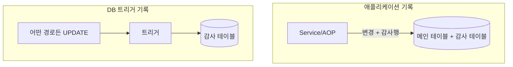

## 들어가며

어느 주, "이 데이터를 누가 언제 바꿨냐"는 질문에 답해야 했다. 현재 상태만 가진 테이블은 이 질문에 답하지 못한다. 마지막 값만 남고 과정은 사라지기 때문이다. **감사 로그(audit trail)**는 이 빈틈을 메운다. 단순해 보이지만 "어디서 기록하느냐"에 따라 설계가 갈린다.

## 핵심 개념: 상태가 아니라 사건을 남긴다

일반 테이블은 **현재 상태(state)**만 저장한다. UPDATE는 과거를 덮어쓴다. 감사 로그의 발상은 반대다. **변경이라는 사건(event)을 추가로 적재**한다. 행을 덮어쓰는 대신 "언제, 누가, 어떤 컬럼을, 무엇에서 무엇으로 바꿨다"를 새 행으로 쌓는다.

남길 최소 항목은 다음이다.

- **누가** — actor (사용자 ID/시스템 주체)
- **언제** — timestamp
- **무엇을** — 대상 테이블·PK
- **어떻게** — 작업 종류(INSERT/UPDATE/DELETE)와 **변경 전후 값**

전후 값을 어떻게 담느냐는 두 갈래다. 컬럼별 (이전, 이후) 쌍을 한 행씩 남기거나, 행 전체 스냅샷을 JSON으로 통째 저장하는 방식이다. 후자는 단순하고 스키마 변화에 강하지만, "어떤 컬럼이 바뀌었나"를 질의하기는 불편하다.

## 어디서 기록하나: 애플리케이션 vs DB 트리거



**애플리케이션 계층 기록(AOP·서비스).**
- 장점: 비즈니스 맥락(actor, 요청 사유, 화면)을 알 수 있다. 코드로 관리돼 테스트·버전관리가 쉽다.
- 단점: **애플리케이션을 거치지 않는 변경**(DBA의 수동 SQL, 배치 직접 수정)은 못 잡는다.

**DB 트리거 기록.**
- 장점: 경로 불문 **모든 변경**을 포착한다. 누락이 원천적으로 없다.
- 단점: actor·사유 같은 애플리케이션 맥락을 알기 어렵고, 로직이 DB에 숨어 추적이 힘들다. 성능 부하도 변경마다 붙는다.

실무에선 **비즈니스 이력은 애플리케이션에서, 보안·규제용 완전 추적은 트리거에서** 식으로 목적에 맞춰 나눈다.

## 코드 예시

AOP로 변경 전후를 가로채 감사 행을 남기는 골격이다.

```java
@Aspect @Component
public class AuditAspect {

    @Around("@annotation(Audited)")
    public Object audit(ProceedingJoinPoint pjp) throws Throwable {
        Object before = snapshotTarget(pjp);   // 변경 전 상태 조회
        Object result = pjp.proceed();          // 실제 변경 수행
        Object after = snapshotTarget(pjp);     // 변경 후 상태 조회

        auditRepo.save(AuditLog.builder()
            .actor(SecurityContext.currentUserId())
            .at(Instant.now())
            .entity("orders").entityId(extractId(pjp))
            .action("UPDATE")
            .beforeJson(toJson(before))
            .afterJson(toJson(after))
            .build());
        return result;
    }
}
```

```sql
CREATE TABLE audit_log (
    id          BIGINT AUTO_INCREMENT PRIMARY KEY,
    actor_id    BIGINT       NOT NULL,
    acted_at    DATETIME(3)  NOT NULL,
    entity      VARCHAR(64)  NOT NULL,
    entity_id   BIGINT       NOT NULL,
    action      VARCHAR(16)  NOT NULL,
    before_json JSON,
    after_json  JSON,
    INDEX idx_entity (entity, entity_id, acted_at)
);
```

## 운영 함정

**함정 1 — 감사 로그가 메인 트랜잭션을 같이 죽인다.** 감사 기록 실패가 본 작업을 롤백시키면 안 되는 경우가 많다. 반대로 규제상 "기록 없이는 변경 불가"여야 하는 경우도 있다. **무엇이 우선인지** 먼저 정하고 트랜잭션 경계를 설계한다.

**함정 2 — 무한 증식.** 감사 테이블은 메인보다 빠르게 커진다. 인덱스 설계와 **보존 기간·아카이빙 정책**을 처음부터 잡지 않으면 몇 달 뒤 조회가 느려지고 디스크가 찬다.

## 핵심 요약

- 감사 로그는 상태가 아니라 **사건**을 쌓는다. 누가·언제·무엇을·전후값이 최소 항목.
- 애플리케이션 기록은 맥락이 풍부하나 우회 경로를 못 잡고, 트리거는 완전하나 맥락이 빈약하다. 목적별로 나눈다.
- 면접 한 줄 — **"왜 트리거 대신 AOP로 감사?"** → actor·요청 사유 같은 비즈니스 맥락을 함께 남기고 코드로 관리하기 위함. 단 애플리케이션 외 경로는 못 잡는 한계를 인지한다.
