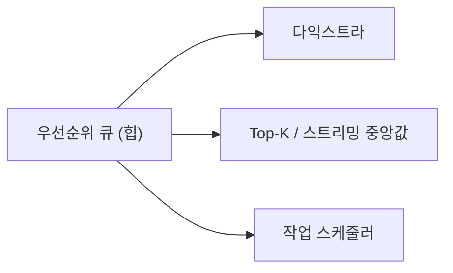

## "어디서 넣고 어디서 빼는가"가 전부다

[배열과 연결 리스트]()는 데이터를 담는 그릇이었습니다. 스택·큐·힙은 그 위에 **"넣고 빼는 위치를 제한하는 규칙"** 을 얹은 것입니다. 규칙을 줄이는 게 어떻게 더 강력해질까요? 제약이 명확하면 **연산이 전부 O(1)~O(log n)으로 단순·빨라지고**, 그 규칙 자체가 알고리즘의 도구가 되기 때문입니다.

스택은 깊이 우선 탐색과 함수 호출을, 큐는 너비 우선 탐색과 작업 분배를, 힙은 "다음으로 가장 급한 것"을 뽑는 우선순위 처리를 가능하게 합니다.

## 스택과 큐 — LIFO vs FIFO

**스택(stack)** 은 한쪽 끝에서만 넣고(push) 뺍니다(pop) — **나중에 들어온 게 먼저** 나오는 LIFO. **큐(queue)** 는 뒤로 넣고(enqueue) 앞에서 빼서(dequeue) — **먼저 들어온 게 먼저** 나오는 FIFO. 둘 다 핵심 연산이 전부 **O(1)** 입니다.

<svg viewBox="0 0 680 220" role="img" aria-label="스택은 위에서 push하고 같은 위에서 pop하는 후입선출, 큐는 뒤로 넣고 앞에서 빼는 선입선출을 보여주는 대비 애니메이션">
  <text class="lbl" x="120" y="28" text-anchor="middle">스택 — LIFO (위에서 넣고 위에서 뺀다)</text>
  <rect class="box" x="80" y="60" width="80" height="130" rx="4"/>
  <rect class="it" x="86" y="158" width="68" height="26" rx="3"/>
  <rect class="it" x="86" y="128" width="68" height="26" rx="3"/>
  <rect class="it sp" x="86" y="98" width="68" height="26" rx="3"/>
  <text class="sub" x="120" y="52" text-anchor="middle">push / pop ↕</text>
  <text class="lbl" x="460" y="28" text-anchor="middle">큐 — FIFO (뒤로 넣고 앞에서 뺀다)</text>
  <rect class="box" x="300" y="110" width="320" height="44" rx="4"/>
  <text class="sub" x="300" y="172">↑ 앞(dequeue)</text>
  <text class="sub" x="620" y="172" text-anchor="end">뒤(enqueue) ↑</text>
  <rect class="itq" x="308" y="116" width="56" height="32" rx="3"/>
  <rect class="itq" x="370" y="116" width="56" height="32" rx="3"/>
  <rect class="itq" x="432" y="116" width="56" height="32" rx="3"/>
  <rect class="itq qin" x="494" y="116" width="56" height="32" rx="3"/>
</svg>

스택은 보통 동적 배열로(끝에서 push/pop), 큐는 **원형 버퍼(circular buffer)** 나 양 끝 연결 리스트로 구현합니다. 큐를 단순 배열의 앞에서 빼면 매번 전체를 당겨 O(n)이 되므로, 앞/뒤 인덱스를 돌리는 원형 버퍼가 정석입니다.

**덱(deque)** 은 양쪽 끝에서 모두 넣고 뺄 수 있는 일반화입니다(Java `ArrayDeque`). 스택으로도 큐로도 쓸 수 있어 실무에선 `Stack`/`LinkedList`보다 `ArrayDeque`가 권장됩니다.

이 규칙들은 알고리즘의 엔진입니다.

| 자료구조 | 규칙 | 대표 쓰임 |
|---------|------|----------|
| 스택 | LIFO | 함수 콜스택, 괄호 짝 검사, [DFS](), 실행 취소(undo) |
| 큐 | FIFO | [BFS](), 작업 큐, 메시지 버퍼, 프린터 스풀 |
| 덱 | 양끝 | 슬라이딩 윈도우 최댓값, LRU |

## 힙 — "가장 급한 것"을 O(log n)에 뽑는다

스택·큐가 들어온 **순서**로 뺀다면, **힙(heap)** 은 **우선순위**로 뺍니다. 가장 작은(또는 큰) 원소를 항상 O(log n)에 꺼내는 **우선순위 큐(priority queue)** 의 표준 구현입니다.

이진 힙은 **완전 이진 트리**이면서 "부모는 항상 자식보다 작다(min-heap)"는 **힙 속성**을 지킵니다. 완전 트리라 트리인데도 **배열 하나**로 표현됩니다 — 인덱스 `i`의 자식은 `2i+1`, `2i+2`, 부모는 `(i-1)/2`. 포인터가 없어 캐시 친화적입니다.

삽입은 맨 끝에 넣고 **부모와 비교하며 위로 올리는 sift-up**, 삭제(최소값 추출)는 루트를 빼고 마지막 원소를 올린 뒤 **자식과 비교하며 내리는 sift-down** — 둘 다 트리 높이 **O(log n)**.

<svg viewBox="0 0 560 250" role="img" aria-label="이진 힙에 작은 값을 삽입하면 맨 아래 끝에 들어간 뒤 부모와 비교하며 위로 올라가 자기 자리를 찾는 sift-up 애니메이션">
  <line class="edge" x1="280" y1="40" x2="170" y2="110"/>
  <line class="edge" x1="280" y1="40" x2="390" y2="110"/>
  <line class="edge" x1="170" y1="110" x2="110" y2="190"/>
  <line class="edge" x1="170" y1="110" x2="230" y2="190"/>
  <circle class="node" cx="280" cy="40" r="22"/><text class="nv lbl" x="280" y="45" text-anchor="middle">3</text>
  <circle class="node" cx="170" cy="110" r="22"/><text class="nv lbl" x="170" y="115" text-anchor="middle">8</text>
  <circle class="node" cx="390" cy="110" r="22"/><text class="nv lbl" x="390" y="115" text-anchor="middle">9</text>
  <circle class="node" cx="110" cy="190" r="22"/><text class="nv lbl" x="110" y="195" text-anchor="middle">10</text>
  <g class="climb">
    <circle class="node swap" cx="230" cy="190" r="22"/>
    <text class="nv lbl" x="230" y="195" text-anchor="middle" fill="#fff">2</text>
  </g>
  <text class="sub" x="280" y="232" text-anchor="middle">새 값 2 = 맨 끝 삽입 → 부모(8,3)와 비교하며 위로 (sift-up, O(log n))</text>
</svg>

배열 표현이라 위 트리는 메모리상 `[3, 8, 9, 10, 2]` 한 줄이고, sift-up은 인덱스를 `(i-1)/2`로 거슬러 오르며 swap할 뿐입니다.

힙의 진짜 위력은 알고리즘에서 드러납니다.

- [다익스트라 최단경로]()에서 "가장 가까운 미방문 정점"을 매번 O(log n)에 뽑음.
- 힙 정렬: n개를 힙에 넣고 하나씩 빼면 O(n log n) 정렬.
- 상위 K개(top-K), 스트리밍 중앙값(두 힙), 작업 스케줄러의 우선순위 처리.

| 연산 | 이진 힙 | 정렬된 배열 | 정렬 안 된 배열 |
|------|--------|-----------|---------------|
| 삽입 | O(log n) | O(n) | O(1) |
| 최소값 조회 | O(1) | O(1) | O(n) |
| 최소값 삭제 | O(log n) | O(n) | O(n) |

## 프로덕션에서 마주치는 함정

| 함정 | 증상 | 해법 |
|------|------|------|
| 단순 배열 앞에서 dequeue | 매번 당기기 → O(n) | 원형 버퍼 / `ArrayDeque` |
| Java `Stack`·`Vector` 사용 | 동기화 오버헤드·레거시 | `ArrayDeque`로 스택/큐 |
| 힙 안 원소의 우선순위 변경 | 위치 못 찾아 못 고침 | 인덱스 맵 보유, 또는 (재삽입+지연삭제) |
| `PriorityQueue` 비교자 누락 | 자연 순서로 엉뚱 정렬 | `Comparator` 명시 |
| 콜스택 재귀 폭주 | StackOverflow | 명시적 스택으로 반복 전환 |

## 면접/리뷰 단골 질문

- **Q. 스택과 큐의 차이 한 줄?** → 스택은 LIFO(같은 끝에서 넣고 뺌), 큐는 FIFO(뒤로 넣고 앞에서 뺌).
- **Q. 힙이 배열 하나로 트리를 표현하는 방법?** → 완전 이진 트리라 인덱스 i의 자식 2i+1·2i+2, 부모 (i-1)/2로 계산. 포인터 불필요, 캐시 친화적.
- **Q. 힙 삽입/삭제가 O(log n)인 이유?** → sift-up/down이 트리 높이만큼만 비교·교환하기 때문. 완전 트리 높이는 log n.
- **Q. 우선순위 큐를 정렬 배열로 만들면?** → 조회 O(1)이나 삽입 O(n). 힙은 삽입·삭제 O(log n)으로 균형이 좋다.
- **Q. 힙 안 특정 원소의 우선순위를 바꾸려면?** → 기본 힙은 못 찾음. 값→인덱스 맵을 같이 유지하는 인덱스 힙(decrease-key)으로.

## 정리

- 스택(LIFO)·큐(FIFO)·덱은 **접근 위치를 제약**해 모든 핵심 연산을 O(1)로 만든 도구다.
- 힙은 **우선순위**로 뺀다 — 완전 이진 트리를 배열로 표현, 삽입/삭제 O(log n)·최소값 조회 O(1).
- 스택은 DFS·콜스택, 큐는 BFS·작업분배, 힙은 다익스트라·Top-K·스케줄러의 엔진이다.
- 실무에선 `ArrayDeque`(스택/큐)와 `PriorityQueue`(힙)를 쓰고, 비교자·원형 버퍼 같은 디테일을 챙긴다.

> 다음 글은 또 다른 핵심 자료구조 [해시 테이블]()입니다. 순서도 우선순위도 아닌, "키로 곧장 찾는" 평균 O(1)의 비밀을 봅니다.
</content>
</invoke>
